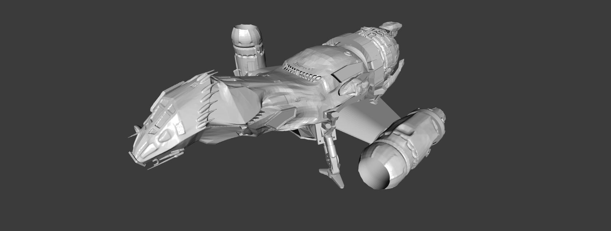
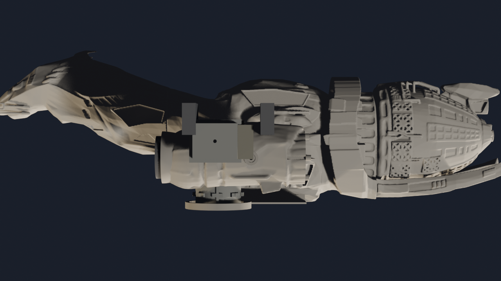
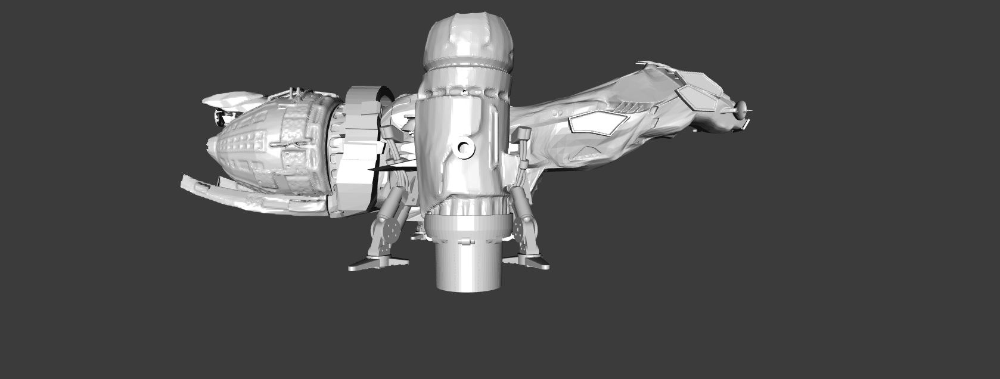
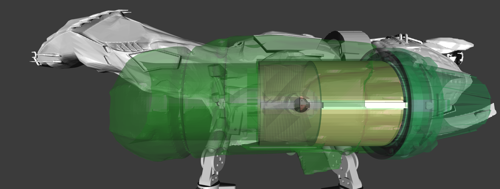
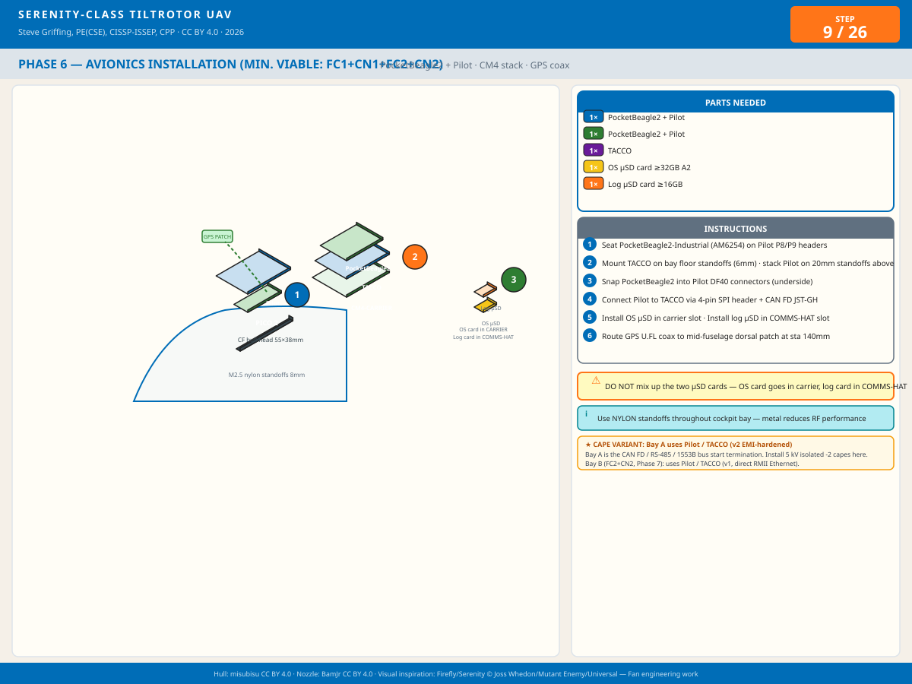
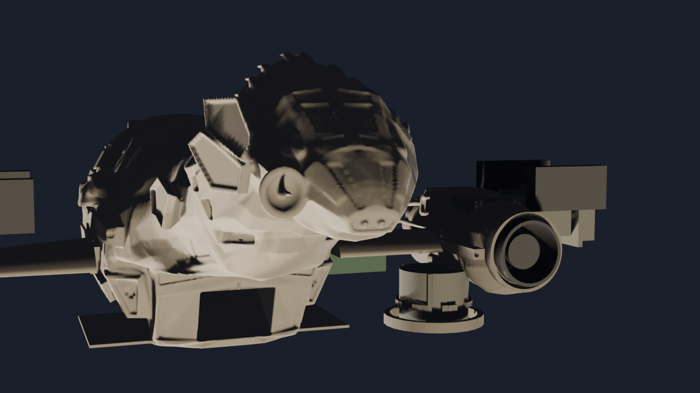
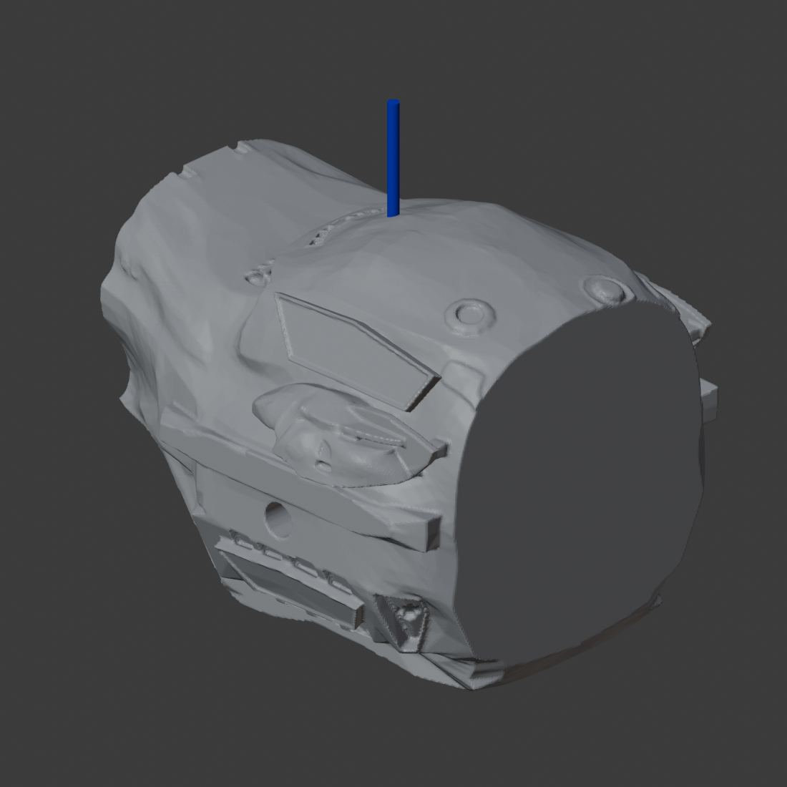

# Serenity UAV

### A flight-worthy, security-hardened EDF tilt-rotor replica of the Firefly-class ship *Serenity*

*"Can't stop the signal, and can't take the sky from me."*

*Isometric render of the Rev S assembly — port/bow/dorsal view. Predates the Rev S1g wing
spar and Rev S4c nacelle geometry; re-render pending (see `TODO.md` §0.10).*

## Overview

Serenity UAV is a fully functional electric ducted fan (EDF) tilt-rotor aircraft engineered as an
actual physical build of the Firefly-class transport *Serenity* (Joss Whedon, 2002) — every
component here is fabricated or procured, not conceptual. Four canonical CF-PETG-printed hull
sections carry two tilting EDF nacelles, a belly cargo bay with powered winch and clamshell doors,
and an 8-node cooperative avionics architecture with PACE (Primary/Alternate/Contingency/Emergency)
failover across every flight-critical function.

The design is held to the same rigor as a certifiable aircraft: real mass/CG/load budgets (no
"TBD" specs), FAA/FCC/NIST/IEC standards vetting on every design decision with any effect beyond
cosmetics, redundant power and control paths throughout, and a zero-trust security model — every
onboard message is signed, authenticated, and logged to hardware-enforced non-executable storage —
engineered to keep operating correctly inside a 500 W/m² RF field. Avionics, comms, and software
are built for reuse across other UAV/UGV/USV platforms, not just this airframe. See
[`AGENTS.md`](AGENTS.md) for the full authoritative project policy that governs every design
decision in this repository.

<table>
<tr>
<td width="50%" valign="top">

### Nominal Mission Profile

1. Take off VTOL.
2. Land vertically with cargo bay open and load and secure a 4″ × 3″ × 3″, 8 oz payload.
3. Take off VTOL with payload.
4. Fly into a 500 W/m² broadband RF environment.
5. Lower and release the payload from the cargo bay onto a platform.
6. Identify a 4″ × 3″ × 3″ payload on a moving platform.
7. Synchronize flight with the platform.
8. Attach the payload to the hoist and lift it from the platform.
9. Pull the payload into the cargo bay and close the clamshells.
10. Exit the hazardous environment and return to origin.

Throughout the mission, the aircraft must also:

- Identify, categorize, log, and report rogue or unauthorized C2 commands or malicious logic from
  any transmitter, authorized or not.
- Identify unauthorized or unsafe behavior from any onboard compute node.
- Isolate the affected node(s), gracefully fail over its functions, and log/report to ground
  control — all while maintaining safety of flight.

</td>
<td width="50%" valign="top">

### Specifications

| Parameter | Value |
|-----------|-------|
| Length | 24.0 in (609 mm) |
| Wingspan | 19.1 in (486 mm) |
| Height | 7.93 in (201.5 mm) |
| AUW — Phases 5–10 (nacelles only) | ~8.62 lbm (3,911 g) |
| AUW — Phase 11 (full system) | ~9.42 lbm (4,273 g) |
| Payload capacity (minimum) | 8.0 oz (226 g) in a 4″ × 3″ × 3″ bay |
| Thrust — nacelles only (hover) | 9.84 lbf (4,464 g) |
| Thrust — Phase 11 rear EDF (cruise) | ~2.81 lbf (1,275 g) net after RCS bleed |
| T/W — nacelles only (hover) | ≈ 1.14 (VTOL hover capable; margin corrected 2026-08-22, see TODO.md §0.10.1) |
| T/W — Phase 11 (hover, nacelles only) | ≈ 1.43 (rear EDF is forward-thrust only) |
| Compute | 8× PocketBeagle 2 Industrial (AM6254), PACE failover |
| Onboard buses | CAN FD, MIL-STD-1553B, RS-485, Ethernet RSTP ring |
| External comms | Wi-Fi 5 GHz, Zigbee 2.4 GHz, SiK/MAVLink 915 MHz, 49 MHz AX.25 |
| EMI design objective | 500 W/m² RF field, correct operation |

</td>
</tr>
</table>

## Subsystems

<table>
<tr>
<td width="50%" valign="top">
  

**Airframe**

Four-section CF-PETG printed hull (head, cargo, middle, rear) with high-lift wings, hollow-walled
and foam-filled to the canonical Firefly outer mold line.

[Airframe README →](airframe/README.md)

</td>
<td width="50%" valign="top">
  

**Landing Gear**

Four corner legs pair a rigid CF-PETG post with spring and ductile wire braces, giving a
deliberately progressive, field-replaceable failure mode rated for a 6 ft full-AUW drop.

[Landing Gear Analysis →](docs/LANDING_GEAR_ANALYSIS.md)

</td>
</tr>
<tr>
<td width="50%" valign="top">
  

**Nacelles**

Two tilting pods each carry a tandem 50 mm EDF pair behind an 11-fin stator, with an 8-petal
variable-area nozzle gear-linked passively to the 0°–140° tilt pivot.

[Nozzle-Drive Trade Study →](docs/NOZZLE_DRIVE_TRADE.md)

</td>
<td width="50%" valign="top">
  

**Powerplant**

Four nacelle EDFs give 9.84 lbf combined hover thrust at a T/W of ≈1.14, fed by a 6S LiPo through
the EMI-hardened Flight Engineer power distribution board.

[Power Distribution →](docs/POWER_DISTRIBUTION.md)

</td>
</tr>
<tr>
<td width="50%" valign="top">
  

**Avionics**

Eight PocketBeagle 2 Industrial nodes in four PACE-redundant stacks handle flight control, comms,
and payload functions, all with 5 kV galvanic isolation, TPM-backed signed logging, and the
**Skipper** ground control station.

[Avionics README →](avionics/README.md)

</td>
<td width="50%" valign="top">
  

**Bow Sensor Suite**

The forward **Observer** node — camera, Time-of-Flight array, and an eye-safe laser indicator — in
the nose pod handles obstacle avoidance and rough size/orientation sizing of the mission payload.

[Observer Board →](avionics/kicad/Observer/Observer.md)

</td>
</tr>
<tr>
<td colspan="2" valign="top">
  

**Cargo Handling — Observer**

A belly clamshell cargo bay with a powered winch and hoist loads/releases an 8 oz payload in
flight, guided by the downward-facing **Observer** node for close-in 3D imaging of the payload.

[Cargo Winch Specification →](docs/CARGO_WINCH_SPECIFICATION.md)

</td>
</tr>
</table>

---

## Table of Contents

- [Authoritative Project Instructions](#authoritative-project-instructions)
- [References](#references)
- [License](#license)
- [Attribution](#attribution)
    - [Component License Map](#component-license-map)
    - [What This License Covers](#what-this-license-covers)
    - [Patent Notice](#patent-notice)
    - [Forensic Evidence Integrity Note](#forensic-evidence-integrity-note)

---

## Authoritative Project Instructions

The canonical workspace instructions and design policy are maintained in `AGENTS.md`. All
contributors and automated tools (including AI assistants) must follow the requirements and
standards documented there (coding style, fabrication specs, licensing, and attribution).
`CLAUDE.md` is a one-line pointer to the same file, kept for tooling that looks for that name.

The [Nominal Mission Profile](#nominal-mission-profile) and [Specifications](#specifications)
above are the current design baseline. Full engineering detail for each subsystem lives in that
subsystem's own README/doc — see the link on each card in [Subsystems](#subsystems) above. The
narrative that used to live directly in this file (full Airframe/Powerplant/Avionics/Cargo
Handling write-ups) is preserved verbatim, for historical reference, in
[`archives/root-readme-deep-dive-2026-08-03/`](archives/root-readme-deep-dive-2026-08-03/).

---

## References

- Design conversation: [claude.ai/share/a1e3900e-d2bf-4690-ba63-25178e7de666](https://claude.ai/share/a1e3900e-d2bf-4690-ba63-25178e7de666)
- Latest design revision spec: `current-specification/serenity-rev-s.jsx`

---

## License

Dual-licensed by Steve Griffing, PE(CSE), CISSP-ISSEP, CPP:

- **Hardware / CAD / PCB design files** — **CERN Open Hardware Licence Version 2 —
  Weakly Reciprocal (CERN-OHL-W 2.0)**. Covers airframe SCAD/STL/FCStd, KiCad
  schematics/PCB/Gerbers, and mechanical drawings. Full text: `LICENSE` (root) /
  `LICENSES/CERN-OHL-W 2.0`, [ohwr.org/licences](https://ohwr.org/licences/).
- **Documentation, code, scripts, and non-hardware drawings** — **Creative Commons
  Attribution-ShareAlike 4.0 International (CC BY-SA 4.0)**. Covers this document,
  firmware/tooling source, build guides, and SVG diagrams. Full text:
  `LICENSES/CC-BY-SA 4.0`, [creativecommons.org/licenses/by-sa/4.0](https://creativecommons.org/licenses/by-sa/4.0).

See `docs/attribution_and_licensing.md` for the full policy, the per-subsystem `LICENSE`
federation map, and the CERN-OHL-W "Available Component" treatment of upstream
canonical-reference geometry. Revision S, July 2026.

## Attribution

> "Serenity Tiltrotor Drone Project — hardware CERN-OHL-W 2.0, docs/code CC BY-SA 4.0, based on:
> · Serenity Firefly-class hull by misubisu (thingiverse.com/thing:7330462, CC BY-SA 4.0)
> · Variable-area EDF nozzle by BamJr (thingiverse.com/thing:2991269, CC BY 4.0)
> Include a link to the applicable license and indicate if changes were made."

### Component License Map

| Component | Original Author | Source | License | Derivative Notes |
|-----------|----------------|--------|---------|-----------------|
| Hull | misubisu | [thingiverse.com/thing:7330462](https://www.thingiverse.com/thing:7330462) | CC BY-SA 4.0 (Available Component under CERN-OHL-W 2.0) | Scaled to 24 in, hollowed to 0.079 in (2.0 mm) CF-PETG shell, foam-filled |
| Nozzle mechanism concept | BamJr | [thingiverse.com/thing:2991269](https://www.thingiverse.com/thing:2991269) | CC BY 4.0 | Iris petal concept reference; all Rev O/P/Q nozzle geometry original |
| Design (hardware/CAD/PCB) | This project | — | CERN-OHL-W 2.0 | All original work: PCBs, mechanical/CAD, wiring |
| Design (docs/code/scripts) | This project | — | CC BY-SA 4.0 | Firmware spec, tooling, build guides, this document |

### What This License Covers

Covered under **CERN-OHL-W 2.0** (hardware):

- 3D-printable hull, nacelle, and nozzle design files (STL/SCAD/FCStd)
- PCB schematics and Gerber files for Pilot, XO, Flight Engineer, and Commo
- Circuit diagrams, pinout tables, and wiring specifications
- Mechanical drawings and assembly specifications
- Any derived hardware must carry CERN-OHL-W 2.0 (or a compatible license) and attribute
  all upstream authors

Covered under **CC BY-SA 4.0** (documentation, code, scripts, non-hardware drawings):

- Firmware architecture specifications and algorithm descriptions
- This design document in all its revisions (A–R and beyond)
- Build automation/tooling scripts and non-hardware SVG diagrams
- Any derived works must carry CC BY-SA 4.0 and attribute all upstream authors

Not covered / separate terms:

- Third-party commercial components (EDFs, ESCs, PocketBeagle 2, etc.) — their own terms
- SiK radio firmware — GPL-3.0
- ArduPilot / QGroundControl — GPL-3.0
- tpm2-tools / tpm2-tss — BSD-2
- CPLD Verilog write-blocker firmware — separately MIT licensed
- Proprietary flight controller firmware (your compiled code) — your terms
- FAA/ICAO regulatory compliance is YOUR responsibility as operator

### Patent Notice

This license does NOT grant rights to any patents held by component manufacturers or the
design authors. The design uses standard open hardware interfaces (CAN FD, Ethernet, SDIO,
SPI, I²C, MAVLink). If you commercialise products based on this design, conduct your own
freedom-to-operate analysis. The write-blocker CPLD design implements append-only log
enforcement consistent with log data protection principles in NIST SP 800-92 §4.4.2
[REF-NIST-004]; no patent claims are made on the implementation.

### Forensic Evidence Integrity Note

The write-blocker and NX enforcement hardware described in this design are intended to
support operational log integrity, not forensic evidence collection.  They implement
log data protection principles consistent with NIST SP 800-92 §4.4.2 [REF-NIST-004].
They are NOT certified forensic tools under NIST CFTT (Computer Forensics Tool Testing)
Program specifications or SWGDE (Scientific Working Group on Digital Evidence) standards.
Do not use this design as the sole mechanism for evidence preservation in legal proceedings
without independent verification of the implementation against your jurisdiction's
evidence handling requirements.
