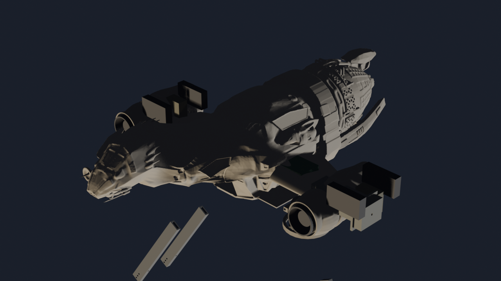
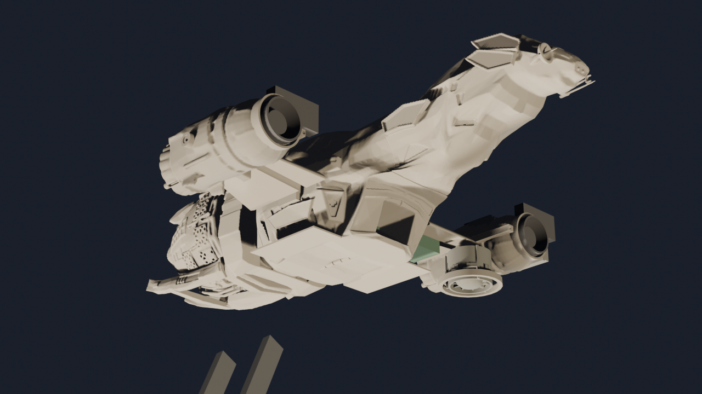

# Serenity UAV

### A flight-worthy, security-hardened EDF tilt-rotor replica of the Firefly-class ship *Serenity*

*"Can't stop the signal, and can't take the sky from me."*

*Isometric render of the full Rev S assembly — port/bow/dorsal view.*

## Overview

Serenity UAV is a fully functional electric ducted fan (EDF) tilt-rotor aircraft engineered as an
actual physical build of the Firefly-class transport *Serenity* (Joss Whedon, 2002) — every
component here is fabricated or procured, not conceptual. Four canonical CF-PETG-printed hull
sections carry two tilting EDF nacelles, a belly cargo bay with powered winch and clamshell doors,
and an 8-node cooperative avionics architecture with PACE (Primary/Alternate/Contingency/Emergency)
failover across every flight-critical function.

The design is held to the same rigor as a certifiable aircraft: real mass/CG/load budgets (no
"TBD" specs), FAA/FCC/NIST/IEC standards vetting on every design decision with any effect beyond
cosmetics, redundant power and control paths throughout, and a zero-trust security model — every
onboard message is signed, authenticated, and logged to hardware-enforced non-executable storage —
engineered to keep operating correctly inside a 500 W/m² RF field. Avionics, comms, and software
are built for reuse across other UAV/UGV/USV platforms, not just this airframe. See
[`AGENTS.md`](AGENTS.md) for the full authoritative project policy that governs every design
decision in this repository.

<table>
<tr>
<td width="50%" valign="top">

### Nominal Mission Profile

1. Take off VTOL.
2. Land vertically with cargo bay open and load and secure a 4″ × 3″ × 3″, 8 oz payload.
3. Take off VTOL with payload.
4. Fly into a 500 W/m² broadband RF environment.
5. Lower and release the payload from the cargo bay onto a platform.
6. Identify a 4″ × 3″ × 3″ payload on a moving platform.
7. Synchronize flight with the platform.
8. Attach the payload to the hoist and lift it from the platform.
9. Pull the payload into the cargo bay and close the clamshells.
10. Exit the hazardous environment and return to origin.

Throughout the mission, the aircraft must also:

- Identify, categorize, log, and report rogue or unauthorized C2 commands or malicious logic from
  any transmitter, authorized or not.
- Identify unauthorized or unsafe behavior from any onboard compute node.
- Isolate the affected node(s), gracefully fail over its functions, and log/report to ground
  control — all while maintaining safety of flight.

</td>
<td width="50%" valign="top">

### Specifications

| Parameter | Value |
|-----------|-------|
| Length | 24.0 in (609 mm) |
| Wingspan | 19.1 in (486 mm) |
| Height | 7.93 in (201.5 mm) |
| AUW — Phases 5–10 (nacelles only) | ~6.10 lbm (2,768 g) |
| AUW — Phase 11 (full system) | ~6.90 lbm (3,130 g) |
| Payload capacity (minimum) | 8.0 oz (226 g) in a 4″ × 3″ × 3″ bay |
| Thrust — nacelles only (hover) | 9.84 lbf (4,464 g) |
| Thrust — Phase 11 rear EDF (cruise) | ~2.81 lbf (1,275 g) net after RCS bleed |
| T/W — nacelles only (hover) | ≈ 1.61 (full VTOL hover capable) |
| T/W — Phase 11 (hover, nacelles only) | ≈ 1.43 (rear EDF is forward-thrust only) |
| Compute | 8× PocketBeagle 2 Industrial (AM6254), PACE failover |
| Onboard buses | CAN FD, MIL-STD-1553B, RS-485, Ethernet RSTP ring |
| External comms | Wi-Fi 5 GHz, Zigbee 2.4 GHz, SiK/MAVLink 915 MHz, 49 MHz AX.25 |
| EMI design objective | 500 W/m² RF field, correct operation |

</td>
</tr>
</table>

## Subsystems

<table>
<tr>
<td width="50%" valign="top">
  

**Airframe**

Four-section CF-PETG printed hull (head, cargo, middle, rear) with high-lift wings and two tilting
EDF nacelles, hollow-walled and foam-filled to the canonical Firefly outer mold line.

[Airframe README →](airframe/README.md)

</td>
<td width="50%" valign="top">
  

**Powerplant**

Tandem 50 mm EDF pairs in each tilting nacelle drive variable-area nozzles gear-linked to tilt
angle, giving 9.84 lbf combined hover thrust at a T/W of ≈1.61 with counter-rotating torque
cancellation.

[More →](#powerplant)

</td>
</tr>
<tr>
<td width="50%" valign="top">
  

**Avionics**

Eight PocketBeagle 2 Industrial nodes in four PACE-redundant stacks handle flight control, comms,
and payload functions, all with 5 kV galvanic isolation, TPM-backed signed logging, and the
**Skipper** ground control station.

[Avionics README →](avionics/README.md)

</td>
<td width="50%" valign="top">
  

**Cargo Handling — Observer**

A belly clamshell cargo bay with powered winch and hoist loads/releases an 8 oz payload in flight,
guided by the **Observer** nose and cargo-bay vision/ToF/laser sensors.

[More →](#cargo-handling--observer)

</td>
</tr>
</table>

---

## Table of Contents

- [Authoritative Project Instructions](#authoritative-project-instructions)
- [Airframe](#airframe)
    - [Coordinate Standard (Rev R1)](#coordinate-standard-rev-r1)
    - [Fuselage](#fuselage)
        - [Compartments and Bays](#compartments-and-bays)
    - [Wings](#wings)
    - [Nacelles](#nacelles)
    - [Landing Gear](#landing-gear)
- [Powerplant](#powerplant)
    - [Power Distribution](#power-distribution)
    - [Battery](#battery)
    - [Propulsion — Rev R baseline](#propulsion--rev-r-baseline)
        - [DEFERRED — Phase 11: Fuselage EDF + RCS](#deferred--phase-11-fuselage-edf--rcs)
    - [Servos and Motors](#servos-and-motors)
- [Avionics](#avionics)
    - [Ground Control — Skipper](#ground-control--skipper)
    - [Onboard — 8-node cooperative architecture](#onboard--8-node-cooperative-architecture)
- [Cargo Handling — Observer](#cargo-handling--observer)
- [References](#references)
- [License](#license)
- [Attribution](#attribution)
    - [Component License Map](#component-license-map)
    - [What This License Covers](#what-this-license-covers)
    - [Patent Notice](#patent-notice)
    - [Forensic Evidence Integrity Note](#forensic-evidence-integrity-note)

---

## Authoritative Project Instructions

The canonical workspace instructions and design policy are maintained in `AGENTS.md`. All
contributors and automated tools (including AI assistants) must follow the requirements and
standards documented there (coding style, fabrication specs, licensing, and attribution).
`CLAUDE.md` is a one-line pointer to the same file, kept for tooling that looks for that name.

The [Nominal Mission Profile](#nominal-mission-profile) and [Specifications](#specifications)
above are the current design baseline; the sections below give the full engineering detail behind
each subsystem.

---

## Airframe

Airframe engineered to FAA [REF-FAA-001, REF-FAA-002, REF-FAA-003] and AUVSI
[REF-AUVSI-001] standards for UAVs rather than relying on the source desktop-model
specifications.

### Coordinate Standard (Rev R1)

All design artifacts (SCAD, STL, Blender/FreeCAD scripts, documentation) use the
single validated **hull frame**: X = +port (lateral), Y = +aft (longitudinal),
Z = +dorsal, origin at the `SerenityAssembly.FCStd` world origin. As of R1
(2026-06-11) the validated component placements are **baked into the published
STL vertex data** by `tools/bake_hull_frame.py` (header marker
`SerenityUAV HULL-FRAME R1`); the FreeCAD assembly imports every primary
component at identity. Re-run the bake tool after regenerating any primary STL.
Documented exceptions: avionics KiCad files (board coordinates), Skipper GCS
hardware (part-local), and G-code (printer bed). See `airframe/AGENTS.md`
"Hull-Frame Coordinate Standard" for the full rule set and baked extents.

### Fuselage

The design retains the four canonical sections — head, cargo, middle, and rear — from the source hull model:
[thingiverse.com/thing:7330462](https://www.thingiverse.com/thing:7330462)
("Serenity Firefly with landing gear and swivel engines" by misubisu, CC BY-SA 4.0).
Scaled to 24 in (609 mm) overall length.

- Shell walls hollowed to 0.079 in (2.0 mm) CF-PETG, watertight exterior surface.
- All unoccupied interior volume filled with 2 lb/ft³ (32 kg/m³) closed-cell foam for
  structural support and buoyancy.
- Bosses and ribs added to interior as needed for joints and component mounting.
- Mating faces between sections are left open to allow construction access and
  inter-compartment cable routing.

#### Compartments and Bays

Seven named compartments are specified:

**Shepherd's room** — Forward avionics bay (Bay A), head section near the bridge.
Primary tasking: watchdog, fault detection, failover, and authentication.
Pilot + XO stack. SiK primary / Wi-Fi secondary comms.
Ventilation ducting, cable conduits, and low-impedance bonding to other avionics bays.
External access via a removable hull panel on the head section.

**Inara's shuttle** — Avionics bay (Bay B), port side of the cargo section.
Primary tasking: camera, external sensors, and high-bandwidth ground communications.
Pilot + XO stack. Wi-Fi primary / LoRa secondary comms.
Ventilation ducting, cable conduits, and low-impedance bonding to other avionics bays.
External access via a removable hull panel above the port wing (resembles the shuttle
fairing in the canonical model). Also accessible via Observer's cargo bay.

**River's room** — Avionics bay (Bay C), starboard side of the cargo section.
Primary tasking: forward EDF control, nacelle tilt command/sync, and resilient comms.
Pilot + XO stack. 49 MHz (Part 15 §15.235) primary / LoRa secondary comms.
Ventilation ducting, cable conduits, and low-impedance bonding to other avionics bays.
External access via a removable hull panel above the starboard wing. Also accessible
via Observer's cargo bay.

**Simon's medbay** — Aft avionics bay (Bay D), middle section.
Primary tasking: aft EDF control, alternate watchdog, and cargo/payload oversight.
Pilot + XO stack. 49 MHz (Part 15 §15.235) primary / SiK secondary comms.
Ventilation ducting, cable conduits, and low-impedance bonding to other avionics bays.
Adjacent to Flight Engineer's room. Accessible via Observer's cargo bay.

**Flight Engineer's room** — EMI-hardened power distribution bay, middle section, aft of the
cargo bay and adjacent to Simon's medbay and the engine cone.
Houses the Flight Engineer Power Distribution Board (PDB) and battery management system.
Accessible via Observer's cargo bay.

**Battery compartment** — head/cargo section, accessible via Observer's cargo bay.
Designed for quick field-swapping of the flight battery. Allows mounting of different size batteries based on various intended flight profiles, and allows adjustment for per flight weight and balance tuning.

**Observer's cargo bay** — Belly clamshell cargo bay with actuated doors.
Provides payload loading/release and access to Flight Engineer's room, the battery compartment,
Simon's medbay, and the port/starboard avionics bays (Inara's and River's).

**Deferred — Fuselage EDF compartment** *(Phase 11 only)*: 55 mm EDF and motor bay in the
rear cone, exhausting through the canonical elliptical tail nozzle and feeding 4 RCS bleed-air
thrusters. Design files in `deferred/aft-edf/`.

### Wings

Wings modified to a high-lift airfoil profile (Selig S1223) while maintaining canonical
chord and span proportions. Carbon-fiber spars, pivot linkages, and cableways run through
each wing to the nacelles.

### Nacelles

Two nacelles (port + starboard), each housing two 1.97 in (50 mm) EDFs in tandem series.

**Nacelle tilt (Rev O — CG pivot):** 0° (cruise / horizontal) → 90° (hover / vertical)
→ 120° (backing thrust). Hard stops at −5° and 140°. Pivot at 3.27 in (83 mm) from
forward nacelle face (nacelle CG) — eliminates gravity torque on the tilt servo at all
angles. One digital servo ≥ 347 oz·in (25 kg·cm) @ 6 V per nacelle, fuselage-mounted.

**Variable-area nozzles (Rev O — M=1.0 / DP 25.4 gear train):** 8-petal iris on the two
nacelle EDF exits. The rear fuselage EDF uses the **fixed canonical Serenity tail nozzle**
(elliptical, not an iris — see Phase 11 below).

- Nacelle nozzles (2×): gear-linked passively to the tilt pivot — no dedicated servo.
  0° nacelle tilt = nozzle fully closed; 90° tilt = nozzle fully open (full burn).
  Gear train: sector R = 0.87 in (22 mm) → pinion N = 12T → bevel pair N = 14T 45°
  → crown N = 12T → compound idler (44T in / 15T out) → full-circle unison ring gear
  N = 72T, R = 1.42 in (36 mm), whose spiral face-cam drives the 8 overlapping
  tangential-hinge flaps (Rev R2 — smooth conical exit, replaces the Rev R1 rack).
- Inner flap face: translucent-blue PETG (visual airflow reference only — the WS2812B
  exhaust LED backlight has been removed from the design).

Iris mechanism concept:
[Variable-area EDF nozzle by BamJr](https://www.thingiverse.com/thing:2991269)
(CC BY 4.0) — all Rev O/P/Q nozzle geometry is original.

11-fin twisted inter-stage stator per nacelle, integral to the CF-PETG nacelle print.
33° vane angle. Generated by `blender_nacelle_revo.py` / `nacelle_pod_50mm_tandem.scad`.

Counter-rotating EDF pairs: port nacelle CW from intake, starboard CCW — zero net
torque reaction.

### Landing Gear

**Vertical post + 4-wire brace (Rev R5):** four corner leg assemblies. The original
canonical single-blade leg (Thingiverse-derived) is itself a vertical part with two
branch points of its own — one at the apex, one about 1/3 of the way down from the
apex. Each leg keeps a short CF-PETG **vertical post** (foot up through the 1/3-down
branch height, 100% infill, not expected to ever yield) and braces it to the hull with
**four simple wires** instead of forked CF-PETG arms: 2 **spring** wires at the apex
(elastic, fully recoverable — ordinary hard landings cause no damage) and 2 **ductile**
wires at the 1/3-down branch (each independently sized to absorb the *entire* 6 ft
full-AUW worst-case impact energy on its own). Each wire is just a single piece of wire
stock with one shallow pre-bend — the simplest possible shape to manufacture and to
field-replace, chosen after an earlier closed-ring fuse design proved too hard to form
and swap in the field. Under overload, a ductile wire's bow visibly deepens
(field-replaceable, unambiguous "replace this" indicator) while the aircraft stays
supported on the rest of the structure — a deliberately progressive, sacrificial
failure mode rather than a catastrophic one. Total added wire mass ≈50 g (1.6% of AUW).
Rated for the 6 ft (1.829 m) design drop at Phase 11 AUW. Full structural analysis:
`docs/LANDING_GEAR_ANALYSIS.md`.

---

## Powerplant

### Power Distribution

**Flight Engineer** — EMI-hardened Power Distribution Board provides clean, filtered, monitored,
and decoupled power to all powerplant, avionics, flight control, and cargo-handling
systems with graceful degradation. Flight Engineer receives direction from the flight control node
(Pilot). Faraday enclosure; located in Flight Engineer's room, middle section.

### Battery

| Parameter | Value |
|-----------|-------|
| Chemistry | LiPo, 6S (22.2 V nominal) |
| Capacity | 4000 mAh |
| Discharge rating | 60 C |
| Mass | 26.5 oz (750 g) |
| Dimensions (L × W × H) | 5.59″ × 1.97″ × 1.50″ (142 mm × 50 mm × 38 mm) |

### Propulsion — Rev R baseline

**Nacelle EDFs (4 total — active all phases):**

- Baseline EDF: XFly Galaxy X5 50 mm 12-blade 6S 3200 KV — **2.73 lbf (1,240 g) thrust per EDF**
  ([xfly-model.eu](https://xfly-model.eu))
- Per nacelle (tandem pair, 90% additive via 11-fin inter-stage stator):
  2 × 2.73 × 0.90 = **4.92 lbf (2,232 g)**
- Total nacelle thrust (2 nacelles): **9.84 lbf (4,464 g)**

**Phase 5–10 (nacelles only):**
AUW ~6.10 lbm (2,768 g) | Thrust 9.84 lbf (4,464 g) | T/W ≈ **1.61** — full VTOL hover capable.

---

#### DEFERRED — Phase 11: Fuselage EDF + RCS

Design files in `deferred/aft-edf/`. Physical build deferred until all other systems are proven.
Nacelle-only T/W ≈ 1.61 is sufficient for VTOL hover; the rear EDF adds cruise thrust and
attitude authority, **not** hover lift.

- 1 × 2.17 in (55 mm) 6S EDF in the rear fuselage cone — **~3.31 lbf (1,500 g) raw fan thrust**
  (no inter-stage stator; differs from tandem nacelle EDFs which use 90% efficiency factor),
  exhausting through the **fixed canonical elliptical tail nozzle** (2.06 in × 1.76 in /
  52.3 mm × 44.7 mm, ~1,836 mm² exit). Because the canonical nozzle fires straight aft, the
  rear EDF provides **horizontal forward thrust only** (cruise/range) — it is not counted in hover T/W.
- **4 RCS (reaction-control) bleed-air thrusters** fed from the EDF discharge plenum, tapping
  ~15% of EDF mass flow for pitch/yaw attitude authority (proportional-valve modulated).
  Net forward thrust after RCS bleed: ~2.81 lbf (1,275 g) = 1,500 g × 0.85 (85% forward, 15% RCS).
- Deferred EDF system mass: ~0.79 lbm (360 g) total
  (EDF ~3.4 oz / 95 g + ESC ~1.2 oz / 35 g + CF-PETG intake frame ~0.7 oz / 20 g
    + CF-PETG plenum + RCS manifold ~1.8 oz / 50 g + fixed canonical nozzle ~1.1 oz / 30 g
    + 4× RCS jets/ducts ~1.1 oz / 32 g + 4× RCS proportional valves ~1.3 oz / 36 g
    + motor mount + thrust tube ~1.6 oz / 45 g + wiring ~0.5 oz / 15 g)
- **Phase 11 full-system:** AUW ~6.90 lbm (3,130 g) | Rear forward thrust ~2.81 lbf (1,275 g) |
  Hover T/W ≈ **1.43** (nacelles only; above the 1.0 hover floor, below the 1.5 comfort target —
  keep hover payload light, or treat the rear EDF as a cruise-only device).
- Fuselage EDF intake: reduced-area neck scoops at station ~12.2 in (310 mm) via
  `neck_intake_frame.stl` + `aft_edf_plenum.stl` (plenum sized for the 55 mm fan + RCS taps).

---

### Servos and Motors

| Item | Qty | Spec |
|------|-----|------|
| Nacelle tilt servo | 2 | SPT5425LV + LibreServo v2, ≥ 347 oz·in (25 kg·cm) @ 6 V (supersedes DS3218MG) |
| Cargo door servo | 1 | SG90 class + OpenServoCore control board |
| Cargo release servo | 1 | SG90 class + OpenServoCore control board |
| Cargo winch motor | 1 | SPT5425LV + LibreServo v2 serial-bus servo (supersedes N20, then STS3215) |
| **Deferred Phase 11** RCS proportional valve servos | 4 | SG90 class + OpenServoCore control board (one per RCS bleed jet) |

Cargo door + release controlled via DRV8833 H-bridge on the Simon node.

---

## Avionics

EMI hardening design objective: operation in a **500 W/m²** RF environment (e.g., in the
near field of radiating commercial antenna systems).

### Ground Control — Skipper

- ArduPilot-compatible Ground Control Station.
- Name: **Skipper** ("CAPT Reynolds / CAPT Tight Pants") — *"I aim to misbehave."*
- Requires a paired XO + PocketBeagle 2 Industrial stack for communications.

### Onboard — 8-node cooperative architecture

8 × PocketBeagle 2 Industrial (AM6254) boards arranged as 4 stacks of 1 Pilot + 1 XO,
one stack per avionics bay.

**Pilot** (flight control cape — 4 nodes):
GPS, IMU, barometer, airspeed sensor, FPV camera, TPM 2.0, ADC, ESC telemetry, PWM, GPIO.
EMI-hardened v2 design (CAPE-A-2).

**XO** (comms/logging cape — 4 nodes):
MAVLink/SiK 915 MHz, LoRa RFM95W 915 MHz, TI WL1837MOD WiFi/BT, 49 MHz (Part 15 §15.235) transceiver
**Commo** (daughter board to XO), CAN FD, MIL-STD-1553B, RS-485, Ethernet RSTP ring, TPM 2.0,
ATF16V8BQL CPLD hardware write-blocker, non-executable log microSD.
EMI-hardened v2 design (CAPE-B-2).

**Observer** (camera, Time-of-Flight, and laser module): two standalone MCU nodes on the CAN FD
and Ethernet ring with vision processing — one mounted in the nose with a forward view, one in the
cargo bay with a downward view. The cargo-bay unit does 3D imaging of objects close to the belly
of the UAV; the forward-looking unit does rough size and orientation detection.
**Rev R — EMI-hardened v2 capes at ALL 8 positions.**
All nodes use 5 kV galvanic isolation:
- CAN FD: ISOW1044BDFMR (TI)
- RS-485: ADM2795EBRWZ (ADI)
- Ethernet: ADIN1300BCPZ PHY via dual ISO7642FDWRR + Würth 749010012A transformer (JST GH 4P)
- Commo: SRF2012-100Y CMC, PRTR5V0U2X TVS, X2Y bridging capacitor on antenna feed

All isolation barriers certified at 5 kV reinforced insulation
[REF-IEC-001 Cl.5.5.2] / [REF-VDE-001 Cl.4.3 and Cl.5.3].
Cape-A-1, Cape-B-1, and XCVR-49MHZ-1 archived Rev Q (2026-06-05).
Gerbers for v2 capes pending DRC sign-off.

**Intra-vehicle networks (all nodes):** CAN FD, MIL-STD-1553B, RS-485, Ethernet RSTP ring.

**External communications:**

| Link | Frequency | Node (primary) |
|------|-----------|---------------|
| SiK / MAVLink | 915 MHz | Shepherd (primary), Inara (secondary) |
| Wi-Fi | 5 GHz | Inara (primary), Shepherd (secondary) |
| LoRa | 915 MHz | River (primary), Simon (secondary) |
| AX.25 / 49 MHz | 49 MHz | River + Simon (47 CFR Part 15 §15.235 [REF-FCC-003] / AX.25 framing [REF-PROTO-001]) |
| Zigbee | 2.4 GHz | XO nodes (secondary mesh) |

**Security:** Every message (internal and external) is digitally signed and authenticated
[REF-NIST-001 §2.1 — Zero Trust Architecture: no implicit trust by network location].
All sensor data, messages, and camera feeds are logged to hardware-enforced non-executable
microSD cards (ATF16V8BQL CPLD write-blocker on each XO node)
[REF-NIST-004 §4.4.2 — log data protection via hardware write-block].
NIST SP 800-207 Zero Trust architecture [REF-NIST-001]; NIST SP 800-82 Rev 3 OT security
[REF-NIST-002]; every board has a TPM 2.0 [REF-NIST-001 §3.3 — device agent attestation].

**PACE workload assignments:**

| Function | Primary | Alternate | Contingency | Emergency |
|----------|---------|-----------|-------------|-----------|
| Watchdog | Shepherd | Inara | Simon | River |
| Comms | Inara | Shepherd | River | Simon |
| Flight control | River | Simon | Shepherd | Inara |
| Payload control | Simon | River | Inara | Shepherd |

---

## Cargo Handling — Observer

*"I was aiming for his head."*

- Payload design minimum: **8.0 oz (226 g)** in a 4″ × 3″ × 3″ bay (Rev P spec).
- Payload capacity (PDB-rated): 14.1 oz (400 g).
- Belly clamshell doors (CF-PETG, port + starboard), 8-barrel piano hinge on 0.118 in (3 mm)
  CF rod.
- SG90 door servo + SG90 release servo (OpenServoCore control board) via DRV8833 H-bridge.
- SPT5425LV + LibreServo v2 winch servo (supersedes STS3215, rotation-limit pin removed) on
  a both-ends-supported spool with a normally-engaged safety ratchet + Dyneema SK75
  0.020 in (0.5 mm) line, auto-latch payload cradle. See `docs/CARGO_WINCH_SPECIFICATION.md`.
- HX711 load cell, FPV camera bezel, GPS retention ring, 3M foam gasket door seal.
- Winch/gondola system supports loading and releasing cargo in flight.
  *(Just be careful about taking jobs from Mr. Niska.)*

---

## References

- Design conversation: [claude.ai/share/a1e3900e-d2bf-4690-ba63-25178e7de666](https://claude.ai/share/a1e3900e-d2bf-4690-ba63-25178e7de666)
- Latest design revision spec: `current-specification/serenity-rev-s.jsx`

---

## License

Dual-licensed by Steve Griffing, PE(CSE), CISSP-ISSEP, CPP:

- **Hardware / CAD / PCB design files** — **CERN Open Hardware Licence Version 2 —
  Weakly Reciprocal (CERN-OHL-W 2.0)**. Covers airframe SCAD/STL/FCStd, KiCad
  schematics/PCB/Gerbers, and mechanical drawings. Full text: `LICENSE` (root) /
  `LICENSES/CERN-OHL-W 2.0`, [ohwr.org/licences](https://ohwr.org/licences/).
- **Documentation, code, scripts, and non-hardware drawings** — **Creative Commons
  Attribution-ShareAlike 4.0 International (CC BY-SA 4.0)**. Covers this document,
  firmware/tooling source, build guides, and SVG diagrams. Full text:
  `LICENSES/CC-BY-SA 4.0`, [creativecommons.org/licenses/by-sa/4.0](https://creativecommons.org/licenses/by-sa/4.0).

See `docs/attribution_and_licencing.md` for the full policy, the per-subsystem `LICENSE`
federation map, and the CERN-OHL-W "Available Component" treatment of upstream
canonical-reference geometry. Revision S, July 2026.

## Attribution

> "Serenity Tiltrotor Drone Project — hardware CERN-OHL-W 2.0, docs/code CC BY-SA 4.0, based on:
> · Serenity Firefly-class hull by misubisu (thingiverse.com/thing:7330462, CC BY-SA 4.0)
> · Variable-area EDF nozzle by BamJr (thingiverse.com/thing:2991269, CC BY 4.0)
> Include a link to the applicable license and indicate if changes were made."

### Component License Map

| Component | Original Author | Source | License | Derivative Notes |
|-----------|----------------|--------|---------|-----------------|
| Hull | misubisu | [thingiverse.com/thing:7330462](https://www.thingiverse.com/thing:7330462) | CC BY-SA 4.0 (Available Component under CERN-OHL-W 2.0) | Scaled to 24 in, hollowed to 0.079 in (2.0 mm) CF-PETG shell, foam-filled |
| Nozzle mechanism concept | BamJr | [thingiverse.com/thing:2991269](https://www.thingiverse.com/thing:2991269) | CC BY 4.0 | Iris petal concept reference; all Rev O/P/Q nozzle geometry original |
| Design (hardware/CAD/PCB) | This project | — | CERN-OHL-W 2.0 | All original work: PCBs, mechanical/CAD, wiring |
| Design (docs/code/scripts) | This project | — | CC BY-SA 4.0 | Firmware spec, tooling, build guides, this document |

### What This License Covers

Covered under **CERN-OHL-W 2.0** (hardware):

- 3D-printable hull, nacelle, and nozzle design files (STL/SCAD/FCStd)
- PCB schematics and Gerber files for Pilot, XO, Flight Engineer, and Commo
- Circuit diagrams, pinout tables, and wiring specifications
- Mechanical drawings and assembly specifications
- Any derived hardware must carry CERN-OHL-W 2.0 (or a compatible licence) and attribute
  all upstream authors

Covered under **CC BY-SA 4.0** (documentation, code, scripts, non-hardware drawings):

- Firmware architecture specifications and algorithm descriptions
- This design document in all its revisions (A–R and beyond)
- Build automation/tooling scripts and non-hardware SVG diagrams
- Any derived works must carry CC BY-SA 4.0 and attribute all upstream authors

Not covered / separate terms:

- Third-party commercial components (EDFs, ESCs, PocketBeagle 2, etc.) — their own terms
- SiK radio firmware — GPL-3.0
- ArduPilot / QGroundControl — GPL-3.0
- tpm2-tools / tpm2-tss — BSD-2
- CPLD Verilog write-blocker firmware — separately MIT licensed
- Proprietary flight controller firmware (your compiled code) — your terms
- FAA/ICAO regulatory compliance is YOUR responsibility as operator

### Patent Notice

This license does NOT grant rights to any patents held by component manufacturers or the
design authors. The design uses standard open hardware interfaces (CAN FD, Ethernet, SDIO,
SPI, I²C, MAVLink). If you commercialise products based on this design, conduct your own
freedom-to-operate analysis. The write-blocker CPLD design implements append-only log
enforcement consistent with log data protection principles in NIST SP 800-92 §4.4.2
[REF-NIST-004]; no patent claims are made on the implementation.

### Forensic Evidence Integrity Note

The write-blocker and NX enforcement hardware described in this design are intended to
support operational log integrity, not forensic evidence collection.  They implement
log data protection principles consistent with NIST SP 800-92 §4.4.2 [REF-NIST-004].
They are NOT certified forensic tools under NIST CFTT (Computer Forensics Tool Testing)
Program specifications or SWGDE (Scientific Working Group on Digital Evidence) standards.
Do not use this design as the sole mechanism for evidence preservation in legal proceedings
without independent verification of the implementation against your jurisdiction's
evidence handling requirements.
