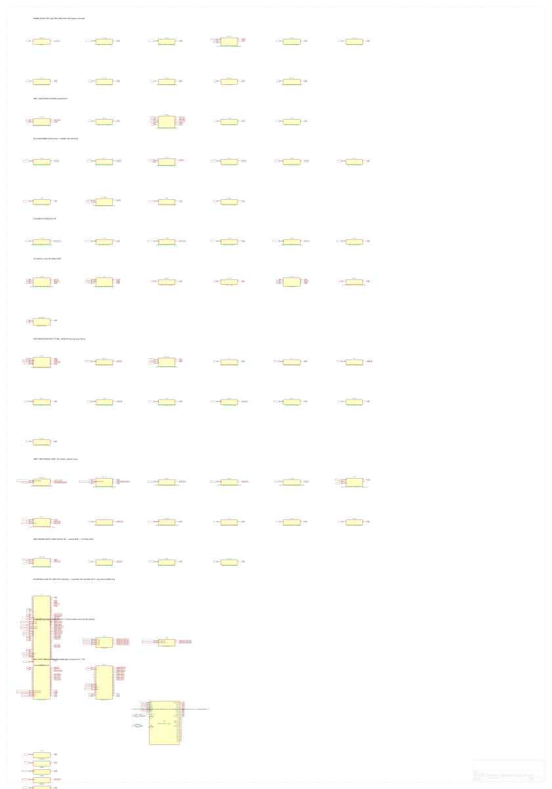

# Hardware Design Description

**Project:** Commo

## Executive Summary

This design contains **84 components** (80 unique parts) across **153 nets**. EMC risk score: 85.0/100.

## 2. System Overview

Commo is the fleet's dedicated radio-comms PocketBeagle 2 cape: a 49MHz Part 15 §15.235
AX.25/AFSK analog transceiver (DDS synthesizer, PA chain, LM393 RX demodulator) plus, as of the
2026-09-21 radio-relocation redesign, the **SiK modem (RFD900ux-SMT)** relocated here from the
XO/TACCO cape, replacing the RFM95W LoRa module Commo previously carried. The relocation was the
other half of a fleet-wide swap: XO/TACCO gave up SiK in exchange for an mLRS radio on a Seeed
Wio-E5 module (see `avionics/kicad/TACCO/reports/HDD.md` §2), so the fleet keeps one SiK-class
link and one LoRa-family link, now split the other way across the two radio-comms capes. Commo
was chosen to absorb SiK's higher TX current draw (1A peak vs. Commo's previously-documented
250mA budget) because it is already the fleet's high-power radio-comms cape by design — per the
owner, "mostly just moving the power requirement from XO, not building a whole new power
distribution rail from the batteries." See `avionics/WBS.md` §1.2a for the full decision record.

| Metric           | Value |
| ---------------- | ----- |
| Total components | 84    |
| Unique parts     | 80    |
| Nets             | 153   |
| Schematic sheets | 1     |

## 3. Power System Design

Commo runs on a +5V input rail with an on-board MCP1703T-3302 LDO (`LDO 3V3`, 72dB PSRR @100kHz)
producing +3V3 for the analog radio chain. This is a linear, not switching, 3.3V regulator —
appropriate here because Commo's digital/analog RF circuitry (DDS synth, PA bias, LM393
comparator) is more sensitive to switching-regulator ripple than to the LDO's lower efficiency at
this board's modest current draw. The SiK module (`C-SIK1`/`C-SIK2`, 10uF + 100nF) draws directly
from `SIK_VCC`, decoupled at the module pin per the RFD900ux datasheet's supply guidance.

### Decoupling

| IC        | Rail | Capacitors                        | Total |
| --------- | ---- | --------------------------------- | ----- |
| +3V3 rail | +3V3 | CMP By, C_INV, C_MUX, C_TPM_EMMA1 |       |

## 4. Signal Interfaces

*No formal buses detected by the analyzer; real interfaces on this board include the SiK UART
(`UART_SIK_RX`/`_TX`, `SIK_RTS`/`_CTS`) to the PB2 host, Ethernet (`ETH-PHY`), and the analog
AFSK audio path between the DAC/demodulator and the PA/RX chain.*

The LoRa->SiK swap reused Commo's PB2 header pins with minimal net renaming: `LORA_RESETN` and
`LORA_DIO0` (unused by SiK, which has no reset/DIO pins wired) were repurposed as `SIK_RTS`/
`SIK_CTS`, and `SPI1_CS_LORA` (SiK doesn't use SPI) was freed and reassigned to `DDS_FSYNC`, the
onboard MCP4921 TX DAC's own chip-select — previously unrouted to any controller pin. `UART_SIK_RX/
TX` already existed as real, wired PB2 global labels before this swap (a pre-existing provision),
so no new PB2 net assignment was needed for the SiK UART itself.

## 5. Analog Design

### Voltage Dividers

| R_top   | R_bottom | Ratio | Output Net |
| ------- | -------- | ----- | ---------- |
| RSSI Hi | RSSI Lo  | 0.500 | RSSI_ANA   |

### LC Filters

| Type | R | C       | Cutoff |
| ---- | - | ------- | ------ |
| ?    | ? | C1 120p | —      |
| ?    | ? | C1 120p | —      |
| ?    | ? | C2 180p | —      |
| ?    | ? | C2 180p | —      |
| ?    | ? | C3 120p | —      |

The RSSI carrier-detect divider (`RSSI Hi`/`RSSI Lo`, 0.5 ratio) scales the LM393 comparator's
carrier-detect threshold; the C1/C2/C3 shunt caps form the 3-pole LPF filtering the AFSK PA
output. Two real, pre-existing circuit bugs surfaced and were fixed during this session's SiK
swap (found via ERC cleanup, not from any new component): the PA final transistor's (`PA 100mW`,
2N3866) emitter pin had been wired straight to GND, bypassing its own 10R emitter-degeneration
resistor (`PA Re`) entirely — rewired onto the `PA_EMIT` net it was always meant to use; and the
T/R switch's antenna pin was on a differently-named net (`RF_ANT_SW`) one schematic row away from
the already-working `ANT` filter chain (`ANT CMC`->`ANT TVS`->`ANT RPSMA`) — merged. Neither bug
involved new parts; both were latent naming/wiring defects this session's ERC-driven review
exposed.

## 6. Thermal Analysis

**Thermal Score:** 100/100 | **Hottest Component:** — | **Components >85°C:** 0

## 7. EMC Considerations

**EMC Risk Score:** 85.0/100 | **Critical:** 0 | **High:** 0 | **Medium:** 0

### Findings by Category

| Category          | Count | Severity Breakdown |
| ----------------- | ----- | ------------------ |
| Ground Plane      | 2     | 1×info, 1×warning  |
| Decoupling        | 2     | 2×error            |
| Io Filtering      | 4     | 4×info             |
| Emission Estimate | 1     | 1×info             |

The 2 `decoupling` errors are the highest-severity finding and warrant follow-up before fab; they
are flagged against this board's existing analog RF section, not the newly-added SiK chain (the
SiK module has its own bulk+HF decoupling pair per the datasheet). The two ESD-protected antenna
paths (`ANT TVS` on the 49MHz chain, `D-ANT-SIK` RCLAMP0502B on the new SiK MMCX jack) follow the
same TVS-at-connector pattern used fleet-wide.

## 8. PCB Design Details

| Metric                  | Value |
| ----------------------- | ----- |
| Copper layers           | 4     |
| Footprints (front/back) | 71/17 |
| Track segments          | 527   |
| Vias                    | 90    |
| Routing completion      | partial (most pre-existing nets routed; the 8 new SiK-chain footprints are placed but unrouted) |

**Board Dimensions:** 55.1mm × 35.1mm (PocketBeagle 2 stackable cape envelope)

The old RFM95W footprint was removed and the 8 new SiK-chain footprints (`SIK`, `C-SIK1/2`,
`C-SIK-SH1/2`, `L-SIK-SER`, `D-ANT-SIK`, `J-ANT-SIK`) were added via direct `pcbnew` Python
scripting rather than a full board regeneration, matching this project's established practice for
boards whose schematic generator has drifted from the real PCB. Net use is now 46.1% of the
2-sided theoretical footprint-area ceiling (up from 34.9% before the swap), comfortably under the
~70% guideline for this 4-layer stackup. **Placement is not fab-ready**: this board's existing
hand-placed layout, already dense before the swap, has no contiguous 21x29mm gap for the SIK
module in any orientation without touching `ETH-PHY`/`T-ETH` — `kicad-cli pcb drc
--schematic-parity` reports 0 missing/extra footprints and 0 net conflicts (the swap's netlist is
correct), but 262 ordinary DRC violations, up from a 160 pre-swap baseline, reflecting real
placement-density conflicts that need a hands-on floorplan pass (potentially relocating
`ETH-PHY`/`T-ETH`) before this board can be routed and fabricated.

## 9. Mechanical / Environmental

**Board Dimensions:** 55.1mm × 35.1mm

Mounts as a stackable PocketBeagle 2 cape via the PB2-P1/PB2-P2 header pairs, the same mechanical
interface as every other cape in this fleet. The new SiK antenna jack (`J-ANT-SIK`, MMCX vertical)
joins the existing 49MHz RPSMA antenna jack (`ANT RPSMA`) as a second connector requiring
enclosure clearance at the cape stack's edge. Operating environment follows the fleet's general
avionics-bay envelope; no board-specific derating has been established beyond the fleet default.

## 10. BOM Summary

| References           | Value                                            | Footprint         | MPN | Qty |
| -------------------- | ------------------------------------------------ | ----------------- | --- | --: |
| +3V 100n             | 100nF X7R 0402  +3V3 HF Bypass                   |                   |     |   1 |
| +3V 100u             | 100uF 10V X5R 1210  +3V3 Bulk                    |                   |     |   1 |
| +3V 10n              | 10nF C0G 0402  +3V3 VHF 49MHz Bypass             |                   |     |   1 |
| +3V 10u              | 10uF X5R 0805  +3V3 Mid-freq                     |                   |     |   1 |
| +5V 100n             | 100nF X7R 0402  +5V HF Bypass                    |                   |     |   1 |
| +5V 100u             | 100uF 10V X5R 1210  +5V Bulk                     |                   |     |   1 |
| +5V Bead             | 742792512                                        |                   |     |   1 |
| 1.2k C               | 10nF  RX RC Bandpass 1200Hz Cap                  |                   |     |   1 |
| 1.2k R               | 13k Ohm  RX RC Bandpass 1200Hz                   |                   |     |   1 |
| 2.2k C               | 10nF  RX RC Bandpass 2200Hz Cap                  |                   |     |   1 |
| 2.2k R               | 7.2k Ohm  RX RC Bandpass 2200Hz                  |                   |     |   1 |
| 49M DDS              | Si5351A-B-GT  49MHz DDS I2C Synthesiser          |                   |     |   1 |
| AFSK Cp              | 1uF  AFSK Audio Coupling DAC→PA                  |                   |     |   1 |
| ANT CMC              | SRF2012-100Y                                     |                   |     |   1 |
| ANT RPSMA            | RPSMA-EDGE-50R                                   |                   |     |   1 |
| ANT TVS              | PRTR5V0U2X                                       |                   |     |   1 |
| C-SIK-SH1, C-SIK-SH2 | DNP                                              |                   |     |   2 |
| C-SIK1               | 10uF 10V X5R                                     |                   |     |   1 |
| C-SIK2               | 100nF                                            |                   |     |   1 |
| C1 120p              | 120pF C0G  LPF Shunt-1                           |                   |     |   1 |
| C2 180p              | 180pF C0G  LPF Shunt-2                           |                   |     |   1 |
| C3 120p              | 120pF C0G  LPF Shunt-3                           |                   |     |   1 |
| CMP By               | 100nF +3V3 U2B CMP Bypass                        |                   |     |   1 |
| C_INV                | 100nF C0G 0402  INV1 VCC Bypass                  |                   |     |   1 |
| C_MUX                | 100nF C0G 0402  MUX1 VCC Bypass                  |                   |     |   1 |
| C_TPM_EMMA1          | 100nF                                            | C_0402_1005Metric |     |   1 |
| D-ANT-SIK            | RCLAMP0502B                                      |                   |     |   1 |
| DAC By               | 100nF +3V3 U2A DAC Bypass                        |                   |     |   1 |
| ETH-PHY              | ADIN1300BCPZ                                     |                   |     |   1 |
| GND X2Y              | 4.7nF_X2Y_C0G                                    |                   |     |   1 |
| INV1                 | SN74LVC1G04  SOT-23-5  3.3V  UART_RX_F->SBUS_OUT |                   |     |   1 |
| J-ANT-SIK            | MMCX vertical                                    |                   |     |   1 |
| J-ETH                | JST-GH-4P-ETH                                    |                   |     |   1 |
| L-SIK-SER            | 0R link                                          |                   |     |   1 |
| L1 100n              | 100nH  Coilcraft-0805HQ-101J  LPF Series-1       |                   |     |   1 |
| L2 180n              | 180nH  Coilcraft-0805HQ-181J  LPF Series-2       |                   |     |   1 |
| L3 180n              | 180nH  Coilcraft-0805HQ-181J  LPF Series-3       |                   |     |   1 |
| LDO 3V3              | MCP1703T-3302  LDO 3.3V  72dB-PSRR@100kHz        |                   |     |   1 |
| LDO By               | 100nF +3V3 U6 LDO Bypass                         |                   |     |   1 |
| LNA                  | MGA-82563  LNA  2.4dB NF  50-6000MHz             |                   |     |   1 |
| LNA By               | 100nF +3V3 U4 LNA Bypass                         |                   |     |   1 |
| MUX1                 | SN74LVC1G157  SC-70-6  2:1MUX  UART/SBUS Select  |                   |     |   1 |
| OSC By               | 100nF +3V3 X1 TCXO Bypass                        |                   |     |   1 |
| PA 100mW             | 2N3866  NPN BJT  PA Class-AB Final 100mW         |                   |     |   1 |
| PA By                | 100nF +5V U3 PA VCC Bypass                       |                   |     |   1 |
| PA By2               | 1nF  U3B Collector RF Bypass                     |                   |     |   1 |
| PA Cb1               | 100pF  DDS-RF Coupling Cap to U3A                |                   |     |   1 |
| PA Cb2               | 100pF  PA Interstage Bypass                      |                   |     |   1 |
| PA Drvr              | MMBT2222A  NPN BJT  PA Class-A Driver            |                   |     |   1 |
| PA Rb1               | 10k Ohm  U3A Base Bias Resistor                  |                   |     |   1 |
*... and 31 more line items.*

## 11. Test and Debug

No dedicated production test points or programming interface are defined for the analog 49MHz
chain; the SiK module itself is factory-programmed and configured over its own UART (AT command
set), accessible via the PB2 host once `UART_SIK_RX/TX` are wired through. Formal test procedures
are deferred to `avionics/WBS.md` §U7 (per-board ERC/DRC/gerber closeout).

## 12. Compliance and Standards

### EMC Test Plan

*See EMC analysis output for detailed test plan.*

Two independent radio regimes apply: the 49MHz AX.25 link falls under FCC Part 15 §15.235 (the
project's own pre-compliance checklist tracks field-strength/harmonic-suppression limits in
`avionics/WBS.md`), and the SiK link (900MHz-class ISM) falls under FCC Part 15's frequency-hopping
rules for that band. No formal pre-compliance testing has been performed for either radio on this
board as of this writing.

## Appendix A: Schematic Drawings

### Commo

