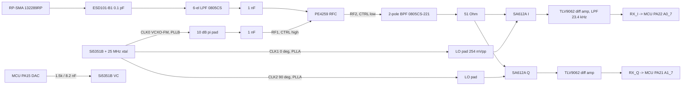

# Commo Rev T — 49 MHz Radio Design (I/Q receiver + VCXO-FM transmitter)

> ⚠️ **ENGINEERING REVIEW REQUIRED — this output is not a substitute for a qualified engineer.**
> Every result, calculation, and recommendation here **must be independently reviewed and
> accepted by a properly qualified individual** (a licensed Professional Engineer or an
> equivalently qualified authority) **before it is applied to any system carrying risk to life or
> safety.** Produced with the `electronics-engineering` skill (engineering-pe-skills, UNREVIEWED
> DRAFT). It is not a sealed, certified, or reviewed work product.

**Plan:** `docs/plans/2026-09-29-002-feat-commo-revt-49mhz-iq-radio-plan.md`, units U2 and U3.
**Schematic:** `kicads/Commo_radio.kicad_sch` (79 parts, 200 pins), generated by
`scripts/gen_commo_radio_sch.py`.
**Values:** computed and self-checked by `scripts/commo_radio_design.py`. It exits non-zero on any
failed check.
**Prepared:** 2026-09-29 by Claude Opus 5.5 (Claude Code). Owner: S. Griffing
(`Stab-Rabbit-coding`).

## 1. Architecture

- **Frequencies.** The channel is 49.860 MHz, provisional inside the 49.82–49.90 MHz band. The
  owner sets the channel list. The RX LO is 49.848 MHz, a low IF of +12 kHz.
- **Line regime.** Every on-board RF path is **electrically short (lumped)**. At 49.86 MHz, 1 in
  (25.4 mm) of FR-4 trace is about 1/160 of a wavelength. Only the antenna coax is distributed.
- **Receive path.**
  - The antenna passes through the 6-element LPF to the PE4259 switch.
  - From there it goes through a 2-pole band-pass filter to two SA612A mixers, fed by
    quadrature LOs.
  - A differential-to-single-ended low-pass amplifier follows each mixer.
  - The MSPM0's two simultaneous-sampling ADCs digitize the I and Q signals at 384 ksps.
  - Firmware decimates to 48 ksps and performs channel filtering, FM discrimination, and
    Bell-202 AFSK demodulation.
  - The MSPM0 trig accelerator does the FM discrimination. See `avionics/firmware/WBS.md`.
- **Transmit path.**
  - The MCU's 12-bit DAC frequency-modulates the Si5351B VCXO (PLLB).
  - CLK0 feeds a 10 dB pad and the switch, and the LPF removes square-wave harmonics.
  - There is no power amplifier.

## Computed values (commo_radio_design.py)

| Block | Quantity | Value |
|---|---|---|
| Plan | RX channel / LO (low-IF +12 kHz) | 49.860 MHz / 49.848 MHz |
| Si5351B PLLA (RX LO) | VCO, feedback a+b/c | 697.8720 MHz = 27 + 959320/1048575 |
| Si5351B PLLB (TX, VCXO) | VCO, feedback a+b/c | 698.0400 MHz = 27 + 966367/1048575 |
| Si5351B | MultiSynth divider (both), CLK2 PHOFF | 14, 14 steps = 90.00 deg |
| VCXO | deviation / Kv / VC swing | +/-3.0 kHz = +/-60.2 ppm / 100 ppm/V / 1.65 +/- 0.602 V |
| VCXO | DAC 12-bit LSB | 0.806 mV = 4.0 Hz |
| VCXO | VC RC 1.5 kOhm / 8.2 nF | fc 12.94 kHz; -0.12 dB at 2.2 kHz; -11.7 dB at 48 kHz |
| LO pad | 2.4 kOhm series, 200 Ohm shunt, 1 nF block | 254 mVpp at pin 6 (3.2 Ohm block at 49.85 MHz) |
| LPF (0805CS-101/181/181, 120/180/120 pF) | S21 | -1.43 dB at 49.86; -45.6 dB at 99.7; -68.3 dB at 149.6; -95.6 dB at 249.3 MHz |
| RX BPF (0805CS-221, 30/3.9/15 pF) | peak, -3 dB BW, 49.86, 88 MHz | 49.35 MHz, 5.79 MHz, -2.82 dB, -27.9 dB |
| TX pad | 10 dB pi, shunt / series | 96.25 / 71.15 Ohm -> E96 95.3 / 71.5 Ohm |
| Baseband | gain, LPF, HPF, post-RC | x8.70 (18.8 dB), 23.4 kHz, 13.8 Hz, 72.3 kHz |
| Baseband | alias attenuation at 336 kHz (fs 384 ksps) | -36.7 dB |
| Power | RX current at 5 V, typ / max | 34.3 mA / 56.3 mA |

## Design checks

| Check | Result | Detail |
|---|---|---|
| PLLA VCO in range | PASS | 697.8720 MHz |
| PLLB VCO in range | PASS | 698.0400 MHz |
| VCXO output <= 112.5 MHz | PASS | Si5351-B VCXO section |
| I/Q offset is an integer step count | PASS | PHOFF = 14.0000 steps (= MS divider), error 0.0000 deg |
| Deviation inside pull range | PASS | +/-60.2 ppm vs +/-30..240 ppm |
| VC swing stays in the 10-90 % linear window | PASS | 1.048..2.252 V |
| VC RC corner 10-20 kHz | PASS | 12.94 kHz |
| LO level at SA612A pin 6 | PASS | 254 mVpp |
| CLK1/2 load current < 2 mA drive setting | PASS | 1.27 mA peak |
| LPF passband loss < 1.5 dB | PASS | -1.43 dB at 49.86 MHz |
| LPF >= 40 dB at 3rd harmonic (square-wave TX) | PASS | -68.3 dB at 149.6 MHz |
| BPF centre within +/-1.5 MHz of channel | PASS | peak 49.35 MHz, -2.77 dB |
| BPF loss at channel < 4 dB | PASS | -2.82 dB at 49.86 MHz |
| Channel (IF 12 kHz +/- Carson 5.2 kHz) inside baseband corner | PASS | corner 23.4 kHz |
| High-pass corner far below IF | PASS | 13.8 Hz |
| TLV9062 GBW margin (10x) | PASS | needs 2.04 MHz of 10 MHz |
| Alias attenuation at fs-48k >= 35 dB | PASS | -36.7 dB at 336 kHz |

**RX BPF value choice.** The script sweeps the E24/E12 capacitor combinations
(C_res 27/30 pF, C_end 10–15 pF, C_couple 2.7–3.9 pF). 30 / 3.9 / 15 pF gives the lowest loss at
49.86 MHz (−2.82 dB), a 5.8 MHz bandwidth, and −27.9 dB at 88 MHz, the bottom of the FM broadcast
band. The response peak sits 0.5 MHz below the channel but inside a flat 5.8 MHz passband.
Component tolerance (±2 % L, ±0.25 pF C) moves the centre by about 1 MHz and the channel stays in
the passband.

## 2. Parts (all datasheets in `avionics/datasheets/`)

| Ref | Part | Package | Status / source |
|---|---|---|---|
| U-SYN | Skyworks **Si5351B-B-GM1** | 16-QFN 3 × 3 mm, EP land 1.70 mm (= package minimum, §12.3) | Si5351-B Rev 1.3. The B variant has **no 10-MSOP**, so the plan's KTD3 package is corrected here. |
| Y-SYN | ECS **ECS-250-8-36-CGN-TR** (ECX-2236) | 2.5 × 2.0 mm | 25.000 MHz, CL 8 pF, ESR 60 Ω max, 100 µW, −40…+85 °C. The Si5351B VCXO pulls PLLB, not the crystal (datasheet Fig. 3, "non-pullable"). |
| U-MIX-I, U-MIX-Q | NXP **SA612AD/01,118** | SO8 (only package) | Rev 3 (2014). Listed active on nxp.com. The FM-IF parts SA605, SA614A, and SA636 are discontinued. |
| U-TR | pSemi **PE4259-63** | SC-70-6 | DOC-03694-5.01 (07/2026). 10–3000 MHz, CTRL high = TX. |
| U-BB | TI **TLV9062IDDFR** | SOT-23-8 (DDF) | "Active / Production" in the TI package addendum. |
| U-LDO-RF | TI **TPS7A2033PDBVR** | SOT-23-5 | "Active / Production". PSRR 95 dB at 1 kHz. A smaller option is the TPS7A2033DQNR, X2SON 1 × 1 mm. |
| L-LPF1/2/3 | Coilcraft **0805CS-101XGRC / -181XGRC** | 0805 | 0805cs.pdf, SRF 1250 / 920 MHz. |
| L-BPF1/2 | Coilcraft **0805CS-221XGRC** | 0805 | SRF 820 MHz. |
| D-ANT | Infineon **ESD101-B1-02ELS** | TSSLP-2-4 (SecureControllers lib) | ±5.5 V V_RWM, 0.1 pF typical. |
| J-ANT | Amphenol **132289RP** RP-SMA edge | stock 132289 land | §15.203 unique coupling (Commo.md J2). **Datasheet not on file.** |

## 3. Rev S carry-overs found wrong and corrected

- **LPF inductors.** The Rev S "Coilcraft 0805HQ-101J / -181J" parts **do not exist**: the 0805HQ
  series stops at 51 nH (0805hq.pdf). Replaced with 0805CS-101 / -181.
- **Antenna TVS.** The "SMAJ5.0A" is a 400 W TVS whose datasheet does not state a capacitance.
  Large TVS junctions are unsuitable directly on a 49.86 MHz RF port, and the part is
  unidirectional although Commo.md calls it bidirectional. Replaced with the ESD101-B1
  (0.1 pF, bidirectional).
- **Ferrite bead.** The "742792510 600 Ω @ 100 MHz" bead is actually 70 Ω ±25 % at 100 MHz with a
  5 A rating (wurth-742792510.pdf). The RF supply now uses a 4.7 Ω / 10 µF RC filter.
- **Rev S chain.** The Si5351A pin map, the TCXO, the PE4259 VDD and common port, the MGA-82563
  pins, and the missing detector are covered in `COMMO_REVT_PHASE1_PARTS.md` §3.

## 4. Power, size, weight

- **Power: RX current at 5 V is 34.3 mA typical and 56.3 mA maximum.** That is about 0.17 W
  typical. Plan requirement R4 (≤ 15 mA) **is not met**.
  - The Si5351B core (24 mA typical, 38 mA maximum, IDD with 4 outputs) dominates.
  - **Mitigation:** `RF_EN` shuts the TPS7A2033 off, which removes the Si5351B, op-amps, and
    switch rail when the radio is idle. The radio then draws only the SA612As (4.8 mA).
  - R4 is re-baselined to "≤ 60 mA while the receiver is active; RF rail off when idle", pending
    owner acceptance.
- **Size.** Courtyard estimate for the radio section, to confirm in U4 from the loaded footprints:

  | Item | Courtyard area |
  |---|---|
  | 2 × SA612A SO8 | ≈ 60 mm² |
  | Si5351B | ≈ 16 mm² |
  | Crystal | ≈ 10 mm² |
  | TLV9062 | ≈ 13 mm² |
  | PE4259 | ≈ 8 mm² |
  | LDO | ≈ 9 mm² |
  | 5 × 0805 inductors | ≈ 35 mm² |
  | about 60 × 0402 passives | ≈ 115 mm² |
  | RP-SMA | ≈ 70 mm² |
  | ESD101 | ≈ 1 mm² |
  | **Total** | **≈ 340 mm²** |

  That is within the 400 mm² target.
- **Weight.** It comes from the PCB mass roll-up in U5.

## 5. Regulatory (47 CFR Part 15 §15.235, REF-FCC-003)

No numeric limit is asserted here from memory (skill rule 6).

- **TX attenuation.** The 10 dB pad value, the Si5351B drive strength (2/4/6/8 mA
  programmable), and firmware output gating together set conducted power. The starting target
  is the project's existing −13 dBm (Commo.md "Regulatory Constraints"). It **must be confirmed
  against the current §15.235 field-strength text and set at an accredited EMC lab**, and the
  pad resistors re-picked there.
- **Harmonics.** The square-wave harmonics at 99.7, 149.6, and 249.3 MHz are attenuated by the
  LPF (see the table). The applicable §15.209/§15.235(b) spurious limits must be confirmed by
  measurement.
- **Certification.** The background single-chip search found no modular-grant option
  (`docs/brainstorms/2026-09-29-commo-49mhz-single-chip-search.md`). Commo needs its own full
  §15.235 certification.

## 6. MCU interface (pins confirmed in TI SLASFA6B Table 6-2 / Signal Descriptions)

| Net | MCU pin (RGZ-48) | Function |
|---|---|---|
| RX_I | PA22, pin 40 | A0_7, ADC0 |
| RX_Q | PA21, pin 39 | A1_7, ADC1, sampled simultaneously with ADC0 |
| VCXO_DAC | PA15, pin 30 | DAC_OUT |
| TR_CTRL | PB15, pin 25 | GPIO; the PE4259 allows at most 25 kHz switching |
| RF_EN | PB9, pin 23 | GPIO; the TPS7A20 EN has a 500 kΩ internal pull-down, so the rail is off at reset |
| I2C0_SCL / SDA | PA1 / PA0 | shared with the OPTIGA (0x30); Si5351B at 0x60; 2.2 kΩ pull-ups (Si5351-B: ≥ 1 kΩ) |

## 7. Assumptions and bench-verify items

1. **Inductor Q.** Q = 40 at 50–250 MHz is assumed for the 0805CS parts. The datasheet
   specifies Q min only at 250–500 MHz. The LPF (−1.43 dB) and BPF (−2.82 dB) losses scale with
   it, so measure them.
2. **SA612A OSC_E (pin 7).** It is left open with external LO injection. The datasheet says only
   to inject at OSC_B through a DC block. Confirm conversion gain on the bench.
3. **I/Q phase.** The quadrature phase is set by CLK2 PHOFF = 14 steps (the MultiSynth divider).
   Residual I/Q gain and phase imbalance is corrected in firmware.
4. **FM deviation.** ±3 kHz and Kv = 100 ppm/V are chosen values. Confirm the deviation against
   the AX.25/Bell-202 link design and the §15.235 bandwidth rules. Calibrate Kv with the APR
   register.
5. **Si5351B VC input.** The datasheet gives no VC input impedance. The 1.5 kΩ / 8.2 nF RC
   assumes a high-impedance input. Measure the modulation response.
6. **TLV9062 DDF land.** Verify the stock `SOT-23-8` footprint against the TI DDF land pattern
   in U4.
7. **Antenna ground.** The J-ANT shell goes to RF GND for a low-inductance return. That departs
   from Commo.md's shell-to-PGND ring. The owner should confirm the chassis bonding approach.
