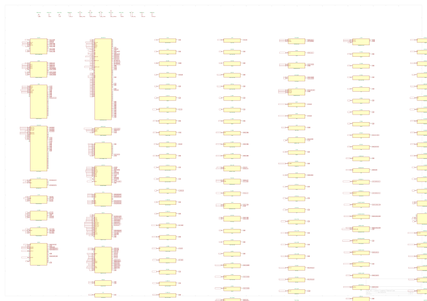

# Hardware Design Description

**Project:** TACCO (formerly XO)

## Executive Summary

This design contains **143 components** (57 unique parts) across **250 nets**. Power rails: +1V8_RF (1.344V), +3V3 (2.452V), +3V3_RF (3.3V). EMC risk score: 67.0/100.

## 2. System Overview

TACCO is a PocketBeagle 2 (PB2) stackable cape combining the fleet's 1553B/C avionics
bus interface, dual CAN-FD/RS-485 peripheral buses, Ethernet uplink, SD/QSPI-flash
local storage, and — as of the 2026-09-21 radio-relocation redesign — the mLRS
long-range command/telemetry link on a Seeed Wio-E5 (STM32WLE5) module in place of
the RFD900ux-SMT SiK modem this board carried previously. SiK was moved to the
Commo cape (which gained the area headroom to absorb it after Commo's own LoRa
module was removed) so that the fleet keeps one SiK-class link and one LoRa-family
link split across the two radio-comms capes rather than doubling up on either
family. The Wio-E5 was chosen over a bare-chip STM32WLE5 layout for its
open-published KiCad source and EU-domiciled silicon vendor (STMicroelectronics),
and mLRS was chosen over a from-scratch protocol stack as the closest like-for-like
replacement for what SiK provided (MAVLink-transparent telemetry, bidirectional RC,
frequency hopping). See `avionics/WBS.md` §1.2a for the full radio-relocation decision record
(SiK-to-Commo, Wio-E5-to-TACCO, with CH32V006 and EByte both considered and
rejected).

> **Radio swap summary (2026-09-21):** This board (then named XO, renamed TACCO
> 2026-09-22) removed its RFD900ux-SMT SiK modem and gained an mLRS radio link on a
> Seeed Wio-E5 (STM32WLE5) module — refs `WIOE5`, `C-WIOE5-IN`, `C-WIOE5-SH1/SH2`,
> `L-WIOE5-SER`, `D-ANT-WIOE5`, `J-ANT-WIOE5`, `FB-WIOE5-1/2`, `LED-WIOE5-G/R`,
> `R-WIOE5-*`, `SW-WIOE5-BOOT`. The Commo cape received the RFD900ux-SMT SiK modem
> this board gave up, in exchange for removing its own RFM95W LoRa module — see
> `avionics/kicad/Commo/reports/HDD.md` §2 for that side of the swap. Net effect:
> the fleet still carries one SiK-class link and one LoRa-family link, just
> swapped between the two radio-comms capes.

| Metric           | Value |
| ---------------- | ----- |
| Total components | 143   |
| Unique parts     | 57    |
| Nets             | 250   |
| Schematic sheets | 1     |

## 3. Power System Design

Board input is +5V (from the PB2 host or the Nano-Fit `PWR-IN` connector). Two TPS62933
synchronous buck converters (U-3V3, U-1V8RF) and one TPS63031 buck-boost (U-3V3RF) derive the
three on-board rails. U-1V8RF is a second TPS62933 instance added during the 2026-09-21 radio
redesign specifically to feed +1V8_RF for the Wio-E5 module's SD_VIO pin — sharing that rail with
the existing high-current RF 1.8V consumer rather than adding a dedicated LDO for a
low-current signaling pin (owner's "one bigger regulator, not two" call). U-3V3RF is the
dedicated buck-boost RF supply that keeps +3V3_RF regulated for the RF-sensitive loads (WIOE5,
WIFI-BT-ZB) even if +5V sags under load, independent of the digital +3V3 rail.

| Ref     | Part         | Topology  | Input Rail | Output Rail | Vout |
| ------- | ------------ | --------- | ---------- | ----------- | ---- |
| U-1V8RF | TPS62933DRLR | switching | +5V        | +1V8_RF     | 1.3V |
| U-3V3   | TPS62933DRLR | switching | +5V        | +3V3        | 2.5V |
| U-3V3RF | TPS63031DSKR | LDO       | +5V        | +3V3_RF     | 3.3V |

### Decoupling

| IC               | Rail        | Capacitors                                                                                                                                                      | Total |
| ---------------- | ----------- | --------------------------------------------------------------------------------------------------------------------------------------------------------------- | ----- |
| +3V3 rail        | +3V3        | C-3V3-O1, C-3V3-O2, C-CAN3, C-485-3, C-25M, C-PHY-A1, C-PHY-A2, C-PHY-A3, C-1553A, C-1553B, C-1553C, C-TPM1, C-TPM2, C-TPM3, C-TPM4, C-ZB-VIO, C-FLASH1, C-PLD1 | 57µF  |
| +5V rail         | +5V         | C-IN2, C-IN3, C-3V3-IN, C-3V3-HF, C-1V8RF-IN, C-1V8RF-HF, C-RF-IN1, C-RF-IN2, C-CAN1, C-CAN2, C-485-1, C-485-2                                                  | 60µF  |
| +1V8_RF rail     | +1V8_RF     | C-1V8RF-O1, C-1V8RF-O2, C-ZB-18-1, C-ZB-18-2, C-ZB-SDVIO                                                                                                        | 44µF  |
| VCC2_RS485B rail | VCC2_RS485B | C-485-4, C-485-5, C-485-6                                                                                                                                       | 10µF  |
| VCC2_CANB rail   | VCC2_CANB   | C-CAN4, C-CAN5, C-CAN6                                                                                                                                          | 10µF  |
| +5V_IN rail      | +5V_IN      | C-IN1                                                                                                                                                           | 47µF  |
| +3V3_RF rail     | +3V3_RF     | C-RF-O1, C-RF-O2, C-WIOE5-IN, C-ZB-33-1, C-ZB-33-2                                                                                                              | 49µF  |

## 4. Signal Interfaces

*No formal buses detected by the analyzer (bus detection works from bus-alias labels, which this
schematic doesn't use); real buses on this board include 1553B/C (`1553-XCVR`/`1553-XFM`),
CAN-FD (`CAN-TR`, isolated), RS-485 (`RS485`, isolated), Ethernet (`ETH-PHY`), microSD/QSPI, and
the mLRS UART to the Wio-E5 module.*

`UART_WIOE5_RX`/`UART_WIOE5_TX` connect the Wio-E5's host UART directly to the PB2 rails with a
ferrite bead pair (`FB-WIOE5-1/2`) for conducted-emission suppression; mLRS carries no RTS/CTS
flow control, so those PB2 pins previously used by SiK are freed (`None, None` in the pin map)
rather than left half-wired. `SWD` debug (`WIOE5_SWDIO`/`WIOE5_SWCLK`) routes to a 4-pin GH
header (`J-WIOE5-SWD`) with 22R series resistors, and `SW-WIOE5-BOOT` forces the module's
bootloader by pulling `PB13` low at power-up — both match the Wio-E5 datasheet's own reference
design (Fig. 12).

## 5. Analog Design

### Voltage Dividers

| R_top   | R_bottom | Ratio | Output Net |
| ------- | -------- | ----- | ---------- |
| R-FB18H | R-FB18L  | 0.446 | FB_1V8RF   |
| R-FB18H | R-FB18L  | 0.446 | FB_1V8RF   |
| R-FB3H  | R-FB3L   | 0.245 | FB_3V3     |
| R-FB3H  | R-FB3L   | 0.245 | FB_3V3     |

### RC Filters

| Type     | R     | C    | Cutoff   |
| -------- | ----- | ---- | -------- |
| low-pass | R-BSR | C-BS | 212.2kHz |
| low-pass | R-BST | C-BS | 212.2kHz |

The two voltage-divider entries are the TPS62933 feedback networks: R-FB18H/R-FB18L (40.2k/32.4k,
1%) set +1V8_RF to ~1.79V, and R-FB3H/R-FB3L (100k/32.4k, 1%) set +3V3 to ~2.45V — both computed
directly from the TPS62933 datasheet's Vref and feedback-divider equation, not tuned by SPICE.
The mLRS antenna chain (`L-WIOE5-SER`, `C-WIOE5-SH1/SH2`) uses the same DNP-shunt-plus-0R-link
placeholder pattern as the rest of the fleet's antenna matching networks: continuity is
guaranteed by the 0R link so the board can be bench-tested before the real matching values are
selected from measured VSWR, matching the vendor reference schematics' own use of unpopulated
matching positions.

## 6. Thermal Analysis

**Thermal Score:** 82/100 | **Hottest Component:** {'ref': 'U-3V3RF', 'tj_estimated_c': 149.6} | **Components >85°C:** 1

## 7. EMC Considerations

**EMC Risk Score:** 67.0/100 | **Critical:** 0 | **High:** 0 | **Medium:** 0

### Findings by Category

| Category          | Count | Severity Breakdown |
| ----------------- | ----- | ------------------ |
| Ground Plane      | 2     | 1×info, 1×warning  |
| Io Filtering      | 3     | 3×info             |
| Via Stitching     | 1     | 1×warning          |
| Emission Estimate | 3     | 3×info             |
| Esd Path          | 2     | 2×warning          |
| Switching Emc     | 8     | 4×error, 4×warning |

The 4 `switching_emc` errors flag the two buck converters' (U-3V3, U-1V8RF) switching-node
layout as the board's dominant emission risk, ahead of the RF radios themselves — expected for a
55x35mm board where switcher hot loops sit close to sensitive RF traces. Each converter's own
input/output bulk + HF decoupling pair (`C-3V3-IN`/`C-3V3-HF`, `C-1V8RF-IN`/`C-1V8RF-HF`) is
placed per the TPS62933 datasheet's layout guidance; the `esd_path` warnings are on the two MMCX
antenna jacks (`J-ANT-WIOE5`, `J-ANT-RADIO`), each protected by an RCLAMP0502B TVS
(`D-ANT-WIOE5`, `D-ANT-RADIO`) at the connector. No certification testing has been run against
this EMC score yet — it is a pre-layout-review estimate, not a pre-compliance measurement.

## 8. PCB Design Details

| Metric                  | Value |
| ----------------------- | ----- |
| Copper layers           | 4     |
| Footprints (front/back) | 102/41 |
| Track segments          | 0 (unrouted — placement in progress) |
| Vias                    | 0     |
| Routing completion      | 0%    |

**Board Dimensions:** 55.1mm × 35.1mm (PocketBeagle 2 stackable cape envelope)

`kicad-cli pcb drc --schematic-parity`: 169 violations, 0 schematic-parity issues (the schematic
and PCB agree on every net and footprint; the 169 are placement-density/unrouted-ratsnest
findings, not sch/pcb mismatches). Placement is not yet complete: this 4-layer, two-sided board
sits at 86.1% of its two-sided theoretical footprint-area ceiling after the SiK-to-WIOE5 swap and
the winch/door-servo-to-bus-network correction freed real estate, and 41 of 143 footprints
remain unplaced — a placer packing-density limit at this component count, not a missing-scope
problem. See `avionics/WBS.md` §1.2a for the placement history and owner's hand-placement
decision.

## 9. Mechanical / Environmental

**Board Dimensions:** 55.1mm × 35.1mm

Mounts as a stackable PocketBeagle 2 cape via the PB2-P1/PB2-P2 2x18 header pairs
(`PocketBeagle2_2x18_P1_Socket`/`_P2_Socket`), the same mechanical interface as every other cape
in this fleet (Pilot, Commo, FlightEngineer, Observer). Two MMCX vertical antenna jacks
(`J-ANT-WIOE5` for the mLRS link, `J-ANT-RADIO` for the shared RF chain) require enclosure
cutouts or pigtails at the cape stack's edge; connector accessibility for `PWR-IN` (Nano-Fit),
`J-CAN`/`J-485`/`J-FAN`/`J-ETH`/`J-1553` (JST-GH) and `J-SD` (microSD) must be preserved in the
final stack-up. Operating temperature, humidity, and vibration requirements follow the airframe's
general avionics-bay environmental envelope (see root `AGENTS.md`); no board-specific derating
beyond the fleet default has been established for this cape.

## 10. BOM Summary

| References                                             | Value             | Footprint                                           | MPN                  | Qty |
| ------------------------------------------------------ | ----------------- | --------------------------------------------------- | -------------------- | --: |
| 1553-XCVR                                              | HI-1573PCI        | QFN-44-1EP_7x7mm_P0.5mm_EP5.2x5.2mm                 | HI-1573PCI           |   1 |
| 1553-XFM                                               | PM-DB2791S        | Xfmr_1553_SMD_0.40in_8pin                           | PM-DB2791S           |   1 |
| C-1553C                                                | 10uF 6.3V X5R     | C_0603_1608Metric                                   |                      |   1 |
| C-3V3-O1, C-3V3-O2, C-1V8RF-O1, C-1V8RF-O2, C-RF-O1 +1 | 22uF 6.3V X5R     | C_0603_1608Metric                                   |                      |   6 |
| C-ANT-SANT                                             | 10pF              | C_0201_0603Metric                                   |                      |   1 |
| C-ANT-SH1, C-ANT-SH2                                   | DNP               | C_0402_1005Metric                                   |                      |   2 |
| C-BS                                                   | 10nF 2kV          | C_1808_4520Metric                                   |                      |   1 |
| C-IN1                                                  | 47uF 10V X5R      | C_1210_3225Metric                                   |                      |   1 |
| C-IN2, C-3V3-IN, C-1V8RF-IN, C-RF-IN1, C-CAN2 +3       | 10uF 10V X5R      | C_0603_1608Metric                                   |                      |   8 |
| C-IN3, C-3V3-HF, C-BST, C-1V8RF-HF, C-BST18 +22        | 100nF             | C_0402_1005Metric                                   |                      |  27 |
| C-PHY-A3, C-PHY-CTD2, C-PHY-CRD2, C-TPM1               | 1uF               | C_0402_1005Metric                                   |                      |   4 |
| C-SS, C-SS18, C-CAN1, C-CAN4, C-485-1 +2               | 10nF              | C_0201_0603Metric                                   |                      |   7 |
| C-WIOE5-IN                                             | 4.7uF             | C_0603_1608Metric                                   |                      |   1 |
| C-WIOE5-SH1, C-WIOE5-SH2                               | DNP               | C_0201_0603Metric                                   |                      |   2 |
| CAN-TR                                                 | ISOW1044BDFMR     | SOIC-20W_7.5x12.8mm_P1.27mm                         | ISOW1044BDFMR        |   1 |
| CMC-CAN, CMC-RS485                                     | SRF2012-100Y      | Bourns_SRF2012_4T                                   | SRF2012-121YA        |   2 |
| D-ANT-WIOE5, D-ANT-RADIO                               | RCLAMP0502B       | RCLAMP0502B_SOD882                                  | RCLAMP0502BTCL       |   2 |
| ETH-PHY                                                | DP83825IRHBR      | Texas_RMQ0024A_WQFN-24-1EP_3x3mm_P0.4mm_EP1.9x1.9mm | DP83825IRHBR         |   1 |
| FB1, FB-WIOE5-1, FB-WIOE5-2, FB-SDIO1, FB-SDIO2 +4     | 742792510         | L_1812_4532Metric                                   | 742792510            |   9 |
| H1, H2, H3, H4                                         | M2.5 PGND         | MountingHole_2.7mm_M2.5_PGND_Ring                   |                      |   4 |
| J-ANT-WIOE5, J-ANT-RADIO                               | MMCX vertical     | MMCX_Molex_73415-1471_Vertical                      | 73415-1471           |   2 |
| J-CAN, J-485, J-FAN                                    | SM03B-GHS-TB      | JST_GH_SM03B-GHS-TB_1x03-1MP_P1.25mm_Horizontal     | SM03B-GHS-TB(LF)(SN) |   3 |
| J-ETH, J-1553, J-WIOE5-SWD                             | SM04B-GHS-TB      | JST_GH_SM04B-GHS-TB_1x04-1MP_P1.25mm_Horizontal     | SM04B-GHS-TB(LF)(SN) |   3 |
| J-SD                                                   | microSD push-pull | microSD_HC_Molex_104031-0811                        | 104031-0811          |   1 |
| L-3V3, L-1V8RF                                         | 3.3uH 2.25A       | L_WE-MAPI_3015                                      | 74438335033          |   2 |
| L-RF1, L-RF2                                           | 2.2uH 3A          | L_Wuerth_MAPI-3015                                  | LPS3015-222MRC       |   2 |
| L-WIOE5-SER, L-ANT-SER                                 | 0R link           | R_0402_1005Metric                                   |                      |   2 |
| LED-WIOE5-G                                            | Green             | LED_0603_1608Metric                                 |                      |   1 |
| LED-WIOE5-R                                            | Red               | LED_0603_1608Metric                                 |                      |   1 |
| NOR-FLASH                                              | W25Q128JVSIQ      | SOIC-8_3.9x4.9mm_P1.27mm                            | W25Q128JVSIQ         |   1 |
| PB2-P1                                                 | PB2I-P1-2x18      | PocketBeagle2_2x18_P1_Socket                        |                      |   1 |
| PB2-P2                                                 | PB2I-P2-2x18      | PocketBeagle2_2x18_P2_Socket                        |                      |   1 |
| PWR-IN                                                 | Nano-Fit 4P       | Molex_NanoFit_1x04_Horizontal                       | 105313-1204          |   1 |
| R-1553P, R-1553N                                       | 55R 2%            | R_0603_1608Metric                                   |                      |   2 |
| R-AD0                                                  | 2.49k             | R_0201_0603Metric                                   |                      |   1 |
| R-BST, R-BSR                                           | 75R               | R_0402_1005Metric                                   |                      |   2 |
| R-CANT, R-485T                                         | 120R              | R_0402_1005Metric                                   |                      |   2 |
| R-EN3, R-EN18                                          | 100k              | R_0201_0603Metric                                   |                      |   2 |
| R-FB18H                                                | 40.2k 1%          | R_0201_0603Metric                                   |                      |   1 |
| R-FB3H                                                 | 100k 1%           | R_0201_0603Metric                                   |                      |   1 |
| R-FB3L, R-FB18L                                        | 32.4k 1%          | R_0201_0603Metric                                   |                      |   2 |
| R-PGND                                                 | 0R                | R_0805_2012Metric                                   |                      |   1 |
| R-RBIAS                                                | 6.49k 1%          | R_0201_0603Metric                                   |                      |   1 |
| R-TPMCS, R-TPM10, R-FLASH-WP                           | 10k               | R_0201_0603Metric                                   |                      |   3 |
| R-WIOE5-LEDG, R-WIOE5-LEDR                             | 1k                | R_0201_0603Metric                                   |                      |   2 |
| R-WIOE5-RST                                            | 22k               | R_0201_0603Metric                                   |                      |   1 |
| R-WIOE5-SWDIO, R-WIOE5-SWCLK                           | 22R               | R_0201_0603Metric                                   |                      |   2 |
| RS485                                                  | ISOW1412DFMR      | SOIC-20W_7.5x12.8mm_P1.27mm                         | ISOW1412DFMR         |   1 |
| SD-WB                                                  | ATF16V8BQL-15XI   | TSSOP-20_4.4x6.5mm_P0.65mm                          | ATF16V8BQL-15XI      |   1 |
| SW-WIOE5-BOOT                                          | PTS125Sx43        | SW_Push_1P1T_NO_CK_PTS125Sx43PSMTR                  | PTS125S43SMTR2LFS    |   1 |
*... and 10 more line items.*

## 11. Test and Debug

| Ref | Type | Protocol |
| --- | ---- | -------- |
| ?   |      |          |

Debug access for the Wio-E5/mLRS radio is the 4-pin `J-WIOE5-SWD` header (VTREF/SWDIO/SWCLK/GND)
plus `SW-WIOE5-BOOT`, a tactile switch that forces the module's UART bootloader for firmware
flashing without SWD. `LED-WIOE5-G`/`LED-WIOE5-R` give visual link/status indication. No dedicated
production bed-of-nails test points have been defined yet for this cape; formal test procedures
are deferred to `avionics/WBS.md` §U7 (per-board ERC/DRC/gerber closeout).

## 12. Compliance and Standards

### EMC Test Plan

*See EMC analysis output for detailed test plan.*

This cape's radios operate under two separate regulatory regimes: the mLRS link (900MHz-class
ISM band, region-configurable in firmware) falls under FCC Part 15 (unintentional/intentional
radiator rules depending on final TX power configuration), and the 1553B/C, CAN-FD, RS-485, and
Ethernet interfaces are conducted, not radiated, so they fall under conducted-emissions/immunity
practice rather than a radio type-certification path. No FCC/CE pre-compliance testing or formal
certification strategy has been established for this board as of this writing — the EMC section
above is a design-time risk estimate, not a compliance test result.

## Appendix A: Schematic Drawings

### TACCO

