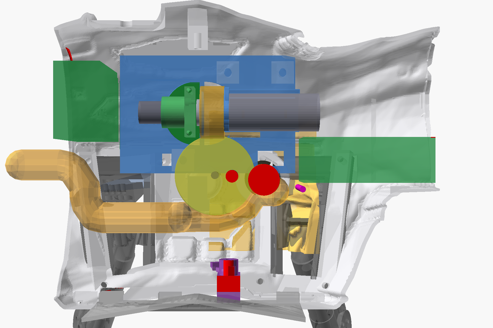
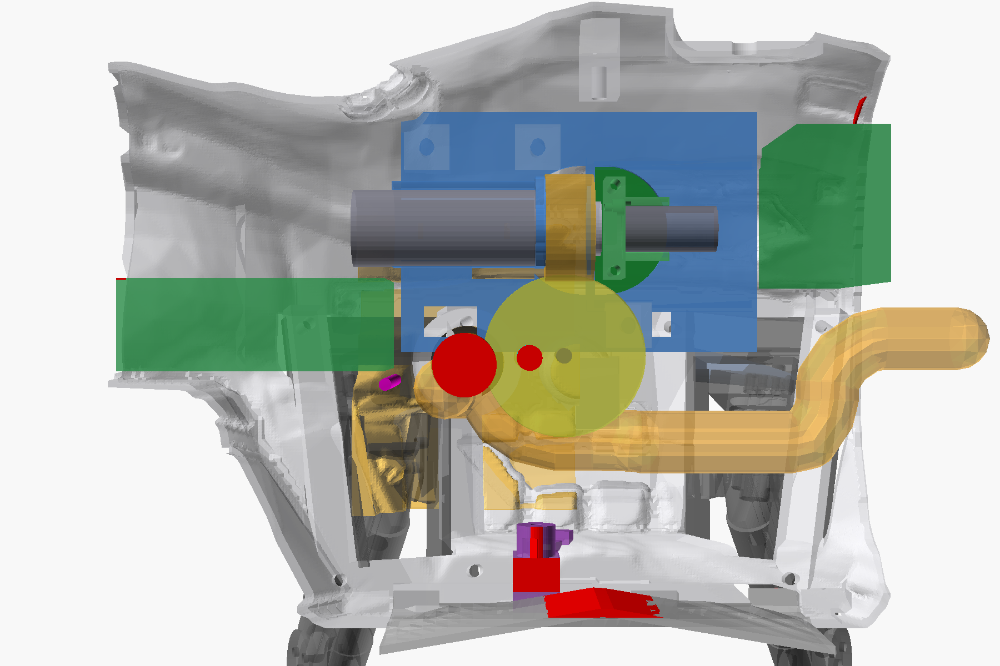
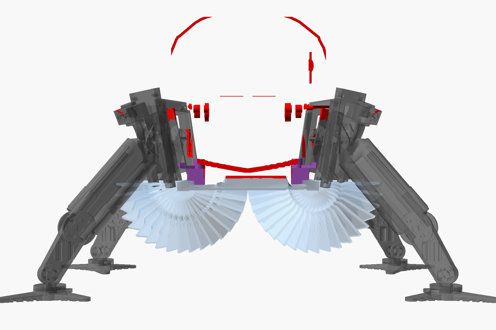
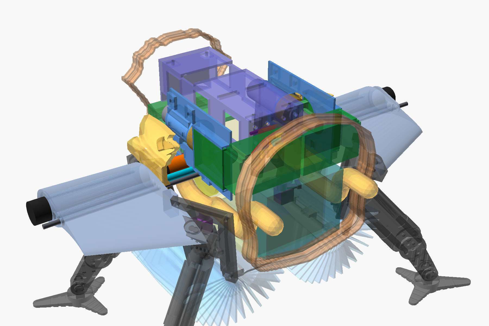

# Cargo Bay Bulkheads — In-Context Fit Check (2026-10-07)

**Author:** Steve Griffing, PE(CSE), CISSP-ISSEP, CPP
**AI note:** Analysis, tool and document by Claude (Claude Opus 5.5, Anthropic)
under the direction of Stab-Rabbit-coding, 2026-10-07, per `AGENTS.md` AI
attribution. No human has yet reviewed these findings.
**License:** CC BY-SA 4.0 — creativecommons.org/licenses/by-sa/4.0
(SPDX-License-Identifier: CC-BY-SA-4.0)

> ⚠️ **ENGINEERING REVIEW REQUIRED.** These are geometric findings from
> assembled meshes. They are not a certified design.

Method:
[build-every-joint-in-context-through-its-full-motion.md](solutions/design-patterns/build-every-joint-in-context-through-its-full-motion.md)
and plan `2026-10-03-002` (rules R1, R4, R5 and R6).
Gate: `tools/cargo_bulkhead_context.py`.
Views: `airframe/openscad/fuselage/cargo/cargo_bulkhead_context.scad`.

Units: sizes and clearances are given in inches, with mm in parentheses.
Station coordinates are hull-frame **mm** datums (X = +port, Y = +aft,
Z = +dorsal), as in every source file they are read from.

## 1. What was assembled

Every part listed below was placed in position on both side walls. The check
then computed the manifold3d intersection volume of all 1,653 pairs among 58
solids.

- Real meshes, hull frame, identity placement — cargo shell (with merged gear
  bays, root bosses and bores), both wings, both bonded root flanges, both tilt
  brackets, both brake guides, battery cradle, chin shelf, door gateway tray,
  both doors, hinge retention, both latch brackets, both splice collars, 3.0 in
  gear legs and bays

- Swept (motion) — worm-wheel tip cylinder, worm tip cylinder, Ø0.16 in (4 mm)
  drive shaft, each door 0–180° about its own hinge pin in 10° steps

- Non-printed (from `cargo_layout_fit.layout_t5()`) — 20D gearmotors, tilt
  controller boards, brake collars and solenoids, battery, payload keep-out,
  TACCO CN2/CN3, Pilot FC2/FC3 with their cable zones, cargo Observer, door
  gateway PCB, hoist lines and drums

- Procured, from wing datums — Ø0.79 in (20 mm) bonded CF spar, from the socket
  floor to the tip stub

- Harnesses — 4 × 10 AWG bundle Ø0.64 in (16.3 mm), AK7455 encoder conduit
  Ø0.26 in (6.5 mm), nav conduit Ø0.13 in (3.2 mm). Each runs from the wall
  skin to 0.39 in (10 mm) past its bore exit, which is the shortest straight
  run before a turn

- Corridor — 1 mm voxel map of the free hull cavity in each bulkhead zone,
  searched for a 10 AWG route from the spar exit to Flight Engineer in the
  middle section

Result: **FAIL**. There are 53 unexpected overlaps, 35 designed contacts and
12 port/starboard desyncs. A 10 AWG route exists on both sides.






Red marks a clash. Amber is the 10 AWG route the corridor search found.
Orange, cyan and magenta are the 10 AWG, encoder and nav harness exits.

## 2. Findings (most severe first)

Volumes are overlap volumes. "P / S" means port / starboard.

- **BHD-01** — **The bonded root flange has no penetrations.**
  `generate_wing_root_flange.py` produces a solid 0.20 in (5 mm) plate. It is
  not bored for the spar socket (Ø20.4), the shaft bushing (Ø4.4), the encoder
  port (Ø7.5) or the nav port (Ø4.2). *Evidence:* Spar ∩ flange 1,566 mm³
  (0.096 in³) P/S (a full Ø20 plug). Shaft ∩ flange 44 / 63 mm³. Encoder ∩
  flange 165 mm³ P/S. Nav ∩ flange 40 mm³ P/S. *Consequence:*
  **Build-blocking.** The spar cannot be inserted, and the shaft and both
  harnesses are blocked.

- **BHD-02** — **The fore gear bays occupy the wing root.** The 3.0 in
  hull-legs mesh includes each bay block, and the fore pair rises to Z 79.4 at
  X −118..−81 (P). *Evidence:* Bay ∩ CF spar 973 / 968 mm³. Bay ∩ root flange
  1,579 / 1,526. Bay ∩ wing 1,181 / 1,467. Bay ∩ 10 AWG bore 101 / 104. Bay ∩
  nav port 122 / 120. *Consequence:* **Build-blocking.** The procured spar
  passes through a printed bay. `landing_gear_wing_clearance.py --proud`
  reports CLEAR for the same geometry: it checks merged nominal features, not
  the real flange, spar and wing meshes (its own warning shows 3.7 mm proud P
  against 12.0 mm S).

- **BHD-03** — **The 10 AWG bundle exits the wall in the worm-wheel plane.**
  The Ø16.3 continuation bore ends at X −125 / −213, inside the wheel slab (X
  −127.75..−122.75). *Evidence:* Bundle ∩ wheel 138 mm³ P/S. Bundle ∩ bracket
  98 P/S. Bundle ∩ payload keep-out 676 / 1,030. *Consequence:* **Harness
  chafes on a rotating gear.** Between the exit and the payload keep-out there
  is 0.27 in (6.8 mm) P / 0.20 in (5.0 mm) S. Even a bend radius of one bundle
  diameter needs 0.96 in (24.5 mm) inboard of the exit. The actual minimum bend
  radius must come from the wire datasheet; it is not set here.

- **BHD-04** — **The encoder conduit exits inside the wheel disc**, a known
  item (HARN-CLIP). It also reaches the bracket web and the payload keep-out.
  *Evidence:* Encoder ∩ wheel 165 mm³ P/S. Encoder ∩ bracket 16.5. Encoder ∩
  payload 108 / 164. *Consequence:* HARN-CLIP cannot be met with a clip alone.
  The exit has to move (see §3).

- **BHD-05** — **The starboard brake guide is translated, not mirrored**
  (`serenity_assembly.py` `T5_STBD_DX`). The guide is asymmetric about the worm
  axis, so the copy passes through the bracket web. *Evidence:* Guide S ∩
  controller board S 385 mm³. Solenoid S ∩ bracket web 149 mm³. Port: 0 mm³.
  *Consequence:* **Starboard controller board cannot be fitted.** A mirrored
  guide and solenoid give **0 mm³** against the bracket, board, worm and collar
  (verified).

- **BHD-06** — **The latch pivot brackets sit inside the closed doors at the
  hinge.**. *Evidence:* Door closed ∩ latch bracket 252 / 254 mm³ (X
  −123.5..−117.5, Y 33.3..45.3, Z 3..6.5). Latch ∩ payload keep-out 102 / 35
  (asymmetric). *Consequence:* **The doors cannot close.** This contradicts the
  header of `door_latch_mechanism.scad` ("the crank clears the door panel's
  swept arc"). The bracket base, not the crank, is the intrusion.

- **BHD-07** — **The doors cannot swing 180°.**. *Evidence:* First contact with
  the gear and bays at **156° P / 148° S** (2° steps). Swept overlap at 180°:
  605 / 554 mm³. *Consequence:* The 180° in the door spec is unreachable with
  the 3.0 in gear fitted. A hard stop at ≤ 145° is needed, or the gear has to
  move.

- **BHD-08** — **The payload keep-out sits 0.08 in (2.14 mm) low.** The box is
  placed at Z 8.72, but the measured closed-door floor is Z 10.86
  (`cargo_bay_envelope.py`). *Evidence:* Door ∩ payload 571 / 986 mm³.
  *Consequence:* Resting on the real floor, the box top moves to Z 87.06. That
  is **0.002 in (0.06 mm) into the Pilot FC2/FC3 nodes** (Z 87.0, Y 99.5..106.3
  overlap), against the 0.08 in (2 mm) budget.

- **BHD-09** — **The cargo Observer envelope runs into the cargo/middle splice
  collar.**. *Evidence:* Observer ∩ collar 1,186 mm³ (Y 121..128.5, Z
  14.2..24.7). *Consequence:* The lower 0.41 in (10.5 mm) of the tray is inside
  the collar ring. It cannot move forward: the payload keep-out is 0.09 in (2.2
  mm) ahead.

- **BHD-10** — **The Pilot FC2/FC3 nodes and their cable zones are 0.02 in (0.5
  mm) into the same collar.**. *Evidence:* 22 / 24 mm³ (nodes), 19 / 19 mm³
  (cable zones). *Consequence:* The aft strip is over-constrained. Moving 2.5
  mm forward to restore the gap puts the nodes into the tilt controller boards
  (Y ≤ 97.9, X overlap).

- **BHD-11** — **The TACCO CN2/CN3 tops touch the real battery-cradle nose.**
  The cradle mesh reaches Z 87.6; the layout envelope assumes Z ≥ 90.
  *Evidence:* 21 mm³ P/S (Y −60.3..−58, Z 87.6..88). *Consequence:* A T5g
  regression that the envelope check could not see.

- **BHD-12** — **The starboard root flange sits 0.03 in (0.76 mm) inboard of
  the port flange's mirror image.**. *Evidence:* Flange S ∩ tilt bracket S 10.5
  mm³; port 0. *Consequence:* A starboard-only clash from the same
  two-centre-plane split already recorded in CENSUS-01 (cargo X_CL −169.85 vs
  measured −169.241). Also desynced: wings, spar and shaft 1.22 mm; harness
  bores 1.70 mm (−213 vs mirror −214.7); doors 0.51; latch 0.51.

Designed contacts confirmed (0 or bounded overlap): wing to flange gap
0.002 in (0.04 mm); wing to shell gap 0.005 in (0.12 mm); bracket feet on their
bosses; worm/wheel mesh 95 mm³; motor face plate 4.3 mm³; board rails;
cradle hangers; chin shelf; gateway tray; hinge knuckles; splice collars.
The door seam is NOT benign (corrected 2026-10-07, BHD-13): opened together,
as the gateway firmware drives them, the doors overlap up to 41 mm³ at 5° and
clear by 15°. The closed doors meet edge to edge at the centreline with no gap,
and each door's crown corner swings inboard across the seam as it starts to
open.

## 2a. Status update (2026-10-07, after owner review)

- **BHD-01 CLOSED.** `generate_wing_root_flange.py` now subtracts the merge
  script's own wing-root negatives (spar socket, shaft bushing seat, nav and
  encoder ports). The spar, shaft, encoder and nav overlaps with the flange
  are 0 mm³. Each flange loses 2,030 mm³: −1.1 g (0.0023 lbm) as printed at
  40 % infill, −2.6 g solid. The flange centroid moves 0.5 mm or less.
- **BHD-05 CLOSED.** `tilt_brake.scad` now mirrors the starboard parts about
  X_CL (`SIDE = -1`) instead of translating them.
  `tilt_brake_guide_stbd.stl` is a separate mirrored print, placed in
  `serenity_assembly.py`. The guide and solenoid have 0 mm³ overlap and are
  SYNC with port. The port guide re-renders identical to the committed STL.
  Mass is unchanged, 2.1 g per side.
- **BHD-07 DECIDED: 145° is adequate** (owner). The gate now sweeps 0–145° in
  5° steps, and the doors clear the gear. The latch spec is updated. A
  mechanical stop and the servo end-point remain open.
- **BHD-13 NEW:** the door seam interferes during synchronised opening (see
  above). Fix with a seam gap or chamfer, or open the doors in sequence
  (DOOR-SEAM-1 will need sequencing anyway).
- **BHD-02 IN WORK:** the gear blocks are being reshaped per owner direction.

## 3. 10 AWG route — the corridor answer

No route from the spar exit to Flight Engineer (middle-section neck,
`POWER_DISTRIBUTION.md`) existed anywhere in the repo. The voxel search finds
one on each side with a **0.79 in (20 mm) bottleneck**, against the 0.64 in
(16.3 mm) bundle plus 0.04 in (1 mm) clearance at 1 mm resolution. Path length
is 7.6 in (192 mm) P and 7.5 in (191 mm) S. The two paths are mirror images.

Port path: it leaves the exit at (X −121, Y 15, Z 60) and moves outboard into
the **shoulder pocket** between the root boss and the wall. That pocket exists:
at Y 40 the wall is at X −85, not −115. The path turns aft under the wheel at
Z 46.5, runs along X −122.4 from Y 66 to Y 106, and rises to Z 74 to pass
through the cargo/middle collar ring.

The fix for BHD-03 and BHD-04 therefore follows from the geometry. Stop the
Ø16.3 continuation bore and the encoder bore in the shoulder pocket, not in
the wheel plane, and turn both harnesses aft there.

## 4. Gates that passed while these defects existed

- `cargo_layout_fit.py` (PASS) — It checks idealised envelopes against a shell
  with its own bosses subtracted. It has no wing, flange, spar, shaft, gear,
  doors, collars or harnesses, and it mirrors the brake parts that the assembly
  translates.

- `landing_gear_wing_clearance.py --proud` (CLEAR) — It checks merged nominal
  wing features, not the real flange, spar and wing meshes, and it accepts 12
  mm proud with only a warning.

- `wing_root_deconflict.py` (CLEAR) — It checks the tenon against the mortise
  only.

## 5. Mass and balance of the recommended fixes

- **BHD-01** (bore the flanges): −2.1 g (0.0047 lbm) per flange for the spar
  bore; the shaft, encoder and nav bores remove < 0.2 g together. Each flange
  is centred on the spar station (Y 21), so the CG shift is below 0.01 mm.
- **BHD-05** (mirrored starboard guide): mass is unchanged. The lateral CG
  moves by the mirrored offset of a 2.1 g part about the worm axis, under 0.01
  mm.
- **BHD-02, -07, -09 and -10** need owner decisions on station changes. Their
  mass effects will be quoted when a direction is chosen.

## 6. Reproduce

```text
/usr/bin/python3 tools/cargo_bulkhead_context.py --corridor \
    --export DIR --json DIR.json
openscad -D 'DIR="DIR"' -D VIEW=0 -D N_CLASH_PORT=22 \
    -D N_CLASH_STBD=27 -D N_CLASH_CL=4 \
    --camera=-560,30,75,-110,30,75 --imgsize=1800,1200 \
    --projection=p --preview -o port.png \
    airframe/openscad/fuselage/cargo/cargo_bulkhead_context.scad
```

The run takes about 15 s without `--corridor` and about 60 s with it.
Exit code 2 means FAIL.
