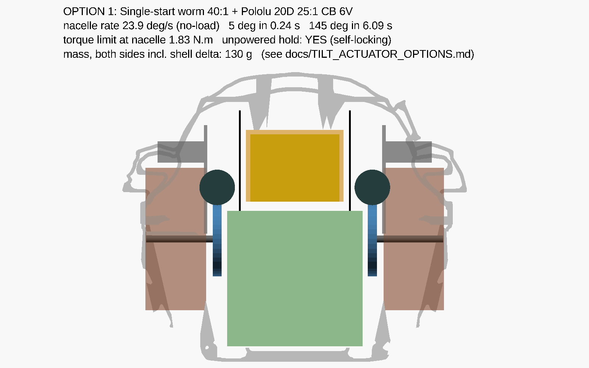
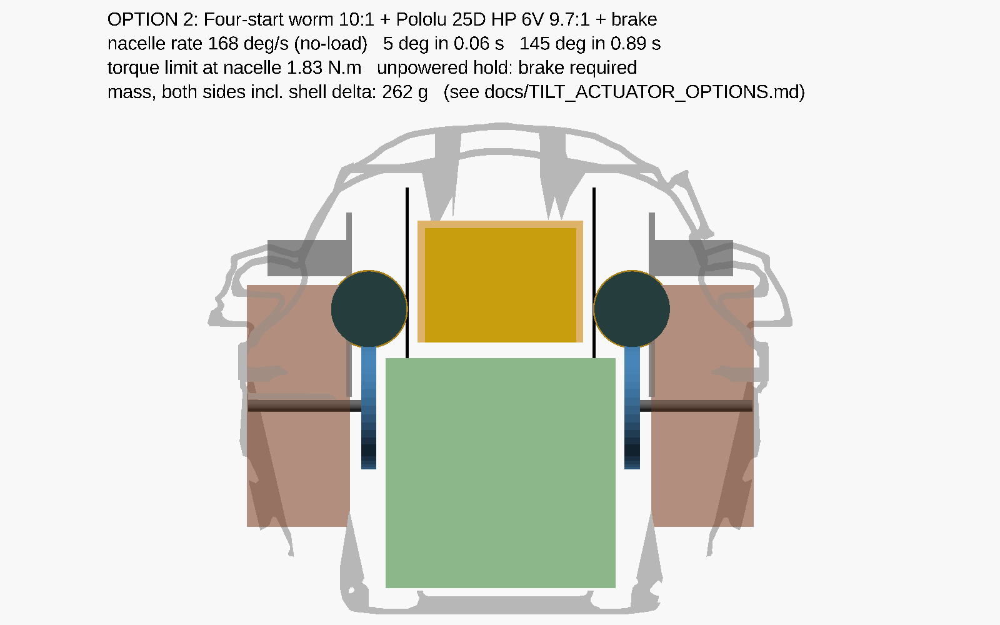
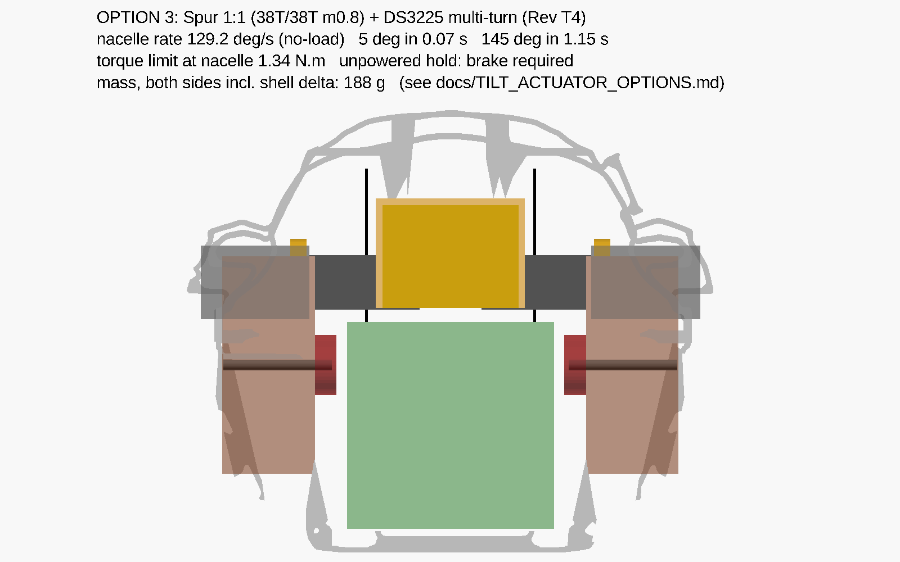
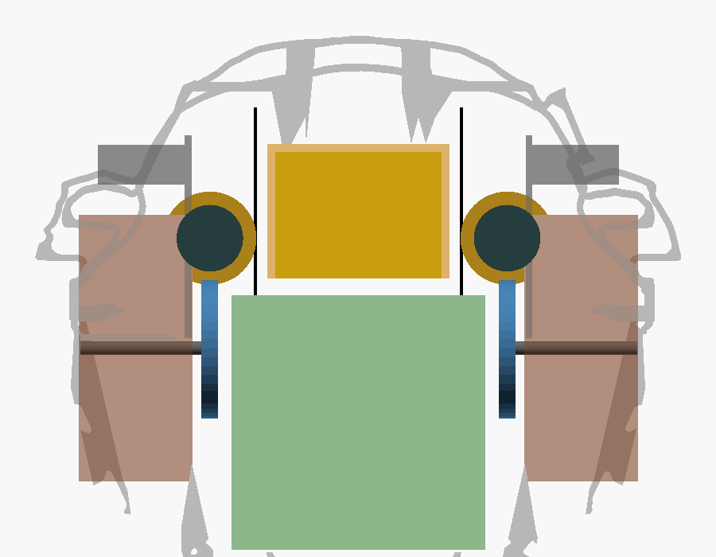
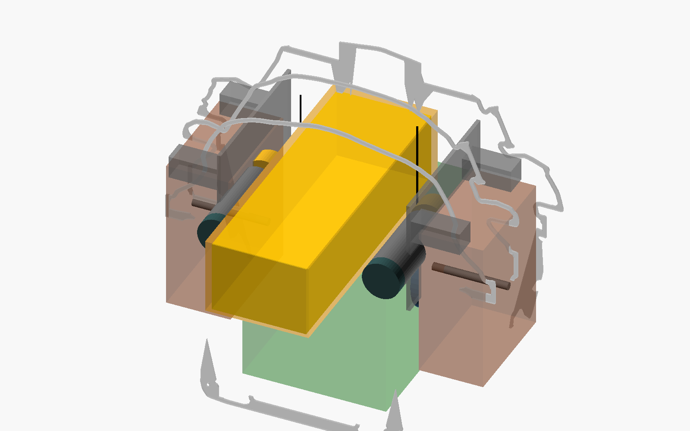
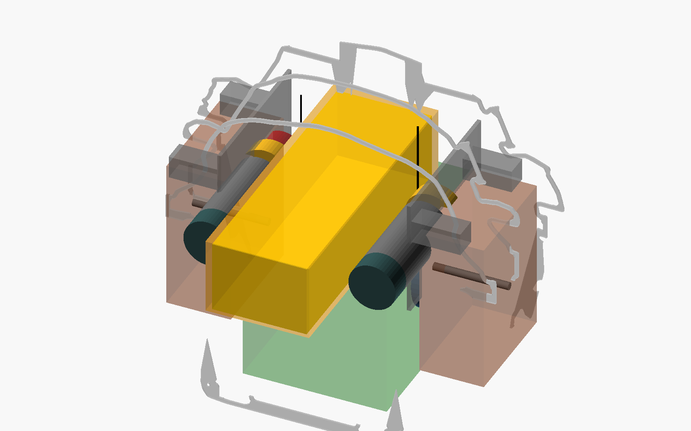
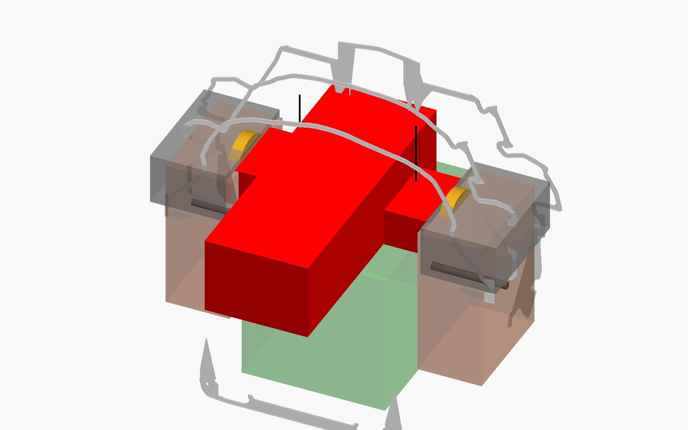
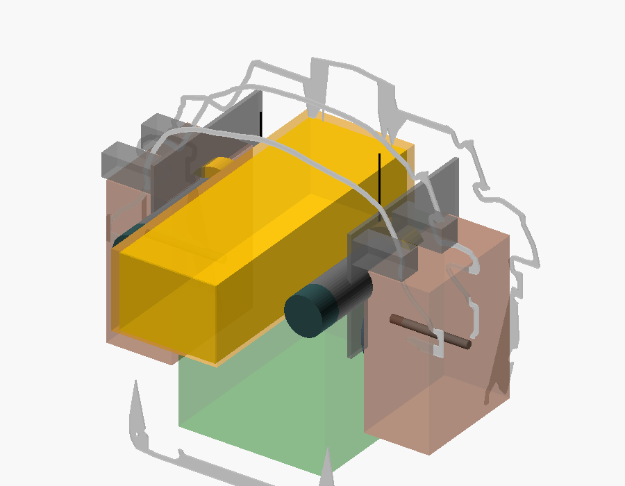

# Nacelle-Tilt Actuator Options — Rev T5 trade (GENERATED)

**Generated by** `tools/tilt_actuator_options.py --write` on 2026-09-16.
Edit the tool, not this file.  Geometry for each option renders from
`airframe/openscad/fuselage/cargo/tilt_actuator_options.scad` (`OPTION = 1|2|3|4`).

**Option 4 is the built configuration (Rev T5e, 2026-09-16).**  Option 2 was
the 2026-09-15 selection; it was retired the next day by finding T5d-1: a
motor coaxial with its worm clears the wheel tip by `WORM_PD/2 − MOTOR_D/2 − m`
whatever the centre distance or the worm's angle on the wheel, and the worm's
inboard reach against the battery cradle caps `WORM_PD` at 26 mm — so a Ø25
body can never clear the Ø42 wheel by more than −1.5 mm and a Ø20 body clears
it by 2.0 mm.  A six-start worm on the slower 20D keeps TILT-CTL-07.

> ⚠️ **ENGINEERING REVIEW REQUIRED** — every figure here is a derived estimate
> from the cited inputs listed in the tool's docstring; the aero moment about
> the tilt axis is unquantified (TILT-CTL-06), the nacelle inertia is the
> lumped pre-T4 figure, and the worm friction coefficient is ASSUMED 0.20.

## Options

1. **Single-start worm 40:1 + Pololu 20D 25:1 CB 6V** — Pololu #3712 (20D, 25:1, CB, 6 V) + #5660 encoder.
2. **Four-start worm 10:1 + Pololu 25D HP 6V 9.7:1 + brake** — Pololu #1571 (25D, 9.7:1, HP, 6 V, no encoder; AEAT-8800 on the worm collar).
3. **Spur 1:1 (38T/38T m0.8) + DS3225 multi-turn (Rev T4)** — DS3225 body + LibreServo_v4, limit pin removed (SERVO-TILT).
4. **Six-start worm 6.67:1 + Pololu 20D 25:1 CB 6V + brake (Rev T5e, built)** — Pololu #3712 (20D, 25:1, CB, 6 V, no encoder; AEAT-8800 on the worm collar).

## Views (from `tilt_actuator_options.scad`, `OPTION = n`)

| Option 1 | Option 2 | Option 3 | Option 4 (built) |
|---|---|---|---|
|  |  |  |  |
|  |  |  |  |

Looking aft from ahead: grey = hull ring sections at Y −10/20/46.6/80, brown =
root-flange keep-out, gold = battery in its cradle, green = mission payload at
the door crown, black lines = bridle hoist lines, blue = wheel on the drive
shaft, dark grey = motor, red = brake envelope (Opt 2/3) or overlap (Opt 3).

## Clearances (tools/cargo_layout_fit.py)

* Opt 1: `--option 1` PASS — every envelope 0 mm³ hit, ≥ 3 mm gap.
* Opt 2: `--option 2` — wheel, worm, battery clear; the Ø25 body reads
  50 mm³ inside the 3 mm gap at the bracket foot bosses (feet 0/1 must rise
  ~4 mm for this option).  Fits.
* Opt 3: DS3225 body X −158.5 overlaps the battery cradle (X ≥ −197.25) by
  13.6 mm on each side — does not fit with the Rev T5 battery station.
* Opt 4: the baseline of `tools/cargo_layout_fit.py` — PASS 2026-09-16 against
  the re-merged Rev T5e shell with the controller boards, chin nodes, chin
  shelf and Observer tray as envelopes; motor-to-wheel-tip 2.0 mm (both
  bracket-located; accepted in place of the 3 mm moving-part budget).

## Numbers

| Metric | Opt 1 | Opt 2 | Opt 3 | Opt 4 |
|---|---|---|---|---|
| Fuselage stage ratio | 40.0:1 (worm, lead 3.2 deg) | 10.0:1 (worm, lead 9.5 deg) | 1.0:1 (spur) | 6.7:1 (worm, lead 13.0 deg) |
| Total ratio actuator -> nacelle | 142.9:1 | 35.7:1 | 3.6:1 | 23.8:1 |
| Stage efficiency (drive / back-drive) | 21 % / locked | 44 % / locked | 95 % / 95 % | 51 % / 13 % |
| Unpowered hold (WA-R16) | YES by geometry (locked for mu >= 0.06) | CONDITIONAL -- locked only while mu >= 0.17 (dry); brake required for the lubricated/vibration case | NO -- brake required (part TBD) | CONDITIONAL -- locked only while mu >= 0.23 (dry); brake required for the lubricated/vibration case |
| Nacelle rate, no-load | 24 deg/s | 168 deg/s | 129 deg/s | 144 deg/s |
| Nacelle rate, motor max-efficiency point | 18 deg/s | 136 deg/s | 103 deg/s | 111 deg/s |
| Torque at nacelle, motor stall | 4.58 N.m (46.7 kgf.cm) = 26x the 0.177 N.m load | 3.36 N.m (34.3 kgf.cm) = 19x the 0.177 N.m load | 7.74 N.m (79.0 kgf.cm) = 44x the 0.177 N.m load | 1.81 N.m (18.5 kgf.cm) = 10x the 0.177 N.m load |
| Torque limit at nacelle (governing) | 1.83 N.m, by tooth (Lewis) | 1.83 N.m, by tooth (Lewis) | 1.34 N.m, by tooth (Lewis) | 1.81 N.m, by motor stall |
| Angular accel (motor-limited, tau_m 0.03 s ASSUMED) | 14 rad/s^2; nacelle inertia costs 0.010 N.m | 98 rad/s^2; nacelle inertia costs 0.070 N.m | 75 rad/s^2; nacelle inertia costs 0.054 N.m | 84 rad/s^2; nacelle inertia costs 0.060 N.m |
| Time +/-5 deg / +/-15 deg / 90 deg / 145 deg | 0.24 / 0.66 / 3.79 / 6.09 s | 0.06 / 0.12 / 0.57 / 0.89 s | 0.07 / 0.15 / 0.73 / 1.15 s | 0.06 / 0.13 / 0.66 / 1.04 s |
| Rate-limit bandwidth, +/-2 deg / +/-5 deg | 1.9 Hz / 0.8 Hz | 13.4 Hz / 5.3 Hz | 10.3 Hz / 4.1 Hz | 11.4 Hz / 4.6 Hz |
| Motor inboard reach (port, hull X) | -138.8 mm | -142.8 mm | -158.5 mm | -139.2 mm |
| Battery cradle (X -197..-142) clear? | yes | yes | NO -- 13.6 mm overlap | yes |
| Mass per side (motor + mechanism) | 80 g | 136 g | 94 g | 88 g |
| Mass, both sides incl. shell delta | +130 g vs Rev T4 shell | +242 g vs Rev T4 shell | +188 g vs Rev T4 shell | +147 g vs Rev T4 shell |
| Stall current, both motors (6 V bus) | 5.8 A | 12.0 A | 4.6 A | 5.8 A |

Mass basis: motor mass from the datasheets; mechanism masses are the exported
STL volumes × 1.05 g/cm³ (Opt 1), scaled estimates (Opt 2 cradle, brake 12 g
EST), the Rev T4 BOM rows (Opt 3) and the exported Rev T5e STLs (Opt 4:
bracket 16.3, worm 6.0, wheel 6.9, guide 2.1 g; solenoid + pin 10 g EST).
Shell delta: the two DS3225 standoff
pads measure 53.5 g in the published Rev T4 shell; six 12 × 12 mm foot bosses
add 3.9 g each.

## Flight domains

| Flight domain | What the actuator must do | Opt 1 | Opt 2 | Opt 3 | Opt 4 |
|---|---|---|---|---|---|
| Hover attitude (pitch/yaw by vectoring) | small +/-2..5 deg moves at a few Hz | 0.8 Hz @5 deg, 24 deg/s | 5.3 Hz @5 deg, 168 deg/s | 4.1 Hz @5 deg, 129 deg/s | 4.6 Hz @5 deg, 144 deg/s |
| Hover translate (2/5/10 deg collective tilt) | a_x = 0.34/0.85/1.70 m/s^2 (all options, thrust-limited) | reach 5 deg in 0.24 s | reach 5 deg in 0.06 s | reach 5 deg in 0.07 s | reach 5 deg in 0.06 s |
| Hover yaw (differential +/-5 deg) | N = 0.72 N.m at AUW 3911 g | 0.24 s to command | 0.06 s to command | 0.07 s to command | 0.06 s to command |
| Transition 0 -> 90 deg | monotonic, iris scheduled (nozzle_linkage_check.py) | 3.8 s | 0.6 s | 0.7 s | 0.7 s |
| Full sweep -5 -> 140 deg | no requirement recorded (TILT-CTL-05) | 6.1 s | 0.9 s | 1.2 s | 1.0 s |
| Cruise hold, powered | hold against aero moment (unquantified, TILT-CTL-06) | 1.8 N.m available | 1.8 N.m available | 1.3 N.m available | 1.8 N.m available |
| Loss of actuator power | hold (TILT_DRIVE_CONTROL_SPEC SS5.2) | holds (self-locking) | holds only if dry (mu >= 0.17); brake required | free -- brake required | holds only if dry (mu >= 0.23); brake required |
| Hard landing 2.5 g | inertial load nulled by pivot-at-CG; train sees 0.177 N.m bound | 26x margin | 19x margin | 44x margin | 10x margin |

Aircraft-level authority is thrust-limited and identical for all options —
what differs is how fast the command arrives.  Pitch moment from a collective
tilt δ is `W·sin δ · (z_pivot − z_cg)`; z_cg is not recorded (LG-29), so at
5° it is 0.003 N·m per mm of vertical offset.

## Reading the table

* **Opt 1** holds unpowered by geometry and is the lightest, but at
  24 deg/s it takes 0.24 s to move 5° — a
  0.8 Hz rate limit.  That is a mode-change actuator, not a
  vectoring one.
* **Opt 2** keeps the Rev T5 packaging (motor along the wall, battery clear)
  and gives 168 deg/s, but the 4-start lead (9.5°)
  is above the friction angle, so the unpowered hold has to come from a brake
  that does not yet exist, and the 25D motor doubles the stall current.
* **Opt 3** is the fastest (129 deg/s) and the most
  torque, but its body reaches to X -158.5 — through the
  battery cradle — and it too needs a brake.

## Open items this trade creates

* TILT-CTL-05: adopt a nacelle rate / bandwidth requirement (owner).
* Brake design for Opt 2/3 (spring-applied, solenoid-released, on the drive
  shaft or the worm shaft).
* Bench: motor rotor inertia and worm friction — both neglected/assumed here.
