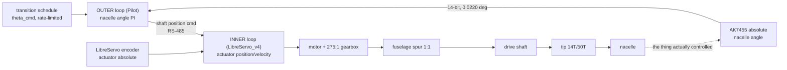

# Nacelle Tilt Drive — Control References and Sensors (Rev T1)

**Revision:** T1 (2026-08-30)
**Author:** Steve Griffing, PE(CSE), CISSP-ISSEP, CPP
**Analysis and drafting:** Claude (Claude Opus 5, Anthropic) under the author's
direction, per `AGENTS.md` §3 "Attribution and Licensing"
**License:** CC BY-SA 4.0 — <https://creativecommons.org/licenses/by-sa/4.0/>

> ⚠️ **ENGINEERING REVIEW REQUIRED — this output is not a substitute for a
> qualified engineer.** Every result, calculation, and recommendation produced
> with this skill **must be independently reviewed and accepted by a properly
> qualified individual** — a licensed Professional Engineer or an equivalently
> qualified authority for the jurisdiction and discipline — **before it is
> applied to any system carrying risk to life or safety.** This skill informs
> engineering judgment; it does not replace it, and it carries no professional
> liability.

---

## 0. Why this document exists

`docs/WING_ATTACH_INTERFACE.md` §4.3b closed the "180° or 270° servo?" question
by making it void: the tip stage is a **reduction**, so the drive shaft must turn
**more than one revolution** per 140° of nacelle. That has a consequence the
mechanical document states but does not develop:

> the encoder becomes **load-bearing for control**, not telemetry — a multi-turn
> drive without absolute feedback does not know where the nacelle is.

The tilt loop is therefore no longer "a servo commanded to an angle." It is a
**cascade** whose outer measurement is the only thing that knows the controlled
variable. This document specifies that loop: what is measured, what the
reference is, what the structure is, and what happens when each part of it
fails. It is the control-side companion to WA-R15.

**Scope boundary.** This is a control-architecture and instrumentation
specification. It does **not** contain tuned gains, and it says why: the plant
has not been identified, and a tuning set delivered without a plant model and
stated stability margins is not a result, it is a guess. §7 defines the bench
test that produces the model.

---

## 1. The loop

| Term | Value |
|---|---|
| **Controlled variable (CV)** | Nacelle tilt angle `θ_n`, −5° (cruise) … +140° (hover), 145° of sweep |
| **Manipulated variable (MV)** | Actuator shaft position command, on the RS-485 fleet bus |
| **Measured variable (MV_meas)** | `θ_n`, absolute, from the AK7455 on the wingtip pad reading the trunnion ring magnet (REF-SENSOR-008) |
| **Inner measured variable** | Actuator shaft position, absolute, from the LibreServo board's own encoder |
| **Disturbances** | Aero moment about the tilt axis (**unquantified**, `docs/TILT_SPAR_ANALYSIS.md` §2.1.3); gear backlash across two external meshes; shaft wind-up; gravity residual (bounded, ≤ 0.019 kgf·cm — the pivot is at the nacelle CG) |
| **Actuator limits** | Rate: **not established** (§7.2). Span: unbounded — the rotation-limiting pin is removed, so the actuator has no travel limit of its own. Deadband: **not established** |

### 1.1 Train, ratio, and sense

```text
actuator  --[fuselage spur pair 38T/38T, m 0.8, C 30.40, 1:1]-->  drive shaft
drive shaft --[tip pinion 14T -> ring 50T, m 0.8, C 25.60, i 3.571]--> nacelle
```

* Total reduction actuator → nacelle: **3.571**.
* Actuator travel over the full sweep: `145° × 3.571 = 517.8°` = **1.438 rev**.
  The actuator is multi-turn. This is what WA-R15 requires and what makes the
  AK7455 non-optional.
* **Sense is preserved, not reversed.** Both stages are external meshes and each
  reverses; two reversals restore the original sense. Actuator-positive is
  nacelle-positive. Declare this in firmware rather than discovering it — a sign
  error here drives the nacelle *away* from its setpoint at full authority, and
  the fleet precedent for getting it wrong is a commissioning fault, not a
  tuning fault.
* Torque referred to the actuator: `0.177 / 3.571 = 0.0496 N·m (0.44 lbf·in)`
  against the DS3225's cited 2.402 N·m stall — **2.1 %**, a 48× margin. Torque
  is not a design driver anywhere in this loop.

### 1.2 Resolution, and why the outer sensor is the coarser one

| | counts/rev | at the nacelle |
|---|---|---|
| AK7455, outer (REF-SENSOR-008) | 16,384 (14-bit) | **0.0220°** — the magnet rides the trunnion, 1:1 with the nacelle |
| LibreServo encoder, inner (REF-SENSOR-014, v2: AEAT-8800) | 65,536 (16-bit) | 0.00154° — divided by the 3.571 reduction |

The inner sensor is **14× finer at the nacelle** than the outer one. It is still
the wrong sensor to close the outer loop on, because it is upstream of every
compliance in the train: two lash-bearing external meshes and 0.27° of shaft
wind-up (0.076° referred to the nacelle). It measures the actuator accurately
and the nacelle only optimistically. That asymmetry — a precise inner
measurement that cannot see the real disturbance, and a coarser outer
measurement that can — is the textbook case for cascade, not a reason to prefer
one sensor over the other.

Over the full sweep the AK7455 gives 6,598 counts. Quantisation is not a
limiting error source at any plausible pointing requirement for this axis.

> **LibreServo_v4 encoder part is UNVERIFIED.** REF-SENSOR-014 documents the
> AEAT-8800 on **v2**. The aircraft carries **v4** (`current-specification/bom_revS.csv`
> `SERVO-TILT`), whose position sensor this repository has not confirmed. The
> 16-bit figure above is therefore v2's, carried as a **class expectation, not a
> v4 datasheet value**. Confirm before it is used for anything but architecture.

---

## 2. Structure — cascade, and why structure beats tuning here



**Inner loop** — actuator position, closed on the board, fast, local. Rejects
motor and gearbox disturbance (cogging, friction, supply sag) before it reaches
the airframe.

**Outer loop** — nacelle angle, closed by Pilot on the AK7455 at the flight-
control rate. Absorbs everything the inner loop is blind to: backlash, wind-up,
mesh eccentricity, and the aero moment.

This is not a stylistic preference. A single loop closed on the actuator cannot
see backlash at all; a single loop closed on the AK7455 must chase motor-level
disturbances through a bus with unmeasured latency. The cascade puts each
disturbance in the loop that can actually reject it.

**Fleet precedent, and it is exact.** The cargo winch already runs this
architecture — *"continuous rotation, gateway closes position on the AK7455
spool encoder … multi-turn, unbounded by the servo itself"*
(`REFERENCES.md`, Servo Fleet Standardisation table; `docs/CARGO_WINCH_SPECIFICATION.md`
§3.7.3). Nacelle tilt moves onto the same pattern at Rev T1. Reuse the winch's
gateway command scheme rather than inventing a second one.

> **The `REFERENCES.md` fleet table is now STALE for this row.** It records
> nacelle tilt as *"Position, firmware soft-limited, −5°…140°"* — i.e. a
> limited-travel application. Rev T1 makes it multi-turn. Corrected in that file
> under WA-R15.

### 2.1 Rate-limit the reference, do not rate-limit with the integrator

The transition schedule must present `θ_cmd` to the outer loop through an
explicit slew limiter set **below** the drive's demonstrated capability (§7.2).
A reference the drive cannot follow saturates the actuator, and a saturated
actuator with an integrating outer loop winds up. Anti-windup (clamping or
back-calculation, declared by name in the firmware) is required regardless, but
the rate limiter is what keeps it from being exercised on every normal
transition.

### 2.2 Feedforward

* **Gravity: none required.** The pivot is at the nacelle CG, which bounds the
  gravity moment at 0.019 kgf·cm (`docs/TILT_SPAR_ANALYSIS.md` §2.1.1) — below
  the loop's own resolution. This is a deliberate mechanical choice paying a
  control dividend; do not add a gravity term and do not remove the pivot-at-CG
  constraint without re-opening this line.
* **Aero: cannot be fed forward.** The aero moment about the tilt axis is
  **unquantified** — the repository holds no nacelle `C_d` or frontal-area
  figure (§2.1.3). It must therefore be rejected as a disturbance by integral
  action in the outer loop, which is the reason the outer loop needs integral
  action at all.

---

## 3. Sensors

| ID | Device | Measures | Interface | Role |
|---|---|---|---|---|
| `ENC-NACELLE-1/2` (`SKIPPER-TILT-ENC-PCB`) | AKM AK7455, 14-bit off-axis (REF-SENSOR-008) | Nacelle absolute angle | SPI, shared bus, separate CSN per side, plus `ERROR` | **Outer loop, control-critical.** Was telemetry through Rev S |
| — | LibreServo_v4 on-board absolute encoder | Actuator absolute position | Internal to the board | Inner loop |
| — | LibreServo_v4 motor current | Actuator torque proxy | RS-485 telemetry | Jam / obstruction detection, §5.3 |

### 3.1 What changed about the AK7455 installation at Rev T1

Three things, all consequences of the spar becoming a fixed CF tube
(`docs/WING_ATTACH_INTERFACE.md` §4.5):

1. **The distortion source is removed, not mitigated.** The ferromagnetic
   4130/17-4 steel shaft that used to run through the ring centre is gone.
   `docs/TILT_ENCODER_WIRING_EMI_SPEC.md` §6.1 still states the old premise and
   is **factually wrong until corrected** (WA-R13).
2. **The keep-out is retained anyway.** The 10 mm non-ferrous radius still
   governs the fasteners, the nacelle-side collar, and — new at Rev T1 — the
   **steel drive shaft and its steel pinion**, which are nearby and moving.
   In-situ zero-calibration remains required; it now absorbs the drive train
   instead of the spar.
3. **The magnet grew to clear the Ø20 spar** (ID 26 / OD 41.2) and
   `HALL_SENS_R` moved 11 → 16.8 mm so the IC still reads mid-annulus. At R = 11
   the IC would have sat 2.0 mm inboard of the magnet's inner edge — off the
   magnet, reading nothing. This is a **control-availability** item, not a
   packaging one, now that the loop depends on the reading.

### 3.2 What is deliberately NOT added

**No limit switches, and no end-stop sensors.** The AK7455 is absolute: it knows
where the nacelle is at power-on with no homing sweep, so soft limits in the
outer loop are sufficient and a switch would add a failure mode without adding
information. Mechanical hard stops remain, as the last resort they are — not as
a control element the loop is allowed to reach in normal operation.

**No second angle sensor per nacelle.** The two nacelles' AK7455s cross-check
each other (§5.4), which covers the failure that actually matters — differential
tilt — without a redundant part.

---

## 4. References (setpoints), spans, and sign conventions

Declare all of the following explicitly in firmware and in the ICD. Most
commissioning faults on an axis like this are sign and span errors, not tuning
errors.

| Quantity | Convention |
|---|---|
| `θ_n` zero | Cruise, nacelle thrust axis aligned with hull +Y (forward) |
| `θ_n` positive | Toward hover (thrust axis rotating toward hull +Z, dorsal) |
| `θ_n` span | **−5° … +140°**, soft-limited; mechanical stops beyond |
| Actuator positive | Same sense as `θ_n` (two external meshes, §1.1) |
| Actuator span | Unbounded in hardware; **soft-limited to `θ_n` × 3.571 = −17.9° … +500.0°** from the calibrated zero |
| AK7455 raw → `θ_n` | Signed, wrapped, with the in-situ calibration offset applied; the sensor's own zero is arbitrary |
| Units on the bus | Engineering units (degrees, ×100 fixed-point), **not** percent of span — the two loops have different spans and a percentage means different things in each |

**Calibration is a build step, not a firmware default.** The AK7455's zero is set
in situ per aircraft, per side, against the mechanical cruise stop, and the
offset is stored. A unit swapped without re-calibration is a unit that does not
know where the nacelle is.

---

## 5. Failure behaviour

**A safety function is not derived from a control function.** The items in §5.4
are architecturally separate from the loops in §2 and must not share their code
path, their sensor conditioning, or their enable logic.

### 5.1 Loss of the AK7455 (SPI silent, `ERROR` asserted, or reading implausible)

The outer loop **must not** integrate against a stale or absent measurement.
Required behaviour: freeze the outer loop, hold the last valid actuator position
command, and let the inner loop hold station on its own absolute encoder.

**Hold, not return-to-zero.** In hover the nacelle *is* the lift vector; slewing
it to cruise on sensor loss is a control input, not a safe state. The aircraft
keeps flying on the attitude it has while the pilot is told.

Plausibility test: the nacelle cannot move faster than the drive can move it, so
a reading that changes by more than the demonstrated slew rate (§7.2) in one
sample is a fault, not a measurement.

### 5.2 Loss of the actuator or its bus

**The train is not self-locking, and this is the most important line in this
document.** Both stages are spur meshes and the total reduction is 3.571 — far
from the ratio and geometry at which a gear train holds itself. With the motor
unpowered, the nacelle back-drives under whatever moment is on it.

The gravity term is nulled by the pivot-at-CG, so on the ground and in still air
the nacelle will sit. **In flight the aero moment is unquantified**, and an
unquantified moment on a non-self-locking train is an unbounded rate.

**OPEN — a holding provision is required and is not yet specified (TILT-CTL-01,
§8).** The candidates, in the order this analysis prefers them:

1. Motor short-brake held by the LibreServo board on loss of command — costs
   nothing mechanical, but is only as available as the board's own power.
2. A detent or over-centre latch at the hover and cruise ends — holds without
   power, but only at the ends, and adds a mechanism to the tightest region on
   the airframe.
3. A worm or lead-screw stage — self-locking by geometry, but it is a
   right-angle stage and the whole drive architecture exists to avoid one
   (plan 004 KTD1).

Do not close this by assuming the motor holds. Whether it does is a bench
measurement (§7.3).

### 5.3 Jam or obstruction

Actuator current is available as RS-485 telemetry. A current at or near stall
with the AK7455 reading unchanged is a jam. Required behaviour: stop commanding
into it — a 48× torque margin against a 0.050 N·m requirement means the actuator
can comfortably destroy the drive train it is jammed against.

### 5.4 Differential tilt — the safety layer

Two nacelles at different tilt angles is a roll and yaw upset in hover, and it is
the failure mode that ends the flight. The two AK7455s make a natural
cross-check.

Required, and **separate from the two position loops**:

* Continuous comparison of port and starboard `θ_n`.
* A declared trip threshold and a declared response, both set by the flight-
  dynamics case rather than by what the loops happen to achieve.
* Independent enable, so a fault in one position loop cannot suppress the trip.

**The threshold is not set here.** Setting it requires the roll/yaw authority
available at a given tilt split, which needs the aero data the repository does
not have (§2.2). Tracked as TILT-CTL-02.

### 5.5 Security

The actuator is a bus device on the fleet RS-485 segment and the loop's MV
crosses that bus. Command authenticity is a design input, not an add-on
[REF-ISA-001]. LibreServo_v4 carries an OPTIGA Trust M
(`current-specification/bom_revS.csv` `SERVO-TILT`); the fleet position recorded
in `REFERENCES.md` is that the **gateway** signs the frame rather than the servo,
because the fork's own TPM/RS-485 work is schematic-only. Nothing in this
document assumes servo-native signing.

---

## 6. What is NOT specified here, and why

No gains. No gain or phase margins. No settling time.

Every one of those is downstream of a plant model, and the plant model does not
exist yet. Specifically unknown:

* **Dead time** `θ` — RS-485 command latency + inner-loop response + SPI read +
  Pilot's own loop period. Dead time, not lag, is what bounds achievable
  performance, and `θ/τ` decides whether a single PI is even the right structure
  before any gain is chosen.
* **Time constant** `τ` and **process gain** `K_p` of the actuator-plus-train.
* **Backlash amplitude** across two external meshes. It appears as hysteresis
  rather than steady-state error because the loop closes on true nacelle angle
  (plan 004 RISK-2), but its size decides whether the outer loop can carry
  integral action without limit-cycling.
* **Actuator slew rate** (§7.2) — and with it, whether any transition-time
  requirement is achievable at all.

Publishing gains before these are measured would be exactly the error
`docs/TILT_SPAR_ANALYSIS.md` §2.1 already caught once on this axis: a number
picked, then carried forward as though it had been derived.

---

## 7. Bench programme (the work that closes §6)

### 7.1 Plant identification

Step and relay tests on one installed nacelle, actuator commanded, AK7455
logged. Report `K_p`, `τ`, `θ`, and `θ/τ`. Assess controllability from `θ/τ`
**before** choosing a controller structure; a large ratio calls for a different
measurement point or dead-time compensation, not more gain.

### 7.2 Slew rate — and the stale figure to avoid

The repository contains **two** tilt-rate figures and neither is a design
requirement (`docs/TILT_SPAR_ANALYSIS.md` §2.1.2):

* **10 °/s** — a bench *monitoring* rate from a CAN-message-rate test
  (`docs/TILT_ENCODER_WIRING_EMI_SPEC.md` §7.3). An instrumentation setting.
* **145° in 500 ms** (290 °/s) — a **stale** Phase-3 build-guide step written
  for a different pivot.

Do not adopt either as the transition requirement. Measure what the built drive
delivers, then ask the flight-dynamics case what it needs.

> **DS3225 no-load speed is NOT in `REFERENCES.md`** — the `0.18 s/60°` figure
> catalogued there belongs to the superseded **SPT5425LV** (REF-SENSOR-013) and
> must not be reused for the DS3225. Nacelle rate is `actuator rate / 3.571`
> whatever it turns out to be; that relation is exact, the input to it is not
> known.

### 7.3 Hold test (closes TILT-CTL-01)

With the actuator unpowered and then with it commanded-to-hold, apply a known
moment at the nacelle and record the angle that results. This is what decides
between the three holding provisions in §5.2.

### 7.4 Backlash characterisation

Command a slow reversal and log commanded-vs-measured `θ_n`. The width of the
hysteresis loop is the number §6 needs.

### 7.5 Encoder installation validation

Off-axis flux at the IC must fall in the AK7455's 10–70 mT window with the
built ring and the 1.5 mm gap, **with the steel drive shaft and pinion
installed** — they are new since the sensor was selected. Then run the EEPROM
INL calibration over the real −5…+140° sweep.

---

## 8. Open items

| ID | Item | Blocks |
|---|---|---|
| **TILT-CTL-01** | Holding provision for a non-self-locking train (§5.2). Not closed by assuming the motor brakes. | Flight release |
| **TILT-CTL-02** | Differential-tilt trip threshold (§5.4). Needs roll/yaw authority vs tilt split. | Flight release |
| **TILT-CTL-03** | Plant model — `K_p`, `τ`, `θ` — and gains derived from it with stated margins (§7.1). | Bring-up |
| **TILT-CTL-04** | LibreServo_v4 position-sensor part and resolution unverified (§1.2). | Inner-loop design |
| **TILT-CTL-05** | Actuator slew rate unmeasured; no transition-time requirement exists (§7.2). | Transition schedule |
| **TILT-CTL-06** | Aero moment about the tilt axis unquantified (`TILT_SPAR_ANALYSIS.md` §2.1.3). | TILT-CTL-01, TILT-CTL-02 |
| **WA-R13** | `TILT_ENCODER_WIRING_EMI_SPEC.md` §6.1 states a premise that is now false (§3.1). | Documentation integrity |

---

## 9. Sources

- `docs/WING_ATTACH_INTERFACE.md` §4.3b (reduction, multi-turn actuator, WA-R15),
  §4.5 (encoder changes), §5 (requirement register).
- `docs/TILT_SPAR_ANALYSIS.md` §1 (encoder closes the loop on true nacelle
  angle), §2.1.1 (gravity bound), §2.1.2 (the two tilt-rate figures and their
  status), §2.1.3 (aero open item), §2.1.4 (grounded torque).
- `docs/TILT_ENCODER_WIRING_EMI_SPEC.md` §2.1, §2.3, §6.1 (§6.1 superseded),
  §7.3 (10 °/s bench rate).
- `docs/CARGO_WINCH_SPECIFICATION.md` §3.7.3 — the fleet precedent for a
  multi-turn actuator closed on an AK7455.
- `docs/plans/2026-08-29-004-feat-nacelle-trunnion-pivot-tilt-drive-plan.md`
  KTD1 (parallel-axis argument), RISK-2 (backlash as hysteresis).
- `REFERENCES.md` REF-SENSOR-008 (AK7455), REF-SENSOR-013/014 (fleet servo and
  LibreServo v2), REF-ISA-001 (ISA/IEC 62443-3-3).
- `airframe/blender-scripts/merge_cargo_interior.py` `TILT_STAGE_*` — the
  fuselage stage geometry this loop drives through.
