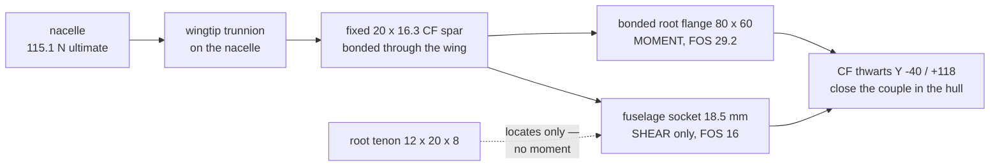
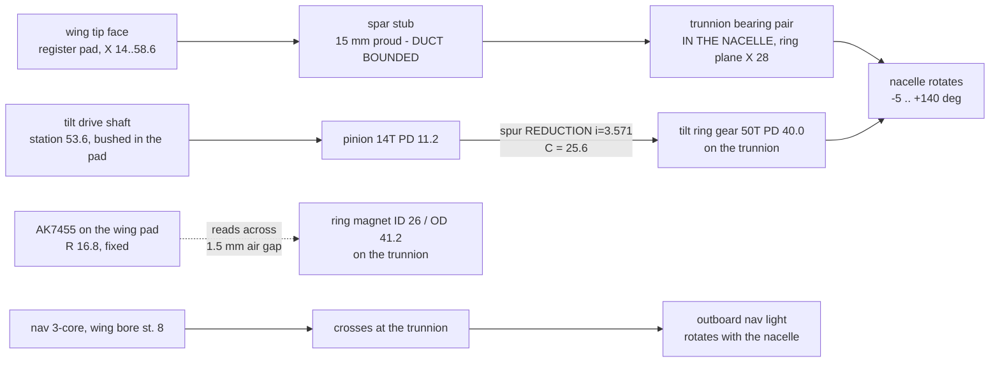

# Wing Attachment Interface Specification — Rev T1

**Revision:** T1b (2026-08-29)
**Author:** Steve Griffing, PE(CSE), CISSP-ISSEP, CPP
**Analysis and drafting:** Claude (Claude Opus 5, Anthropic) under the author's
direction, per `AGENTS.md` §3 "Attribution and Licensing"
**License:** CC BY-SA 4.0 — <https://creativecommons.org/licenses/by-sa/4.0/>

**Status:** SPECIFICATION — the wing side is built
(`airframe/openscad/wings/wings_s1223_revo.scad`, Rev T1). The fuselage and
nacelle sides are **NOT** built; this document is what they are to be built to.

---

## 1. Why this document exists

Rev T1 changes what the spar *is*. Through Rev R2 the tilt spar was a rotating
drive shaft that happened to pass through the wing on two bearings; the wing was
a fairing threaded onto it. Under Rev T1 the spar is a **fixed 20 × 16.3 mm
carbon-fibre tube bonded into the wing over its full span**, and it is the
wing's primary bending member.

That single change re-writes both ends of the wing at once:

| | Rev R2 (rotating spar) | **Rev T1 (fixed bonded spar)** |
|---|---|---|
| Wing root moment path | tenon, then two bonded CF tie rods | **the spar itself, into a bonded root flange** |
| Root couple arm | 48 mm (chordwise rod spacing) | **86.7 mm (spanwise support span)** |
| Wingtip | MF128ZZ bearing seat (spar journals in the wing) | **register face; the spar is rigid in the wing** |
| Tilt bearing | wingtip, in the wing | **nacelle trunnion ring** |
| Tilt torque path | the spar | **separate Ø4 mm shaft + spur pair** |
| ESC power | 2 × Ø7 wing conduit, 17.65 mm off-axis | **inside the spar bore, on the tilt axis** |

Because the load path now crosses two joints this repo's federation splits
across three owners, the numbers have to be stated once, in one place, rather
than three times in three WBS files. **This is that place.** Requirements below
carry an owner and a status.

---

## 2. Basis

### 2.1 Loads

From `tools/wing_spar_carrythrough.py`, measured against the baked hull-frame
STLs, at `docs/structural_analysis.md` §3's convention (4 g limit = 3 g gust +
1 g manoeuvre, × 1.5 ultimate — the 1.5 is **14 CFR §23.2230** [REF-FAA-004],
adopted as an engineering baseline, *not* a compliance claim: Serenity is an
sUAS under Part 107, which imposes no structural certification basis), AUW
3.911 kg (8.62 lbm):

> **§23.2265 [REF-FAA-004] applies to this airframe.** It requires a *special*
> factor beyond the basic 1.5 for parts "subject to appreciable variability
> because of uncertainties in manufacturing processes or inspection methods" —
> which is exactly FDM-printed CF-PETG. The repo's FOS 4.0 joint target is the
> response to that; the requirement is cited, the numeric value is the
> project's own choice.

| Quantity | Limit | **Ultimate** |
|---|---|---|
| Nacelle load, per side | 76.7 N (17.24 lbf) | **115.1 N (25.87 lbf)** |
| Wingtip reaction `R_tip` | 110.6 N (24.87 lbf) | **165.9 N (37.30 lbf)** |
| Wing root moment | 9.74 N·m (86.2 lbf·in) | **14.60 N·m (129.2 lbf·in)** |
| Wing torsion about the spar axis | 0.068 N·m | **0.41 N·m (3.6 lbf·in)** |

### 2.2 Spar section

20 mm OD × 16.3 mm ID roll-wrapped carbon fibre:
`I = 4,389 mm⁴`, `Z = 438.9 mm³`, `A = 105.5 mm²`, 14.5 g (0.032 lbm) over the
85.7 mm wing span, 29.1 g (0.064 lbm) over the full 173 mm installed run.

Bending at the ultimate root moment, **cantilever bound** (the whole moment
taken by the spar alone, not shared with the skin):
`σ = 33.28 MPa`, **FOS 9.0** against the 300 MPa cross-ply stand-in.

> **The allowable is not verified.** 300 MPa is the same conservative stand-in
> `tools/wing_spar_carrythrough.py` uses for the CF thwart plate, carried over
> because the repo holds no ASTM D3039/D695 certificate for any CF stock
> (plan 003 DEP-1). Obtain supplier certificates before fabrication.

### 2.3 Bore sizing

The bore is sized by **wire volume, not torque**. Four 10 AWG conductors at
Ø5.5 mm circumscribe a **13.28 mm** circle — the exact 4-circle packing ratio
`1 + √2` [REF-MATH-001], computed in `tools/spar_bundle_fit.py`. With 1.5 mm
radial clearance so the bundle can twist through the tilt sweep, the minimum
bore is **16.28 mm**, hence 20 × 16.3.

> **The 5.5 mm wire OD is an assumption**, not a measurement:
> `current-specification/bom_revS.csv` records no OD for `WIRE-10AWG`
> (plan 003 DEP-2 / OQ4). A larger real OD scales the entire bore chain and
> would re-open the airfoil trade. **Measure the procured wire before cutting
> CF.**

---

## 3. Wing ROOT → fuselage

### 3.1 Mechanism

The joint **splits by load type**: a short bonded socket takes the shear, and a
bonded flange on the inner sidewall takes the moment. The tenon locates and
reacts neither. There are no tie rods. §3.3 derives why the split is forced —
the cargo bay bounds the socket depth, and a socket's capacity goes as 1/L².



### 3.2 Geometry the fuselage must provide

| Item | Value | Was (Rev S1b) |
|---|---|---|
| Spar station, hull Y | **+21.00 mm** | +38.15 mm |
| Spar height, hull Z | **+66.85 mm** | +68.42 mm |
| Socket bore | **Ø20.4 mm** (20.0 + 0.2/side epoxy gap) | Ø8.3 mm |
| Socket spanwise reach inboard of the wall | **18.5 mm — SHEAR ONLY** | ~19 mm (bearing boss) |
| Bonded root flange on the inner sidewall | **80 (Z) × 60 (Y) mm — MOMENT** | none |
| Root bearing | **NONE — bonded/clamped socket** | F688ZZ |
| Mortise (for the locating tenon) | 12.8 × 20.8 mm | 30.8 × 20.8 mm |

Hull Y is derived, not chosen: the wing's LE root sits at hull Y −7.0
(`tools/bake_hull_frame.py`), and the spar is at chord station 28.0 →
`−7.0 + 28.0 = +21.0`. Hull Z likewise: the wing's chord line bakes to Z
+58.0, and the spar rides the **unscaled** camber midline, +8.84 mm at this
station → `58.01 + 8.84 = 66.85`.

> The camber midline is unscaled deliberately. `s1223_section()` opens the
> thickness envelope *about* the camber line (Rev S1b), so `THICKNESS_SCALE`
> does not move the bore centre. Applying the thickness scale to the midline
> would lift the socket 4.07 mm above the spar it is supposed to receive.

### 3.3 Why the joint splits in two

**The cargo bay bounds the socket, and the bound is binding.** Owner
requirement (2026-08-29): the centre of the cargo bay stays clear. The bay's
clear span begins at hull **X −100** and the wall skin sits at **X −81.33**, so
the socket has **18.67 mm** of depth and no more.

A rigid pin in an elastic socket develops a roughly triangular pressure
distribution either side of the reversal point, resultants at `L/3` from each
end — an effective couple arm of `2L/3`:

```text
F     = 3M / (2L) + V/2
area  = D · L/3          (projected bearing, the CARGO-03c convention)
sigma = F / area         ∝ 1/L²
```

| Socket L | σ | FOS | |
|---|---|---|---|
| **18.67 mm** | **9.89 MPa** | **0.51** | all the bay allows |
| 30 mm | 3.94 MPa | 1.27 | would enter the bay |
| 55 mm | 1.24 MPa | 4.02 | would enter the bay |

Stress goes as **1/L²**, so depth is the only lever a socket has — and the bay
has taken it away. **The socket therefore stops being the moment path.**

**Shear, however, is fine and never needed depth:**
`σ = 115.1 / (20 × 18.5) = 0.31 MPa` → **FOS 16**.

**The moment moves to a bonded root flange** on the *inner face* of the
sidewall, reacting over wall **area** instead of socket **depth** — so it needs
no inboard reach at all. Triangular pressure over height `h`, arm `2h/3`:

| h × w | F | area | σ | FOS |
|---|---|---|---|---|
| 40 × 40 | 548 N | 533 mm² | 1.03 MPa | 4.9 |
| 60 × 50 | 365 N | 1,000 mm² | 0.37 MPa | 13.7 |
| **80 × 60** | **274 N** | **1,600 mm²** | **0.17 MPa** | **29.2** |
| 100 × 60 | 219 N | 2,000 mm² | 0.11 MPa | 45.6 |

**80 × 60 mm is specified.** The cargo section is ~150 mm tall inside at this
station, so 80 mm of height is available without crowding. The flange lies flat
against the wall and protrudes only its own thickness (~5 mm, to X ≈ −86)
against a bay edge at −100.

**This is better than the 55 mm socket it replaces, not a compromise** — FOS
29.2 against 4.02 — because a flange trades an unfavourable 1/L² depth term for
a linear area term. The bay-clear requirement forced a better joint.

It also **demotes the LG-11 coupon** here from a gate to a packaging
convenience: at 5 / 15 / 47 MPa the flange gives FOS 29.2 / 87.6 / 274.6. The
coupon would only decide how small the flange could shrink.

The tube-to-flange transfer is the wing's own 85.7 mm bond, not a separate
fitting: the spar is bonded through the wing root, and the flange is clamped to
the spar at the wall by the same split collar that makes the joint releasable.

### 3.4 Clamp

The spar is bonded into the **wing** and clamped into the **fuselage**. That
asymmetry is deliberate: it makes *wing + spar* one serviceable assembly that
comes off the aircraft by releasing the root clamp and withdrawing outboard —
the light-aircraft spar-stub-into-socket pattern — and it puts the releasable
joint where there is room for a collar.

- Split-collar pinch clamp, ≥ 5 mm wall over Ø20 (i.e. ~Ø30 outside),
  M3 heat-set inserts, 2 screws.
- **Positive split gap when clamped.** If the halves close on each other before
  they close on the tube, the collar grips itself and the spar is free.
- **No set screws.** CF tube splinters under a point load; the grip must be
  distributed (plan 003 RISK-3).

### 3.5 Torsion — why no anti-rotation pin

Wing pitching moment about the spar axis is 0.41 N·m at ultimate
(`Cm ≈ 0.25`, 40 kt, one panel). Reacted as bond shear over a 40 mm socket that
is **0.016 MPa — FOS 306**. Nacelle thrust adds none: the duct axis passes
through the pivot, which is on the spar axis. A round tube in a round bonded
socket is sufficient; the retired aft tie rod had no remaining job.

---

## 4. Wing TIP → nacelle

### 4.1 Mechanism

The spar protrudes past the wing tip face and the **nacelle** carries the
bearings. The wing tip provides a register face, a supported bushing boss for
the tilt drive shaft, and the fixed encoder.



### 4.2 Geometry the nacelle must provide

| Item | Value | Note |
|---|---|---|
| Spar stub proud of the wing tip face | **15.0 mm — DUCT-BOUNDED** | The spar must TERMINATE at ≥ 26 mm from the duct axis (see §4.3a). Max 15.7; 15.0 built. **The bearing pair must fit inside it** — 2 × 6804 (20 × 32 × 7) = 14.0 mm does. |
| Trunnion bearing bore | **Ø20.0 H7** | on the nacelle, ring plane X ≈ 28 mm from the duct axis |
| Bearing duty | axial **and** radial, 21.9 N each at 4 g × 1.5 | thrust is axial to the spar in cruise and transverse in hover — a stack chosen for one attitude is wrong for the other (plan 004 RISK-4) |
| Ring gear | **50T, module 0.8, PD 40.0 mm** | concentric with the spar; root Ø 38.0 clears it with 9 mm of hub each side; OD 41.6 inside the 53.4 envelope |
| Pinion | **14T, module 0.8, PD 11.2 mm** | on the wing's drive shaft; 14T is the no-undercut floor at 20° PA |
| Reduction ratio | **3.571** | shaft turns **1.389 revolutions** per 140° of nacelle |
| Gear centre distance | **25.6 mm** | → wing shaft at chord station 53.6 |
| Ring magnet | **ID 26 / OD 41.2 mm**, diametric | mean radius 16.8 = `HALL_SENS_R` |
| Magnet axial gap to the AK7455 face | **1.5 mm** | set by the nacelle standoff |
| Non-ferrous zone | ≥ 10 mm radius around the IC | see §4.5 |
| 4 × 10 AWG disconnect | **in the nacelle annulus** | see §4.4 |

### 4.3a The spar stub is bounded by the thrust duct

**Owner requirement (2026-08-29): the spar must not penetrate the nacelle
thrust tube.** That is a hard geometric bound and it is tighter than the bearing
stack would like.

The duct is a cylinder of `r = 25 mm` about the nacelle's local Z axis. The spar
runs along local X at `Y = 0`, so every point of it at station X sits
`√(X² + Y²) ≥ |X|` from the duct axis. The spar therefore clears the duct **iff
it terminates at `|X| ≥ 26`** (25 plus the 1 mm margin plan 003 R4 states):

```text
wing tip face   |X| = 37.7 (NACELLE_OD_X/2) + 4.0 (joint gap) = 41.7 mm
spar must stop  |X| = 26.0 mm
=> MAXIMUM STUB       15.7 mm      (15.0 built, 0.7 in hand)
```

The 32.0 mm stub this document previously specified would have reached
`|X| = 9.7` — **fifteen millimetres inside the duct wall**, straight through the
thrust column between the two EDFs. It was budgeted outward from the bearing
stack and never checked against the duct, which is the same class of error as
the Rev R2 through-duct spar this whole revision exists to remove.

**The bearing stack must fit inside 15 mm.** Two thin-section 6804 (20 × 32 × 7)
total 14.0 mm and fit; 6804 is already a BOM item (`SKIPPER-BRG-6804`). A deeper
stack does not fit and must not be assumed.

### 4.3b The drive is a reduction — the shaft turns more than one revolution

**Owner direction (2026-08-29):** the actuator drives the shaft through **more
than a single revolution** to sweep the nacelle 140°. That inverts the tip
stage, and it dissolves a problem this document previously reported as
unsolvable.

An earlier pass assumed a limited-rotation hobby servo (180°/270°), which forces
a **step-up** — ring smaller than pinion. Since the ring gear is concentric with
the spar and must clear Ø20, that produced an impossibility: at plan 004 KTD4's
`C = 15 mm` the algebra returns `PD_ring = 10.5 mm`, a ring gear smaller than
the spar it encircles.

**As a reduction the ring is the larger member and the geometry closes easily.**
With `i = N_ring / N_pinion`, the shaft turns `140° × i`:

| N_ring | PD | i | shaft rev | C | station | ring OD | root Ø | |
|---|---|---|---|---|---|---|---|---|
| 36 | 28.8 | 2.571 | 1.000 | 20.00 | 48.00 | 30.4 | 26.8 | exactly one rev, not "more than" |
| 45 | 36.0 | 3.214 | 1.250 | 23.60 | 51.60 | 37.6 | 34.0 | |
| **50** | **40.0** | **3.571** | **1.389** | **25.60** | **53.60** | **41.6** | **38.0** | **selected** |
| 54 | 43.2 | 3.857 | 1.500 | 27.20 | 55.20 | 44.8 | 41.2 | leaves 1.1 mm to the tenon — under the floor |

*(module 0.8, 14T pinion, PD 11.2)*

**50T is selected.** It also leaves the AK7455 pocket a 10.2 mm chordwise window
between the spar bore's aft edge (38.2) and the shaft's forward edge (51.4) —
the encoder radius, the board width and the gear centre distance are one coupled
set, and none of the three is independently free.

**Consequence for the actuator, and it is a real change.** A multi-turn output
means the drive is **no longer a limited-rotation servo**. It is a
continuous-rotation gearmotor or a stepper, closed on the AK7455's absolute
nacelle angle rather than on the actuator's own travel. That:

- **retires the 180°-vs-270° question**, which was blocking;
- removes the 145°-of-travel constraint plan 004 KTD5 identified as the
  *binding* one (torque never was — the reduction delivers 3.571× whatever the
  actuator gives, against a 0.177 N·m grounded requirement);
- makes the AK7455 **load-bearing for control**, not just telemetry: without
  absolute feedback a multi-turn drive has no idea where the nacelle is.

Shaft torque is 0.050 N·m; wind-up over the installed length is 0.27° (Ø4 steel,
`G` = 79 GPa). **Re-open the actuator selection** — the DS3225 was already ~17×
oversized on torque and is now also the wrong *kind* of device.

### 4.4 The power disconnect belongs in the nacelle, not the wingtip

Plan 003 U3 specified a wingtip "maintenance garage" holding the four 10 AWG
bullet disconnects. **It does not fit and is reassigned to the nacelle.**

Any 10 AWG disconnect — ring-terminal studs, bullets, or blade tabs — needs
~6 mm of clear height. Aft of the spar the tip section falls away fast
(measured at `THICKNESS_SCALE_TIP` 2.20):

| Chord station | 40 | 44 | 54 | 66 | 78 |
|---|---|---|---|---|---|
| Tip section depth (mm) | 17.50 | 15.60 | 11.20 | 6.78 | 3.43 |

Subtracting 2 × `WALL_T` of skin leaves 12.5 mm at station 40 and 1.8 mm by
station 66 — over a chordwise run too short to lay four disconnects out in, and
that volume is already claimed by the AK7455 conduit and the drive shaft.

The nacelle has the volume: plan 003's own routing already lands the bundle in
*"the annular space between the duct wall (r = 25) and the outer skin"* before
ESC1/ESC2. Putting the break there also keeps the 40 A joint out of the same
pocket as the AK7455 plug, which is what
`docs/TILT_ENCODER_WIRING_EMI_SPEC.md` §2.3 requires and what a shared wingtip
garage would have violated.

**Service model is unchanged and needs no hatch:** sliding the nacelle off the
spar exposes the entire wing tip face. **The nacelle is the cover.** This is the
nacelle-off-spar model already adopted in
`docs/plans/2026-08-26-001-nacelle-esc-intake-integration-plan.md`.

### 4.5 Encoder — what changed and what did not

**Unchanged:** AK7455 (SPI, off-axis) stays selected. AS5600 and MT6701 stay
rejected — both are on-axis-only parts and there is still no free shaft end,
because the spar bore is now full of the power bundle.

**Changed, and the nacelle must follow:**

1. **The spar is no longer ferromagnetic.** Rev R2's magnetic-siting problem was
   a 4130/17-4 PH steel shaft through the ring centre distorting the bias field
   (`docs/TILT_ENCODER_WIRING_EMI_SPEC.md` §6.1). The Rev T1 spar is carbon
   fibre. **That distortion source is removed, not mitigated** — and §6.1's
   stated premise is now factually wrong and needs correcting there.
   The non-ferrous keep-out is **retained anyway**, because it also governs the
   fasteners and the nacelle-side collar, and the drive shaft and pinion *are*
   steel and *are* nearby. In-situ zero-calibration stays required; it now
   absorbs the drive train rather than the spar.
2. **The ring magnet had to grow.** It rides a collar on the spar, and the spar
   went Ø8 → Ø20; ID 10 cannot pass over a Ø20 tube. ID 26 / OD 41.2 clears the
   spar plus a 3.0 mm non-ferrous collar and fits inside the trunnion ring's
   measured 53.4 mm envelope (plan 003 OQ2).
3. **`HALL_SENS_R` 11 → 16.8 mm** so the IC still reads **mid-annulus**. This is
   not cosmetic: a diametric ring's field is only clean over the annulus, and an
   IC left at R = 11 would sit 2.0 mm inboard of the magnet's inner edge (r 13.0) — off
   the magnet entirely.
4. **The ring magnet and the ring gear are nearly coradial** (magnet annulus
   r 13.0–20.6, gear PD r 20.0, gear OD r 20.8) and must therefore be **axially
   separated** on the trunnion — and both must fit within the 15 mm the duct
   allows the stub (§4.3a). Nacelle to resolve; this is the tightest packaging
   constraint the joint has.

---

## 4A. The built section is not an S1223 — designation and data

Re-derived 2026-08-29 by sampling `S1223_UPPER` / `S1223_LOWER` at 1/20000
chord. These are computed from the tabulated UIUC coordinates [REF-CAD-006],
not quoted from a datasheet.

**Designations.** The built sections share S1223's *camber line* and nothing
else, so they carry their own names:

| | designation | meaning |
|---|---|---|
| root | **S1223/t17.7** | S1223 camber line, thickness envelope × 1.46 |
| tip | **S1223/t26.7** | S1223 camber line, thickness envelope × 2.20 |

The *filename* keeps `s1223` for continuity of the git/STL/BOM trail. The
*section* does not.

| | baseline | root built | tip built |
|---|---|---|---|
| thickness scale | 1.000 | 1.460 | 2.200 |
| max t/c | 12.14 % | **17.72 %** | **26.71 %** |
| at x/c | 0.198 | 0.198 | 0.198 |
| max camber | 8.67 % | 8.67 % | 8.67 % |
| at x/c | 0.490 | 0.490 | 0.490 |
| LE radius r/c | 0.02502 | 0.05333 | 0.12110 |
| LE radius, absolute | 3.23 mm @ c 129 | 6.88 mm @ c 129 | 11.26 mm @ c 93 |

**Correction to the previous header.** It claimed max thickness *"at 22.6 %
chord"* and max camber *"at 39.4 % chord"*. Both magnitudes were about right;
both **chordwise locations were wrong**, and neither was traceable to the
coordinate table the file actually builds from. The re-derivation returns
19.8 % and 49.0 % — exactly the published S1223 characterisation.

Camber is identical across all three columns because `s1223_section()` scales
thickness *about an unscaled camber line*. LE radius goes as `t_scale²`, a
consequence of scaling a fixed shape's thickness envelope, verified numerically
(0.02502 × 1.46² = 0.05333; × 2.20² = 0.12110). The tip's leading edge is 12 %
of its own chord — geometrically closer to a strut-fairing nose than to a
low-Reynolds high-lift section.

### What published S1223 data still applies

**Flow regime first**, because it governs which methods are even legal.
`Re = V·c/ν` at 40 kt (20.58 m/s), `ν = 1.46 × 10⁻⁵ m²/s` (ISA SL, 15 °C):

| station | chord | Re |
|---|---|---|
| root | 129 mm | ≈ 182,000 |
| MAC | 111 mm | ≈ 156,000 |
| tip | 93 mm | ≈ 131,000 |

All below `Re = 5 × 10⁵` — the **low-Reynolds regime**, where laminar
separation bubbles dominate and published polars do not transfer between
Reynolds numbers, let alone between sections. Chord is unchanged at Rev T1, so
Re is unchanged.

| Claim | Status |
|---|---|
| max camber 8.67 % at 49.0 % chord | **Exact** for the built sections — camber is unscaled by construction, not approximated |
| zero-lift angle, lift-curve slope | **Partially survives at the root only.** Thin-airfoil theory makes `dc_l/dα = 2π` and `α_(L=0)` functions of the camber line alone, independent of thickness — which is *why* preserving the camber line matters. But that theory is valid for **thin** sections; 17.7 % is already outside its comfortable range and 26.7 % is emphatically outside. Optimism at the root; nothing at the tip |
| `CL ≈ 1.55` at 3° AoA | **Does not survive** |
| `CL_max ≈ 2.0` | **Does not survive.** `c_l,max` comes only from measurement or computation at the actual Re — never from theory, never carried across sections |
| `L/D ≈ 30–35` | **Does not survive** |
| 7.6 N cruise lift, "~22 % AUW" | **Does not survive** — derived from the above |
| printed surface finish | **Never characterised.** FDM layer lines act as a de-facto trip strip whose effect at these Re is real and unquantified for this part |

**Establishing real numbers** needs XFOIL or a transition-sensitive RANS run at
Re 1.3–1.8 × 10⁵, or a bench/tunnel result. A fully-turbulent RANS model will
misrepresent the separation bubble. Tracked in `TODO.md` §0.8 and
`docs/flight_envelope.md`.

> ⚠ **Engineering review required.** These are computed geometric properties
> and a statement of what is *not* known. They are not a performance
> substantiation and must be reviewed and accepted by a qualified engineer
> before any flight-relevant decision rests on them.

---

## 5. Requirement register

| ID | Requirement | Owner | Status |
|---|---|---|---|
| **WA-R1** | Spar socket at hull Y +21.00, Z +66.85, Ø20.4, 18.5 mm deep — SHEAR path (FOS 16) | fuselage-mid | **OPEN** |
| **WA-R1b** | Bonded root flange 80 (Z) × 60 (Y) mm on the inner sidewall — MOMENT path (FOS 29.2). Nothing inboard of hull X ≈ −86; the bay stays clear | fuselage-mid | **OPEN** |
| **WA-R2** | Root bearing (F688ZZ) deleted; bonded/clamped socket replaces it | fuselage-mid | **OPEN** |
| **WA-R3** | Split-collar pinch clamp, ≥ 5 mm wall, M3 inserts, positive split gap | fuselage-mid | **OPEN** |
| **WA-R4** | Mortise re-sized 30.8 → 12.8 mm wide for the locating tenon | fuselage-mid | **OPEN** |
| **WA-R5** | Cargo-bay envelope unchanged — **CLOSED by design**: the joint no longer enters the bay | fuselage-mid | **CLOSED** |
| **WA-R6** | Fuselage-side conduits for the nav 3-core (Y +1.0) and the AK7455 pair (Y +37.5), and a drive-shaft bore at Y +46.6 | fuselage-mid | **OPEN** |
| **WA-R7** | Trunnion bearing bore Ø20.0, ring plane X ≈ 28, axial + radial duty | wings-nacelles | **OPEN** |
| **WA-R8** | Tilt ring gear 50T module 0.8 (PD 40.0) concentric with the spar, C = 25.6 to the wing shaft; reduction 3.571 | wings-nacelles | **OPEN** |
| **WA-R9** | Ring magnet ID 26 / OD 41.2, axially separated from the ring gear, both inside the 15 mm stub | wings-nacelles | **OPEN** |
| **WA-R10** | 4 × 10 AWG disconnect in the nacelle annulus, partitioned from the AK7455 plug | wings-nacelles | **OPEN** |
| **WA-R11** | Nav 3-core crosses at the trunnion, radially separated from the power bundle | wings-nacelles | **OPEN** |
| **WA-R12** | Trunnion bearing pair within the **15 mm** duct-bounded stub (2 × 6804 = 14.0 mm fits); no member closer than 26 mm to the duct axis | wings-nacelles | **OPEN** |
| **WA-R15** | Actuator re-select: continuous-rotation gearmotor or stepper, not a limited-rotation servo (§4.3b) | avionics / wings-nacelles | **OPEN** |
| **WA-R13** | `TILT_ENCODER_WIRING_EMI_SPEC.md` §6.1 corrected — the spar is no longer ferromagnetic | avionics | **OPEN** |
| **WA-R14** | Wing side: bores, pad, root path, thickness scales | wings-nacelles | **BUILT** (Rev T1) |

---

## 6. Open items

- **OI-1 — Wire OD.** `WIRE-10AWG` has no recorded OD. Everything in §2.3 scales
  with it. **Blocks CF tube procurement.**
- **OI-2 — CF allowable.** No ASTM D3039/D695 certificate exists for any CF
  stock in this repo. The 300 MPa figure is a stand-in (plan 003 DEP-1).
- **OI-3 — CLOSED as a gate.** The LG-11 coupon no longer decides whether the
  root joint is buildable: the flange clears FOS 4.0 by 7× at the standing 5 MPa
  figure (FOS 29.2 / 87.6 / 274.6 at 5 / 15 / 47 MPa). It now only sets how
  small the flange could shrink — a packaging convenience.
- **OI-4 — CLOSED.** The 180°-vs-270° question is void: the drive is multi-turn,
  so the actuator's own travel no longer sets the ratio (§4.3b). **Replaced by
  OI-7.**
- **OI-7 — Actuator selection (new, open).** A continuous-rotation gearmotor or
  stepper, closed on the AK7455. The DS3225 is both ~17× oversized on torque and
  the wrong kind of device. Note this makes the encoder **load-bearing for
  control**, not telemetry — a multi-turn drive without absolute feedback does
  not know where the nacelle is.
- **OI-8 — Trunnion packaging (new, open).** The bearing pair, the ring gear and
  the ring magnet must all fit within the 15 mm the duct allows, and the magnet
  and gear are nearly coradial. This is now the joint's tightest constraint.
- **OI-5 — Aero revalidation.** The section is no longer S1223: root t/c
  12.14 → 17.72 %, tip 18.93 → 26.70 %. **Every aero figure in the repo that
  cites this wing is unverified**, including the 7.6 N cruise-lift figure in
  `wings_s1223_revo.scad`'s header and everything derived from it. Do not
  present the re-lofted wing as an S1223 performance match (plan 003 RISK-1).
- **OI-6 — CLOSED.** The bay is not intruded; the joint was re-designed around
  the requirement rather than trading against it (§3.3).

---

## 7. Verification

```text
/usr/bin/python3 tools/spar_bundle_fit.py
/usr/bin/python3 tools/wing_spar_station_fit.py --bore 20.4 --station 28
/usr/bin/python3 tools/wing_airfoil_integrity.py
/usr/bin/python3 tools/wing_internal_clearance.py --verbose
/usr/bin/python3 tools/wing_spar_carrythrough.py
/usr/bin/python3 tools/validate_stls.py
/usr/bin/python3 tools/cargo_bay_envelope.py
/usr/bin/python3 tools/landing_gear_wing_clearance.py --proud
/usr/bin/python3 tools/wing_root_deconflict.py     # RED until WA-R1/R6 land
```

`wing_root_deconflict.py` **fails by design** at Rev T1 and must keep failing
until the fuselage side moves. Its three findings are all one fact — the
fuselage still carries `WING_SPAR_Y = +38.15` and `WING_SPAR_BORE_D = 8.3`:

| Finding | Cause |
|---|---|
| rotating spar tube blocks Hall/encoder conduit (1,720.6 mm³) | fuselage spar solid at Y +38.15 sits where the wing's new AK7455 conduit runs |
| rotating spar tube blocks tilt drive-shaft bore (637.7 mm³) | same solid, vs. the new shaft bore |
| cargo shell blocks spar bore / 4 × 10 AWG feeds (2,048.6 mm³) | shell bore still Ø12.3 at Y +38.15; the wing's Ø20.4 is at Y +21.0 |

---

## 8. Sources

- `docs/plans/2026-08-29-003-feat-unified-20mm-spar-trunnion-belt-drive-plan.md`
  — architecture, KTD1–KTD8, frozen station/thickness figures.
- `docs/plans/2026-08-29-004-feat-nacelle-trunnion-pivot-tilt-drive-plan.md`
  — drive trade study. Its KTD4 shaft station is corrected in §4.3.
- `docs/TILT_SPAR_ANALYSIS.md` §2.1 (torque), §3 (superseded 8 mm section),
  §4 (duct blockage).
- `docs/TILT_ENCODER_WIRING_EMI_SPEC.md` §2.1, §2.3, §6.1 (§6.1 superseded by
  §4.5 above).
- `docs/structural_analysis.md` §3 (load factors), §7.3 (5 MPa bond-limited
  figure).
- `REFERENCES.md` REF-MATH-001 (packing), REF-MAT-001/002 (CF-PETG),
  REF-SENSOR-008 (AK7455), REF-FAA-003 §91.209(a) (nav lights).
- Geometry measured 2026-08-29 by `tools/wing_spar_station_fit.py`,
  `tools/wing_internal_clearance.py`, `tools/wing_spar_carrythrough.py`, and
  `tools/spar_bundle_fit.py` against the Rev T1 sources.
