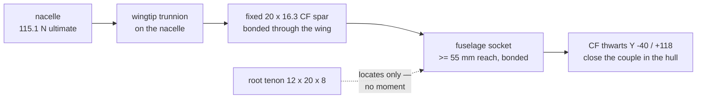
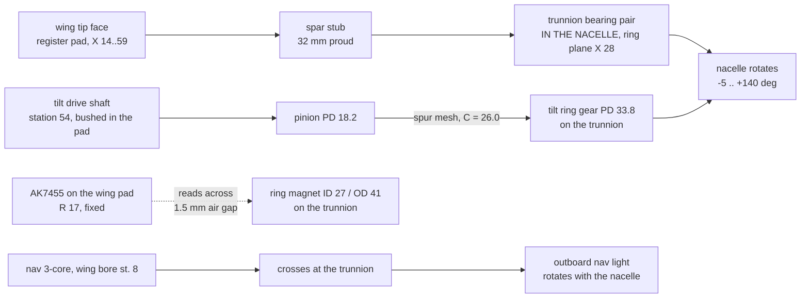

# Wing Attachment Interface Specification — Rev T1

**Revision:** T1 (2026-08-29)
**Author:** Steve Griffing, PE(CSE), CISSP-ISSEP, CPP
**Analysis and drafting:** Claude (Claude Opus 5, Anthropic) under the author's
direction, per `AGENTS.md` §3 "Attribution and Licensing"
**License:** CC BY-SA 4.0 — <https://creativecommons.org/licenses/by-sa/4.0/>

**Status:** SPECIFICATION — the wing side is built
(`airframe/openscad/wings/wings_s1223_revo.scad`, Rev T1). The fuselage and
nacelle sides are **NOT** built; this document is what they are to be built to.

---

## 1. Why this document exists

Rev T1 changes what the spar *is*. Through Rev R2 the tilt spar was a rotating
drive shaft that happened to pass through the wing on two bearings; the wing was
a fairing threaded onto it. Under Rev T1 the spar is a **fixed 20 × 16.3 mm
carbon-fibre tube bonded into the wing over its full span**, and it is the
wing's primary bending member.

That single change re-writes both ends of the wing at once:

| | Rev R2 (rotating spar) | **Rev T1 (fixed bonded spar)** |
|---|---|---|
| Wing root moment path | tenon, then two bonded CF tie rods | **the spar itself, into a fuselage socket** |
| Root couple arm | 48 mm (chordwise rod spacing) | **86.7 mm (spanwise support span)** |
| Wingtip | MF128ZZ bearing seat (spar journals in the wing) | **register face; the spar is rigid in the wing** |
| Tilt bearing | wingtip, in the wing | **nacelle trunnion ring** |
| Tilt torque path | the spar | **separate Ø4 mm shaft + spur pair** |
| ESC power | 2 × Ø7 wing conduit, 17.65 mm off-axis | **inside the spar bore, on the tilt axis** |

Because the load path now crosses two joints this repo's federation splits
across three owners, the numbers have to be stated once, in one place, rather
than three times in three WBS files. **This is that place.** Requirements below
carry an owner and a status.

---

## 2. Basis

### 2.1 Loads

From `tools/wing_spar_carrythrough.py`, measured against the baked hull-frame
STLs, at `docs/structural_analysis.md` §3's convention (4 g limit = 3 g gust +
1 g manoeuvre, × 1.5 ultimate), AUW 3.911 kg (8.62 lbm):

| Quantity | Limit | **Ultimate** |
|---|---|---|
| Nacelle load, per side | 76.7 N (17.24 lbf) | **115.1 N (25.87 lbf)** |
| Wingtip reaction `R_tip` | 110.6 N (24.87 lbf) | **165.9 N (37.30 lbf)** |
| Wing root moment | 9.74 N·m (86.2 lbf·in) | **14.60 N·m (129.2 lbf·in)** |
| Wing torsion about the spar axis | 0.068 N·m | **0.41 N·m (3.6 lbf·in)** |

### 2.2 Spar section

20 mm OD × 16.3 mm ID roll-wrapped carbon fibre:
`I = 4,389 mm⁴`, `Z = 438.9 mm³`, `A = 105.5 mm²`, 14.5 g (0.032 lbm) over the
85.7 mm wing span, 29.1 g (0.064 lbm) over the full 173 mm installed run.

Bending at the ultimate root moment, **cantilever bound** (the whole moment
taken by the spar alone, not shared with the skin):
`σ = 33.28 MPa`, **FOS 9.0** against the 300 MPa cross-ply stand-in.

> **The allowable is not verified.** 300 MPa is the same conservative stand-in
> `tools/wing_spar_carrythrough.py` uses for the CF thwart plate, carried over
> because the repo holds no ASTM D3039/D695 certificate for any CF stock
> (plan 003 DEP-1). Obtain supplier certificates before fabrication.

### 2.3 Bore sizing

The bore is sized by **wire volume, not torque**. Four 10 AWG conductors at
Ø5.5 mm circumscribe a **13.28 mm** circle — the exact 4-circle packing ratio
`1 + √2` [REF-MATH-001], computed in `tools/spar_bundle_fit.py`. With 1.5 mm
radial clearance so the bundle can twist through the tilt sweep, the minimum
bore is **16.28 mm**, hence 20 × 16.3.

> **The 5.5 mm wire OD is an assumption**, not a measurement:
> `current-specification/bom_revS.csv` records no OD for `WIRE-10AWG`
> (plan 003 DEP-2 / OQ4). A larger real OD scales the entire bore chain and
> would re-open the airfoil trade. **Measure the procured wire before cutting
> CF.**

---

## 3. Wing ROOT → fuselage

### 3.1 Mechanism

A **bonded spar socket** in the cargo sidewall carries the whole root joint. The
tenon locates and does not react moment. There are no tie rods.



### 3.2 Geometry the fuselage must provide

| Item | Value | Was (Rev S1b) |
|---|---|---|
| Spar station, hull Y | **+21.00 mm** | +38.15 mm |
| Spar height, hull Z | **+66.85 mm** | +68.42 mm |
| Socket bore | **Ø20.4 mm** (20.0 + 0.2/side epoxy gap) | Ø8.3 mm |
| Socket spanwise reach inboard of the wall | **≥ 55 mm** | ~19 mm (bearing boss) |
| Root bearing | **NONE — bonded/clamped socket** | F688ZZ |
| Mortise (for the locating tenon) | 12.8 × 20.8 mm | 30.8 × 20.8 mm |

Hull Y is derived, not chosen: the wing's LE root sits at hull Y −7.0
(`tools/bake_hull_frame.py`), and the spar is at chord station 28.0 →
`−7.0 + 28.0 = +21.0`. Hull Z likewise: the wing's chord line bakes to Z
+58.0, and the spar rides the **unscaled** camber midline, +8.84 mm at this
station → `58.01 + 8.84 = 66.85`.

> The camber midline is unscaled deliberately. `s1223_section()` opens the
> thickness envelope *about* the camber line (Rev S1b), so `THICKNESS_SCALE`
> does not move the bore centre. Applying the thickness scale to the midline
> would lift the socket 4.07 mm above the spar it is supposed to receive.

### 3.3 Why 55 mm

A rigid pin in an elastic socket develops a roughly triangular pressure
distribution either side of the reversal point, resultants at `L/3` from each
end — an effective couple arm of `2L/3`:

```text
F     = 3M / (2L) + V/2
area  = D · L/3          (projected bearing, the CARGO-03c convention)
sigma = F / area         ∝ 1/L²
```

Stress goes as **1/L²**, so length is the only effective lever — diameter
appears only linearly. Against the repo's standing 5 MPa bond-limited CF-PETG
figure (`docs/structural_analysis.md` §7.3):

| Socket L | σ | FOS |
|---|---|---|
| 20 mm | 8.65 MPa | 0.58 |
| 40 mm | 2.27 MPa | 2.20 |
| 50 mm | 1.49 MPa | 3.36 |
| **55 mm** | **1.24 MPa** | **4.02** |
| 60 mm | 1.06 MPa | 4.73 |

**COST, AND IT IS AN OWNER DECISION.** 55 mm of reach puts the spar's inboard
end near hull X −136 (wall at −81.3), reducing the cargo-bay clear span from
140 mm to ~104 mm on that side. `CARGO-01` removed a full-width spar
carry-through *precisely* to free that volume, so this is a real
re-encroachment — smaller than the original, but in the same direction.

Three ways out, unpriced here:

1. **Accept the 36 mm bay intrusion.** `tools/cargo_bay_envelope.py` currently
   passes the mission payload (101.6 × 76.2 × 76.2 mm) against a 170.6 mm
   measured interior width, so there is nominal room — but the check must be
   re-run against the intruded span, not assumed.
2. **Land the LG-11 coupon.** At the owner's own <15 MPa decision-rule
   threshold a 31 mm socket clears FOS 4.0; at REF-MAT-001's ASTM D695 bulk
   compressive figure for 20 % CF-PETG (47 MPa) **17 mm** would do. Bearing of
   a bonded tube against a socket wall is a *compressive* mode, not the
   bond/peel mode 5 MPa was written to bound, so this is very likely the
   conservative direction by a wide margin. Overturning a standing repo
   allowable is an owner call, not a side effect of a geometry change — hence
   it is flagged, not assumed.
3. **Two short collars instead of one long socket.** Same 1/L² physics applies
   to the separation rather than the length; two 12 mm collars 50 mm apart
   reach FOS 4.1 with less continuous material, though the same total reach.

### 3.4 Clamp

The spar is bonded into the **wing** and clamped into the **fuselage**. That
asymmetry is deliberate: it makes *wing + spar* one serviceable assembly that
comes off the aircraft by releasing the root clamp and withdrawing outboard —
the light-aircraft spar-stub-into-socket pattern — and it puts the releasable
joint where there is room for a collar.

- Split-collar pinch clamp, ≥ 5 mm wall over Ø20 (i.e. ~Ø30 outside),
  M3 heat-set inserts, 2 screws.
- **Positive split gap when clamped.** If the halves close on each other before
  they close on the tube, the collar grips itself and the spar is free.
- **No set screws.** CF tube splinters under a point load; the grip must be
  distributed (plan 003 RISK-3).

### 3.5 Torsion — why no anti-rotation pin

Wing pitching moment about the spar axis is 0.41 N·m at ultimate
(`Cm ≈ 0.25`, 40 kt, one panel). Reacted as bond shear over a 40 mm socket that
is **0.016 MPa — FOS 306**. Nacelle thrust adds none: the duct axis passes
through the pivot, which is on the spar axis. A round tube in a round bonded
socket is sufficient; the retired aft tie rod had no remaining job.

---

## 4. Wing TIP → nacelle

### 4.1 Mechanism

The spar protrudes past the wing tip face and the **nacelle** carries the
bearings. The wing tip provides a register face, a supported bushing boss for
the tilt drive shaft, and the fixed encoder.



### 4.2 Geometry the nacelle must provide

| Item | Value | Note |
|---|---|---|
| Spar stub proud of the wing tip face | **32.0 mm** | 4 joint gap + 10 to the ring plane + ~18 bearing pair. **REQUIRES CONFIRMATION** against the nacelle's final bearing stations. |
| Trunnion bearing bore | **Ø20.0 H7** | on the nacelle, ring plane X ≈ 28 mm from the duct axis |
| Bearing duty | axial **and** radial, 21.9 N each at 4 g × 1.5 | thrust is axial to the spar in cruise and transverse in hover — a stack chosen for one attitude is wrong for the other (plan 004 RISK-4) |
| Ring gear pitch diameter | **33.8 mm** | must be concentric with and clear the Ø20 spar |
| Pinion pitch diameter | **18.2 mm** | on the wing's drive shaft |
| Gear centre distance | **26.0 mm** | → wing shaft at chord station 54.0 |
| Ring magnet | **ID 27 / OD 41 mm**, diametric | mean radius 17.0 = `HALL_SENS_R` |
| Magnet axial gap to the AK7455 face | **1.5 mm** | set by the nacelle standoff |
| Non-ferrous zone | ≥ 10 mm radius around the IC | see §4.5 |
| 4 × 10 AWG disconnect | **in the nacelle annulus** | see §4.4 |

### 4.3 The gear centre distance is not free — and plan 004's figure is wrong

`docs/plans/2026-08-29-004-...` KTD4 places the drive shaft at chord station
43, i.e. **15.0 mm** from the spar axis. That centre distance is impossible for
this mechanism, and the plan's own inputs show it once they are closed:

- The tilt ring gear is **concentric with the spar**, so its root diameter must
  clear Ø20 plus a hub wall → PD ≥ ~30 mm.
- The stage is a step-**up** (the nacelle sweeps 145°, more than a servo's
  range), so the pinion is the smaller member:
  `PD_ring × 145 = PD_pinion × servo_deg`.
- `C = (PD_ring + PD_pinion) / 2`.

At `C = 15` with a 270° servo the algebra returns **`PD_ring = 10.5 mm` — a
ring gear smaller than the spar it encircles.** No tooth count fixes this.

| PD_ring | Servo | PD_pinion | C | Wing shaft station |
|---|---|---|---|---|
| 30.0 | 270° | 16.1 | 23.1 | 51.1 |
| **33.8** | **270°** | **18.2** | **26.0** | **54.0 (built)** |
| 30.0 | 180° | 24.2 | 27.1 | 55.1 |
| 33.8 | 180° | 27.2 | 30.5 | 58.5 |

**C = 26.0 is built** — it is the value that leaves the AK7455 pocket its
1.80 mm of chordwise clearance between the spar bore and the shaft bore. The
180° column is **not** buildable at the current wing: station 58.5 collides with
the root tenon (58.5 mm). **Confirm the servo's real angular range
(plan 003 OQ3 / plan 004 OQ1) before cutting gears** — a 180° servo forces
either a smaller ring gear or a tenon relocation.

### 4.4 The power disconnect belongs in the nacelle, not the wingtip

Plan 003 U3 specified a wingtip "maintenance garage" holding the four 10 AWG
bullet disconnects. **It does not fit and is reassigned to the nacelle.**

Any 10 AWG disconnect — ring-terminal studs, bullets, or blade tabs — needs
~6 mm of clear height. Aft of the spar the tip section falls away fast
(measured at `THICKNESS_SCALE_TIP` 2.20):

| Chord station | 40 | 44 | 54 | 66 | 78 |
|---|---|---|---|---|---|
| Tip section depth (mm) | 17.50 | 15.60 | 11.20 | 6.78 | 3.43 |

Subtracting 2 × `WALL_T` of skin leaves 12.5 mm at station 40 and 1.8 mm by
station 66 — over a chordwise run too short to lay four disconnects out in, and
that volume is already claimed by the AK7455 conduit and the drive shaft.

The nacelle has the volume: plan 003's own routing already lands the bundle in
*"the annular space between the duct wall (r = 25) and the outer skin"* before
ESC1/ESC2. Putting the break there also keeps the 40 A joint out of the same
pocket as the AK7455 plug, which is what
`docs/TILT_ENCODER_WIRING_EMI_SPEC.md` §2.3 requires and what a shared wingtip
garage would have violated.

**Service model is unchanged and needs no hatch:** sliding the nacelle off the
spar exposes the entire wing tip face. **The nacelle is the cover.** This is the
nacelle-off-spar model already adopted in
`docs/plans/2026-08-26-001-nacelle-esc-intake-integration-plan.md`.

### 4.5 Encoder — what changed and what did not

**Unchanged:** AK7455 (SPI, off-axis) stays selected. AS5600 and MT6701 stay
rejected — both are on-axis-only parts and there is still no free shaft end,
because the spar bore is now full of the power bundle.

**Changed, and the nacelle must follow:**

1. **The spar is no longer ferromagnetic.** Rev R2's magnetic-siting problem was
   a 4130/17-4 PH steel shaft through the ring centre distorting the bias field
   (`docs/TILT_ENCODER_WIRING_EMI_SPEC.md` §6.1). The Rev T1 spar is carbon
   fibre. **That distortion source is removed, not mitigated** — and §6.1's
   stated premise is now factually wrong and needs correcting there.
   The non-ferrous keep-out is **retained anyway**, because it also governs the
   fasteners and the nacelle-side collar, and the drive shaft and pinion *are*
   steel and *are* nearby. In-situ zero-calibration stays required; it now
   absorbs the drive train rather than the spar.
2. **The ring magnet had to grow.** It rides a collar on the spar, and the spar
   went Ø8 → Ø20; ID 10 cannot pass over a Ø20 tube. ID 27 / OD 41 clears the
   spar plus a 3.5 mm non-ferrous collar and fits inside the trunnion ring's
   measured 53.4 mm envelope (plan 003 OQ2).
3. **`HALL_SENS_R` 11 → 17 mm** so the IC still reads **mid-annulus**. This is
   not cosmetic: a diametric ring's field is only clean over the annulus, and an
   IC left at R = 11 would sit 2.5 mm inboard of the magnet's inner edge — off
   the magnet entirely.
4. **The ring magnet and the ring gear are nearly coradial** (magnet annulus
   r 13.5–20.5, gear PD r 16.9) and must therefore be **axially separated** on
   the trunnion. Nacelle to resolve.

---

## 5. Requirement register

| ID | Requirement | Owner | Status |
|---|---|---|---|
| **WA-R1** | Spar socket at hull Y +21.00, Z +66.85, Ø20.4, ≥ 55 mm reach | fuselage-mid | **OPEN** |
| **WA-R2** | Root bearing (F688ZZ) deleted; bonded/clamped socket replaces it | fuselage-mid | **OPEN** |
| **WA-R3** | Split-collar pinch clamp, ≥ 5 mm wall, M3 inserts, positive split gap | fuselage-mid | **OPEN** |
| **WA-R4** | Mortise re-sized 30.8 → 12.8 mm wide for the locating tenon | fuselage-mid | **OPEN** |
| **WA-R5** | Cargo-bay envelope re-verified against the intruded clear span | fuselage-mid | **OPEN** |
| **WA-R6** | Fuselage-side conduits for the nav 3-core (Y +1.0) and the AK7455 pair (Y +37.5), and a drive-shaft bore at Y +47.0 | fuselage-mid | **OPEN** |
| **WA-R7** | Trunnion bearing bore Ø20.0, ring plane X ≈ 28, axial + radial duty | wings-nacelles | **OPEN** |
| **WA-R8** | Tilt ring gear PD 33.8 concentric with the spar, C = 26.0 to the wing shaft | wings-nacelles | **OPEN** |
| **WA-R9** | Ring magnet ID 27 / OD 41, axially separated from the ring gear | wings-nacelles | **OPEN** |
| **WA-R10** | 4 × 10 AWG disconnect in the nacelle annulus, partitioned from the AK7455 plug | wings-nacelles | **OPEN** |
| **WA-R11** | Nav 3-core crosses at the trunnion, radially separated from the power bundle | wings-nacelles | **OPEN** |
| **WA-R12** | Confirm the spar stub protrusion (32 mm) against final bearing stations | wings-nacelles | **OPEN** |
| **WA-R13** | `TILT_ENCODER_WIRING_EMI_SPEC.md` §6.1 corrected — the spar is no longer ferromagnetic | avionics | **OPEN** |
| **WA-R14** | Wing side: bores, pad, root path, thickness scales | wings-nacelles | **BUILT** (Rev T1) |

---

## 6. Open items

- **OI-1 — Wire OD.** `WIRE-10AWG` has no recorded OD. Everything in §2.3 scales
  with it. **Blocks CF tube procurement.**
- **OI-2 — CF allowable.** No ASTM D3039/D695 certificate exists for any CF
  stock in this repo. The 300 MPa figure is a stand-in (plan 003 DEP-1).
- **OI-3 — Socket allowable / LG-11 coupon.** Decides whether the socket is
  55 mm or 17 mm, and therefore whether the cargo bay is intruded at all.
- **OI-4 — Servo angular range.** 180° vs 270° changes the gear centre distance
  and, at 180°, does not fit the current wing (§4.3).
- **OI-5 — Aero revalidation.** The section is no longer S1223: root t/c
  12.14 → 17.72 %, tip 18.93 → 26.70 %. **Every aero figure in the repo that
  cites this wing is unverified**, including the 7.6 N cruise-lift figure in
  `wings_s1223_revo.scad`'s header and everything derived from it. Do not
  present the re-lofted wing as an S1223 performance match (plan 003 RISK-1).
- **OI-6 — Bay intrusion decision** (§3.3).

---

## 7. Verification

```text
/usr/bin/python3 tools/spar_bundle_fit.py
/usr/bin/python3 tools/wing_spar_station_fit.py --bore 20.4 --station 28
/usr/bin/python3 tools/wing_airfoil_integrity.py
/usr/bin/python3 tools/wing_internal_clearance.py --verbose
/usr/bin/python3 tools/wing_spar_carrythrough.py
/usr/bin/python3 tools/validate_stls.py
/usr/bin/python3 tools/cargo_bay_envelope.py
/usr/bin/python3 tools/landing_gear_wing_clearance.py --proud
/usr/bin/python3 tools/wing_root_deconflict.py     # RED until WA-R1/R6 land
```

`wing_root_deconflict.py` **fails by design** at Rev T1 and must keep failing
until the fuselage side moves. Its three findings are all one fact — the
fuselage still carries `WING_SPAR_Y = +38.15` and `WING_SPAR_BORE_D = 8.3`:

| Finding | Cause |
|---|---|
| rotating spar tube blocks Hall/encoder conduit (1,720.6 mm³) | fuselage spar solid at Y +38.15 sits where the wing's new AK7455 conduit runs |
| rotating spar tube blocks tilt drive-shaft bore (637.7 mm³) | same solid, vs. the new shaft bore |
| cargo shell blocks spar bore / 4 × 10 AWG feeds (2,048.6 mm³) | shell bore still Ø12.3 at Y +38.15; the wing's Ø20.4 is at Y +21.0 |

---

## 8. Sources

- `docs/plans/2026-08-29-003-feat-unified-20mm-spar-trunnion-belt-drive-plan.md`
  — architecture, KTD1–KTD8, frozen station/thickness figures.
- `docs/plans/2026-08-29-004-feat-nacelle-trunnion-pivot-tilt-drive-plan.md`
  — drive trade study. Its KTD4 shaft station is corrected in §4.3.
- `docs/TILT_SPAR_ANALYSIS.md` §2.1 (torque), §3 (superseded 8 mm section),
  §4 (duct blockage).
- `docs/TILT_ENCODER_WIRING_EMI_SPEC.md` §2.1, §2.3, §6.1 (§6.1 superseded by
  §4.5 above).
- `docs/structural_analysis.md` §3 (load factors), §7.3 (5 MPa bond-limited
  figure).
- `REFERENCES.md` REF-MATH-001 (packing), REF-MAT-001/002 (CF-PETG),
  REF-SENSOR-008 (AK7455), REF-FAA-003 §91.209(a) (nav lights).
- Geometry measured 2026-08-29 by `tools/wing_spar_station_fit.py`,
  `tools/wing_internal_clearance.py`, `tools/wing_spar_carrythrough.py`, and
  `tools/spar_bundle_fit.py` against the Rev T1 sources.
