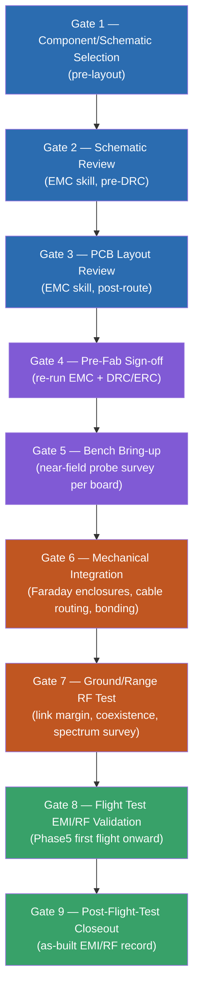

# plan: EMI/RF Design and Test Plan

**Target repo:** Serenity-UAV (this repo)
**Scope:** A phased EMI/RF design-and-test process spanning schematic capture,
PCB layout, mechanical integration, and flight test — for every RF system
(telemetry/C2 links, GPS, FPV/vision, Wi-Fi) and every EMI-sensitive or
EMI-generating subsystem (avionics capes, AK7455 tilt encoder, OPTIGA Trust M,
EDF motor drives/ESCs, switching BECs, servo PWM). This plan does **not**
redesign hardware — it defines *when* EMI/RF analysis happens, *what* gets
checked at each gate, *which* standards apply, and *what* the pass/fail
criteria and deliverables are. Hardware fixes surfaced by running this plan's
gates land in the existing `avionics/emi-hardening/WBS.md` §1.4 checklist, not
here.

*"We're just too far out. I can't hail 'em." — Wash, on comms range* /
*"We are just too old and busted for that trick." — Kaylee, on the plan not
duplicating existing hardening work*

---

## Summary

The repo already has real EMI/RF infrastructure: a documented 500 W/m²
(≈434 V/m) design objective that exceeds MIL-STD-461G RS103
[REF-NIST-002 §6.2.5], RE102/CE102 limits applied to Pilot/XO/Flight Engineer
[REF-MIL-002], FCC Part 15 band citations for all four external radios
[REF-FCC-001, REF-FCC-002, REF-FCC-003], IEC 61000-4-2/4/5 immunity targets
[REF-IEC-003, REF-IEC-004, REF-IEC-005], a 0.20 mm copper-to-edge design floor
[IPC-2221 §4], and a hardware task list in `avionics/emi-hardening/WBS.md`
§1.4 (Faraday enclosures, chokes, antenna placement). What's missing is a
**process**: EMI/RF issues are currently found late (e.g. the IEC 62368-1
isolation-mesh violations in `avionics/emi-hardening/WBS.md` §0.6 were only
caught by a DRC run after layout was largely complete) and there is no
standing schedule of design-review gates that re-checks EMI/RF risk as the
design changes.

This plan creates that process: a new standing document,
`avionics/emi-hardening/EMI_RF_TEST_PLAN.md`, defining gates from component
selection through post-flight-test closeout, each with required
analyses/tools (including the repo's own `emc` skill), pass/fail criteria,
and a deliverable. Per the owner's direction, MIL-STD-461G stays a **design-to**
standard verified by bench self-test — no accredited-lab qualification is
scoped here (matches the existing "qualification testing deferred" posture in
[REF-MIL-002]).

## Problem Frame

- **Requirement source:** root `AGENTS.md` §1 "EMI hardening: design objective
  is correct operation in a 500 W/m² RF field" is a non-negotiable, and
  `avionics/AGENTS.md` requires every radio link to be regulation-compliant
  and every board to meet MIL-STD-461G RE102/CE102 targets. Neither document
  says *when in the build process* these get verified.
- **Evidence of the gap:** `avionics/emi-hardening/WBS.md` §0.6 shows IEC
  62368-1 isolation-mesh clearance violations (down to 0.0 mm — direct
  contact — between `TMESH_P/N` and isolated ground domains) discovered by a
  DRC run well after Pilot/XO layout was substantially complete, requiring
  layout rework referred back to the user. This is the class of finding an
  earlier gate should catch before routing is 80% done.
- **Scope-defining decisions** (both confirmed by the project owner this
  session — see Requirements Traceability):
  1. MIL-STD-461G stays **design-to / self-test**, not accredited
     qualification.
  2. This plan is a **new standalone document** with WBS/TODO hooks, not an
     in-place expansion of `avionics/emi-hardening/WBS.md`.
- **Non-goal:** re-deriving or re-justifying the 500 W/m² design objective, or
  redesigning any specific circuit. Those live in `avionics/AGENTS.md` and
  `avionics/emi-hardening/WBS.md` respectively.

## Requirements Traceability

| ID | Requirement | Source |
|---|---|---|
| R1 | EMI/RF risk must be checked at component-selection/schematic time, before layout is committed | User request; gap evidenced by §0.6 late-catch |
| R2 | Every RF system (telemetry/C2, GPS, FPV/vision, Wi-Fi) gets a link/coexistence review | User request; `avionics/AGENTS.md` external comms list |
| R3 | Every EMI-sensitive subsystem (AK7455 tilt encoder, OPTIGA Trust M, avionics capes) gets a susceptibility review relative to on-airframe noise sources | User request |
| R4 | Every high-noise source (EDF motor drives/ESCs, switching BECs, servo PWM) gets an emissions review | User request |
| R5 | Shielding/grounding/filtering strategy is defined and checked, not just aspirational | User request; existing Faraday-enclosure tasks in §1.4.1 |
| R6 | Gates continue through PCB layout, mechanical integration, and flight test — not a single end-of-project test | User request |
| R7 | The repo's `emc` skill is invoked at defined gates as a tool, with its scope and limits stated | User request |
| R8 | Applicable standards are vetted per root `AGENTS.md` §"Standards Vetting Policy" — FCC Part 15, CISPR 32/25 where applicable, MIL-STD-461G at design-to rigor (KTD1) | User request; `docs/attribution_and_licensing.md` policy |
| R9 | The plan integrates with existing governance — `AGENTS.md`, `WBS.md`, `TODO.md` — rather than existing as an orphan document | Root `CLAUDE.md`/`AGENTS.md` governance federation requirement |

## Key Technical Decisions

**KTD1 — MIL-STD-461G rigor: design-to + bench self-test, not accredited qualification.**
*(session-settled: user-directed — chosen over "plan toward accredited
qualification": matches the existing REFERENCES.md posture that qualification
testing is deferred pending airframe integration, and avoids scoping lab cost
this plan cannot commit the project to.)* Gates in this plan verify RE102/
CE102/RS103-*equivalent* margins using bench instruments (spectrum analyzer,
near-field H/E probes, a TEM cell or GTEM if available, and the `emc` skill's
analytical models) against the MIL-STD-461G *limit lines* as design targets.
No test happens at an accredited EMC lab under this plan. If the owner later
wants a qualification data package (e.g. for a customer or airworthiness
approval), that is a new, separate plan.

**KTD2 — New standalone document, not an in-place WBS.md expansion.**
*(session-settled: user-directed — chosen over folding gates into
`avionics/emi-hardening/WBS.md` directly: keeps the repeatable *process*
document separate from the one-time hardware task checklist, so the process
survives after §1.4's tasks are checked off.)* The new document is
`avionics/emi-hardening/EMI_RF_TEST_PLAN.md` (co-located with the existing
`avionics/emi-hardening/WBS.md`/`TODO.md` detail pair, same directory,
same license/authorship header convention). Root `WBS.md` and `TODO.md` get
short pointer entries into it, matching the existing `→ detail:` convention
used for `avionics/emi-hardening/WBS.md` §1.4.

**KTD3 — Gate numbering follows the project's existing Phase0–Phase12 build
phases**, not an independent numbering scheme, so a reader already oriented
by root `WBS.md` §3.0 "Physical Build" can place each EMI/RF gate against a
build milestone they already know (Phase0 print/CF-cut, Phase1 hull
structure, Phase2 nacelle assembly, Phase5 first flight, etc.) rather than
learning a second phase vocabulary.

**KTD4 — The `emc` skill is scoped honestly as a risk-reducer, not a
compliance oracle.** Its own SKILL.md states "~70% of common EMC design
mistakes... cannot guarantee FCC/CISPR compliance." Every gate that invokes it
records that scope limit alongside the result, so a clean `emc` run is never
mistaken for a pass/fail compliance determination.

---

## Standards Applicability Matrix

| Standard | Applies to | Applicability call | Reference |
|---|---|---|---|
| FCC Part 15 §15.235 (49 MHz) | Commo transceiver | Mandatory — unlicensed intentional radiator, requires eventual FCC cert (§2.803/§15.19) before any transmission off a test bench | [REF-FCC-003] |
| FCC Part 15 §15.247 (915 MHz SiK, 2.4 GHz Zigbee) | XO radios | Mandatory | [REF-FCC-001] |
| FCC Part 15 Subpart E §15.407 (5 GHz Wi-Fi) | XO Wi-Fi (WL1837MOD) | Mandatory | [REF-FCC-002] |
| FCC Part 15 Subpart B (unintentional radiators) | Every digital board (Pilot, XO, Flight Engineer, Observer, Commo digital section) | Applicable — Class B limits are the relevant civilian baseline for a small UAV; used here as the *unintentional-emissions* pre-compliance target the `emc` skill's FCC Part 15 model checks against | New — add to REFERENCES.md (§ Workflow Note below) |
| CISPR 32 | Same boards, as the international-harmonized equivalent of FCC Part 15B | Informational cross-check only — no dual-market compliance program is in scope; the `emc` skill already supports it, so it's free to note where CISPR 32 Class B would be tighter than FCC Class B | New — add to REFERENCES.md |
| CISPR 25 (automotive-grade conducted/radiated) | Not applicable as a compliance target | Referenced only as a *design stress-test*: CISPR 25's tighter conducted-emission limits on switching regulators are a useful design margin check for the EDF ESC/BEC noise sources, given the 500 W/m² objective already exceeds civilian norms | New — add to REFERENCES.md, marked "design margin reference only" |
| MIL-STD-461G RE102/CE102/RS103 | Pilot, XO, Flight Engineer (per existing REFERENCES.md scope) | Design-to + bench self-test per KTD1 | [REF-MIL-002] |
| IEC 61000-4-2/4/5 (ESD/EFT/Surge immunity) | All boards, connectors | Design-to, Level 4 target already recorded | [REF-IEC-003, REF-IEC-004, REF-IEC-005] |
| IEC 62368-1 Annex G (creepage/clearance) | Isolation domains (CAN/RS-485/Ethernet galvanic isolation, tamper mesh) | Mandatory, currently **failing** per §0.6 — Gate 2 (below) re-verifies after each layout rework | [REF-IEC-001] |
| IPC-2221 §4 (EMI/RFI PCB design rules) | All board stackups/edge clearance | Mandatory, 0.20 mm floor already set | Cited in REFERENCES.md line 843 area |

**Workflow note (Standards Vetting Policy compliance):** FCC Part 15 Subpart B
and CISPR 32 are cited above as *newly applicable* to this plan's Gate 3/4/6
unintentional-emissions checks but do not yet have REF-IDs in
`REFERENCES.md`. Per root `AGENTS.md` §4 and `CLAUDE.md` Standards Vetting
Policy, Implementation Unit U1 adds them with validated URLs and specific
section citations before any gate cites them by REF-ID. Do not invoke a
REF-ID for these until U1 lands.

---

## High-Level Technical Design



Color grouping: blue = design-time (schematic/layout), purple = per-board
bench verification, orange = integration/range, green = flight/closeout —
matching the "as early as possible, then follow up throughout" requirement:
the earliest gates are cheapest to act on (a schematic change), the latest
are the most expensive to discover a problem at (a flight anomaly).

---

## Output Structure

```
avionics/emi-hardening/
├── AGENTS.md                      (new — pointer stub, see U5)
├── EMI_RF_TEST_PLAN.md            (new — this plan's primary deliverable, U2-U4)
├── WBS.md                         (existing — hardware task detail, unchanged in structure)
└── TODO.md                        (existing — compact index, gets new pointer line, U6)
```

---

## Scope Boundaries

**In scope:**
- The gate definitions, required analyses, tools, pass/fail criteria, and
  deliverables for Gates 1–9 above.
- REFERENCES.md additions for FCC Part 15B and CISPR 32 (as design-margin
  references) needed to cite them honestly in the gates.
- WBS.md/TODO.md pointer entries so the plan is discoverable from root
  governance.
- Defining *what* the `emc` skill checks at each applicable gate and what its
  output does and does not prove.

**Out of scope (do here, not deferred — these are existing WBS items the
gates will re-use, not redo):**
- Actually fixing the §0.6 isolation-mesh violations — that's existing
  `avionics/emi-hardening/WBS.md` §0.6 work; Gate 2/3 of this plan re-runs
  verification against it, doesn't perform the fix.
- Building the Faraday enclosures — existing §1.4.1 hardware task.
- Redesigning any filter, choke, or PDN — existing hardware work this plan's
  gates flag, not implement.

### Deferred to Follow-Up Work
- **Accredited MIL-STD-461G qualification test package** — explicitly
  deferred by KTD1; would be a separate plan if/when the owner decides to
  pursue it.
- **FCC equipment certification filing (TCB submission)** for the 49 MHz
  Commo link — Gate 7/8 verify the link meets §15.235 emission limits on
  bench/range instruments, but the actual TCB certification paperwork is
  root `WBS.md` §5.1 territory, not this plan's.
- **A dedicated RF anechoic/OATS test campaign** — Gate 7 uses an open-area
  ground range with a calibrated antenna and spectrum analyzer as a
  practical stand-in; a formal OATS/chamber campaign is deferred with
  accredited qualification.

---

## Implementation Units

### U1. Standards Vetting — Add FCC Part 15 Subpart B and CISPR 32 to REFERENCES.md

**Goal:** Close the Standards Vetting Policy gap identified above before any
gate cites these standards by REF-ID.

**Requirements:** R8

**Dependencies:** None

**Files:**
- `REFERENCES.md` — add `REF-FCC-005: 47 CFR Part 15 Subpart B — Unintentional Radiators` (or next unused REF-FCC number) with validated URL (ecfr.gov), the specific §15.109 (radiated) / §15.107 (conducted) Class B limit tables applied, and a note distinguishing it from the existing intentional-radiator REF-FCC-001/002/003 entries.
- `REFERENCES.md` — add `REF-CISPR-001: CISPR 32:2015 — Electromagnetic compatibility of multimedia equipment` with validated URL/access note (IEC webstore listing at minimum, since CISPR standards are not free), explicitly marked "design-margin reference only, not a compliance target" per the Standards Applicability Matrix above.

**Approach:**
1. Look up the current FCC Part 15 Subpart B section numbers on ecfr.gov (§15.107, §15.109) — do not guess; if a section can't be verified, mark "requires verification" and add a TODO item per root `CLAUDE.md` Workflow Notes.
2. Add both entries following the exact table format of adjacent `REF-FCC-*` entries (Issuing authority / Edition / Official URL / applied sections table).
3. Update the REFERENCES.md table of contents entries for both new REF-IDs.

**Patterns to follow:** Existing `REF-FCC-001`/`REF-FCC-002`/`REF-FCC-003` entries (REFERENCES.md lines ~300–410) for table shape and citation granularity.

**Test scenarios:**
- Test expectation: none — documentation-only unit; verification is that both REF-IDs resolve to a validated URL and a specific section citation, not a placeholder.

**Verification:** Both REF-IDs appear in REFERENCES.md's table of contents and body with a real URL and specific section/edition; no "TBD" or fabricated section number.

---

### U2. Author `avionics/emi-hardening/EMI_RF_TEST_PLAN.md` — Gates 1–4 (Design-Time)

**Goal:** Write the design-time portion of the standing test-plan document:
Gate 1 (component/schematic selection) through Gate 4 (pre-fab sign-off).
These are the gates that directly satisfy "catch issues as early as possible."

**Requirements:** R1, R2, R3, R4, R5, R7, R9; governed by KTD1–KTD4

**Dependencies:** U1 (needs the new REF-IDs to cite correctly)

**Files:**
- `avionics/emi-hardening/EMI_RF_TEST_PLAN.md` (new)

**Approach:**
1. Open with the same author/license header convention as
   `avionics/emi-hardening/WBS.md` (CC BY-SA 4.0, author line, "detail-holder"
   framing — but framed as a *process* document, not a task checklist).
2. **Gate 1 — Component/Schematic Selection (pre-layout).** For every new or
   changed component in a schematic touching RF or high-noise/sensitive
   nets: check datasheet EMI figures (radiated/conducted emission curves for
   switching regulators; RF module spurious-emission and receiver
   selectivity specs for radios; SPI/I2C bus speed vs. AK7455/OPTIGA Trust M
   susceptibility). Deliverable: a per-board "EMI component risk note" added
   to that board's own `.md` file (e.g. `avionics/kicad/Pilot/Pilot.md`),
   not duplicated here. Pass criterion: every RF, switching, or
   crypto/sensor-adjacent component on the schematic has a one-line EMI
   risk call-out (even if "low risk, standard part").
3. **Gate 2 — Schematic Review (pre-DRC).** Run the `kicad` skill's
   `analyze_schematic.py`, then the `emc` skill's `analyze_emc.py` against
   the schematic-only JSON (PDN topology, decoupling presence, filter
   placement intent) before layout exists. Pass criterion: no P1/P2 `emc`
   finding in categories that are schematic-fixable (missing decoupling cap
   values, missing input filter on a switching net, no differential pair
   assignment for a high-speed net) — cite finding IDs from the tool output,
   not paraphrases.
4. **Gate 3 — PCB Layout Review (post-route, pre-fab).** Run `kicad`
   `analyze_pcb.py --full` then `emc` `analyze_emc.py --full` against the
   routed board. Cross-check against the existing IEC 62368-1 isolation
   findings in `avionics/emi-hardening/WBS.md` §0.6 — this gate is the one
   that would have caught the tamper-mesh clearance violation before it
   reached "layout largely complete." Pass criterion: zero
   `ISOLATION`-netclass DRC violations (ties to §0.6 closure) AND no new P1
   `emc` finding since Gate 2.
5. **Gate 4 — Pre-Fab Sign-off.** Re-run Gate 3's tool pair one final time
   against the fab-candidate Gerbers/pos files, plus a manual edge-clearance
   spot check against the 0.20 mm IPC-2221 floor. Deliverable: a short
   sign-off note appended to the board's `.md` file with tool versions, run
   date, and finding counts (matching the existing "verified 2026-06-22 via
   `kicad-cli pcb drc`..." evidentiary style already used in
   `avionics/emi-hardening/WBS.md` §0.6).
6. For every gate, state explicitly: "The `emc` skill is a risk-reducer
   (~70% of common EMI mistakes per its own scope statement), not a
   compliance predictor — see KTD4."

**Patterns to follow:** The evidentiary citation style in
`avionics/emi-hardening/WBS.md` §0.6 (tool name, version, exact command,
dated, quantified result) — every gate's pass/fail record in the new
document should read the same way, not as a vaguer checklist tick.

**Test scenarios:**
- Test expectation: none — this is a process document; its "test" is the
  dry-run below.
- Dry-run scenario: pick one already-existing board (Pilot or XO) and
  manually walk Gate 2/Gate 3 against its current `.kicad_sch`/`.kicad_pcb`
  as a worked example embedded in the document, so the gate isn't purely
  theoretical prose — this doubles as evidence the gate criteria are
  actually checkable with tools present in this repo.

**Verification:** Document exists, Gates 1–4 each specify tool + command +
pass/fail criterion + deliverable location, and the Pilot/XO worked example
runs successfully (or documents a real finding, per the dry-run scenario).

---

### U3. Author `EMI_RF_TEST_PLAN.md` — Gates 5–7 (Bench, Integration, Range)

**Goal:** Write the bench-bring-up, mechanical-integration, and ground/range
RF test gates.

**Requirements:** R2, R3, R4, R5, R6, R8; governed by KTD1, KTD3

**Dependencies:** U2 (continues the same document)

**Files:**
- `avionics/emi-hardening/EMI_RF_TEST_PLAN.md` (append)

**Approach:**
1. **Gate 5 — Bench Bring-up (per board, powered, pre-integration).** Near-
   field H-probe/E-probe survey around each populated board with EDF/ESC
   simulated load (bench PSU + dummy load, not a spinning motor yet) to spot
   local hot spots (switching regulator, PWM driver, high-speed digital).
   Cross-reference hot-spot frequencies against the AK7455 SPI clock and
   OPTIGA Trust M I2C/SPI clock to flag coupling risk before those parts are
   even near the noise source physically. Pass criterion: no near-field
   reading that (via free-space approximation at the actual planned
   component spacing) projects above the MIL-STD-461G RS103-equivalent
   design floor at the sensitive component's location — this is a bench
   *design-to* check per KTD1, not a chamber measurement.
2. **Gate 6 — Mechanical Integration.** Verify against the `avionics/
   emi-hardening/WBS.md` §1.4.1 Faraday-enclosure constraints (bonding
   without loops, cut-out feedthroughs, no direct RF leakage slot at
   fan/vent) as each enclosure is actually installed in the airframe —
   this gate is a physical-inspection checklist cross-referencing §1.4.1's
   existing design constraints, not new constraints. Include: antenna
   feedline routing clear of the EDF/ESC bay, single-point chassis bonding
   verified with a continuity/low-resistance check, no ground loop between
   enclosures sharing a bonding strap.
3. **Gate 7 — Ground/Range RF Test.** With the airframe powered and EDFs
   spinning (tethered/bench-restrained, not in flight): (a) link-margin
   check for each active radio (49 MHz Commo, 915 MHz SiK, 2.4 GHz Zigbee,
   5 GHz Wi-Fi) — transmit a known test pattern, measure received signal
   strength at a fixed range with motors off vs. motors on, record the
   delta; (b) spectrum survey with a handheld/USB spectrum analyzer across
   all active bands plus known EDF/ESC switching harmonics, looking for
   spurs landing in-band on any receiver; (c) FCC Part 15 §15.235/§15.247/
   §15.407 field-strength spot-check at 3 m using a calibrated antenna,
   compared against the limits already tabulated in REFERENCES.md (e.g.
   REF-FCC-003's 10,000 µV/m at 3 m for the 49 MHz link) — this is a
   pre-compliance bench check, not a certification measurement (KTD1
   scope note applies equally to FCC pre-compliance, not just MIL-461).
   Pass criterion: motors-on link-margin degradation stays within the
   link budget's designed margin (cite the relevant radio's link-budget
   doc if one exists; otherwise flag as an open question — see Open
   Questions below); no spur within 6 dB of a receiver's sensitivity
   floor in its own operating band.

**Patterns to follow:** REFERENCES.md's existing field-strength limit table
for REF-FCC-003 (line ~364) as the format for recording Gate 7's measured
vs. limit values.

**Test scenarios:**
- Test expectation: none — physical test procedure, not code; the
  "scenarios" are the procedure steps enumerated above, each with a named
  input (frequency/band), action (measurement), and expected outcome
  (limit or margin) as required by this plan's own quality bar.

**Verification:** Gates 5–7 each specify the instrument, procedure steps,
pass/fail numeric criterion, and where the result gets recorded (which
board's `.md` file, or a new "Gate 7 log" table in the plan document
itself for range results that don't belong to one board).

---

### U4. Author `EMI_RF_TEST_PLAN.md` — Gates 8–9 (Flight Test, Closeout) + Front Matter

**Goal:** Write the flight-test EMI/RF validation gate, the post-flight-test
closeout gate, and the document's front matter (purpose, how it relates to
`avionics/emi-hardening/WBS.md`, how to invoke the `emc` skill, revision
history).

**Requirements:** R6, R7, R9; governed by KTD3, KTD4

**Dependencies:** U2, U3 (front matter references gate numbering established there)

**Files:**
- `avionics/emi-hardening/EMI_RF_TEST_PLAN.md` (finish)

**Approach:**
1. **Gate 8 — Flight Test EMI/RF Validation**, tied to root `WBS.md` Phase5
   "Minimum Viable Flyer ★ FIRST FLIGHT" onward (KTD3): repeat Gate 7's
   link-margin and spectrum-survey procedure in actual flight (in-flight
   telemetry link-quality logging, if the firmware already logs RSSI/LQ —
   cross-reference `avionics/AGENTS.md` firmware logging requirements; if
   not yet logged, flag as an Open Question, don't invent a new logging
   requirement here) at first flight, then re-run at each subsequent phase
   that adds a new radio or a new noise source (Phase6 full 8-node +
   Observer vision, Phase7 cargo system, Phase11 aft EDF).
2. **Gate 9 — Post-Flight-Test Closeout.** After each flight-test EMI/RF
   pass (Gate 8 instance), append a dated entry to the plan document's
   "As-Built EMI/RF Record" table: what was tested, what changed since the
   last gate, pass/fail, any hardware follow-up filed back into
   `avionics/emi-hardening/WBS.md` §1.4. This closes the loop the Problem
   Frame identifies as missing — a standing record that accumulates instead
   of a one-shot pre-flight check.
3. Front matter: state plainly that this document is the *process*
   (when/how to check), while `avionics/emi-hardening/WBS.md` remains the
   *task list* (what hardware still needs building) — cross-link both
   directions.
4. Add a short "How to invoke the `emc` skill for this plan's gates"
   subsection with the exact two-step command pattern (`analyze_schematic.py`
   → `analyze_emc.py`, or the PCB equivalent) so a future session doesn't
   have to re-derive it from the skill's own SKILL.md each time.

**Patterns to follow:** `avionics/emi-hardening/WBS.md`'s own document header
(license, author, "detail-holder for the root WBS" framing, italicized
in-universe epigraph) for stylistic consistency across the two sibling files.

**Test scenarios:**
- Test expectation: none — documentation.

**Verification:** Gates 8–9 specify the Phase tie-in, the log source for
in-flight RSSI/LQ data (or an explicit Open Question if none exists yet), and
the As-Built EMI/RF Record table exists with at least a header row ready for
the first real Gate 8 entry at Phase5 first flight.

---

### U5. Add `avionics/emi-hardening/AGENTS.md` Pointer Stub

**Goal:** Satisfy the root `CLAUDE.md` "Repository Architecture" requirement
that first-level subdirectories carry a CLAUDE.md/AGENTS.md pointer, and that
IDEs/other AI agents are directed to the authoritative file — this
subdirectory currently has no such stub.

**Requirements:** R9

**Dependencies:** U2 (needs the new file's name to point to)

**Files:**
- `avionics/emi-hardening/AGENTS.md` (new)
- `avionics/emi-hardening/CLAUDE.md` (new, one-line pointer to AGENTS.md, matching root convention)

**Approach:**
1. Follow the exact pattern of root `CLAUDE.md` → `AGENTS.md` (one line:
   "See `AGENTS.md` — authoritative...").
2. `avionics/emi-hardening/AGENTS.md` body: scope statement ("EMI/RF design
   process and hardware task tracking for the 500 W/m² design objective"),
   pointer to `EMI_RF_TEST_PLAN.md` (process) and `WBS.md` (tasks), and a
   cross-reference up to `avionics/AGENTS.md` and root `AGENTS.md` §1 for the
   originating requirement — mirroring the federation style already used by
   `airframe/AGENTS.md`/`avionics/AGENTS.md` pointing back to root.

**Test scenarios:**
- Test expectation: none — documentation scaffold.

**Verification:** Both files exist; `AGENTS.md` correctly cross-references
`EMI_RF_TEST_PLAN.md`, `WBS.md`, and the parent `avionics/AGENTS.md`.

---

### U6. Wire Root `WBS.md` / `TODO.md` Pointer Entries

**Goal:** Make the new plan discoverable from root governance, per the
existing `→ detail:` convention, so a future session or agent finds it
without being told the path.

**Requirements:** R9

**Dependencies:** U2, U5

**Files:**
- `WBS.md` — add a subsection under `## 1.0 — Design Artifacts` or extend
  existing `### 1.4 — EMI Hardening Beyond the PCBs` header line to also
  point at the new process doc (do not duplicate §1.4's task list; just add
  a second `→ detail:` line: `→ process: avionics/emi-hardening/EMI_RF_TEST_PLAN.md`).
- `TODO.md` — add the corresponding compact index entries per root
  `AGENTS.md` "TODO.md ... formal Work Breakdown Structure" requirement:
  one checkbox line per gate (`[ ] Gate 1 — Component/Schematic Selection
  process defined`, etc.), all unchecked until U2–U4 land, then checked as
  part of this plan's own closeout.

**Approach:**
1. Match the exact existing line format: `→ detail: avionics/emi-hardening/WBS.md §1.4` becomes a sibling `→ process: avionics/emi-hardening/EMI_RF_TEST_PLAN.md`.
2. TODO.md entries stay ≤70 chars per root `AGENTS.md`, matching the compact-index rule already enforced elsewhere in that file.

**Test scenarios:**
- Test expectation: none — documentation/index update.

**Verification:** `grep -n "EMI_RF_TEST_PLAN" WBS.md TODO.md` returns at
least one hit in each file; existing §1.4 task list content is unchanged
(diff shows only additions).

---

## Open Questions

- **In-flight RSSI/LQ logging availability** (affects Gate 8, U4): does
  current Pilot/XO firmware already log per-radio link-quality telemetry, or
  does this plan's Gate 8 surface a new firmware logging requirement?
  Deferred to implementation — U4 should record whichever answer it finds
  rather than assume; if logging doesn't exist, file it as a new item under
  root `WBS.md` §4.0 Firmware, not invent it silently inside this plan.
- **Link-budget documentation for each radio** (affects Gate 7 pass
  criterion, U3): if no existing link-budget calculation exists for the
  49 MHz/915 MHz/2.4 GHz/5 GHz links, Gate 7's "designed margin" criterion
  has nothing to compare against on first run. U3 should note this
  explicitly in the gate text as "establish baseline on first run" rather
  than assume a budget exists.
- **Instrument availability** (affects Gates 5–7): the plan assumes access
  to a near-field probe set, a spectrum analyzer, and a calibrated antenna.
  If these aren't currently owned, U3/U4 should note the minimum viable
  substitute (e.g. an SDR dongle + open-source spectrum tool) rather than
  block the gate definitions on procurement.

## Risks

- **Process document without enforcement drifts stale**, the same way
  `docs/FIRST_FLIGHT_READINESS.md` is flagged elsewhere in this repo as
  self-disclosed stale. Mitigation: U6's WBS/TODO hooks make each gate a
  checkable item, and U4's As-Built EMI/RF Record table forces a dated entry
  per real gate execution — a document with an empty record table after
  Phase5 first flight is a visible, auditable failure to follow the process.
- **`emc` skill scope creep** — a future session could start treating a
  clean `emc` run as "EMC compliant." Mitigation: KTD4 and the explicit
  scope-limit line required in every gate (U2 step 6).
- **MIL-461 rigor decision (KTD1) could be revisited** if the project later
  needs a formal compliance record (e.g. for a defense customer). This plan
  doesn't block that — Deferred to Follow-Up Work — but a future re-scoping
  should re-read KTD1's rationale before assuming self-test was always the
  intended end-state.

## Definition of Done

- [ ] U1: REF-FCC-005 and REF-CISPR-001 exist in `REFERENCES.md` with
      validated URLs and specific sections.
- [ ] U2: `EMI_RF_TEST_PLAN.md` created with Gates 1–4 fully specified,
      including the Pilot/XO worked-example dry-run.
- [ ] U3: Gates 5–7 appended, each with instrument/procedure/pass-criterion/
      record-location.
- [ ] U4: Gates 8–9 and front matter appended; As-Built EMI/RF Record table
      present with header row.
- [ ] U5: `avionics/emi-hardening/AGENTS.md` and `CLAUDE.md` stub created.
- [ ] U6: `WBS.md` and `TODO.md` carry discoverable pointers; existing §1.4
      content unmodified aside from the added pointer line.
- [ ] All new standards citations pass the Standards Vetting Policy (no
      "TBD" section numbers).
