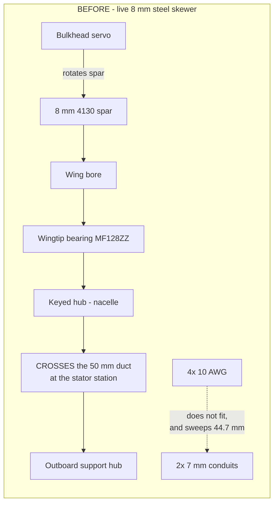
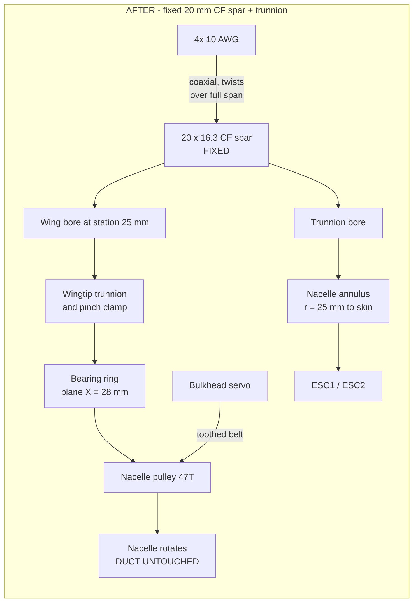
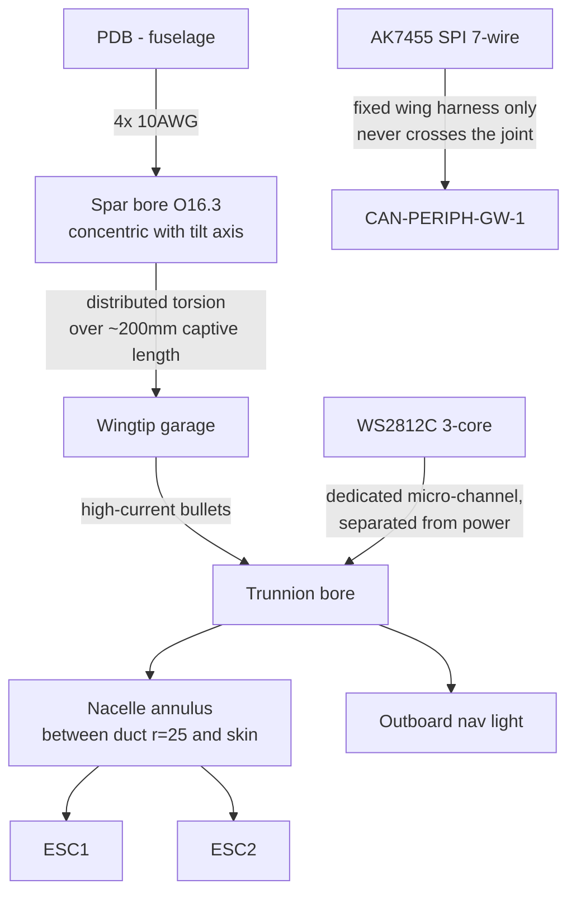

# feat: Unified 20 mm fixed CF spar, trunnion pivot, and belt tilt drive

**Target repo:** Serenity-UAV (this repo)

*"We have done the impossible, and that makes us mighty." — Malcolm Reynolds*

---

## Summary

The four 10 AWG ESC feeds have no viable path from the fuselage to the nacelles.
They do not fit the wing's Ø7 mm conduits, and even if they did, those conduits
sit 17.65 mm forward of the tilt axis, so every transition would sweep them
through a ~45 mm arc. Fixing this cannot be done inside the current mechanism:
it requires a larger hollow spar, a thicker airfoil to carry it, a pivot that no
longer skewers the thrust duct, and a tilt drive that does not rely on the spar
rotating.

This plan implements the owner-selected architecture from
`docs/plans/2026-08-27-nacelle-wiring-plan.md`: a **fixed 20 × 16.3 mm carbon
fiber spar** carrying the power bundle coaxially with the tilt axis, a
**trunnion ring at the nacelle inboard face** that removes the through-duct
spar entirely, and a **toothed-belt tilt drive** from the existing
fuselage-mounted servos.

The 20 mm size is a correction to the plan doc's 16 mm: four 5.5 mm wires
circumscribe a **13.28 mm** circle, so a 16 mm tube fits them only as 16 × 14
(1 mm wall) with 0.72 mm total clearance — no room to twist. 20 × 16.3 gives the
bundle 1.5 mm radial clearance and still comes out **lighter than the steel spar
it replaces** (67.5 g vs 96.2 g per pair, −0.063 lbm).

---

## Implementation record — wing side BUILT 2026-08-29 (Rev T1)

**U1, U2, U3, U5 (wing half), and plan 004 U3 (wing half) are implemented.**
The joint requirements this plan hands to the fuselage (U7) and the nacelle
(U4, U6, U8) are consolidated, with their numbers, in
[`docs/WING_ATTACH_INTERFACE.md`](../WING_ATTACH_INTERFACE.md) — build to that,
not to this plan's prose.

**Frozen figures confirmed by tool, not accepted on trust.** `THICKNESS_SCALE`
1.456 and `THICKNESS_SCALE_TIP` 2.190 at station 28.0 reproduce exactly
(`tools/wing_spar_station_fit.py --bore 20.4 --station 28`), as does
`SPAR_Z` 66.85 and the 13.28 mm circumscribed bundle. Both scales were rounded
UP in the source (1.46 / 2.20) per this file's own established convention —
Rev S1b took 1.447 → 1.45 and U6 took 1.5505 → 1.56 so the wall is not sitting
on its own limit. Built walls are 1.19 mm (root) and 1.21 mm (tip).

**Four things in this plan did not survive implementation. Each is recorded
where it was found, not silently worked around:**

1. **U3's wingtip split-collar pinch clamp — MOVED TO THE ROOT.** A collar that
   grips Ø20 CF without crushing it needs ~Ø30 outside; the re-lofted tip
   section is 22.83 mm deep at its deepest. It cannot exist there. It would
   also have nothing to do: the spar is bonded over 85.7 mm (5,492 mm² of bond,
   ~27 kN of axial retention at 5 MPa), and a bonded spar cannot be withdrawn,
   so a clamp at that end cannot make the joint serviceable either. The clamp
   belongs at the joint that is designed to open — the fuselage socket. Wing +
   bonded spar are now one serviceable assembly.
2. **U3's wingtip maintenance garage — MOVED TO THE NACELLE.** Any 10 AWG
   disconnect needs ~6 mm of clear height; aft of the spar the tip section falls
   17.50 → 3.43 mm over stations 40 → 78, and what depth exists is already
   claimed by the AK7455 conduit and the drive shaft. This plan's own routing
   already lands the bundle in the nacelle annulus, which has the volume — and
   putting the break there also keeps the 40 A joint out of the AK7455's pocket,
   which `TILT_ENCODER_WIRING_EMI_SPEC.md` §2.3 requires and a shared garage
   would have violated. No hatch is needed: the nacelle is the cover.
3. **U9's tie-rod expectation — the couple is RETIRED, not re-sized.** The
   forward rod (station 14.0, Ø8.2 → 9.9..18.1) now intersects the Ø20.4 spar
   bore (17.80..38.20) outright, and the aft rod's only remaining job would be
   wing torsion — 0.41 N·m at ultimate, bond shear 0.016 MPa, FOS 306. A fixed
   bonded spar reacts the root moment directly, which is what neither the tenon
   nor the rods could do, so the whole work-around retires with it.
4. **RISK-2 was not actually covered by its own gate.** `wing_airfoil_integrity.py`
   validated the tabulated table — i.e. the section at `t_scale` 1.0 — and never
   read either thickness scale, so it would have passed identically at 1.0 and
   2.20. It now validates the sections `wing_solid()` actually lofts. Both are
   valid closed polygons at 1.46 / 2.20; RISK-2 is closed on evidence rather
   than on a gate that could not see it.

**Open questions closed:** OQ3 (servo range) is **CLOSED and void** — the drive
is multi-turn, so the actuator's own travel no longer sets the ratio. OQ4
(wire OD) remains open and blocking. See the interface spec §6.

**Three further owner directives landed 2026-08-29 after the first build pass,
and two of them invalidated built geometry:**

1. **The spar must not penetrate the thrust duct.** The 32 mm stub reached
   |X| = 9.7 against a duct wall at 25 — fifteen millimetres inside it. Cut to
   **15.0 mm** (max 15.7). The nacelle's bearing pair must now fit inside that.
2. **The centre of the cargo bay must stay clear.** That rules out the 55 mm
   socket U7 was scoped around; only 18.67 mm exists before the bay. The joint
   splits instead — socket for shear (FOS 16), bonded 80 × 60 flange for the
   moment (FOS 29.2) — which is *better* than the socket it replaces, because a
   flange trades a 1/L² depth term for a linear area term.
3. **The drive turns the shaft more than one revolution**, inverting the tip
   stage to a reduction (see plan 004's correction note). **OQ5 is resolved by construction:**
the nacelle keeps its canonical station because the pivot moved inside it
(KTD7/KTD8), and only the wing-internal station moved.

**RISK-1 stands and is now measurable.** Root t/c 12.14 → 17.72 %, tip
18.93 → 26.70 %, both verified against the built source. Every aero figure in
this repo that cites this wing is unverified until CFD or bench data exists.

---

## Problem Frame

### What is actually broken

1. **The conduits cannot carry the wire.** `CABLE_BORE_D = 7.0 mm`
   (`airframe/openscad/wings/wings_s1223_revo.scad`). Two 10 AWG silicone wires
   side-by-side in one round bore need ≥ 2 × 5.5 = 11.0 mm. A single Ø7 mm bore
   holds one wire. Both conduits together cap out at two power conductors; four
   are required (`current-specification/bom_revS.csv` `WIRE-10AWG`;
   `docs/POWER_DISTRIBUTION.md` §"Wire ampacity", PDB→ESC = 10 AWG, 55 A).
2. **The conduits are off-axis.** `CABLE_BORE_STATION = 27.5` vs
   `SPAR_BORE_STATION = 45.15` — 17.65 mm forward of the tilt axis. Over the
   −5°…+140° range that is a 44.7 mm arc every transition: a restoring moment
   against the tilt servo, work-hardening of the copper, and chafe at the
   conduit exits. Already logged, unclosed, as U6 in
   `docs/plans/2026-08-26-001-nacelle-esc-intake-integration-plan.md`.
3. **The current spar cannot be enlarged in place.** The Ø8 mm spar crosses the
   50 mm duct at the stator station. Scaling it to carry wires makes the duct
   blockage untenable: a bare 20 mm strut across the duct is ~51 % of the
   1,963 mm² annulus, and unlike the Ø8 mm case it cannot hide behind the
   existing 16 mm stator hub — it is larger than the hub.

### What the external analysis got right, and what it got wrong

The source conversation (`docs/Tilt-Rotor 10AWG Wire Clearance Analysis.md`)
diagnosed the problem correctly and reached the right architecture. Three of its
numbers do not survive checking, and this plan corrects them:

| Claim | Verdict | Evidence |
|---|---|---|
| Ø7 mm conduits cannot carry 4 × 10 AWG | **Confirmed** | 2 × 5.5 = 11.0 mm needed per bore; 7.0 available |
| 17.65 mm offset → 44.7 mm arc over 145° | **Confirmed** | `45.15 − 27.5 = 17.65`; `17.65 × 2.53 rad = 44.7 mm` |
| Wires must be coaxial with the pivot | **Confirmed** | Converts a sweeping arc into distributed torsion |
| Spar must stop skewering the duct | **Confirmed** | 20 mm strut ≈ 51 % duct blockage, exceeds the 16 mm hub it would need to hide behind |
| `SPAR_BORE_D = 11.0` clears the bundle | **WRONG — does not fit at all** | 4 × Ø5.5 circumscribe **13.28 mm** (R/r = 1+√2). The same conversation says 13.3 mm at one point, then writes 11.0 into the plan |
| 16 mm OD is sufficient | **WRONG — only as 16×14, zero twist clearance** | 16×12 (ID 12.0) and 16×13 (ID 13.0) do not fit; 16×14 leaves 0.72 mm total. Free twist needs ~16.3 mm bore → **~20 mm OD** |
| AS5600 for tilt feedback | **WRONG — already datasheet-rejected** | On-axis only; the spar bore is occupied by the wire bundle, so the sensor stays off-axis. **AK7455** remains correct (`airframe/wings-nacelles/WBS.md` §1.1.3.6, REF-SENSOR-008) |

### The geometric finding that makes the trunnion work

A ring centred on the tilt axis at the nacelle inboard face **cannot intersect
the duct at any diameter**. The duct is a cylinder of r = 25 mm about local Z;
the ring lies in a plane at constant X. Every point on it is at distance
`√(X² + Y²) ≥ X` from the duct axis, so any ring at X ≥ 26 mm clears. Combined
with the shell envelope, the usable band is:

Measured from `airframe/stls/nacelles/eng_left_shell24_50mm_repaired.stl`,
bore-centred as the SCAD does, in a ±2 mm slab at the pivot station Z = 111.5:

| Ring plane X | Duct margin | Shell \|Y\| max | Max ring OD |
|---|---|---|---|
| 26 mm | +1 mm | 31.2 mm | 57.4 mm |
| **28 mm** | **+3 mm** | **29.2 mm** | **53.4 mm** |
| 30 mm | +5 mm | 27.9 mm | 50.8 mm |

X = 28 mm is the working point: 3 mm of duct margin with a 53.4 mm ring
envelope. Max ring OD = `2 × (|Y|max − WALL_T)`. These are measured values, not
the bounding-box ellipse — the SCAD header is right that the Serenity nacelle is
not a symmetric ellipse, and the real shell is ~1 mm more generous than the
ellipse estimate at every station checked.

### Hover ground clearance — and a bug in the current design

Verifying R12 surfaced a defect that **predates this plan**. In hover the duct
axis is vertical and the nozzle swings down, so the governing dimension is the
pivot-to-nozzle-tip arm. The iris seats at `NOZZLE_RING_Z = 166.25` and its own
STL runs to +55.1, so the rotating assembly reaches **local Z 221.3 — 36.1 mm
proud of the 185.2 mm shell**. Measured against the baked hull-frame gear STLs:

| `PIVOT_Z` | Arm | Tip hull Z | vs 1.5 in gear (−38.1) | vs 3.0 in gear (−80.0) |
|---|---|---|---|---|
| **111.5 (CG, as-built)** | 109.8 | −41.39 | **−3.3 mm — STRIKES** | +38.6 mm OK |
| 79.0 (withdrawn KTD7) | 142.3 | −73.89 | −35.8 mm strikes | +6.1 mm marginal |

`airframe/FreeCAD-scripts/serenity_assembly.py` L505-518 wires
`lg_r6_1_5in_hull_legs.stl` in as "the ACTIVE (compact, default) variant", with
the 3.0 in legs "kept for rough-field missions but not wired into this default
assembly." **In that default configuration the nozzle tip sits 3.3 mm below the
ground plane whenever the nacelles are vertical — i.e. on every takeoff and
landing.** Worst case is exactly 90°; by 140° the tip has risen to 0.643× the arm.

This is independent of the spar work and is filed as its own item (LG-HOVER-01).
Either the 3.0 in gear becomes mandatory rather than optional, or the nozzle stack
shortens. **LG-HOVER-01 is answered 2026-09-06 — both, and the first one is the
fix.** The 3.0 in gear is mandatory
(`docs/plans/2026-09-06-001-fix-minimum-safe-landing-gear-leg-length-plan.md`,
`docs/LANDING_GEAR_ANALYSIS.md` §4.8); plan 005 R1's 30 mm flaps stay, as
attitude margin rather than as the clearance fix. Note the table below is
computed at `PIVOT_Z` 111.5, which has since been measured at **107.45**, and at
a spar height of 68.42, since **built** at 66.851 — re-run
`tools/nacelle_mass_cg.py` and `tools/landing_gear_ground_clearance.py` rather
than reading these rows. For this plan it sets a floor: with the 3.0 in gear and a 20 mm margin,
`PIVOT_Z ≥ 92.9`; the CG at 111.5 clears that comfortably, and 79.0 does not.

### The spar station is a THREE-way trade, not a two-way one

*(Added 2026-08-29.)* The station was originally traded as airfoil-thickness vs
canonical-nacelle-offset. It also moves **hover clearance**, because the bore
rides the camber midline and that midline is lower forward. Moving the station
**aft** improves canonical offset *and* clearance, and costs only thickness:

| Station | Root `t_scale` | Tip `t_scale` | Tip t/c | `SPAR_Z` | Canonical offset | Hover clr |
|---|---|---|---|---|---|---|
| 22.00 | 1.464 | 2.039 | 24.8 % | 65.68 | −32.5 | +2.6 |
| 30.00 | 1.466 | 2.268 | 27.5 % | 67.18 | −24.5 | +5.5 |
| 45.15 | 1.718 | 3.317 | 40.3 % | 68.73 | −9.3 | +5.6 |

*(clearance figures assume plan 005's 30 mm flaps and the re-derived
`PIVOT_Z` 110.1; canonical offset = `station + 57 − PIVOT_Z`.)*

**Holding the spar at today's height instead of riding the midline is worse than
either.** At station 22 the bore would sit 3.74 mm above the tip camber midline,
making the upper skin the binding wall and pushing tip `t_scale` 2.039 → **2.711**
(+33 %, t/c 33 %). Rejected.

### Moving the pivot aft buys clearance — and pairs with the station move

`PIVOT_Z` and the station push canonical offset in **opposite** directions
(`offset = station + 57 − PIVOT_Z`), so moving both aft together buys clearance
at constant offset. Relocating **ESC1 aft alongside ESC2** shifts the CG
+6.0 mm at **zero added mass**, and the pivot follows the CG:

| Configuration | Station | `PIVOT_Z` | Tip t/c | Canonical offset | Hover clr |
|---|---|---|---|---|---|
| baseline (22.0) | 22.0 | 110.1 | 24.8 % | −31.1 | +2.6 |
| **+ ESC1 relocated (free)** | **28.0** | **116.1** | **26.6 %** | **−31.1** | **+9.8** |
| + ESC1 + 4 mm ballast | 30.0 | 118.1 | 27.5 % | −31.1 | +12.1 |
| + ESC1 + 12 mm ballast | 34.0 | 122.1 | 29.9 % | −31.1 | +16.6 |

**+7.2 mm of hover clearance for no mass and 1.8 points of tip t/c, with the
canonical offset unchanged.** Ballast beyond that costs 17.7 g per nacelle per
4 mm of CG shift (T/W 1.59 → 1.55 at 12 mm) — available, but the free move
should be taken first.

### Cost of the change

The spar must move forward to stay inside the airfoil. Required section depth is
`20.4 + 2 × 1.16 = 22.72 mm`:

| Station | Root `t_scale` | Root t/c | Tip `t_scale` | Tip t/c | Spar hull Y |
|---|---|---|---|---|---|
| 20.00 mm | 1.486 | 18.0 % | 2.019 | 24.5 % | +13.0 |
| 22.00 mm | 1.464 | 17.8 % | 2.039 | 24.8 % | +15.0 |
| 25.00 mm | 1.453 | 17.6 % | 2.098 | 25.5 % | +18.0 |
| **28.00 mm (SELECTED)** | **1.456** | **17.7 %** | **2.190** | **26.6 %** | **+21.0** |
| 30.00 mm | 1.466 | 17.8 % | 2.268 | 27.5 % | +23.0 |
| 45.15 mm (hold) | 1.718 | 20.9 % | 3.317 | 40.3 % | +38.15 |
| *as-built* | *1.000* | *12.1 %* | *1.560* | *18.9 %* | *+38.15* |

Holding the Rev S1b station costs a 40 % t/c tip — not an airfoil. **28.00 mm is
selected** (KTD2). 22.0 minimises thickness, but the station also moves hover
clearance (next section), and 28.0 trades 1.8 points of tip t/c for 7.2 mm of
clearance at constant canonical offset.

This re-opens the Rev S1b decision (`airframe/wings-nacelles/WBS.md` §1.1.2.1),
which moved the spar aft to 45.15 mm partly to avoid dragging the nacelle
forward. **That second motive no longer applies**: the nacelle stays canonical
because the pivot moves inside it instead (KTD7). Only the *wing-internal* spar
station moves, and it moves back to a line the wing was already built on.

---

## Requirements

- **R1** — Four 10 AWG conductors run from the fuselage to each nacelle inside a
  bore concentric with the tilt axis, with ≥ 1.5 mm radial clearance around the
  13.28 mm circumscribed bundle over the full captive length.
- **R2** — No power or signal conductor is displaced more than 2 mm from the
  tilt axis at any point in the rotating joint, across the full −5°…+140° range.
- **R3** — The spar is **fixed** (non-rotating) and carries bending only. It
  terminates at the wingtip trunnion and does not enter the 50 mm duct.
- **R4** — The nacelle rotates on a structural ring at its inboard face whose
  ring plane sits at X ≥ 26 mm, preserving ≥ 1 mm clearance to the r = 25 mm
  duct wall at every point.
- **R5** — Tilt is driven by a toothed belt from the existing bulkhead-mounted
  servos, delivering ≥ 145° of nacelle travel with ≥ 3× torque margin on the
  grounded requirement (0.177 N·m, `docs/TILT_SPAR_ANALYSIS.md` §2.1.4).
- **R6** — The airfoil is re-lofted to swallow the spar at the selected station
  with ≥ 1.16 mm skin over the bore at **both** root and tip
  (`tools/wing_spar_station_fit.py` floor).
- **R7** — The WS2812C nav light still reaches the **outboard** nacelle face and
  rotates with the nacelle [REF-FAA-003 §91.209(a)]; its 3-core crosses the
  rotating joint without binding and stays physically separated from the 10 AWG
  bundle.
- **R8** — The AK7455 tilt encoder stays on the fixed wing side reading a magnet
  on the rotating nacelle, with its 7-wire SPI pigtail in the fixed harness only
  (`docs/TILT_ENCODER_WIRING_EMI_SPEC.md`).
- **R9** — The nozzle drive keeps a valid fixed datum after the rotating spar is
  removed, preserving full iris travel across the tilt range.
- **R10** — The wingtip is field-maintainable: the nacelle comes off, and both
  power and signal disconnect, using hex drivers without cutting wire.
- **R11** — Mass, CG, and hover T/W are re-derived and remain within the 1.2 T/W
  floor (`AGENTS.md` propulsion baseline).
- **R12** — In the vertical (hover) attitude the rotating assembly clears the
  ground plane with a stated, positive margin. The tilt pivot sits at the nacelle
  CG so the centre of thrust does not move with tilt, and so the aircraft CG does
  not shift through the transition.

---

## Key Technical Decisions

**KTD1 — Unified 20 × 16.3 mm fixed CF spar carrying the power bundle.**
*(session-settled: user-directed — chosen over decoupling the cableway from the
spar: keeps one structural member and one bore rather than adding a separate
racetrack cableway, at the cost of airfoil thickening.)* Sized up from the plan
doc's 16 mm because 16 mm does not clear the 13.28 mm bundle with any usable
wall. Governs R1, R3, R6.

**KTD2 — Spar station moves 45.15 → 28.0 mm aft of LE.** *(resolved 2026-08-29;
superseded the earlier 22.0 pick once the station's effect on hover clearance
was measured.)* `THICKNESS_SCALE` 1.00 → **1.456** (root t/c 17.7 %),
`THICKNESS_SCALE_TIP` 1.56 → **2.190** (tip t/c 26.6 %), `SPAR_Z` = **66.85**.

22.0 minimises airfoil thickness, but the station is a **three-way** trade (see
the table below) and 28.0 buys 7.2 mm of hover clearance for 1.8 points of tip
t/c while holding the canonical offset constant — paired with the pivot move in
KTD7. Holding 45.15 mm would still cost a 40 % t/c tip. Explicitly re-opens the
Rev S1b decision. Governs R6, R12.

**KTD8 — ESC1 relocates aft alongside ESC2, moving the CG (and so the pivot)
+6.0 mm at zero added mass.** *(session-settled: user-directed.)* `PIVOT_Z`
110.1 → **116.1**. Because canonical offset is `station + 57 − PIVOT_Z`, moving
the station and the pivot aft *together* buys hover clearance at constant
offset. This is the free half of the clearance fix; ballast beyond it costs
17.7 g per nacelle per 4 mm and is not taken. Governs R11, R12.

**KTD7 — The tilt pivot stays at the nacelle CG.**
*(REVISED 2026-08-29 — an earlier draft of this KTD moved the pivot to 79.0 to
keep the nacelle canonical. That is **withdrawn**; two independent constraints
kill it.)*

1. **Thrust-centre and CG-shift (owner-directed).** The pivot must be at the CG
   so the centre of thrust does not depend on tilt. With the pivot off the CG by
   `d`, the nacelle CG swings on a radius `d` through the transition: at
   `d = 32.5 mm` the two nacelles (786.8 g of a 2,768 g AUW, 28.4 %) would move
   the **aircraft** CG ≈ 9.2 mm longitudinally and ≈ 9.2 mm vertically between
   cruise and hover — a trim change that has to be flown out on every transition.
2. **Ground clearance (measured, see below).** Moving the pivot forward
   lengthens the pivot-to-nozzle arm, and the nozzle is what swings down in
   hover. At `PIVOT_Z` 79.0 the tip reaches hull Z −73.9, leaving **+6.1 mm**
   over even the extended 3.0 in gear — not a usable margin.

The gravity moment the earlier draft was buying is real but small (0.125 N·m at
`d = 32.5 mm`), and it is the *only* thing that trade won. It does not outweigh
either constraint above. Governs R4, R5, R11, **R12**.

**Consequence, carried forward as OQ5:** with the pivot pinned at the CG and the
spar station moving to 22 mm, the nacelle slides to −32.5 mm off its canonical
hull station unless the tilt axis is decoupled from the spar axis. See OQ5.

**KTD3 — Trunnion ring at nacelle inboard face, ring plane X ≈ 28 mm.** Removes
the through-duct spar entirely, recovering the stator blockage and freeing the
spar tunnel. Governs R4.

**KTD4 — Material: roll-wrapped CF tube, not steel or aluminium.** At 20 mm OD a
4130 spar would weigh 331 g/pair (0.73 lbm). CF at 1.60 g/cm³ gives 67.5 g/pair
(0.149 lbm) — **lighter than the Ø8 mm steel spar it replaces** (96.2 g/pair).
The spar no longer needs a keyway (it is fixed) and no longer needs a
ferromagnetic-free zone constraint driven by torque transfer, which removes
4130's main advantage. Requires bonded inserts or wide clamping collars rather
than set screws. Governs R3, R11.

**KTD5 — Belt reduction sized for travel, not torque.** With a 270° servo, a
47T nacelle pulley and 25T servo pulley give 145° output and 1.86× torque
multiplication → 4.47 N·m against a 0.177 N·m grounded requirement. Torque is
not the binding constraint; **angular travel is**. Governs R5.

**KTD6 — AK7455 retained; AS5600 rejected.** The spar bore is occupied by the
wire bundle, so no on-axis shaft end exists. Off-axis reading is still required,
which is what AK7455 was selected for. Governs R8.

---

## High-Level Technical Design

### Load path and rotation, before and after





### Wire routing across the rotating joint



---

## Implementation Units

### U1. Freeze the spar/station/airfoil trade

**Goal:** Turn the trade table above into a committed, tool-checked parameter
set before any geometry moves.

**Requirements:** R1, R6
**Dependencies:** none
**Files:** `tools/wing_spar_station_fit.py`,
`tools/spar_bundle_fit.py` (new), `docs/TILT_SPAR_ANALYSIS.md`

**Approach:**

1. Add `tools/spar_bundle_fit.py`: given wire count, wire OD, and desired radial
   clearance, report the circumscribed-bundle diameter, the minimum bore, and
   the resulting tube OD for a range of wall thicknesses. Emit a machine-readable
   PASS/FAIL against a candidate tube.
2. Extend `wing_spar_station_fit.py` to solve for the **root** `t_scale` as well
   as the tip (it currently solves tip only), so the root OML change is visible
   in the same report.
3. Record the selected station and both thickness scales, superseding the Rev S1b
   entry in `airframe/wings-nacelles/WBS.md` §1.1.2.1 rather than editing it away.
4. Add a new §3.6 to `docs/TILT_SPAR_ANALYSIS.md` re-deriving the section for a
   **fixed** spar (bending only, no torsion, no keyway), and mark §3.2 (torsion)
   and §3.5's keyability discriminators as superseded for this architecture.

**Test scenarios:**
- `spar_bundle_fit.py` with 4 × Ø5.5 returns 13.28 mm circumscribed and rejects
  every 16 mm tube except 16 × 14.
- `spar_bundle_fit.py` accepts 20 × 16.3 with ≥ 1.5 mm radial clearance.
- `wing_spar_station_fit.py --bore 20.4` reports root `t_scale` ≈ 1.45 and tip
  ≈ 2.10 at station 25 mm, and root breakout at the as-built `t_scale` 1.00.
- Regression: `--bore 8.3` still reproduces the as-built 1.550 tip figure.

**Verification:** Both tools run clean under `/usr/bin/python3`; the frozen
numbers appear in `TILT_SPAR_ANALYSIS.md` with the tool invocation that produced
them.

---

### U2. Re-loft the wing for the new station and thickness

**Goal:** Move `SPAR_BORE_STATION` and grow both root and tip sections so the
Ø20.4 bore lives inside the skin.

**Requirements:** R1, R6
**Dependencies:** U1
**Files:** `airframe/openscad/wings/wings_s1223_revo.scad`

**Approach:**

1. `SPAR_BORE_STATION` 45.15 → **28.0** (KTD2).
2. `SPAR_BORE_OD` 8.3 → 20.4.
3. `THICKNESS_SCALE` 1.00 → **1.456** (**root OML now changes** — this is new;
   the root was untouched through every prior revision).
4. `THICKNESS_SCALE_TIP` 1.56 → **2.190**.
5. `SPAR_Z` → **66.85** (camber midline at the new station + chord line 58.01).
   This is a *derived* value — do not carry 68.42 forward.
5. Re-check `spar_tip_y()` and `midline_frac()` centring at the new station —
   the bore rides the camber midline, and the midline moves with the station.
6. The Ø7 mm double-D no longer carries power. Keep **one** bore for the AK7455
   SPI pigtail and re-purpose or delete the other; do not silently leave a
   40 A-labelled conduit in the source.

**Execution note:** Re-run the airfoil integrity gate before the clearance gates
— a thickness scale above 2.0 is far outside the range `s1223_section()` was
written for, and self-intersection there would invalidate everything downstream.

**Test scenarios:**
- `tools/wing_airfoil_integrity.py` PASSes at both new thickness scales.
- `tools/wing_spar_station_fit.py` reports ≥ 1.16 mm wall at root and tip.
- `tools/wing_internal_clearance.py` finds no bore-to-bore or bore-to-skin
  interference between the spar bore, the retained SPI conduit, and the belt
  channel from U6.
- Wing STL is watertight and its bounding box is recorded against the prior
  envelope.

**Verification:** Both wing STLs render and pass `tools/validate_stls.py`.

---

### U3. Wingtip trunnion, fixed-spar clamp, and maintenance garage

**Goal:** Terminate the fixed spar at the wingtip in a serviceable joint that
carries the nacelle and passes the wire bundle onto the tilt axis.

**Requirements:** R2, R3, R10
**Dependencies:** U2
**Files:** `airframe/openscad/wings/wings_s1223_revo.scad`,
`airframe/openscad/wings/wingtip_trunnion.scad` (new)

**Approach:**

1. Replace `wing_tip_bearing_seat()` (MF128ZZ, sized for a Ø8 rotating shaft)
   with a trunnion housing: the spar is now **fixed**, so the bearing moves to
   the *nacelle* side of the joint and the wingtip's job is to clamp, not to
   journal.
2. Split-collar pinch clamp with M3 heat-set inserts, sized to grip Ø20 CF
   without crushing — clamping pressure spread over a wide collar, not point
   loads from set screws (KTD4).
3. Maintenance garage: the outboard ~40 mm of the tip becomes a bolted cap
   exposing the spar end, the high-current bullet disconnects, and the AK7455
   plug. Partition the volume so power and signal connectors are physically
   separated.
4. Provide the wire twist runway: the bundle must be free to rotate inside the
   spar over the full captive length. Anchor it at the **root** end only, and
   give it a service loop in the garage — no mid-span clamps.

**Test scenarios:**
- Trunnion bore is concentric with `SPAR_BORE_STATION` within 0.1 mm.
- Clamp closes on Ø20.0 nominal with a positive gap remaining in the split (it
  grips the tube, not itself).
- Garage cap removal path is clear of the wing skin, the belt channel, and the
  nacelle at every tilt angle.
- Power and signal connector volumes do not overlap.

**Verification:** Headless render plus FreeCAD inspection at cruise, 45°, and
hover; the nacelle-off sequence executes with no solid overlap.

---

### U4. Nacelle trunnion ring; delete the through-duct spar

**Goal:** Carry the nacelle on an inboard-face ring and remove every trace of
the skewered shaft from the duct.

**Requirements:** R3, R4
**Dependencies:** U1
**Files:** `airframe/openscad/nacelles/nacelle_pod_50mm_tandem.scad`,
`airframe/openscad/nacelles/edf_stator_sleeve.scad`

**Approach:**

1. Delete `pivot_x_face_boss()`'s full-width through-bore, the outboard support
   hub, the D-flat, and `spar_duct_wall_bosses()`. Retain nothing that crosses
   r = 25 mm.
2. **`PIVOT_Z` stays 111.5** (KTD7) — the pivot remains the CG station, so the
   SCAD header's existing definition stands and needs no rewrite. Verify against
   the U9 re-derived CG and re-check R12 clearance if the CG moves.
3. Add `nacelle_trunnion_ring()`: a structural ring centred on the tilt axis in
   the plane X = ring-plane (KTD3, ~28 mm), with a bearing seat and a load-
   spreading web into the shell. **Measured envelope (OQ2, resolved): 52.0 mm
   max ring OD at Z 79 / X 28**, from
   `airframe/stls/nacelles/eng_left_shell24_50mm_repaired.stl` bore-centred —
   1.4 mm less than at the old pivot station, and 1 mm more than the ellipse
   estimate. X = 26 would allow 54.9 mm at 1 mm duct margin.
4. Recover the stator: the spar tunnel and the 2-fin re-index that
   `docs/TILT_SPAR_ANALYSIS.md` §4 required exist only to pass the shaft. With
   the shaft gone, restore the canonical 11-fin stator.
5. The ring stays at the existing pivot station (Z 111.5, the inter-EDF stator
   gap), so it does not foul either EDF casing — the same station the old spar
   hubs already occupied.

**Test scenarios:**
- No nacelle geometry intersects the r = 25 mm duct cylinder at any Z.
- Ring plane holds ≥ 1 mm clearance to the duct wall at every point on the ring.
- Stator returns to 11 evenly-indexed fins with no tunnel.
- Both nacelle STLs are watertight; the exterior mould line is unchanged.

**Verification:** `tools/validate_stls.py` clean; duct sweep confirms zero
obstruction between EDF1 exit and EDF2 entry other than the stator itself.

---

### U5. Wire routing: spar bore → trunnion → nacelle annulus

**Goal:** Land the power bundle, the nav 3-core, and the encoder pigtail on
three physically separated paths with the correct rotation behaviour.

**Requirements:** R1, R2, R7, R8
**Dependencies:** U3, U4
**Files:** `airframe/openscad/nacelles/nacelle_pod_50mm_tandem.scad`,
`airframe/openscad/wings/wings_s1223_revo.scad`

**Approach:**

1. **Power:** spar bore → trunnion bore → the annular space between the duct
   wall (r = 25) and the outer skin → ESC1 and ESC2. Rework
   `harness_exit_port()`, which is currently a rectangular slot sized and
   positioned for the wing double-D at `HARNESS_PORT_Z = 93.85`; that alignment
   is void once the wires arrive on the tilt axis.
2. **Nav light:** the WS2812C must rotate *with* the nacelle, so its 3-core
   crosses the joint. Route it through a dedicated micro-channel in the trunnion,
   radially separated from the power bundle, then to `nav_wire_channel()` and the
   outboard pocket. This supersedes the `docs/plans/2026-08-29-001` finding that
   the nav wire should join the spar bore — under a *fixed* spar that reasoning
   no longer holds, because the spar no longer rotates with the light.
3. **Encoder:** unchanged in principle — AK7455 stays on the fixed wing side and
   its pigtail never crosses the joint. Resize
   `wing_tip_hall_sensor_pocket()` for the QFN24 4×4 package and `HALL_CABLE_D`
   for the 7-wire SPI pigtail, closing the open item at
   `airframe/wings-nacelles/WBS.md` §1.1.3.6. Rename the MT6701/I²C-worded
   constants.
4. Apply `docs/TILT_ENCODER_WIRING_EMI_SPEC.md` §2.3 separations (≥ 15 mm signal
   group to signal group, ≥ 20 mm to the 40 A feeds) inside the new geometry.

**Test scenarios:**
- Power bundle stays within 2 mm of the tilt axis through the joint at −5°, 0°,
  45°, 90°, and 140°.
- Nav 3-core path has positive clearance across the full sweep with no segment
  bending tighter than the wire's minimum radius.
- Encoder pocket clears the bearing ring and the top skin by a positive,
  echo-verified margin after resizing.
- No remaining MT6701/AS5600/I²C reference in the `HALL_*` block outside the
  historical-rejection comment.
- Power-to-signal separation meets the EMI spec at the closest approach.

**Verification:** FreeCAD inspection at five tilt stations; a wire-path
centreline export confirms the coaxial constraint numerically.

---

### U6. Belt tilt drive

**Goal:** Drive the nacelle ring from the existing bulkhead servo through a
toothed belt, delivering ≥ 145° of travel.

**Requirements:** R5
**Dependencies:** U2, U4
**Files:** `airframe/openscad/wings/wings_s1223_revo.scad`,
`airframe/openscad/nacelles/nacelle_pod_50mm_tandem.scad`,
`airframe/openscad/drive/tilt_belt_drive.scad` (new)

**Approach:**

1. Pulley pair sized for **travel first** (KTD5): 47T nacelle / 25T servo at
   270° servo range, or 47T / 38T at 180°. Confirm the actual servo range before
   freezing tooth counts — this is the binding constraint, not torque.
2. Belt channel swept through the wing from the root rib to the tip, with
   ≥ 1.5 mm clearance around the dynamic belt envelope. Route it clear of the
   spar bore and the retained SPI conduit (checked in U2).
3. Idler or eccentric tensioner at the root end, reachable through an access
   port — belt tension will need adjustment and the wing is a printed part.
4. Integrate the nacelle pulley with the U4 trunnion ring rather than adding a
   separate part; the pulley PD need not equal the bearing ring OD.
5. Re-derive the torque requirement for the new architecture. The DS3225 figure
   in `docs/TILT_SPAR_ANALYSIS.md` §2.1 is for a spar-driven pivot; belt
   pretension adds a radial load the current derivation does not carry, and with
   1.86× multiplication the servo may now be **oversized** — a mass-saving
   opportunity worth checking against U9.

**Test scenarios:**
- Selected tooth counts yield ≥ 145° output over the servo's actual range.
- Belt envelope clears the spar bore, SPI conduit, skin, and rib at every point.
- Tensioner has usable adjustment travel and is reachable with the wing closed.
- Belt tension radial load on the trunnion bearing is inside its rating.

**Verification:** Kinematic sweep in FreeCAD from −5° to +140° with no
interference; belt length closes on a stock GT2 loop or a documented cut length.

---

### U7. Fuselage and cargo-shell re-cut

**Goal:** Move the fuselage-side spar interface to the new station and convert it
from a rotating bearing seat to a fixed-spar mount.

**Requirements:** R3
**Dependencies:** U1
**Files:** `airframe/openscad/fuselage/cargo/merge_cargo_interior.py`,
`airframe/fuselage-mid/WBS.md`

**Approach:**

1. `WING_SPAR_Y` moves from 0.35 of root chord to the U1 station; `WING_SPAR_Z`
   is re-derived on the camber midline at that station (it is **not**
   `WING_ROOT_Z` — see the Rev S1b correction note).
2. The F688ZZ root bearing seat becomes a **clamped mount**: the spar no longer
   rotates, so a bearing there is not merely unnecessary, it is wrong — it would
   let the spar spin under belt reaction. Replace with a bonded/clamped socket.
3. Re-check the CF thwart couple (`tools/wing_spar_carrythrough.py`). The wall
   couple is driven by nacelle load and overhang; the overhang changes when the
   station moves, so the 14.54 N·m ultimate figure must be recomputed.
4. Bore grows Ø12.3 → Ø20.4-plus-socket-wall; re-check the surrounding shell
   thickness and the tenon.

**Test scenarios:**
- `tools/wing_root_deconflict.py` clean at the new station.
- `tools/wing_spar_carrythrough.py` re-run; thwart FOS remains above target with
  the recomputed couple.
- `tools/cargo_bay_envelope.py` confirms the bay clear span is not reduced.
- Socket wall thickness ≥ the CF-PETG minimum around the enlarged bore.

**Verification:** Cargo shell renders watertight; spar passes through fuselage
wall and wing on one axis.

---

### U8. Re-datum the nozzle drive

**Goal:** Keep iris actuation working now that the spar no longer rotates.

**Requirements:** R9
**Dependencies:** U4
**Files:** `airframe/openscad/nacelles/nacelle_nozzle_pushrod.scad`,
`airframe/openscad/port_tilt_spar_assembly.scad`,
`docs/NOZZLE_DRIVE_TRADE.md`

**Approach:**

The current drive takes its datum from the tilt joint — a wing-fixed sync gear
driving a geared bellcrank, with the spar crank already found kinematically dead.
A **fixed** spar is a better datum than a rotating one, not a worse one: the
fixed trunnion is a true ground reference, so the sync gear can mount to it
directly and the nacelle's rotation relative to it is exactly the tilt angle.

1. Re-mount the sync gear on the fixed trunnion rather than the wingtip face.
2. Re-check the bellcrank geometry at the new ring diameter and confirm full
   iris travel over −5°…+140°.
3. Delete the spar crank and its mass-table entry (already superseded, now also
   physically impossible).

**Test scenarios:**
- Iris reaches both end stops across the full tilt range with no over-travel.
- Sync gear mesh is maintained at every tilt angle.
- No drive component crosses r = 25 mm.

**Verification:** Nozzle-area-vs-tilt curve regenerated and compared against the
Rev T mapping.

---

### U9. Mass, CG, BOM, regenerate, and close out

**Goal:** Re-derive what the change actually costs and update every downstream
artifact.

**Requirements:** R11
**Dependencies:** U2–U8
**Files:** `airframe/openscad/nacelles/nacelle_pod_50mm_tandem.scad` (mass
table), `current-specification/bom_revS.csv`, `REFERENCES.md`,
`airframe/wings-nacelles/WBS.md`, `PROJECT_INDEX.md`, `docs/TILT_SPAR_ANALYSIS.md`

**Approach:**

1. Re-derive the rotating-assembly CG: −19.2 g steel spar span, −1.4 g crank,
   + trunnion ring, + pulley. **`PIVOT_Z` no longer follows the CG** (KTD7) —
   it is fixed at 79.0 by the spar station and the bake transform. So this
   re-derivation *reports* the resulting gravity moment and updates KTD7's
   0.125 N·m figure; it does **not** relocate the pivot or the ring plane.
   Confirm the recomputed moment stays a small fraction of belt-delivered
   torque.
2. Airframe mass delta: spar 96.2 → 67.5 g/pair (−28.7 g, −0.063 lbm), plus
   thicker wing skins (**adds** mass — quantify from the re-lofted STL volume),
   plus belt/pulleys/bearings, minus the deleted gear-train and spar hardware.
3. Re-check hover T/W against the 1.2 floor.
4. BOM: add CF tube (20 × 16.3, roll-wrapped), trunnion bearings, GT2 belt and
   pulleys, bonded inserts; retire the 4130 tube, F688ZZ, MF128ZZ, and the
   keyed-hub hardware.
5. `REFERENCES.md`: add a validated source for the CF tube's flexural allowable
   and for the belt/pulley spec; the 300 MPa cross-ply figure used in this plan
   is a **stand-in, not a verified allowable**.
6. Regenerate both nacelle and both wing STLs, re-bake hull frame, regenerate
   `PROJECT_INDEX.md` / `index_tags.json` via `tools/precommit_index.py`.

**Test scenarios:**
- Mass table sums to the stated total and the CG matches the stated `PIVOT_Z`.
- Hover T/W ≥ 1.2 with the new AUW.
- Every retired BOM line is removed and every new line has a real supplier.
- Index regeneration is a no-op on a second run.

**Verification:** Full gate suite (below) green; `git status` clean after index
regeneration.

---

## Scope Boundaries

**In scope:** wing airfoil re-loft and spar station move; wingtip trunnion,
clamp, and garage; nacelle trunnion ring and duct cleanup; wire routing for
power, nav, and encoder; belt tilt drive; fuselage-side spar mount; nozzle drive
re-datum; mass/CG/BOM closeout.

**Deferred to follow-up work:**
- CFD or bench validation of the re-lofted airfoil (see RISK-1).
- Servo down-select if U6 confirms the DS3225 is oversized.
- Stepper-plus-driver alternative to the servo (raised in the source
  conversation; a control-system change, not a geometry one).

**Out of scope:** ESC relocation into the wing (evaluated and rejected in the
source conversation on thermal grounds — 50 A ESCs need the duct airflow); any
change to the EDF units, battery, or power architecture upstream of the PDB.

---

## Risks & Dependencies

- **RISK-0 (high) — MITIGATED BY DECISION 2026-09-06, not yet closed.** The gear
  question this risk raised is answered in
  `docs/plans/2026-09-06-001-fix-minimum-safe-landing-gear-leg-length-plan.md`:
  the **3.0 in gear is the flight article** (the 1.5 in gear is below the derived
  minimum safe belly clearance by 27–40 mm and is retired from the flight
  configuration), and the nozzle clears by +33.00 mm statically / +26.48 mm at a
  5° touchdown-roll case as built today. It closes when the assembly actually
  consumes `lg_r6_3_0in_hull_legs.stl` (**LG-31**) and the attitude case is
  confirmed (**LG-27**). This plan's own floor — `PIVOT_Z ≥ 92.9` on the 3.0 in
  gear at 20 mm margin — is unaffected and still satisfied at the measured
  107.45. *(Original text:)*
- **RISK-0 (high) — hover ground clearance is already violated in the default
  assembly.** The nozzle tip reaches hull Z −41.39 in hover against a −38.1 mm
  ground plane on the active 1.5 in gear: a 3.3 mm strike on every vertical
  takeoff and landing. Pre-existing, not caused by this plan, but this plan must
  not make it worse and its pivot choice is constrained by it (KTD7, R12).
  Mitigation: adopt the 3.0 in gear as mandatory (+38.6 mm), or shorten the
  nozzle stack. Tracked as LG-HOVER-01.
- **RISK-1 (high) — the airfoil is no longer S1223.** Root goes 12.1 → 17.6 %
  t/c and tip 18.9 → 25.5 %. S1223 is a high-lift low-Reynolds section
  characterised at 12.14 %; scaling thickness ~2× changes its behaviour
  qualitatively. **Every aero figure in the repo that cites this wing becomes
  unverified**, including the 7.6 N lift figure `wings_s1223_revo.scad` L35 and
  the derived hover/cruise numbers. Mitigation: treat all aero claims as
  requires-verification until a CFD or bench result exists; do not present the
  re-lofted wing as an S1223 performance match.
- **RISK-2 (high) — thickness scale exceeds the section generator's design
  range.** `s1223_section()` carries a note that `t_scale` was intended for
  0.85–1.0 and had "left that range long ago" at 1.25. This plan takes it past
  2.0. Self-intersection or camber distortion is plausible. Mitigation: U2's
  execution note runs the integrity gate first.
- **RISK-3 (medium) — CF crush at the clamp.** CF tube splinters under localised
  clamping. Mitigation: wide split collars, bonded internal inserts, no set
  screws (KTD4).
- **RISK-4 — CLOSED 2026-08-29.** The ring envelope was measured from the
  canonical shell STL rather than estimated: 52.0 mm at Z 79 / X 28, 1 mm better
  than the ellipse approximation. The X = 28 working point holds with 3 mm duct
  margin.
- **RISK-5 — DISSOLVED 2026-08-29 by KTD7.** The feared feedback loop
  (`PIVOT_Z` defined as the CG station → mass moves → pivot moves → ring plane
  moves → mass moves) **cannot occur once the pivot is no longer defined by the
  CG.** `PIVOT_Z` is now fixed at 79.0 by the spar station and the bake
  transform, both of which are independent of the mass table. U9's mass work
  therefore *reports* a gravity moment rather than *relocating* the pivot.
  Residual: if U9's re-derived CG moves off 111.5, `PIVOT_Z` follows it (KTD7),
  which moves the ring plane and re-opens R12 clearance. Bound it: R12 allows
  `PIVOT_Z ≥ 92.9` on the 3.0 in gear at 20 mm margin, so a CG drift of up to
  −18 mm is absorbable without geometry change.
- **DEP-1** — No verified CF tube allowable exists in `REFERENCES.md`. The
  FOS 9.1 in this plan uses a 300 MPa cross-ply stand-in.
- **DEP-2** — Actual 10 AWG silicone OD is assumed at 5.5 mm from the source
  conversation; `bom_revS.csv` records no OD. A larger real OD scales the whole
  bore chain.

---

## Open Questions

- **OQ1 — RESOLVED 2026-08-29: station 28.0 mm.** See KTD2. Supersedes an
  earlier 22.0 pick, which minimised airfoil thickness before the station's
  effect on hover clearance was measured.
- **OQ2 — RESOLVED 2026-08-29: 53.4 mm max ring OD** at Z 111.5 / X 28, measured
  from the bore-centred canonical shell STL (X = 26 gives 57.4 mm at 1 mm duct
  margin). The ellipse estimate was 1 mm conservative; the working point holds.
- **OQ3** — Actual servo angular range (180° vs 270°). Gates U6's tooth counts;
  travel, not torque, is binding.
- **OQ4** — Measured OD of the procured 10 AWG silicone wire. Gates R1.
- **OQ5 — REOPENED 2026-08-29, now the plan's main unresolved trade.** With the
  pivot pinned at the CG (KTD7) and the spar at station 28, the nacelle sits
  **−31.1 mm off its canonical hull station** (vs −9.35 mm today). Two ways out,
  both unpriced:
  **(a) accept the offset** — simplest structurally, tilt axis is the spar axis,
  but it is a visible silhouette change on a replica airframe;
  **(b) decouple the tilt axis from the spar axis** — spar stays at station 28
  for the airfoil, the trunnion sits at the canonical station on a bracket
  carried by the tip rib, and the wire bundle makes its 23–32 mm jog *inside the
  fixed garage* where nothing flexes. Costs a torque about the spar axis of
  ≈ 0.5 N·m at limit (thrust × offset), reacted by the tip rib and pinch clamp,
  and a more involved tip structure. Owner call; (b) is the only option that
  keeps both the CG pivot and canonical placement.
- **OQ6** — Roll-wrapped 20 × 16.3 CF: stock item or custom? Standard metric CF
  tube steps are 20 × 16 and 20 × 18; 20 × 16 (2 mm wall) gives 16.0 mm bore
  against a 13.28 mm bundle = 1.36 mm radial clearance, marginally under the
  1.5 mm target but likely acceptable — confirm against a real supplier.

---

## Verification Contract

```text
/usr/bin/python3 tools/spar_bundle_fit.py            # new, U1
/usr/bin/python3 tools/wing_spar_station_fit.py --bore 20.4
/usr/bin/python3 tools/wing_airfoil_integrity.py
/usr/bin/python3 tools/validate_stls.py
/usr/bin/python3 tools/wing_root_deconflict.py
/usr/bin/python3 tools/wing_internal_clearance.py
/usr/bin/python3 tools/wing_spar_carrythrough.py
/usr/bin/python3 tools/cargo_bay_envelope.py
/usr/bin/python3 tools/landing_gear_wing_clearance.py --proud
/usr/bin/python3 tools/precommit_index.py --check
```

Plus, not automatable: FreeCAD inspection at −5°, 0°, 45°, 90°, and 140° tilt
confirming (a) no duct penetration, (b) the power bundle stays within 2 mm of the
tilt axis, (c) belt and nozzle drive clear at every station, and (d) the
nacelle-off service sequence executes.

---

## Definition of Done

1. Four 10 AWG conductors route fuselage → nacelle inside a bore concentric with
   the tilt axis, with ≥ 1.5 mm radial clearance (or the OQ6-accepted 1.36 mm).
2. No geometry crosses the r = 25 mm duct at any Z; the stator is back to its
   canonical 11 fins.
3. The nacelle rotates ≥ 145° on the trunnion ring, belt-driven, with no
   interference at any station.
4. Nav light rotates with the nacelle and reaches the outboard face; the AK7455
   pigtail stays entirely in the fixed harness; power/signal separation meets
   `TILT_ENCODER_WIRING_EMI_SPEC.md`.
5. Iris reaches both end stops across the full tilt range.
6. All gates above green; mass, CG, and T/W re-derived with T/W ≥ 1.2.
7. WBS, TODO, BOM, `REFERENCES.md`, and `PROJECT_INDEX.md` updated;
   `docs/plans/2026-08-29-001-*` marked superseded; every unverified allowable
   and aero claim explicitly flagged as requires-verification.

---

## Sources & Research

- `docs/Tilt-Rotor 10AWG Wire Clearance Analysis.md` — source conversation
  (external, Gemini). Diagnosis and architecture direction adopted; three
  numeric claims corrected (see Problem Frame).
- `docs/plans/2026-08-27-nacelle-wiring-plan.md` — owner synthesis; the
  architecture this plan implements.
- `docs/TILT_SPAR_ANALYSIS.md` — the Ø8 mm live-spar analysis this supersedes;
  §2.1 torque derivation and §4 duct-blockage figures reused.
- `docs/plans/2026-08-26-001-nacelle-esc-intake-integration-plan.md` §U6 — the
  original, unclosed statement of the tilt-sweep problem.
- `docs/POWER_DISTRIBUTION.md`, `current-specification/bom_revS.csv` — 10 AWG
  ampacity and BOM basis.
- `docs/TILT_ENCODER_WIRING_EMI_SPEC.md`, `airframe/wings-nacelles/WBS.md`
  §1.1.3.6 — AK7455 architecture and the open wing-pocket item folded in here.
- Measurements in this plan were produced by `tools/wing_spar_station_fit.py`
  and `tools/wing_spar_carrythrough.py` against the current SCAD sources on
  2026-08-29; packing geometry uses the exact 4-circle-in-circle ratio
  R/r = 1 + √2.

---

*Analysis and plan drafted by Claude (Claude Sonnet 5, Anthropic) under the
author's direction, 2026-08-29, per `AGENTS.md` AI attribution. External source
conversation (Google Gemini) cited above and corrected where its figures did not
survive checking.*
