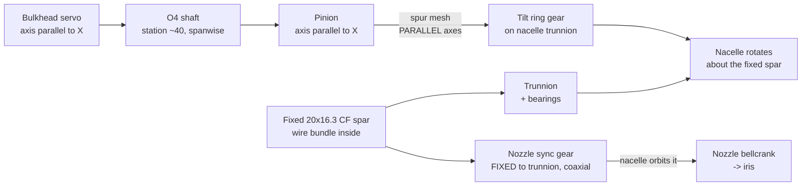
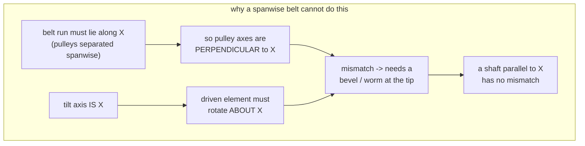

# feat: Nacelle trunnion pivot on the fixed hollow spar + tilt-drive trade study

**Target repo:** Serenity-UAV (this repo)

*"Sure as I know anything, I know this — they will try again."* — Book

---

## Summary

Plan 003 establishes *why* the spar becomes a fixed 20 × 16.3 mm CF tube. This
plan builds the mechanism that hangs off it: how the nacelle pivots about that
fixed spar, how the tilt is driven from a fuselage servo, and how the nozzle
drive survives losing its rotating-spar datum.

It answers the drive question with a trade study, and the answer is not the one
the source conversation assumed. **A spanwise toothed belt cannot drive this
pivot without an added right-angle stage** — a kinematic constraint, not a
packaging preference. A small spanwise shaft with a spur pair at the tip does
the same job with strictly fewer parts, because the shaft is already parallel to
the tilt axis. **Option A (shaft + spur) is recommended.**

Second finding: the drive is bound by **travel, not torque**. A 180° servo
needs a 1.24× step-*up* to reach 145°, and the shaft then carries 0.143 N·m —
against a DS3225 rated 2.402 N·m. The servo is ~17× oversized, which is mass to
recover, not margin to celebrate.

---

## CORRECTION 2026-08-29 — KTD4's shaft station is kinematically impossible

**U3 (the wing-side shaft bore) is BUILT, at station 53.6, not 43.0.**

**SUPERSEDED IN PART 2026-08-29 (owner direction): the stage is a REDUCTION.**
The actuator drives the shaft through **more than one revolution** per 140° of
nacelle, so the ring is the LARGER member. The impossibility recorded below was
real *under the step-up reading* this plan assumed (a limited-rotation servo),
and it is what a reduction dissolves. Built: module 0.8, **14T pinion / 50T
ring**, i = 3.571, shaft 1.389 rev, **C = 25.6 → station 53.6**. The
step-up analysis below is retained as the record of why the original figure
failed — it is still correct about KTD4's C = 15 mm being impossible.

**OQ1 (servo 180° vs 270°) is CLOSED — the question is void.** A multi-turn
output means the actuator is a continuous-rotation gearmotor or stepper closed
on the AK7455, not a limited-rotation servo. That also retires KTD5's "travel is
the binding constraint" finding, and makes the encoder load-bearing for CONTROL
rather than telemetry. **New open item: actuator re-select.**

KTD4 places the drive shaft 15.0 mm from the spar axis. Close this plan's own
inputs on each other and that centre distance returns an impossible gear:

- The tilt ring gear is **concentric with the spar** (KTD3 puts it on the
  trunnion), so its root diameter must clear Ø20 plus a hub wall → PD ≥ ~30 mm.
- The stage is a step-**up** — the nacelle sweeps 145°, more than a servo's
  range — so the pinion is the SMALLER member:
  `PD_ring × 145 = PD_pinion × servo_deg`.
- `C = (PD_ring + PD_pinion) / 2`.

At `C = 15` with a 270° servo this yields **`PD_ring = 10.5 mm` — a ring gear
smaller than the spar it must encircle.** No tooth count fixes it.

| PD_ring | Servo | PD_pinion | C | Wing shaft station |
|---|---|---|---|---|
| 30.0 | 270° | 16.1 | 23.1 | 51.1 |
| **33.8** | **270°** | **18.2** | **26.0** | **54.0 — BUILT** |
| 30.0 | 180° | 24.2 | 27.1 | 55.1 |
| 33.8 | 180° | 27.2 | 30.5 | 58.5 |

C = 26.0 is built because it is also what leaves the AK7455 pocket its 1.80 mm
of chordwise clearance between the spar bore and the shaft bore — the three
dimensions are coupled and none of them is free.

**This escalates OQ1 from advisory to blocking.** The 180° column is not
buildable at the current wing: station 58.5 collides with the root tenon at
58.5 mm. Confirm the servo's real angular range before cutting gears; a 180°
servo forces either a smaller ring gear or a tenon relocation.

**KTD1 (Option A, shaft + spur) is unaffected and stands.** The right-angle
argument that selected it over a belt is about axis orientation, not centre
distance, and remains correct. What changes is only where the shaft sits.

**U2's trunnion, U4's ring gear, U5's nozzle re-datum, and U6 remain OPEN** —
they are nacelle work and were deliberately not touched this pass. Their
interface numbers are consolidated in
[`docs/WING_ATTACH_INTERFACE.md`](../WING_ATTACH_INTERFACE.md) §4.

**RISK-1 (tip congestion) was realised, exactly as predicted.** The wingtip now
hosts the spar bore, the register pad, the AK7455 pocket, the drive-shaft
bushing boss, and the nav-conduit exit. Settling it took three coupled moves —
the shaft's centre distance, `HALL_SENS_R` 11 → 16.8, and the AK7455 conduit
54.0 → 44.5 — and the surviving margins are 2.10 mm on each side of the encoder
pocket. There is no slack left at this station.

**OQ5 (inherited) is resolved:** the trunnion IS concentric with the spar; the
nacelle keeps its canonical station because the pivot moved inside it, so no
tip-rib offset bracket is needed.

---

## Problem Frame

### The kinematic constraint that decides the trade

The tilt axis is the spar axis, which runs **spanwise along hull X**
(`port_tilt_spar_assembly.scad`: `SPAR_X0 = −96` to `SPAR_X1 = 88`, drawn with
`x_cyl`). The servo lives on the fuselage bulkhead, inboard along that same X.

For a belt to carry torque from the fuselage to the wingtip, its two pulleys
must be separated along X, so the belt run is along X. A belt pulley's axis is
perpendicular to its run — so both pulley axes are **perpendicular to X**.

But the driven element at the nacelle must rotate **about X**, because that is
the tilt axis. Perpendicular ≠ parallel: the belt's output axis is at right
angles to the axis it needs to drive.

So any spanwise belt needs a bevel, worm, or equivalent right-angle stage at the
tip. **The belt does not remove gears from this mechanism; it adds a belt in
front of them.** Toothed belts cannot absorb the twist themselves — a quarter-
turn belt drive needs a long centre distance and disengages timing teeth.

A shaft has no such problem. A shaft lying parallel to X and rotating about its
own axis is already parallel to the tilt axis, so a plain **spur** pair at the
tip transfers motion with no direction change.

### Travel, not torque, sizes the drive

The nacelle must sweep −5°…+140° = 145°. A servo has less range than that, so
the tip stage is a **step-up** (driven element larger than driver), which
*divides* torque rather than multiplying it:

| Servo range | Ratio needed | Driven element | Torque at nacelle |
|---|---|---|---|
| 180° | 0.806 | 1.24× the driver | 1.24 × servo |
| 270° | 0.537 | 1.86× the driver | 1.86 × servo |

Against the grounded requirement of 0.177 N·m
(`docs/TILT_SPAR_ANALYSIS.md` §2.1.4 — gravity + inertia; aero remains an
unquantified open item), the shaft carries 0.177 / 1.24 = **0.143 N·m**. The
DS3225's cited 2.402 N·m stall is ~17× that. Torque is not a design driver here.

### What the nozzle drive needs

The Rev T nozzle drive takes its datum from the tilt joint, and the spar crank
that once did so is already recorded as kinematically dead. Losing spar rotation
does **not** break it — it improves the datum. A fixed spar is a true ground
reference: a sync gear bolted to the non-rotating trunnion, with a pinion
orbiting it as the nacelle turns, yields exactly the tilt angle. The tilt ring
and the nozzle sync gear can sit **coaxially** at the same station, one rotating
with the nacelle and one fixed to the spar.

---

## Tilt-Drive Trade Study

Four architectures were evaluated. All assume the fixed 20 × 16.3 CF spar at
station **28** (plan 003 KTD2), the pivot at the nacelle CG `PIVOT_Z` = **116.1**
after the ESC1 relocation (003 KTD7/KTD8), and a bulkhead-mounted servo.

### Option A — Spanwise shaft + spur pair at the tip *(recommended)*

Ø4 mm steel shaft parallel to the spar, running fuselage → wingtip in its own
bore; pinion on the shaft end meshing a ring gear on the nacelle trunnion.

- **Axes:** shaft ∥ X, ring about X → **parallel-axis spur mesh, no direction
  change.**
- **Wind-up:** 0.78° over 190 mm at 0.143 N·m (Ø4 steel, `J` = 25.13 mm⁴,
  `G` = 79 GPa). Ø5 gives 0.32°, Ø3 gives 2.47°.
- **Packaging:** a Ø4.4 bore fits the re-lofted section comfortably aft of the
  spar — at station 43 the tip section is 16.0 mm deep against 6.72 mm needed.
- **Cost:** one shaft, two bearings/bushings per side, two gears.

### Option B — Spanwise belt + right-angle stage at the tip

- Requires a bevel or worm at the wingtip purely to turn the axis — the exact
  congested region that already holds the trunnion, bearing, AK7455 pocket, and
  wire garage.
- Strictly dominated by A: A's single spur pair replaces **both** the belt and
  the bevel. Everything B offers over a bare gear train (compliance, quiet) is
  available in Option D without the right-angle penalty.
- Adds a tensioner, belt creep, and pretension radial load on the trunnion.

### Option C — Concentric torque sleeve over the fixed spar

A thin sleeve rotating on bushings over the fixed spar, keyed to the nacelle.

- **Axis is inherently correct** — no shaft, no right angle, drives the nacelle
  directly. Conceptually the cleanest.
- **Killed by the airfoil.** The sleeve's OD, not the spar's, sets the wing bore:

  | Sleeve OD | Bore | Root `t_scale` | Tip `t_scale` | Tip t/c |
  |---|---|---|---|---|
  | *20.0 (bare spar, baseline)* | *20.4* | *1.456* | *2.190* | *26.6 %* |
  | 24.0 | 24.4 | 1.722 | 2.398 | 29.1 % |
  | 26.0 | 26.4 | 1.851 | 2.578 | **31.3 %** |
  | 28.0 | 28.4 | 1.980 | 2.757 | 33.5 % |

  A realistic sleeve (20 mm spar + bushing + wall ≈ 26 mm) pushes the tip from
  24.8 % to 31.3 % t/c on a section that is *already* the plan's largest risk
  (003 RISK-1/RISK-2).
- Also adds full-span bushing friction directly into the tilt loop.

### Option D — Shaft to the tip, belt for the final stage

Shaft along X as in A, then a short belt in the Y–Z plane at the tip where
**both** pulley axes are X-parallel — the one place a belt is kinematically legal.

- Viable, and buys belt compliance and easy ratio changes at the final stage.
- But needs a shaft *and* pulleys *and* a tensioner in the tip, for no capability
  A lacks. Hold as the fallback if spur backlash proves objectionable on the
  bench.

### Decision matrix

| Criterion | A: shaft+spur | B: belt+bevel | C: sleeve | D: shaft+belt |
|---|---|---|---|---|
| Right-angle stage needed | **no** | yes | **no** | **no** |
| Part count (per side) | **low** | high | **lowest** | medium |
| Airfoil penalty | **none beyond spar** | none | **severe (+6.5 pt t/c)** | **none** |
| Stiffness / backlash | good / gear backlash | fair / two stages | **excellent** | good / compliant |
| Tip congestion | moderate | **severe** | **none** | high |
| Friction into tilt loop | low | low | **high (full-span bushings)** | low |
| Serviceability | good | poor | fair | fair |
| **Verdict** | **selected** | rejected | rejected on airfoil | fallback |

**Selected: Option A.** B is dominated. C is the most elegant kinematically and
would win on a thicker wing, but this wing has no thickness budget left. D stays
as the named fallback.

---

## Requirements

- **R1** — The nacelle rotates about the fixed spar's axis through −5°…+140°
  with the pivot at the nacelle CG, on bearings carried at the nacelle inboard
  face, with no member crossing the r = 25 mm duct.
- **R2** — Tilt is driven from the existing bulkhead servo through a
  parallel-axis drive requiring no right-angle stage.
- **R3** — The drive delivers ≥ 145° of nacelle travel; total drive-train
  compliance under the grounded 0.177 N·m load is ≤ 2° referred to the nacelle.
- **R4** — The nozzle drive takes its datum from the **fixed** trunnion and
  preserves full iris travel across the tilt range, coaxial with the tilt ring.
- **R5** — The trunnion carries nacelle thrust (21.9 N), weight (3.86 N), and
  gear separation loads at the repo's 4 g × 1.5 convention without exceeding the
  bearing rating or the CF-PETG allowables.
- **R6** — Hover ground clearance is preserved: no rotating-assembly geometry
  goes below the plan-002 R12 floor at any tilt angle.
- **R7** — The nacelle is removable from the spar on the bench without
  disturbing the wing, spar clamp, servo indexing, or AK7455 calibration.

---

## Key Technical Decisions

**KTD1 — Option A: spanwise Ø4 mm shaft + parallel-axis spur pair.**
*(session-settled: user-requested trade — chosen over a spanwise belt, which
cannot reach an X-axis pivot without an added right-angle stage.)* Governs R2.

**KTD2 — Step-up at the tip, sized for travel.** Driven ring 1.24× the pinion
(180° servo) or 1.86× (270°). Confirm the servo's real range before freezing
tooth counts. Governs R3.

**KTD3 — The tilt ring and the nozzle sync gear are coaxial at the trunnion,
one rotating and one fixed.** This is what a fixed spar buys: a genuine ground
reference at the joint. Governs R4.

**KTD4 — Shaft bore at station 43.** *(revised 2026-08-29 — station 40 no
longer fits.)* With the spar at station **28** (plan 003 KTD2 revised), the
Ø20.4 spar occupies 17.8–38.2 and a Ø4.4 shaft at station 40 would occupy
37.8–42.2 — **an 0.4 mm overlap**. Minimum clear station is
`38.2 + 1.16 wall + 2.2 = 41.6`; use **43**, where the re-lofted tip section is
16.0 mm deep against 6.72 mm needed and the AK7455 SPI conduit at 54 stays
clear. Governs R2.

**KTD5 — Re-open the servo selection.** At 0.143 N·m the DS3225 is ~17×
oversized. Carry a down-select as explicit follow-up mass recovery, not a silent
carry-forward. Governs R3.

---

## High-Level Technical Design





---

## Implementation Units

### U1. Freeze the drive kinematics

**Goal:** Turn the trade study into committed tooth counts, ratios, and a
compliance budget.

**Dependencies:** none (parallel with plan 003 U1)
**Files:** `tools/tilt_drive_sizing.py` (new), `docs/NOZZLE_DRIVE_TRADE.md`

**Approach:** Build a tool that takes servo range, target travel, module, and
shaft diameter, and reports tooth counts, achieved travel, torque at the
nacelle, shaft wind-up, and gear-mesh centre distance. Record the Option A/B/C/D
comparison in `NOZZLE_DRIVE_TRADE.md` alongside the existing nozzle trade so the
two drives are documented together.

**Acceptance criteria:**
- [ ] Tool reports ≥ 145° achieved travel for the selected tooth pair.
- [ ] Total compliance (shaft wind-up + gear backlash allowance) ≤ 2° at the
      nacelle under 0.177 N·m.
- [ ] Trade study, including the rejected options and *why*, is written down.

**Verification:** Tool runs clean under `/usr/bin/python3`; numbers reproduce
the table in this plan.

**Scope:** S (1–2 files)

---

### U2. Trunnion and bearing stack

**Goal:** Carry the nacelle on the fixed spar with the pivot at the CG.

**Dependencies:** U1, plan 003 U3
**Files:** `airframe/openscad/wings/wingtip_trunnion.scad`,
`airframe/openscad/nacelles/nacelle_pod_50mm_tandem.scad`

**Approach:** Trunnion boss on the fixed spar at the wingtip; bearing pair
(radial + thrust duty) seated in the nacelle trunnion ring at ring-plane
X ≈ 28 mm, OD within the measured 53.4 mm envelope. Thrust load acts **along**
the spar axis in cruise and **across** it in hover, so the stack must take both;
do not assume a pure radial bearing.

**Acceptance criteria:**
- [ ] Bearing stack reacts 21.9 N axial and 21.9 N radial (thrust in either
      attitude) at 4 g × 1.5 without exceeding rating.
- [ ] Ring OD ≤ 53.4 mm; ring plane holds ≥ 1 mm to the r = 25 mm duct.
- [ ] Nacelle slides off the spar on the bench with the wing installed.

**Verification:** FreeCAD sweep at −5°, 0°, 45°, 90°, 140° with zero solid
overlap; bearing load check recorded against the datasheet rating.

**Scope:** M (3–5 files)

---

### U3. Drive shaft, bores, and bearings

**Goal:** Get torque from the bulkhead to the wingtip on a parallel axis.

**Dependencies:** U1, plan 003 U2
**Files:** `airframe/openscad/wings/wings_s1223_revo.scad`,
`airframe/openscad/drive/tilt_shaft_drive.scad` (new)

**Approach:** Ø4.4 bore at station **43** (KTD4), spanwise, parallel to the spar.
Support bushings at the root rib and tip rib. Servo coupling at the bulkhead.
Check against the spar bore, the AK7455 conduit at station 44.5, and the belt-free
section — the wing now carries three spanwise bores and they must not intersect.

**Acceptance criteria:**
- [ ] Shaft bore clears the spar bore and SPI conduit with ≥ 1.16 mm between
      any pair.
- [ ] Shaft wind-up ≤ 1° at 0.143 N·m over the installed length.
- [ ] Shaft is removable without splitting the wing.

**Verification:** `tools/wing_internal_clearance.py` clean with all three bores
present; wing STL watertight.

**Scope:** M (3–5 files)

---

### Checkpoint: Pivot and drive path

- [ ] `tools/validate_stls.py`, `wing_internal_clearance.py`,
      `wing_airfoil_integrity.py` all green.
- [ ] Nacelle rotates 145° in FreeCAD with no interference and no duct
      penetration.
- [ ] Review with owner before committing the nozzle re-datum.

---

### U4. Tilt ring gear and pinion

**Goal:** The step-up stage that converts servo travel into 145° of nacelle tilt.

**Dependencies:** U2, U3
**Files:** `airframe/openscad/drive/tilt_shaft_drive.scad`,
`airframe/openscad/nacelles/nacelle_pod_50mm_tandem.scad`

**Approach:** Ring gear integrated with the U2 trunnion ring (the pitch diameter
need not equal the bearing OD); pinion on the shaft end. Sector ring is
acceptable — the nacelle only sweeps 145°, so a full 360° ring is wasted
material and print time. Keep the mesh outside r = 25 mm.

**Acceptance criteria:**
- [ ] Achieved travel ≥ 145° with end-stops inside the sector.
- [ ] Mesh maintained at every tilt angle; no tooth leaves engagement.
- [ ] No gear geometry crosses r = 25 mm.

**Verification:** Kinematic sweep; tooth-contact check at both end stops.

**Scope:** M (3–5 files)

---

### U5. Nozzle drive re-datum onto the fixed trunnion

**Goal:** Restore iris actuation using the fixed spar as the ground reference.

**Dependencies:** U4
**Files:** `airframe/openscad/nacelles/nacelle_nozzle_pushrod.scad`,
`airframe/openscad/port_tilt_spar_assembly.scad`, `docs/NOZZLE_DRIVE_TRADE.md`

**Approach:** Mount the sync gear to the **fixed** trunnion, coaxial with and
inboard of the tilt ring (KTD3). The nacelle-mounted pinion orbits it, so its
rotation is exactly the tilt angle — the mapping the Rev T design already
assumes. Delete the spar crank. Re-check bellcrank geometry at the new ring
diameter.

**Acceptance criteria:**
- [ ] Iris reaches both end stops across −5°…+140°, no over-travel.
- [ ] Nozzle-area-vs-tilt curve matches the Rev T mapping within its documented
      tolerance.
- [ ] Sync gear and tilt ring are coaxial and do not interfere.

**Verification:** Regenerate the area-vs-tilt curve; compare against Rev T.

**Scope:** M (3–5 files)

---

### U6. Integration, loads, and closeout

**Goal:** Prove the assembly and update the record.

**Dependencies:** U2–U5
**Files:** `airframe/FreeCAD-scripts/serenity_assembly.py`,
`current-specification/bom_revS.csv`, `REFERENCES.md`,
`airframe/wings-nacelles/WBS.md`, `PROJECT_INDEX.md`

**Approach:** Wire the trunnion, shaft, gears, and bearings into the FreeCAD
assembly with the tilt function. Re-run the plan-002 R12 clearance check with
final geometry. Re-derive mass/CG including the drive train. Update BOM (shaft,
bearings, gears in; belt/pulleys never entered). Add `REFERENCES.md` entries for
the bearing and gear stock. Run the servo down-select from KTD5.

**Acceptance criteria:**
- [ ] Full gate suite green.
- [ ] R12 hover clearance re-verified with as-built geometry and a stated margin.
- [ ] Mass/CG re-derived; hover T/W ≥ 1.2.
- [ ] Every new part has a real supplier line; no placeholder masses.

**Verification:** Gate suite; FreeCAD assembly renders at all five tilt stations.

**Scope:** L (5–8 files)

---

### Checkpoint: Complete

- [ ] All acceptance criteria met across U1–U6.
- [ ] Hover clearance and duct-clearance both re-verified on final geometry.
- [ ] Owner review before fabrication.

---

## Risks & Dependencies

- **RISK-1 (high) — tip congestion.** The wingtip now hosts the trunnion,
  bearings, spar clamp, AK7455 pocket, wire garage, shaft bushing, and gear
  mesh. This is the densest region on the airframe and the most likely source of
  a late interference discovery. Mitigation: U2/U3/U4 each carry an explicit
  clearance gate; the checkpoint after U3 exists for this.
- **RISK-2 (medium) — gear backlash in the tilt loop.** A spur pair has
  backlash the belt would not. The AK7455 closes the loop on true nacelle angle,
  so backlash shows as hysteresis rather than error — acceptable, but must be
  characterised on the bench. Fallback is Option D.
- **RISK-3 (medium) — printed gear tolerance.** CF-PETG spur teeth at small
  module are at the edge of FDM capability. Mitigation: prefer the largest module
  the envelope allows; consider a COTS metal pinion.
- **RISK-4 (medium) — thrust bearing duty is attitude-dependent.** Nacelle
  thrust is axial to the spar in cruise and transverse in hover. A stack chosen
  for one attitude will be wrong for the other.
- **DEP-1** — Inherits every open dependency from plan 003, notably the
  unverified CF allowable and the aero revalidation of the re-lofted section.
- **DEP-2** — Blocked behind plan 003 U2 (wing re-loft) for the shaft bore, and
  002 U3/U4 for the trunnion.

---

## Open Questions

- **OQ1** — Servo angular range (180° vs 270°). Sets tooth counts. Same
  question as plan 003 OQ3 — answer once, use in both.
- **OQ2** — Gear module and material: printed CF-PETG vs COTS metal pinion
  against a printed sector.
- **OQ3** — Bearing selection for the combined axial/radial duty at the trunnion
  (RISK-4).
- **OQ4** — Does the servo down-select (KTD5) change the bulkhead mount, and is
  the recovered mass worth the re-work? Quantify in U6.
- **OQ5 (inherited, blocking)** — Plan 003's OQ5: whether the nacelle accepts
  the −32.5 mm canonical offset, or the tilt axis is decoupled from the spar
  axis on a tip-rib bracket. **This changes U2's trunnion geometry** — if
  decoupled, the trunnion is not concentric with the spar and the shaft/gear
  centre distance changes with it.

---

## Verification Contract

```text
/usr/bin/python3 tools/tilt_drive_sizing.py          # new, U1
/usr/bin/python3 tools/validate_stls.py
/usr/bin/python3 tools/wing_internal_clearance.py
/usr/bin/python3 tools/wing_airfoil_integrity.py
/usr/bin/python3 tools/wing_spar_carrythrough.py
/usr/bin/python3 tools/landing_gear_wing_clearance.py --proud
/usr/bin/python3 tools/precommit_index.py --check
```

Not automatable: FreeCAD sweep at −5°, 0°, 45°, 90°, 140° confirming no
interference, no duct penetration, maintained gear mesh, full iris travel, and
hover ground clearance with a stated margin.

---

## Definition of Done

1. The nacelle rotates ≥ 145° about the fixed spar, pivot at the CG, with no
   member crossing the duct.
2. Tilt is driven from the bulkhead servo through a parallel-axis shaft and spur
   pair, with ≤ 2° total compliance at the nacelle.
3. The nozzle iris reaches both end stops across the full tilt range from a
   trunnion-fixed datum.
4. Hover ground clearance re-verified on final geometry with a stated positive
   margin (plan 003 R12 / LG-HOVER-01).
5. Nacelle removable on the bench without disturbing wing, clamp, or encoder
   calibration.
6. Gate suite green; mass/CG/T-W re-derived; BOM, WBS, `REFERENCES.md`, and
   `PROJECT_INDEX.md` updated; the servo down-select decided either way.

---

## Sources & Research

- `docs/plans/2026-08-29-003-feat-unified-20mm-spar-trunnion-belt-drive-plan.md`
  — parent plan; spar sizing, station, pivot, and R12 clearance floor.
- `docs/Tilt-Rotor 10AWG Wire Clearance Analysis.md` — source conversation. Its
  four drive proposals are evaluated here; the belt recommendation is rejected on
  the kinematic ground it did not consider, and its "concentric torque sleeve"
  is rejected on airfoil cost.
- `docs/TILT_SPAR_ANALYSIS.md` §2.1.4 — the 0.177 N·m grounded torque
  requirement (aero term still unquantified).
- `docs/NOZZLE_DRIVE_TRADE.md`, `airframe/wings-nacelles/WBS.md` §1.1.3.2 —
  existing nozzle drive and the retired gear train.
- `airframe/openscad/port_tilt_spar_assembly.scad` — spar axis orientation
  (`x_cyl`, `SPAR_X0/X1`), the basis of the right-angle finding.
- Shaft wind-up, sleeve-vs-airfoil, and section-depth figures computed
  2026-08-29 against the current SCAD via `tools/wing_spar_station_fit.py`.

---

*Analysis and plan drafted by Claude (Claude Sonnet 5, Anthropic) under the
author's direction, 2026-08-29, per `AGENTS.md` AI attribution.*
