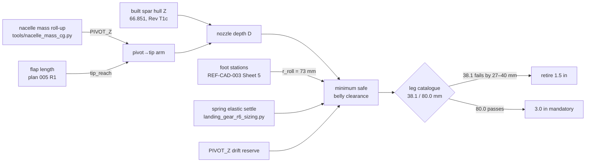

# fix: Minimum safe landing-gear leg length

**Target repo:** Serenity-UAV (this repo)

**AI note:** Analysis, tooling and plan authored by Claude (model: Claude Opus 5,
Anthropic) under the author's direction, 2026-09-06, per `AGENTS.md` §3.

*"Ain't no sin to land hard. Sin's landing hard on the part that costs you the ship." — Skipper*

---

## Summary

The active landing gear does not clear the nozzle stack on a vertical landing,
and every attempt so far to close the gap has been a **static** clearance number
compared against zero. This plan replaces that with a derived **minimum safe
belly clearance** — attitude, stroke, drift reserve and tolerance included — and
evaluates each alternative to lengthening the legs against its own cost.

The answer is decided by a number nobody had put in the budget: **each nozzle
sits ~73 mm outboard of the foot track**, so every degree of touchdown roll
costs 1.30 mm of nozzle clearance, and the whole reserve is spent before the
aircraft has stopped moving.

**Recommendation: make the 3.0 in (80.0 mm) gear the mandatory flight article,
retire the 1.5 in variant from the flight configuration, and adopt plan 005 R1's
30 mm flaps to buy back the attitude budget.** Both parts already exist. Neither
is a new design.

| flap length | attitude case | minimum safe belly clearance | 3.0 in surplus |
|---|---|---:|---:|
| 40 mm (as built) | 5° | 74.41 mm (2.93 in) | +5.45 mm |
| 40 mm (as built) | 8° | 78.35 mm (3.08 in) | +1.44 mm |
| **30 mm (plan 005 R1)** | **5°** | **65.46 mm (2.58 in)** | **+14.37 mm** |
| 30 mm (plan 005 R1) | 8° | 69.41 mm (2.73 in) | +10.30 mm |

Generated by the new gate `tools/landing_gear_ground_clearance.py`. The 1.5 in
gear is below the minimum by 27–40 mm in every case and cannot be rescued by any
lever on the table.

---

## Problem Frame

`tools/nacelle_mass_cg.py` is the authority for `PIVOT_Z` and for hover
clearance, and it currently reports a strike:

```text
PIVOT_Z = 107.4 mm; nozzle tip at hull Z −47.00 against a −38.1 ground plane
  vs 1.5 in gear (ACTIVE default)   −8.90 mm  *** STRIKES ***
  vs 3.0 in gear (kept, not wired in)  +33.00 mm  CLEARS
```

`airframe/FreeCAD-scripts/serenity_assembly.py` L505-518 wires the 1.5 in gear
in as the active default. **The nozzle hits the ground on every vertical takeoff
and landing.**

Three things make this more than an arithmetic fix.

**1. The number that failed has failed four times.** `PIVOT_Z` has been 111.5 →
105.8 → 113.8 → 107.5, each move a correction to the mass roll-up rather than a
design change: the pod turned out solid at 285 g, then was hollowed
forward-biased, then the ESCs were sited where they physically fit (Z 104)
instead of where plan 003 KTD8 assumed (Z 150.6). The arm from pivot to nozzle
tip moves one-for-one with it. **A leg length chosen against today's `PIVOT_Z`
with no reserve will be wrong again.**

**2. Every clearance decision so far has been static.** Plan 005 R3's
owner-accepted "+9.8 mm" and its replacement "+6.41 mm" and the current
"+0.07 mm at 30 mm flaps" are all *nacelles vertical, level ground, nothing
moving*. A landing is not that. The hull settles into the gear, the aircraft
arrives with attitude, and the ground is not flat.

**3. The nozzle is outboard of the gear.** This is the finding that decides the
plan and it is not recorded anywhere in the repo. Nozzle ground projections in
hover are hull (47.0, 43.4) port and (−385.1, 37.4) starboard; the foot track
runs X −21.6…−30.4 port and −309.4…−318.2 starboard. Each nozzle is **~73 mm
outboard of its own foot line** and **inside the wheelbase** (feet at Y −31.8 and
+137.5). So:

* **pitch never costs nozzle clearance** — both nozzles are on the uphill side
  of either the fore or the aft foot line;
* **a ground slope with all four feet planted costs nothing** — the feet define
  the plane and the airframe is rigid;
* **roll is the entire attitude penalty**, at 1.30 mm per degree, and it applies
  whether the source is touchdown attitude, one foot in a hollow, or a
  cross-slope taken on two feet.

---

## Requirements

- **R1** — A **minimum safe belly clearance** is derived, not asserted, from a
  named budget: static nozzle depth, touchdown attitude, energy-absorption
  stroke, `PIVOT_Z` drift reserve, and build tolerance. Each term is separately
  visible and separately arguable.
- **R2** — The derivation is executable and gated. A tool re-derives it from the
  live mass roll-up and exits non-zero when the gear variant wired into
  `serenity_assembly.py` is below the minimum.
- **R3** — The chosen leg tolerates a stated amount of further `PIVOT_Z`
  movement without re-opening the decision. The stated amount is ≥ 8.0 mm, the
  observed historical swing.
- **R4** — The load path is re-derived at the **as-built** lever, and the bay-bolt
  bearing FOS is reported against the repo's 4.0 impact target.
- **R5** — The mass and CG consequence of the chosen leg is quoted in real
  numbers and fed back through hover T/W against the 1.2 floor.
- **R6** — Tip-over/static stability is re-checked: track and wheelbase against
  the raised CG, and the rear-skid tip-back backstop against the raised belly.
- **R7** — Every alternative to lengthening the legs is evaluated with its own
  cost and an explicit accept/reject, including the ones already deferred
  (KD5 stator compression, aft ballast, tilt limiting).
- **R8** — Stale records that contradict the as-built state are corrected, not
  left standing. Named in "Contradictions Found" below.

---

## Key Technical Decisions

**KTD1 — The 3.0 in (80.0 mm) gear becomes the mandatory flight article; the
1.5 in variant is retired from the flight configuration.** It is the only
catalogue leg at or above the minimum, it already exists, it is already
rendered and baked, and it clears by 33 mm statically today with no other change
at all. Governs R1, R3.

**KTD2 — Leg length is a free variable; the crash dynamics are not a function of
it.** Since the 2026-08-09 LG-10.2 hip recess and the canonical-foot-spread
correction, **both variants run the same hip→foot arm `R_H_BUILT = 80 mm`**
(`tools/landing_gear_r6_sizing.py`). Plateau force 609.5 N, hull settle 30.7 mm,
peak deceleration 39.7/79.4 g, hip moment 48.8 N·m and every bay-bolt load are
**identical** in both variants and in any intermediate length built the same
way. Lengthening the leg costs printed leg-frame mass and nothing else. Governs
R4, R7.

> This directly contradicts `docs/LANDING_GEAR_ANALYSIS.md` §0/§4.7, which still
> tabulates R_h 41.9 vs 65.0 and 81/162 g vs 52/104 g. Those tables are **stale
> by four weeks** — see "Contradictions Found".

**KTD3 — The attitude case for nozzle clearance is separate from the gear's
structural attitude case, and smaller.** `docs/LANDING_GEAR_ANALYSIS.md` §1
requirement 2 sizes the *structure* to ±15° of lateral landing. ±15° costs
19.6 mm of nozzle clearance and **no leg in the family can pay it** — the 3.0 in
gear is 8.1 mm short at 15°. These are two different requirements on one event:
the gear must **survive** ±15°; the nozzle must not be **struck** at the attitude
the flight-control system is permitted to touch down at. This plan sizes to **5°
recommended (10.3–14.4 mm of surplus at 30 mm flaps)** and reports the whole
curve to 15°. **The 5° figure is a project assumption pending owner confirmation
and standards vetting — LG-27.** Governs R1, R7.

**KTD4 — A full ductile-fuse arrest is allowed to strike the nozzle.** Clearing
the 30.7 mm ductile stroke as well needs 86.2 mm (3.39 in) at 30 mm flaps —
beyond the catalogue. That case is a 4 ft free drop with the sacrificial wires
fired and scrap; the flaps are printed, cheap, and already the designated
sacrificial element. Sizing the leg to a crash the gear is explicitly allowed to
be destroyed by is the wrong trade. **Recorded as an owner decision, LG-28.**
Governs R1.

**KTD5 — Adopt plan 005 R1's 30 mm flaps as part of this fix, not instead of
it.** 40 mm flaps put the minimum at 74.41 mm (5°) / 78.35 mm (8°) — the 3.0 in
gear passes, but with only 1.4 mm left at 8° of roll. 30 mm flaps move the
minimum to 65.46 / 69.41 and restore a usable attitude budget out past 10°. The
two changes are complementary: the gear supplies the clearance, the flap trim
supplies the margin. Governs R1, R7.

---

## High-Level Technical Design

### The clearance budget

```text
belly clearance C  (ground plane at hull Z = −C)
        │
        ├── nozzle depth D below the belly datum      47.00 mm @ 40 mm flap
        │       = (pivot→tip arm) − (spar hull Z)      38.05 mm @ 30 mm flap
        │       arm = tip_reach(flap) − PIVOT_Z         ← moves 1:1 with PIVOT_Z
        │
        ├── attitude penalty   r_roll · sin θ         1.30 mm per degree
        │       r_roll = 73 mm (nozzle outboard of the foot track)
        │
        └── reserve that must SURVIVE at first contact        21.03 mm
                ├── hull settle at the spring elastic limit    10.03 mm
                │      (3.51 J/leg at 350 N/leg, R_h 80)
                ├── PIVOT_Z drift reserve                       8.00 mm
                │      (observed swing 111.5 / 105.8 / 113.8 / 107.5)
                └── build + TPU tread compression               3.00 mm
```

### The attitude model

Exact rigid-body, not an allowance. For a ground plane tilted `θ` with downhill
azimuth `ψ`, the unit normal is `n = (−sinθ·cosψ, −sinθ·sinψ, cosθ)`; the
airframe rests on whichever foot minimises `p·n`; every other point's clearance
is `(p − p_contact)·n`. The tool sweeps `ψ` over the full circle rather than
assuming which way the aircraft leans — which is how the "pitch is free, roll is
everything" asymmetry was found rather than guessed.



---

## Alternatives Considered

Each row carries its own cost, and the rejection reason is the cost, not the
outcome.

| # | Alternative | What it buys | Its own cost | Verdict |
|---|---|---:|---|---|
| A1 | **3.0 in gear mandatory** | +41.9 mm clearance | +67 g gear mass (503 vs 436 g); T/W −0.021; CG height +41.9 mm; forfeits the compact stance | **ADOPTED (KTD1)** |
| A2 | **Nozzle flaps 40 → 30 mm** (plan 005 R1) | +8.95 mm | Nozzle swing arc grows; linkage re-solve (plan 005 R2); already owner-settled as KD1 | **ADOPTED alongside A1 (KTD5)** |
| A3 | Flaps 40 → 20 mm | +17.98 mm | Doubles the swing arc to 3.58–25.94°; plan 005 KD1 already chose 30 over 20 | Rejected — owner-settled upstream |
| A4 | **KD5 stator / inter-stage compression** | ~7 mm | Needs an aero justification for a shortened stator — a different investigation, not a geometry edit. Would still leave the 1.5 in gear 20+ mm short | **Deferred, not needed.** Keep as reserve if the attitude case is later raised above 10° |
| A5 | **Aft ballast to move `PIVOT_Z`** | 4 mm per 17.7 g per nacelle | Closing the 1.5 in gap needs ~36.5 mm → **~161 g per nacelle, 323 g total**, ~10% of AUW, straight off T/W that is already at 1.19 against a 1.2 floor | **Rejected — absurd exchange rate** |
| A6 | **An intermediate leg length (1.5–3.0 in)** | The question the brief asked | The minimum lands at **2.58–3.08 in** depending on flap and attitude case. A 2.75 in leg saves ≈16 g total and spends the entire attitude reserve. There is no useful length below 3.0 in | **Rejected — the interval exists but is empty of value** |
| A7 | **Limit nacelle tilt near the ground** (control law) | Tip rises as tilt leaves 90° | To recover 36.5 mm the tilt must come off 90° far enough that vertical thrust cannot support the aircraft. This airframe has TPU skid feet and no wheels — it cannot make a rolling landing. `docs/TILT_DRIVE_CONTROL_SPEC.md` §4 already spans −5…+140°, and 90° is where hover lives | **Rejected — physically unavailable** |
| A8 | **Bound touchdown roll in the control law** | Cheap margin | Not a substitute for clearance, but it is what makes the 5° case honest. Requires a declared attitude limit and a go-around trigger. Pairs with A1 | **Adopted as a requirement on the FCS, LG-27** |
| A9 | Raise the pivot by moving the spar station | ~7.2 mm per plan 003 KTD2 | The spar is **built** at hull Z 66.851 (Rev T1c). Moving it re-opens the wing airfoil, the root joint and the nacelle offset — and another session owns that geometry | **Rejected — out of scope, high blast radius** |
| A10 | Shorten the nozzle housing / throat | unquantified | Owned by the nacelle session actively editing `airframe/openscad/nacelles/`. This plan must not touch it | **Out of scope by direction** |

---

## Load Path — Re-derived, Not Quoted

**The brief's premise is out of date, and this is the single most important
correction in this plan.** The brief states that the 1.5 in legs "run hotter
(81/162 g) than the 3.0 in (52/104 g) at the same wire size", citing
`docs/LANDING_GEAR_ANALYSIS.md` §4.7. Re-derived from
`tools/landing_gear_r6_sizing.py` as it stands today:

| Quantity | 1.5 in | 3.0 in | Note |
|---|---:|---:|---|
| Hip→foot arm `R_H` | **80.0 mm** | **80.0 mm** | shared since 2026-08-09 |
| Plateau ground force `F_leg` | 609.5 N (137.0 lbf) | 609.5 N | identical |
| Hull settle | 30.7 mm | 30.7 mm | identical |
| Residual clearance after settle | **7.4 mm** | 49.3 mm | *only* difference |
| Peak decel, tail-down / level | 39.7 / 79.4 g | 39.7 / 79.4 g | identical |
| Hip moment `M = 2·P·r` | 48.8 N·m | 48.8 N·m | `R_H`-independent |
| Thigh section σ | 25.3 MPa (allow 27.5) | same | margin 1.09× |
| Hip pin double shear | 7.0× | 7.0× | same |
| Bay boss bearing vs wire P | 1.55× | 1.55× | same |
| Lateral ±15° into the hip pin | 163 N/leg | 163 N/leg | same |

**Longer legs do not raise the bending moment at the bay bolts.** The hip moment
is `2·P·r` — wire collapse force times the 6 mm bellcrank radius — and carries no
`R_H` term at all. The leg is a lever between the foot and the wires, and both
variants now run the same lever. The 81/162 vs 52/104 split in the published
table was true before 2026-08-09 and has been wrong since.

**FOS against the 4.0 impact target (`lg02_bay_attachment()`):**

| Load path | Capacity | Demand | FOS | Verdict |
|---|---:|---:|---:|---|
| M3 A2-70 bolt tension | 3,521 N | 359 N | 9.8 | OK |
| M3 A2-70 bolt shear | 2,113 N | 152 N | 13.9 | OK |
| Bolt-hole bearing, bare 2 mm wall | 420 N | 390 N | **1.08** | **FAILS 4.0** |
| Bolt-hole bearing, + 5 mm boss | 1,470 N | 390 N | **3.77** | **FAILS 4.0** |
| Bolt-hole bearing, + boss + 3 mm backing plate | 2,100 N | 390 N | **5.39** | OK |
| Net-section tension (K_t = 3.0) | 27.5 MPa | 4.0 MPa | 6.9 | OK |
| Head pull-through | 3,629 N | 359 N | 10.1 | OK |

**The backing plate is REQUIRED, not optional** — at the same demand in both
variants. `airframe/landing-gear/TODO.md` currently records LG-02 as "optional at
4 ft; FOS 4.56 unaided", which the tool contradicts (3.77). Corrected by U4.

---

## Mass, CG and T/W Consequence

| | 1.5 in | 3.0 in | Δ |
|---|---:|---:|---:|
| Printed (leg + bay + foot) | 310 g | 378 g | +68 g |
| Wires (4 ft schedule) | 36 g | 36 g | 0 |
| Pins / bolts | 34 g | 34 g | 0 |
| **System** | **≈436 g (0.961 lbm)** | **≈503 g (1.109 lbm)** | **+67 g (0.148 lbm)** |

The delta is entirely printed leg-frame length: bay, foot, wires and fasteners
are bit-identical shared parts. It is symmetric fore/aft and does not move the
X/Y CG; it raises the vertical CG, and the belly rides 41.9 mm higher.

**Hover T/W.** Thrust 2 × 2,232 gf = 4,464 gf (43.78 N / 9.84 lbf).
`docs/plans/2026-08-30-001` records hover T/W at **~1.19 against a stated 1.2
minimum** — already below the floor before this change. +67 g takes it to
**≈1.169, a further 0.021 down.** This plan does not close that gap and must not
pretend to: it is the weight-reduction plan's subject, and A1's cost is real.
What this plan asserts is only that **a nozzle that strikes the ground on every
landing is not tradeable against 2% of T/W.**

---

## Risks & Dependencies

- **RISK-1 (high) — the AUW ledger is internally inconsistent, and the wire
  schedule inherits it.** `docs/LANDING_GEAR_ANALYSIS.md` §2.1 sizes the gear at
  a 3,130 g design AUW; a hover T/W of 1.19 against 4,464 gf of thrust implies
  ≈3,751 g. Wire diameter scales as AUW^⅓, so the schedule is ≈6.4% light against
  the implied mass. This is LG-15's existing re-check, but the magnitude was not
  recorded. **Do not procure wire until the AUW ledger is reconciled.**
- **RISK-2 (medium) — the aircraft hovers deep in ground effect and the exit is
  close to the deck.** At the 3.0 in gear with 30 mm flaps the nozzle exit sits
  ≈42 mm above the ground — **less than one duct diameter (50 mm)**. Exhaust
  impingement, recirculation and FOD lofting into an intake that is only ~174 mm
  higher are all plausible and none is quantified. No number is invented here.
  Tracked as **LG-30**; needs CFD or a bench hover.
- **RISK-3 (medium) — tip-over and the skid backstop both move with the leg.**
  Track 288 mm and wheelbase 170 mm are unchanged, but the vertical CG rises
  41.9 mm and so does the rear-skid tip-back backstop. The aft-heavy stance puts
  the CG only 23.5 mm forward of the aft foot line (86% of wheelbase), and the
  published "≈12° to skid contact" was computed at the shorter leg. **The
  aircraft's vertical CG station is not recorded anywhere in the repo**, so this
  cannot be closed here. Tracked as **LG-29**.
- **RISK-4 (medium) — `PIVOT_Z` moves again.** The 8.0 mm reserve is sized from
  the observed swing, not from a bound. If the ESC bay thermal work, the
  unmeasured `MOTOR_BOLT_R`, or the window structural allowance (all open in
  `airframe/wings-nacelles/WBS.md` §1.1.3.8) move mass, re-run the gate.
- **DEP-1** — Plan 005 R1 (30 mm flaps) is not yet implemented. This plan's
  recommended margin assumes it; the recommendation itself (KTD1) does not.
- **DEP-2** — `airframe/openscad/nacelles/` is owned by another active session.
  Nothing in this plan edits nacelle, ESC, trunnion or pod geometry.
- **DEP-3** — The 5° attitude case has **no standards citation**. `REFERENCES.md`
  carries no sink-rate or ground-slope reference, and REF-FAA-004 (14 CFR Part
  23, adopted engineering baseline) has no verified section for limit descent
  velocity or landing attitude in the applied-sections table. Per `AGENTS.md` §4
  no section number is asserted. **LG-27** owns the vetting.

---

## Contradictions Found

Recorded because `AGENTS.md` §11.4 puts as-built state above stale documentation.

1. **`docs/LANDING_GEAR_ANALYSIS.md` §0 and §4.7 are four weeks stale.** They
   tabulate R_h 41.9 / 65.0, F_leg 1,241 / 800 N, settle 22.6 / 35.1 mm, residual
   15.5 / 44.9 mm and peak decel 81/162 vs 52/104 g. The as-built tool reports
   R_h 80.0 for **both**, F_leg 609.5 N, settle 30.7 mm, residual **7.4** / 49.3
   mm and 39.7/79.4 g for both. Fixed by U3.
2. **`docs/LANDING_GEAR_ANALYSIS.md` §1 requirement 1 and §4.4 present LG-17 as
   open ("Decision open: LG-17", "6 ft baseline")** while §15 and
   `airframe/landing-gear/WBS.md` record it **CLOSED 2026-08-09, 4 ft adopted**.
   This is the standing "never leave a `[ ]` whose own text says resolved" rule.
   Fixed by U3.
3. **`airframe/landing-gear/TODO.md` records LG-02 as "optional at 4 ft; FOS 4.56
   unaided".** `lg02_bay_attachment()` reports FOS **3.77** for the unaided boss
   and prints `=> backing plate REQUIRED`. Fixed by U4.
4. **`airframe/FreeCAD-scripts/serenity_assembly.py` L353 still carries
   `PIVOT_Z = 111.5`** with a 2026-07-19 derivation comment, against the SCAD's
   107.5 and the measured 107.45. Not fixed here — the file is nacelle-adjacent
   and another session owns that geometry; recorded for that session (U7 raises
   it, does not edit it).
5. **The brief's own figures.** "Nozzle tip at hull Z −40.7" — the tool reports
   **−47.00** (−40.7 would give −2.6 mm, not the −8.90 the brief also quotes).
   And "the 1.5 in legs run hotter (81/162 g)" is the stale §4.7 table, not the
   as-built lever. Both corrected above.
6. **AUW ledger inconsistency** — RISK-1.

---

## Implementation Units

### U1. Ground-clearance gate tool

**Goal:** an executable, gated derivation of the minimum safe belly clearance
that reads `PIVOT_Z` from the live mass roll-up rather than a copied constant.

**Requirements:** R1, R2, R3.
**Dependencies:** none.
**Files:** `tools/landing_gear_ground_clearance.py` *(new — DONE in this plan's
authoring pass; listed as a unit so it carries its own verification)*.

**Approach:**

1. Import `nacelle_mass_cg` and `landing_gear_r6_sizing` rather than duplicating
   their constants; assert `R_H_BUILT == 80.0` on import so a future re-coupling
   of the lever to leg length fails loudly instead of silently invalidating KTD2.
2. Model touchdown attitude exactly (plane normal, first-contact foot, full
   azimuth sweep) rather than as a lumped allowance.
3. Solve the minimum by bisection on the belly clearance — monotonic, and it
   avoids assuming which foot and azimuth govern.
4. Exit non-zero when the variant named `ACTIVE_VARIANT` is below the minimum.

**Patterns to follow:** `tools/landing_gear_r6_sizing.py` (module docstring
carrying the derivation and its provenance; named constants with the reason
beside them), `tools/nacelle_mass_cg.py` (non-zero exit as the gate).

**Test scenarios:**
- Runs clean under `/usr/bin/python3` with no `.venv` (repo standing constraint).
- At `--flap 40 --attitude 0` the static clearance reproduces
  `nacelle_mass_cg.py` exactly: −8.90 mm (1.5 in) and +33.00 mm (3.0 in).
- At `--attitude 0` the worst azimuth is arbitrary and the result is
  azimuth-independent (sanity: the sweep collapses).
- Pitch-only azimuths (ψ = 90°, 270°) never reduce clearance below the static
  value — the "pitch is free" claim is a computed result, not a comment.
- `--attitude 15` on the 3.0 in gear returns a negative surplus (−8.14 mm), the
  number KTD3 rests on.
- Exit status is 2 while `ACTIVE_VARIANT` is the 1.5 in gear, and 0 once U2
  switches it.

**Verification:** `/usr/bin/python3 tools/landing_gear_ground_clearance.py`
prints the budget, the catalogue and the sensitivity table, and its exit status
tracks the active variant.

---

### U2. Make the 3.0 in gear the active flight article

**Goal:** the assembly, the gate and the documentation all name one gear.

**Requirements:** R1, R3.
**Dependencies:** U1.
**Files:**
- `airframe/FreeCAD-scripts/serenity_assembly.py` (L505-518 gear selection and
  its comment block) — **owner/other-session coordination required, see note**
- `tools/landing_gear_ground_clearance.py` (`ACTIVE_VARIANT`)
- `airframe/landing-gear/WBS.md` §1.1.4.1

**Approach:**

1. Switch the consumed compound from `lg_r6_1_5in_hull_legs.stl` to
   `lg_r6_3_0in_hull_legs.stl`; both are already rendered, baked to hull frame,
   and watertight (§16), so this is a name change and a comment rewrite, not a
   geometry change.
2. Update `ACTIVE_VARIANT` in the gate to `"3.0 in"` so the gate turns green on
   the same commit that makes it true.
3. Keep the 1.5 in SCAD and STLs — they are not archived. They become a
   **non-flight** variant, and the WBS must say so in those words rather than
   "default"/"extended".

> **Coordination note.** `serenity_assembly.py` also carries the stale
> `PIVOT_Z = 111.5` (contradiction 4) and nacelle sub-component placements that
> another session owns. Change **only** the gear rows here; raise the rest via
> U7.

**Execution note:** flip the gate constant and the assembly in one commit, so no
commit exists in which the gate claims a variant the assembly does not use.

**Test scenarios:**
- `landing_gear_ground_clearance.py` exits 0 after the change and 2 if the
  assembly is reverted without the gate.
- `grep -n "lg_r6_1_5in_hull_legs" airframe/FreeCAD-scripts/serenity_assembly.py`
  returns nothing.
- `airframe/stls/fuselage/landing-gear/lg_r6_3_0in_hull_legs.stl` exists and
  loads.

**Verification:** the assembly imports the 3.0 in compound; the gate is green.

---

### U3. Correct `docs/LANDING_GEAR_ANALYSIS.md` to the as-built lever

**Goal:** the canonical landing-gear document stops publishing pre-2026-08-09
numbers.

**Requirements:** R4, R8.
**Dependencies:** U1.
**Files:** `docs/LANDING_GEAR_ANALYSIS.md` (§0 summary table, §1 requirements 1
and 7, §4.2, §4.4, §4.7, §6, §11.6, §15).

**Approach:**

1. §0/§4.7 — replace the two-variant crash table with the as-built one (R_h 80
   shared; F_leg 609.5 N; settle 30.7 mm; 39.7/79.4 g; residual 7.4 / 49.3 mm).
   State in one sentence that the variants differ **only** in belly clearance and
   printed leg-frame length.
2. §1 requirement 1 and §4.4 — close LG-17 in place (4 ft adopted 2026-08-09);
   remove "Decision open" and the "6 ft baseline" framing.
3. §1 requirement 7 — keep the 2026-07-23 correction (clearance is a
   flight-safety spec, not a cargo-clearance spec — that reasoning is intact and
   still right) and **add** the nozzle-clearance case as a second, harder
   flight-safety driver that did not exist when that correction was written.
4. §4.7 safety note — the single-ductile-wire fallback still does not close on
   the 1.5 in leg and is now further away; with the 1.5 in retired (U2) this
   becomes a note on a non-flight variant.
5. New §4.8 — "Minimum safe belly clearance", carrying the budget, the derived
   minimum, the attitude sensitivity table, and the pointer to the gate.
6. §15 — add LG-27 … LG-30.

**Test scenarios:**
- No occurrence of `41.9` or `65.0` as a live `R_H` in the document.
- No unchecked item whose own text says the decision is closed.
- Every number in the new §4.8 is reproducible by running the gate.

**Verification:** the document's numbers and the two tools' outputs agree, line
for line.

---

### U4. Correct the landing-gear WBS and TODO

**Goal:** the subsystem's own record matches the as-built state and carries the
new open items.

**Requirements:** R7, R8.
**Dependencies:** U2, U3.
**Files:** `airframe/landing-gear/WBS.md` (§1.1.4 preamble, §1.1.4.1, §1.1.4.2
LG-13, §1.1.4.3, §1.1.4.7, §1.1.4.8), `airframe/landing-gear/TODO.md`.

**Approach:**

1. §1.1.4 preamble and §1.1.4.1 — rewrite the "1.5 in default / 3.0 in extended"
   framing to "3.0 in flight article / 1.5 in non-flight", with the reason
   (nozzle clearance in the hover attitude) and the derived minimum.
2. LG-13 — replace the stale per-variant lateral loads (214 / 333 N) with the
   as-built 163 N/leg, both variants.
3. LG-02 — correct "optional at 4 ft; FOS 4.56 unaided" to the tool's 3.77 and
   `backing plate REQUIRED`. In `TODO.md` the line becomes
   `LG-02 Backing plate part (REQUIRED: bearing FOS 3.77 unaided)`.
4. Add the four new items, closing none of them:
   - **LG-27** — vet and confirm the touchdown-attitude / uneven-ground design
     case (5° assumed). Two parts: an owner decision, and a standards citation
     for a limit descent velocity and landing attitude added to `REFERENCES.md`
     with a verified section — **never a guessed section number**. Also declares
     the paired FCS requirement (A8): a touchdown roll limit and its go-around
     trigger, into `docs/TILT_DRIVE_CONTROL_SPEC.md`. **Blocks first flight.**
   - **LG-28** — owner decision: is a nozzle strike acceptable during a full
     ductile-fuse arrest (KTD4)? If not, no catalogue leg suffices and the stack
     must shorten by a further ~6 mm.
   - **LG-29** — re-derive tip-over and the rear-skid tip-back backstop at the
     3.0 in stance. **Blocked on an input that does not exist: the aircraft's
     vertical CG station in hull frame.** Record that as the first sub-step.
   - **LG-30** — ground effect and FOD at a nozzle exit ≈42 mm above the deck
     (<1 duct diameter). Needs CFD or a bench hover.
5. Regenerate `TODO.md` from `WBS.md` per the §10 federation rule — open
   top-level items only, ≤70 chars, one line each.

**Test scenarios:**
- Every line in `TODO.md` corresponds to an unchecked item in `WBS.md`.
- No `TODO.md` line exceeds 70 characters.
- No item is checked whose text describes open work, and none is unchecked whose
  text says it is closed.

**Verification:** `WBS.md` and `TODO.md` are consistent; the four new items exist
with owners and blockers.

---

### U5. Record the decision in the two plans that raised it

**Goal:** plan 005's R3 and plan 003's LG-HOVER-01 stop being open questions
pointing at each other.

**Requirements:** R7, R8.
**Dependencies:** U3.
**Files:**
- `docs/plans/2026-08-29-005-nacelle-mould-line-conformance-plan.md` (Clearance
  target block, R3, OQ1)
- `docs/plans/2026-08-29-003-feat-unified-20mm-spar-trunnion-belt-drive-plan.md`
  (RISK-0, LG-HOVER-01 reference)

**Approach:** resolve R3/OQ1 by pointing at this plan's KTD1 + KTD5 — the
requirement that survives is unchanged ("positive clearance with the nacelles
vertical, on whatever gear is fitted"); what changes is that the gear is now
decided and the margin is derived rather than accepted by eye. Mark RISK-0
mitigated-by-decision, not closed — it closes when U2 lands and LG-27 is
answered. **Do not edit anything else in either plan**; both have live work
owned elsewhere.

**Test scenarios:**
- Neither plan still presents "which gear" as an open owner question.
- Plan 005's R1 (30 mm flaps) is untouched and still owned by plan 005.

**Verification:** a reader of either plan is routed to this one for the gear
decision and finds no contradicting margin figure.

---

### U6. Wire the gate into the airframe checks and the index

**Goal:** the new gate runs alongside the existing airframe gates and the repo
index is current.

**Requirements:** R2.
**Dependencies:** U1, U2.
**Files:** `tools/README.md` or `tools/TOOL_REFERENCE.md` (one row),
`PROJECT_INDEX.md` (generated), `tools/index_tags.json` (generated).

**Approach:** add the tool to the tool reference beside
`landing_gear_r6_sizing.py` and `nacelle_mass_cg.py`, then regenerate the index.
Do not hand-edit the generated files — per the standing rule, index conflicts are
resolved by regenerating.

**Test scenarios:**
- `/usr/bin/python3 tools/precommit_index.py` exits clean.
- The tool appears in `PROJECT_INDEX.md`.

**Verification:** `precommit_index.py` runs clean and the tool is listed.

---

### U7. Hand off the nacelle-side findings without touching nacelle geometry

**Goal:** the session that owns `airframe/openscad/nacelles/` receives the two
items this analysis surfaced in its territory.

**Requirements:** R8.
**Dependencies:** U3.
**Files:** `airframe/landing-gear/WBS.md` (a cross-reference note only).

**Approach:** record, as landing-gear-side notes pointing at the nacelle WBS,
that (a) `serenity_assembly.py` L353 carries `PIVOT_Z = 111.5` against the
measured 107.45, and (b) the plan-005 30 mm flap trim is now a **margin**
requirement rather than a clearance requirement once the 3.0 in gear is fitted —
which changes its priority, not its content. **Do not edit
`airframe/openscad/nacelles/`, `airframe/wings-nacelles/WBS.md`, or the nacelle
rows of `serenity_assembly.py`.**

**Test expectation: none — documentation cross-reference only, no behavior.**

**Verification:** `git diff --stat` shows no file under
`airframe/openscad/nacelles/`.

---

## Task Sequencing and Checkpoints

```text
U1 (gate tool)
 └── U2 (activate 3.0 in)  ──┐
 └── U3 (LANDING_GEAR_ANALYSIS) ──┐
                                  ├── U4 (WBS + TODO)
                                  ├── U5 (plans 003 / 005)
                                  └── U7 (nacelle hand-off)
U1 + U2 ── U6 (tool reference + index)
```

**Checkpoint A — after U1, U2.** The gate exits 0; the assembly consumes the
3.0 in compound; no nacelle file is touched.

**Checkpoint B — after U3, U4, U5, U7.** Every published crash-dynamics number
in the repo is reproducible by running `landing_gear_r6_sizing.py`; every
published clearance number is reproducible by running
`landing_gear_ground_clearance.py`; no closed decision is still shown as open.

**Checkpoint C — after U6.** `precommit_index.py` clean, committed on
`nacelles-coming-along`.

---

## Verification Contract

| Gate | Command | Pass condition |
|---|---|---|
| Clearance | `/usr/bin/python3 tools/landing_gear_ground_clearance.py` | exit 0; active variant meets the minimum |
| Clearance, margin case | `... --flap 30 --attitude 8` | 3.0 in surplus ≥ +10 mm |
| Static clearance | `/usr/bin/python3 tools/nacelle_mass_cg.py` | exit 0 (all variants clear) once U2 lands |
| Load path | `/usr/bin/python3 tools/landing_gear_r6_sizing.py` | runs clean; bay bolt bearing states `backing plate REQUIRED` |
| Index | `/usr/bin/python3 tools/precommit_index.py` | exit 0 |
| Scope | `git diff --stat` | no file under `airframe/openscad/nacelles/` |

---

## Definition of Done

1. The 3.0 in gear is the active variant in `serenity_assembly.py` and the gate
   agrees with it.
2. `tools/landing_gear_ground_clearance.py` exists, is documented with what it
   guards and why, imports rather than duplicates its inputs, and exits non-zero
   on a below-minimum active variant.
3. `docs/LANDING_GEAR_ANALYSIS.md` publishes the as-built lever, the derived
   minimum safe clearance, and the attitude sensitivity — with no stale
   pre-2026-08-09 crash table and no re-opened closed decision.
4. `airframe/landing-gear/WBS.md` and `TODO.md` are consistent, carry LG-27…LG-30,
   and correct the LG-02 and LG-13 stale figures.
5. Plans 003 and 005 route the gear decision here and carry no contradicting
   margin figure.
6. `precommit_index.py` is clean and the work is committed on
   `nacelles-coming-along` with the required attribution trailer.
7. No nacelle, ESC, trunnion or pod geometry is modified.

---

## Open Questions

- **OQ1 (LG-27, blocking first flight)** — is 5° the right touchdown-attitude /
  uneven-ground case? It is this plan's assumption and it moves the answer by
  1.30 mm per degree. It needs an owner decision **and** a verified standards
  citation; `REFERENCES.md` has neither a sink-rate nor a ground-slope reference
  today, and no section number is guessed here.
- **OQ2 (LG-28)** — is a nozzle strike acceptable during a full ductile-fuse
  arrest? KTD4 says yes; if the owner says no, the stack must shorten a further
  ~6 mm and KD5's stator compression comes off the deferred list.
- **OQ3 (LG-29)** — the aircraft's vertical CG station in hull frame does not
  exist in the repo. Without it, tip-over at the raised stance and the
  rear-skid tip-back backstop cannot be re-derived.
- **OQ4 (RISK-1)** — which AUW is real, 3,130 g or the ≈3,751 g implied by the
  published 1.19 hover T/W? The wire schedule depends on it as AUW^⅓.

---

## Sources

- `tools/nacelle_mass_cg.py` — `PIVOT_Z`, nozzle reach, static hover clearance.
- `tools/landing_gear_r6_sizing.py` — as-built lever, wire schedule, structure
  and bay-bolt checks.
- `tools/landing_gear_ground_clearance.py` *(new)* — the minimum-safe derivation.
- `docs/LANDING_GEAR_ANALYSIS.md` Rev R6 — foot stations, stance, energy cases,
  progressive-failure ladder.
- `airframe/FreeCAD-scripts/serenity_assembly.py` — active gear variant, nacelle
  bake transform (`T_BAKE`, `R_BAKE`).
- `airframe/wings-nacelles/WBS.md` §1.1.3.7, §1.1.3.8 — the current clearance
  record and the Rev T4c `PIVOT_Z` move.
- `docs/plans/2026-08-29-003` (R12, LG-HOVER-01, RISK-0),
  `docs/plans/2026-08-29-005` (R1, R3, OQ1, OQ5, KD1, KD5),
  `docs/plans/2026-08-30-001` (hover T/W, mass ledger).
- `docs/TILT_DRIVE_CONTROL_SPEC.md` §4, §5.4, §8 — tilt span and the safety
  layer that would carry a touchdown attitude limit.
- **[REF-CAD-003]** QMx *Official Serenity Blueprints Reference Pack* (2007),
  Sheet 5 "Ventral Surface Plan View" — canonical bay and foot stations.
- **[REF-CAD-002]** Nick Henning reference renders — leg mechanical detail.
- **[REF-FAA-004]** 14 CFR Part 23 — adopted engineering baseline only, **not a
  compliance claim**. No section is cited for the attitude or descent-velocity
  case because none has been verified; see LG-27.
