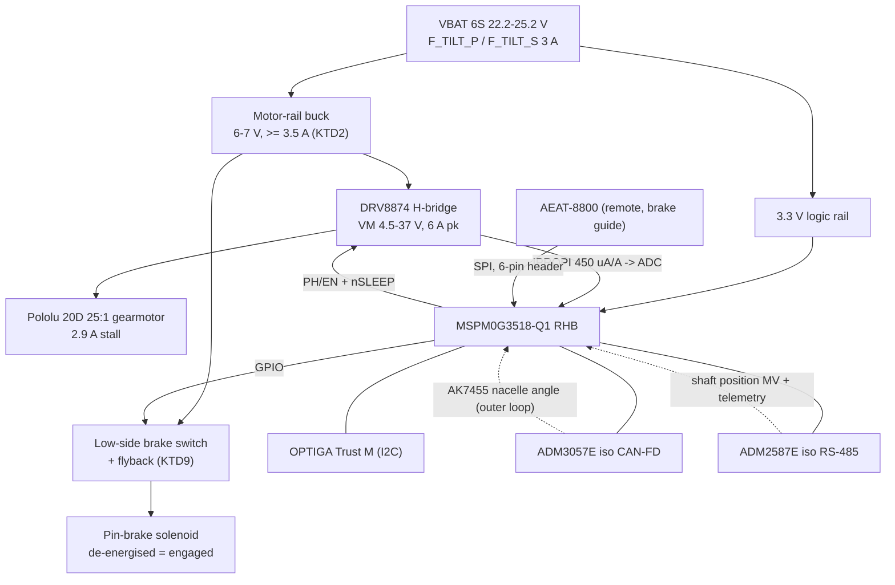
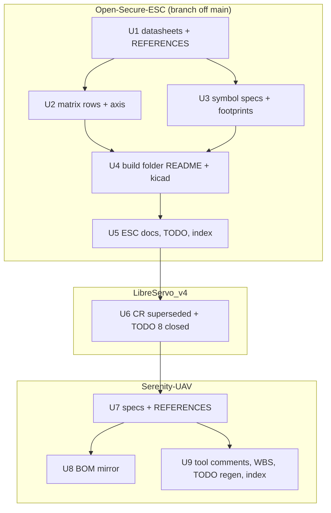

# Nacelle-Tilt Controller as an Open-Secure-ESC Build - Plan

**Author:** Steve Griffing, PE(CSE), CISSP-ISSEP, CPP. **AI note:** drafted by Claude (model: Claude Opus 5, Anthropic) under the author's direction, 2026-09-17, per `AGENTS.md` AI attribution. Research inputs: two Claude Sonnet 5 subagents (institutional-learnings search; Open-Secure-ESC repo-pattern survey).

**Target repos:** three. Paths are repo-relative and prefixed `ESC:` (Open-Secure-ESC), `LS:` (LibreServo_v4) or `SER:` (Serenity-UAV). Unprefixed paths are Serenity-UAV.

---

## Goal Capsule

- **Objective:** specify the Serenity nacelle-tilt controller as a new Open-Secure-ESC build folder (`ESC:builds/6s/10A/BRUSHED_CAN_485_isolation/`) walked from the decision matrix, retire the `LibreServo_v4.1-TC` change request with a redirect, and re-point every Serenity spec, BOM, layout-tool and WBS entry that names the LibreServo variant.
- **Authority:** this plan → `ESC:AGENTS.md` (citation and UNVERIFIED discipline, binding on the ESC side) → `SER:AGENTS.md` and the user-level rules (imperial-primary units, WBS→TODO generation, BOM mirror) → repo conventions. Where this plan and a governing `AGENTS.md` disagree, the `AGENTS.md` wins.
- **Stop conditions:** stop and surface (do not guess) if a primary datasheet for a BOM-line part cannot be obtained (mark `UNVERIFIED — needs primary source (see TODO.md)` and log it); if `isolation_envelope.py` or the schematic shows the build cannot fit the T5e rail envelope (KTD4 is user-directed — report, do not silently resize the rails);
  if the BOM CSV/JSON parity check fails before editing.

- **Execution profile:** three repos, three branches, three PRs, landed in the order ESC → LibreServo_v4 → Serenity-UAV so that Serenity's redirects point at merged paths. Schematic-and-BOM readiness only; no PCB layout, no firmware.
- **Tail ownership:** the implementer opens the three PRs; the owner merges. CI gates are in the Verification Contract.

---

## Product Contract

### Summary

Replace the drafted `LibreServo_v4.1-TC` variant with an Open-Secure-ESC build instance.
The tilt actuator is a brushed gearmotor with a brake, not a servo, and Open-Secure-ESC already carries a brushed-DC tier (integrated H-bridge, `ESC:docs/OpenSecureESC-Brushed-Specifications.md`), the same MCU and secure element, and the same isolated CAN-FD + RS-485 bus stack.
The build is walked from `ESC:docs/decision-matrix.xlsx`; the two actuator needs the matrix cannot express today (a holding-brake output, a remote magnetic absolute sensor) are added to the matrix so the build stays regenerable.
LibreServo v4.0.0 stays untouched for the winch and door servos.

### Problem Frame

Serenity Rev T5e (2026-09-16) moved the nacelle tilt from a DS3225 servo body to a Pololu 20D 25:1 gearmotor driving a six-start worm with a spring-applied pin brake (`docs/TILT_ACTUATOR_SELECTION.md`, `docs/TILT_DRIVE_CONTROL_SPEC.md` §5.2).
The controller change was filed as `LS:docs/CR-2026-09-15-tilt-controller-variant.md`, a variant of the LibreServo_v4 servo board: re-rated bridge, brake driver, VBAT front end, remote sensor.
That variant forks the board away from its upstream (LibreServo → LibreServo_v2 fork → v4), breaking the attribution and continuity chain the project's licensing rules require, for a device that is no longer a servo controller at all.
Open-Secure-ESC is the project's own parameterised motor-controller platform and its brushed tier is the natural home.
Today its Brushed (DC) matrix row is still `Open / unresolved` (TODO 12.6.a), it has no 10 A build, and nothing in it names a brake output or an SPI absolute sensor.

### Requirements

**Controller build (Open-Secure-ESC)**

- R1. A new build folder `ESC:builds/6s/10A/BRUSHED_CAN_485_isolation/` exists with the standard anatomy: `README.md` (axis table + BOM walked from the matrix, each line carrying its `REFERENCES.md` tag and Status), `kicad/` (project wired to `symbols/`, ERC 0 errors), `gerbers/README.md` placeholder.
- R2. The build's axis selections are: Voltage 6S; Amperage 10 A tier; Motor Brushed (DC); Shaft sensor magnetic absolute (SPI), remote; Protocol CAN-FD and RS-485 concurrently; Control closed-loop PID; EMI Isolation; Wire egress and form factor default; Holding brake low-side solenoid driver.
- R3. The power stage is the Tier-1 integrated H-bridge (TI DRV8874, `SLVSF66A`) fed from a regulated 6–7 V motor/solenoid rail; the rail is bucked from the 6S branch feed (22.2 V nominal, 25.2 V full charge, 3 A branch fuse). Every electrical figure in the README traces to a local datasheet or carries the `UNVERIFIED` marker.
- R4. Motor current is read from the DRV8874 `IPROPI` output into the MCU ADC and is published on the bus (jam detection per `docs/TILT_DRIVE_CONTROL_SPEC.md` §5.3 consumes it).
- R5. The brake output is one low-side switch with a flyback clamp, sized for ~0.5 A continuous or PWM-held at the motor rail, de-energised = engaged; brake state is readable on the bus.
- R6. The AEAT-8800 sits ~35 mm (1.38 in) off-board in the brake guide; the board carries a keyed connector for its SPI + supply and no on-board magnet target.
- R7. The board conforms to the Rev T5e rail envelope: outline ≤ 1.69 × 1.44 in (42.9 × 36.5 mm), component height ≤ 0.16 in (4 mm) on the web-facing side, bare back face, connectors on the aft (+Y) or inboard (−X) edge only (`airframe/openscad/fuselage/cargo/tilt_actuator_bracket.scad` `BOARD_*` / `RAIL_*`).
- R8. Firmware requirements (cascade with the AK7455 outer loop received over the bus, brake sequencing release → move → settle → engage, differential-tilt trip input, per-side sense declaration, jam detection) are recorded in the build README as requirements with their Serenity citations; no firmware is written.

**Decision matrix**

- R9. The Motor sheet's Brushed (DC) row is resolved: gate-driver/bridge part = DRV8874 with its `REFERENCES.md` tag, Status `Verified (local PDF)`; TODO 12.6.a closes.
- R10. The Shaft Sensor sheet gains a `Magnetic absolute (SPI/SSI)` row; the workbook gains a `Holding Brake` axis sheet (`None` / `Low-side solenoid driver, spring-applied`), both authored by scripts in `ESC:docs/tools/`, exported to `docs/decision-matrix.json`, and listed in the root README "Build Options".
- R11. The Amperage sheet records that for brushed builds the Motor sheet's bridge row overrides its FET / gate-driver / shunt / current-sense-amp columns (KTD7).

**Verification discipline**

- R12. Every new part (DRV8874, AEAT-8800-Q24, the motor-rail buck, the brake switch) has a local datasheet in `ESC:docs/datasheets/`, an IEEE entry in `ESC:REFERENCES.md`, and a `symbols/specs/<PART>.json` whose `verification` field names the section/table read.
- R13. Country-of-origin screening per `ESC:docs/brushed-component-sourcing-verification.md` is recorded for every new IC.

**LibreServo_v4 retirement**

- R14. `LS:docs/CR-2026-09-15-tilt-controller-variant.md` is marked SUPERSEDED with the date and the ESC build path; the file is kept.
- R15. `LS:TODO.md` §8 items close as superseded (no `[ ]` remains whose text says superseded); nothing in `PCB/kicad/LibreServo-v4.0.0.*` changes.

**Serenity propagation**

- R16.
  `docs/TILT_ACTUATOR_SELECTION.md` §4/§7, `docs/TILT_DRIVE_CONTROL_SPEC.md` (§1 loop table, §1.2, the loop diagram, §5.2 fail-state list, §5.3, §5.5 bus security, the open-items table), `docs/POWER_DISTRIBUTION.md` §3.3a and §5.1 fuse note, `docs/CARGO_SECTION_LAYOUT.md` and `avionics/kicad/CAN-PERIPH-GW-1/CAN-PERIPH-GW-1.md` (Deployment §3,
  open item 7) name the Open-Secure-ESC build and no longer name `LibreServo_v4.1-TC`, "the LibreServo board" or the MPM3610.
  The §5.2 fail-state list gains the driver-fault → coast → brake-engage chain from System-Wide Impact.
- R17. `current-specification/bom_revS.csv` and `.json` retire `LS-TILT-TC` (qty 0, note) and add `OSESC-TILT-TC` (qty 2) with mass, cost and source; the two files stay row-for-row identical.
- R18. `REFERENCES.md` gains a catalog entry for the Open-Secure-ESC tilt build (repo path, licence CERN-OHL-P v2, the upstream DRV8874 citation chain) so every Serenity mention cites a REF-ID.
- R19. `tools/cargo_layout_fit.py` and `airframe/openscad/fuselage/cargo/tilt_actuator_bracket.scad` comments name the ESC build; geometry constants do not change and every layout gate still passes.
- R20.
  WBS items `TILT-CTL-08` (root `WBS.md`), `TC-BOARD` (`airframe/fuselage-mid/WBS.md`) and `U2`, `U6` (`avionics/WBS.md`) are rewritten to the ESC build, and the new items from System-Wide Impact are added (`BRK-6`, the `BRK-4` hold-in voltage sub-item, `TILT-CTL-09`, the `TILT-CTL-02` executor note, the AEAT-8800 sensor daughter);
  every `TODO.md` is regenerated by `tools/gen_todo_from_wbs.py`, never hand-edited.

**Governance**

- R21. `PROJECT_INDEX.md` in each touched repo lists every added file; `ESC:CONCEPTS.md` gains the Holding Brake axis term; AI contributions are attributed by model in every touched file that carries an authorship line.

### Scope Boundaries

- **In scope:** the build folder at schematic + BOM readiness; matrix extension; CR retirement; Serenity documentation, BOM, WBS and comment propagation.
- **Deferred to Follow-Up Work:**
    - PCB layout, routing, DRC and Gerbers for the new build (a new `ESC:TODO.md` section carries them, mirroring §12.1's progression for the 50A build).
    - Firmware for the cascade / brake sequencing / jam detection (`ESC:TODO.md` 8.7 already tracks the brushed firmware variant; the build README adds the Serenity requirements).
    - Brake solenoid part selection (`BRK-4`, Serenity) and the hold bench test (`BRK-5`) — unchanged Serenity open items.
    - Fleet alignment of the isolated transceivers (ADM3057E/ADM2587E as built vs ISOW1412/ISO1042 as audited in `ESC:REFERENCES.md` [59]–[61]) — a spike, not part of this build.
    - A `tools/bom_sync.py` for the Serenity BOM mirror (WBS §0.10 BOM-SYNC).
- **Outside this work's identity:** any change to LibreServo v4.0.0, the winch/door servos, the Rev T5e bracket geometry, or the tilt-drive control law itself.

### Dependencies

- `ESC:` branch off `main` (`03c56d9`); the repo's checkout is on `wip/mcu-placement-and-fet-drain-wiring` — do not build on it.
- `LS:` working tree holds uncommitted edits to `TODO.md` and the CR (the Rev T5e re-rating); U8 builds on that working-tree state.
- `SER:` branch `power-distribution` (clean).
- TI datasheet access works from this machine (the DRV8874 `SLVSF66A` PDF fetched 2026-09-17; the 403 note in `ESC:TODO.md` 1.10 is stale for `ti.com/lit`).

### Outstanding Questions

- **Deferred (non-blocking):** DRV8874 vs DRV8874-Q1. The MCU is the automotive `-Q1`; the ESC spec doc names `DRV8873-Q1 / DRV8874`. Default: DRV8874 (`SLVSF66A`, datasheet in hand). U1 checks whether a `-Q1` datasheet is obtainable and whether it is pin-compatible; if so it is the preferred orderable and the symbol spec records both.
- **Deferred (non-blocking):** motor-rail buck and brake-switch part numbers. Selected in U1 against the constraints in KTD2/KTD9; not named here (no primary source yet — naming a part now would violate `ESC:AGENTS.md` §1.3).
- **Deferred (non-blocking):** brake-state sensing — drive-pin readback only, or readback plus a sense of solenoid current. Decided in U4 once the switch part is chosen.
- **Deferred (non-blocking):** controller board mass for the Serenity BOM. Carried as an estimate (12 g, the figure the retired `LS-TILT-TC` row used) and marked as such until a populated board is weighed; it is not left TBD.

---

## Planning Contract

### Key Technical Decisions

- KTD1. **Open-Secure-ESC build, not a LibreServo variant** (session-settled: user-directed — chosen over the drafted `LibreServo_v4.1-TC` CR: a variant forks the servo board away from its upstream and breaks the attribution chain; the ESC platform already has the brushed tier, MCU, secure element and bus stack). Governs R1–R3, R14–R16.
- KTD2. **Buck-regulated 6–7 V motor/solenoid rail from the 6S branch** (session-settled: user-directed — chosen over direct-VBAT PWM with a firmware duty cap and ITRIP limiting: the gearmotor and solenoid are 6 V parts and must not see 25 V edges; the DRV8874's 4.5–37 V VM range (`SLVSF66A` §6.3) accepts either scheme, so the choice is about the motor, not the driver).
  Buck constraints:
  Vin ≥ 30 V (25.2 V full charge plus margin), Iout ≥ 3.5 A (2.9 A stall + 0.5 A solenoid; the 3 A branch fuse limits the VBAT side, not the rail side), profile ≤ 4 mm on the web-facing side or placed on the bare face — and the bare face must stay bare (R7), so a > 4 mm inductor forces a taller standoff and is a stop condition.
  The buck's own current limit and soft-start now bound the rail — the VBAT-side 3 A fuse no longer sees solenoid inrush, so `POWER_DISTRIBUTION.md` §5.1's "solenoid inrush margin" sentence is re-derived in U7 (R16).
  A buck cannot sink: deceleration is by slow decay (EN = 0, `SLVSF66A` Table 3), never by plugging reversal, and the rail carries bulk capacitance sized for that in U4.
  Governs R3, R5.
- KTD3. **Extend the decision matrix rather than carry build-local options** (session-settled: user-directed — chosen over documenting the brake output and remote sensor as Serenity-only host constraints: every build folder is generated from the workbook, and a build the matrix cannot express cannot be regenerated). Governs R10, R11.
- KTD4. **The board conforms to the T5e rails** (session-settled: user-directed — chosen over letting the layout set the outline and re-deriving `BOARD_*` in `tools/cargo_layout_fit.py`: the bracket, params file, shell merge and every layout gate are validated at Rev T5e).
  Feasibility check already run:
  `ESC:docs/tools/isolation_envelope.py --widest 5.0 --board-width 36.5` gives a 23.96 mm minimum width for the RHB MCU to sit between two isolated rows — 36.5 mm passes with 13.8 mm to spare.
  Governs R7.
- KTD5. **CAN-FD + RS-485 concurrently, Isolation EMI tier** (session-settled: user-directed — chosen over mirroring the 50A build's Faraday tier and over RS-485-only: the control spec puts the MV on RS-485 and the AK7455 angle on CAN-FD via the gateway, and a Faraday can has no place on a board riding a bracket inside the hull).
  Transceivers: the repo's verified symbols ADM3057E (CAN-FD; lower creepage than ADM3055E at identical timing, `ESC:docs/solutions/architecture-patterns/bom-creepage-audit-can485-faraday.md`) and ADM2587E (RS-485).
  ISOW-family alignment is deferred (Scope Boundaries).
  Governs R2.
- KTD6. **Tier-1 integrated H-bridge = TI DRV8874.** Rationale:
  `ESC:docs/OpenSecureESC-Brushed-Specifications.md` §1/§2.2 already designates the Tier-1 bridge for 2S–6S / 10–20 A; the datasheet (`SLVSF66A`, Aug 2019 rev Dec 2019) gives 4.5–37 V VM, 6 A peak, 200 mΩ HS+LS, IPROPI current mirror 450 µA/A, PH/EN and PWM modes, HTSSOP-16 PWP 5.0 × 4.4 mm — comfortably above the 20D's 2.9 A stall and it removes the shunt + INA240 the brushless tiers need.
  Country of origin:
  TI USA fab, Taiwan/Malaysia assembly, listed Compliant in `ESC:docs/brushed-component-sourcing-verification.md` §2.
  The spec doc's own bibliography is not `REFERENCES.md`-conformant (secondary mirrors, no per-claim status) — every figure is re-verified from the primary PDF in U1, not inherited; its §2.2 "45 mΩ total H-bridge" claim conflicts with `SLVSF66A` §6.5 (100 mΩ typ / 120 mΩ max per HS and LS FET) and is corrected in U5.
  Fault behaviour that shapes the design: every protection event (UVLO §7.3.4.1, CPUV §7.3.4.2, OCP §7.3.4.3, TSD §7.3.4.4;
  Table 7) disables all four FETs — a coast, not a hold.
  The OCP trip (IOCP 6 A min / 10 A typ, §6.5) sits above the 20D's 2.9 A stall, so OCP protects the board against a shorted lead and never the gear train; the VREF/ITRIP current regulation (§7.3.3.2) is the only hardware stall backstop.
  Stall dissipation ≈ 2.9 A² × 0.24 Ω ≈ 2 W in the PWP with the component side facing the web at 4 mm — the thermal check per `SLVSF66A` §8.2.1.2 is part of U4's host-constraints section.
  Governs R3, R4, R9.
- KTD7. **For brushed builds the Motor sheet's bridge row overrides the Amperage sheet's power-stage columns.** The Amperage sheet is brushless-shaped (FET part, DRV8353S, shunt, INA240).
  Rather than fork a brushed Amperage sheet, the Amperage notes cell states the override and the 10 A row's `REFERENCES.md Tags` gains the DRV8874 tag; the Amperage sheet still governs copper class and connector class.
  Governs R11.
- KTD8. **Remote AEAT-8800 over a keyed 6-pin header; sensor location unchanged.** The Serenity brake guide already pockets the AEAT-8800 reading the Ø6 diametric magnet in the worm's brake collar (`tilt_actuator_bracket.scad` header, `TILT_ACTUATOR_SELECTION.md` §4).
  The build carries the connector, ESD/series protection per `ESC:docs/design-speed-sensor-integration.md`, and the SPI assignment on the MCU; the sensor daughter (a bare AEAT-8800 carrier) is a Serenity print/PCB item added to the Serenity WBS, not part of this build's BOM.
  Datasheet:
  `LS:PCB/datasheets/pub-005892_ds_aeat-8800-q24_2017-05-17.pdf` is copied into `ESC:docs/datasheets/` with the attribution chain (Broadcom primary → held in LibreServo_v4).
  Governs R6.
- KTD9. **Brake output = low-side switch on the motor rail, flyback clamped, fail-engaged.** Requirements come from `TILT_DRIVE_CONTROL_SPEC.md` §5.2 (`BRK-1..3`) and the learning `docs/solutions/design-patterns/self-locking-worm-and-vectoring-bandwidth-are-mutually-exclusive.md`: the brake is flight-critical and must engage when the controller's own power fails,
  so the switch is normally-off and the solenoid is a pull-to-release type.
  Switch constraints: logic-level gate from a 3.3 V MCU pin, ≥ 1 A continuous, ≥ 30 V VDS, clamp diode rated for the solenoid's inductive kick;
  PWM-hold capability so the coil can be held at reduced duty.
  Four qualifiers the fail-state analysis adds:
    - **`BRAKE_EN` carries an external gate pulldown**, so an MCU reset or brown-out (pin Hi-Z) engages the brake without firmware — the DRV8874's inputs have internal 100 kΩ pulldowns (§5 pin table, §6.5 RPD) that coast the bridge in the same event, but the brake gate has no such guarantee unless the board provides it.
    - **`nFAULT` is a brake-engage input.** A driver fault coasts the motor while the solenoid, on the same rail, stays energised; the MCU must engage the brake on `nFAULT` within a latency budget that, with the pin's mechanical engage time, is set in the firmware follow-up (not in sources).
    - **Rail droop before UVLO.** The DRV8874 drives down to VUVLO (4.35 V typ, §6.5) but the solenoid's hold-in voltage (not in sources — recorded under BRK-4) is likely higher, so a stall or buck current-limit droop can drop the pin into a *driven* castellation.
      The board carries a VM-rail sense divider into the ADC and the firmware requirement "on VM < V_hold:
      EN = 0 (slow decay) before the coil drops out".
    - **"Settled" comes from the AEAT-8800, "unloaded" from the AK7455 over the bus**, never from IPROPI, which in slow decay reports only one low-side FET (§7.3.3.1) and in coast/sleep nothing. The release → move → settle → engage sequence (R8) is therefore: EN = 0 (damp) → worm stationary on the AEAT-8800 → `BRAKE_EN` low → `nSLEEP` low (tSLEEP, §6.5).

  Keeping the solenoid on the buck rail is right for BRK-2 ("held off only by the actuator's own feed" now means the buck output, which is stricter). The solenoid itself (`SOL-TILT-BRAKE`, BRK-4) stays a Serenity open item and gains "record hold-in / dropout voltage". Governs R5, R8.
- KTD15. **IMODE is a safety setting: latched-off with cycle-by-cycle regulation (level 3, RIMODE per `SLVSF66A` Table 6).** IMODE selects both retry-vs-latch on OCP and whether ITRIP chopping is reported on `nFAULT` (§7.3.3.2, Table 6).
  Auto-retry re-enables every tRETRY = 2 ms (§7.3.4.3), hammering a jammed train at 500 Hz with no MCU involvement — the opposite of `TILT_DRIVE_CONTROL_SPEC.md` §5.3's "stop commanding into it".
  Latched-off recovers only through an `nSLEEP` toggle, which re-latches PMODE/IMODE (§7.3.2, §7.4.1) — acceptable because both are hard-strapped on the board (U4).
  Cycle-by-cycle mode also makes ITRIP visible on `nFAULT`, giving jam detection a hardware flag in addition to IPROPI.
  Governs R4, R5.
- KTD10. **Build path `builds/6s/10A/BRUSHED_CAN_485_isolation/`.** Follows `ESC:docs/design-brushed-esc-variant.md` ("`builds/<voltage>/<amperage>/BRUSHED_<variant>/`") and the 50A folder's `<protocols>_<emi-tier>` token order. Serenity is a host, not part of the name; the README's "Host constraints" section carries the Serenity-specific envelope and feeds. Governs R1, R7.
- KTD11. **Schematic authoring is injection-first, generator-second.** `ESC:builds/6s/50A/CAN_485_faraday/kicad/tools/gen_schematic.py` is hard-coded to its build and depends on `kiutils`, which is not installed and cannot be pip-installed here.
  The new build gets its own `kicad/tools/` with a new project name; the schematic is produced either by a new generator run on a machine with `kiutils`, or by targeted S-expression authoring validated with `kicad-cli sch export netlist` per `ESC:docs/solutions/architecture-patterns/schematic-pin-y-sign-when-hand-wiring.md`.
  Either way the acceptance is the same:
  ERC 0 errors and a netlist that names every intended pin/net.
  Governs R1.
- KTD12. **CR retirement = SUPERSEDED banner + redirect; file kept.** The CR is the decision record for TC-1..TC-7 and its figures were harvested into this plan; deleting it would orphan `LS:TODO.md` §8's citations. Governs R14, R15.
- KTD13. **Serenity cites the build through one REFERENCES.md entry** (`REF-ESC-001`, new family) rather than repeating the ESC repo's `[n]` tags inline. The entry carries the ESC repo path, the licence, the DRV8874 `SLVSF66A` chain and the date read, satisfying the "full attribution chain back to upstream sources" rule. Governs R16, R18.
- KTD14. **Serenity BOM edit uses the temp-file + parity pattern** from `docs/solutions/logic-errors/bom-csv-json-mirror-drift-and-in-place-rewrite-truncation.md`: assert CSV/JSON parity before editing, write to a temp file, re-read, assert row count and no `None`/`"null"` overflow keys, then `os.replace()`. Governs R17.

### High-Level Technical Design

The build's electrical shape (power path, control, sensing, bus). Authoritative alongside the README the build will carry.

Cross-repo sequencing. Each repo lands as its own PR; the arrows are the order the redirects need.

### Assumptions

- The DRV8874's integrated current regulation (VREF/ITRIP) is used as a hardware stall backstop below the fuse rating; the firmware current limit for jam detection is a separate, lower threshold. Both thresholds are set in the follow-up firmware work, not here.
- The AK7455 nacelle angle reaches the controller over CAN-FD through the nacelle gateway as `avionics/kicad/CAN-PERIPH-GW-1/CAN-PERIPH-GW-1.md` describes; this plan does not change the gateway.
- One board design serves both sides; the starboard sense reversal (`TC-6`) is a firmware declaration, not a hardware variant.

### Sequencing

U1 → (U2 ∥ U3) → U4 → U5 → U6 → U7 → (U8 ∥ U9). U6 may start once the ESC build path exists on a pushed branch, but its redirect must name the merged path before the LibreServo PR merges.

### System-Wide Impact

The controller is the only thing that can release the nacelle's unpowered hold, so its failure behaviour propagates into the control spec, the gateway, the trust model and the power distribution. Datasheet sections are `SLVSF66A`.

**Failure propagation**

| Event | Motor (DRV8874) | Brake | Bus sees | Owner of the change |
| --- | --- | --- | --- | --- |
| Branch fuse `F_TILT_x` opens | VM → 0, UVLO, all FETs off (§7.3.4.1) | Engages — coil unpowered, coincident and correct | Node silent; gateway still publishes the AK7455 angle | `TILT_DRIVE_CONTROL_SPEC.md` §5.2; `POWER_DISTRIBUTION.md` §5.1 |
| Buck fails open | as above | Engages; MCU alive on the 3.3 V rail | `nFAULT` and brake-state telemetry, node alive | build README fail-state table; spec §5.2 |
| Buck droop (stall / current limit) | keeps driving down to VUVLO 4.35 V typ (§6.5) | May drop out above UVLO → pin into a driven collar | VM-sense alarm | KTD9 (VM sense, EN = 0 before dropout); BRK-4 records hold-in voltage |
| DRV8874 OCP / TSD / CPUV | all FETs off; latched per KTD15 (§7.3.4.3, Table 6) | Released until the MCU engages it on `nFAULT` | fault frame | KTD9 latency budget; spec §5.3 |
| ITRIP chopping (jam) | slow-decay chopping (§7.3.3.2.1) | Released | `nFAULT` (KTD15 mode) and IPROPI | spec §5.3 jam-detection source |
| MCU reset / brown-out | all FETs off via input pulldowns (§7.3.2) | Engages through the `BRAKE_EN` pulldown (KTD9) | node drops off the bus | U4 netlist test; new bench item BRK-6 |
| Bus lost (angle and MV) | inner loop holds on the AEAT-8800 (spec §5.1) | Engage after a timeout, then `nSLEEP` | nothing | spec §5.1/§5.2 merge; timeout set in the firmware follow-up |
| Differential-tilt trip (spec §5.4) | response undefined (TILT-CTL-02) | if "engage both", it is a bus command with latency and authorization | trip frame | TILT-CTL-02 gains "define the executor and its independence from the loop MCU" |

**Affected interfaces and documents**

- `docs/TILT_DRIVE_CONTROL_SPEC.md` §1 (inner measured variable), §5.2 (fail-state list and the superseded "motor short-brake held by the LibreServo board" candidate), §5.3 (IPROPI semantics per KTD9), §5.5 (bus security — the actuator is now a self-signing trunk node; the AK7455 angle frame from the gateway becomes a trust boundary the controller must verify).
- `avionics/kicad/CAN-PERIPH-GW-1/CAN-PERIPH-GW-1.md` Deployment §3 and open item 7: the `J_FLEX` servo-drop question is moot for tilt (still live for the winch); the gateway's tilt role narrows to relaying the signed angle (Deployment §1).
- `avionics/WBS.md` U6: the "tilt-servo" endpoint class becomes a brushed-ESC class, one Secure-Controller-Assurance mapping per class.
- `ESC:docs/design-brushed-esc-variant.md` "Safety & failure modes" and `ESC:TODO.md` 12.3.a (fail-operational vs fail-safe, open fleet-wide): this build is the first flight-critical instance and its README resolves the question for this build — fail-safe = brake engaged, motor coasting.
- `ESC:` Holding Brake matrix sheet carries a **Fail-state** column (de-energised = engaged; gate pulldown required) so the axis records the safety property, not only the part.

**Trust model — brake release.** Release is a phase event (released for a hover or vectoring phase), not a per-command act, so it fits the per-frame CMAC hot path and must not invoke an OPTIGA Trust M private-key operation (`ESC:docs/secure-element-architecture.md`, 5 s protected-op budget).
Brake release is a distinct authenticated command class with its own freshness counter and an arm/confirm pair.
The failure policy is asymmetric: a MAC failure on a position frame → fail-operational on the last valid command (never engage mid-manoeuvre); a MAC failure on a release → stay engaged.
This lands in the build README firmware requirements and in Serenity spec §5.5 as `TILT-CTL-09`.
The symmetric-key path is the MSPM0 AES-CMAC engine "pending `ESC:TODO.md` 13.1.e", not CSEc.

**New Serenity WBS items (U9):** `BRK-6` bench — engage into motion at max slew (MCU-reset case), pin and castellation survival; `BRK-4` sub-item — record hold-in / dropout voltage; `TILT-CTL-09` — brake-release authorization and fail-policy asymmetry; `TILT-CTL-02` — trip executor and independence; AEAT-8800 sensor daughter (KTD8).

---

## Implementation Units

### U1. Datasheets, REFERENCES entries and origin screening for the new parts

- **Goal:** put every new part on a primary source before anything cites it.
- **Requirements:** R3, R12, R13; KTD2, KTD6, KTD8, KTD9.
- **Dependencies:** none.
- **Files:** `ESC:docs/datasheets/drv8874.pdf` (new;
  `SLVSF66A`), `ESC:docs/datasheets/aeat-8800-q24.pdf` (new; copied from `LS:PCB/datasheets/pub-005892_ds_aeat-8800-q24_2017-05-17.pdf`), `ESC:docs/datasheets/<buck>.pdf` (new), `ESC:docs/datasheets/<brake-switch>.pdf` (new), `ESC:REFERENCES.md` (four new `[n]` tags, next unused after [61]), `ESC:docs/brushed-component-sourcing-verification.md` (rows for the buck and switch),
  `ESC:TODO.md` 1.10 (note that `ti.com/lit` fetches now succeed).
- **Approach:**
    1. Fetch the DRV8874 datasheet from `ti.com/lit/ds/symlink/drv8874.pdf` and record the facts KTD6 relies on with section/table numbers (VM range §6.3; peak current §6.3;
       IPROPI gain §6.5; pinout §5; land pattern in the mechanical/"Example Board Layout" sheets — TI keeps it in the datasheet, per the instantiation learning Trap 2).
       Check for a `DRV8874-Q1` datasheet and record the outcome under the deferred question.
    2. Copy the AEAT-8800-Q24 datasheet with an attribution note in the REFERENCES entry (Broadcom primary; local copy held in LibreServo_v4 `PCB/datasheets/`).
    3. Select the motor-rail buck against KTD2's constraints and the brake switch against KTD9's, from US/EU/Japan-origin vendors; fetch each primary datasheet; a part with no obtainable primary datasheet is not selected.
    4. Write the four REFERENCES entries in the repo's IEEE format with URL, section/page and date accessed.
- **Patterns to follow:** `ESC:REFERENCES.md` [59]–[61] (recent entries, 2026-09-06); `ESC:docs/solutions/architecture-patterns/esc-build-instantiation-workflow.md` Step 1 and Traps 2/4.
- **Test scenarios:**
    - Each new `[n]` entry has organisation, title, document ID/revision, URL, section/page and date accessed; none reuses an existing tag.
    - Each datasheet file opens and its literature number matches the entry.
    - Origin table lists fab and assembly for every new IC with a Compliant / Non-Compliant verdict.
    - The DRV8874 entry cites §6.5 (RDS(on), IOCP, VUVLO), §7.3.3.2 and Table 6 (IMODE), §7.3.4.3 (retry / latch) and Table 7 (fault summary) — the sections KTD6, KTD9 and KTD15 rely on.
    - The buck entry records its current limit and soft-start; the brake-switch entry records its gate threshold; the solenoid hold-in voltage is written as "not in sources → BRK-4".
- **Verification:** `markdownlint-cli2` clean on the touched files; a reviewer can trace every KTD6 figure to a page in `drv8874.pdf`.

### U2. Decision matrix: resolve Brushed (DC), add the sensor row and the Holding Brake axis

- **Goal:** make the tilt build expressible and regenerable from the workbook.
- **Requirements:** R9, R10, R11; KTD3, KTD7.
- **Dependencies:** U1 (tags).
- **Files:** `ESC:docs/tools/add_holding_brake_sheet.py` (new), `ESC:docs/tools/resolve_brushed_row_and_add_magnetic_sensor.py` (new; or extend `add_motor_and_shaft_sensor_sheets.py` if it is idempotent for existing rows — check before choosing), `ESC:docs/decision-matrix.xlsx` (+ timestamped `.bak`), `ESC:docs/decision-matrix.json` (regenerated),
  `ESC:README.md` Build Options list, `ESC:docs/tools/README` or docstrings.

- **Approach:**
    1. Holding Brake sheet: columns mirroring the Shaft Sensor sheet (Option, Actuation, Fail-state, MCU pins, Additional BOM component, Connector, Firmware workflow, REFERENCES tags, Status); rows `None` (No part needed) and `Low-side solenoid driver, spring-applied` (Fail-state: de-energised = engaged, gate pulldown required; Candidate until the switch datasheet is local, then Verified).
    2. Shaft Sensor sheet: add `Magnetic absolute (SPI/SSI)` — rotor position source, 4–6 MCU pins, AEAT-8800 tag, connector, firmware workflow (read absolute angle, accumulate turns, home from the outer sensor), Status per U1.
    3. Motor sheet: Brushed (DC) row — Gate Driver Part → `TI DRV8874 [n]`, Shunt Qty → `0 (IPROPI current mirror)`, tags, Status `Verified (local PDF)`.
    4. Amperage sheet: notes cell gains the KTD7 override sentence; the 10 A row's tags gain the DRV8874 tag.
    5. Run the exporter; confirm `--check` passes; add "Holding brake" to the root README Build Options and reword "Motor speed sensor" to include SPI absolute.
- **Patterns to follow:** `ESC:docs/tools/add_wire_egress_sheet.py` (module-level spec dict, `write_sheet` delete-then-recreate, header row 4, timestamped backup, `--dry-run`); `ESC:TODO.md` §15/§16 for the axis-added checklist shape.
- **Test scenarios:**
    - `decision_matrix_to_json.py --check` exits 0 after the edit and exits 1 if the JSON is deliberately staled.
    - `unresolved_cells()` no longer reports the Brushed (DC) gate-driver cell.
    - The JSON's `axes` gains `holding_brake` with two rows carrying a `Fail-state` value, and `shaft_sensor` gains the magnetic-absolute row by slug.
    - Re-running the new sheet script is idempotent (second run produces a byte-identical sheet apart from the backup).
- **Verification:** `ruff check` / `ruff format --check` clean; the workbook opens in LibreOffice with the new sheet styled like its siblings.

### U3. Symbol specs, symbols and footprints for DRV8874, AEAT-8800-Q24, the buck and the brake switch

- **Goal:** citable symbols the build's `sym-lib-table` can bind.
- **Requirements:** R12; KTD6, KTD8.
- **Dependencies:** U1.
- **Files:** `ESC:symbols/specs/DRV8874.json`, `ESC:symbols/specs/AEAT_8800_Q24.json`, `ESC:symbols/specs/<BUCK>.json`, `ESC:symbols/specs/<SWITCH>.json` (new), the generated `ESC:symbols/<PART>.kicad_sym` files, `ESC:symbols/tools/gen_pwp0016_footprint.py` (new, only if no verified KiCad stock HTSSOP-16 EP footprint matches TI's PWP land pattern),
  `ESC:symbols/footprints/Open_Secure_ESC.pretty/` additions, `ESC:symbols/README.md` status rows.

- **Approach:**
    1. Author each spec JSON with `verification` naming the pin table and figure read (INA240.json is the reference shape).
    2. Generate with `symbols/tools/gen_kicad_symbol.py`; round-trip validate with `kicad-cli sym export svg` or KiCad open (the README's `kiutils` round-trip is unavailable here — state the substitute in the README row).
    3. Footprints: prefer a stock KiCad footprint checked dimension-by-dimension against TI's PWP drawing; otherwise a generator whose docstring names each drawing dimension (Trap 1: calibrate on an independent dimension).
- **Patterns to follow:** `ESC:symbols/specs/INA240.json`; `ESC:symbols/tools/gen_rhb0032t_footprint.py`.
- **Test scenarios:**
    - Each spec lists every datasheet pin once with the correct KiCad `etype` (power_in for VM/VCC, output for IPROPI, open-collector for `nFAULT` with the pull-up noted, `PMODE`/`IMODE` marked as strap pins).
    - The DRV8874 spec's `verification` names Table 3 (PH/EN truth table) and Table 6 (IMODE levels).
    - Generated symbols load in KiCad 9.0.2 without "invalid library" warnings.
    - Footprint pad count and pitch equal the datasheet's; thermal pad size matches the drawing callout.
- **Verification:** `kicad-cli sym`/`fp` exports succeed; `symbols/README.md` table has a row per new part with VERIFIED status.

### U4. Build folder: README, host constraints, KiCad project and schematic

- **Goal:** the tilt controller exists as `builds/6s/10A/BRUSHED_CAN_485_isolation/` at schematic + BOM readiness.
- **Requirements:** R1–R8; KTD2, KTD4, KTD5, KTD6, KTD8–KTD11.
- **Dependencies:** U2, U3.
- **Files:** `ESC:builds/6s/10A/BRUSHED_CAN_485_isolation/README.md`, `.../kicad/README.md`, `.../kicad/sym-lib-table`, `.../kicad/fp-lib-table`, `.../kicad/open_secure_esc_6s_10a_brushed_can485_iso.kicad_pro`, `.kicad_sch`, `.kicad_dru`, `.../kicad/tools/` (new scripts with the new project name hard-coded; `snap_to_grid.py` carries the `--force` guard), `.../gerbers/README.md`.
- **Approach:**
    1. README: axis table (R2), BOM per subsystem walked from the JSON with tag + Status per line, a "Host constraints — Serenity-UAV nacelle tilt (Rev T5e)" section (envelope R7, feeds and fuse, connector edges, sensor cable length, per-side sense declaration, brake fail-state) citing the Serenity documents by path and `REF-ESC-001` reciprocal,
       and a "Firmware requirements" section (R8) that cites `TILT_DRIVE_CONTROL_SPEC.md` sections rather than restating them.

    2. Record the `isolation_envelope.py` run (KTD4) in `kicad/README.md` placement rationale.
    3. `sym-lib-table`: entries for MSPM0G3518_Q1_RHB, OPTIGA_TRUST_M, ADM3055E_ADM3057E, ADM2582E_ADM2587E, DRV8874, AEAT_8800_Q24, the buck, the switch, passives — each `descr` carrying the tag and verification note.
    4. Schematic per KTD11: power entry with the 3 A branch assumption noted (fuse is off-board in the Serenity harness), buck with rail bulk capacitance (KTD2), VM-sense divider to an ADC channel (KTD9), DRV8874 in PH/EN mode (`PMODE` strapped low) with `IMODE` strapped per KTD15, `nSLEEP` from the MCU and `nFAULT` pulled up to the MCU, IPROPI RC into an ADC channel,
       brake switch + clamp with the `BRAKE_EN` gate pulldown (KTD9), AEAT-8800 header with protection, isolated CAN-FD and RS-485 blocks reusing the 50A build's ferrite/reservoir topology, OPTIGA I²C, SWD.
       Annotate, then ERC to zero errors; document each remaining warning.
    5. README host-constraints section carries the System-Wide Impact failure table, the fail-safe resolution for this build (brake engaged, motor coasting) and the ≈ 2 W stall-dissipation note (KTD6).
- **Execution note:** export the netlist before and after any bulk edit and require them identical (instantiation learning Trap 3).
- **Patterns to follow:** `ESC:builds/6s/50A/CAN_485_faraday/README.md` (section shape, AS-BUILT callout style); `.../kicad/README.md` (status, libraries and tools tables); variant READMEs for the AI-authorship line.
- **Test scenarios:**
    - `kicad-cli sch erc --severity-error` reports 0 errors on the new schematic.
    - The exported netlist contains nets for VM, motor OUT1/OUT2, IPROPI, nFAULT (with its pull-up), nSLEEP, PH, EN, the `PMODE` → GND strap, the `IMODE` strap resistor, `BRAKE_EN` with its gate pulldown, the VM-sense divider, the SPI set to the sensor header, CAN H/L, RS-485 A/B, and every net has ≥ 2 pins.
    - Every BOM line in the README has a Status and a tag; no line reads `TBD` without the `UNVERIFIED` marker and a TODO pointer.
    - `isolation_envelope.py` with the build's real widest non-isolated part still reports OK at 36.5 mm.
    - The README's host-constraint numbers equal the constants in `SER:tools/cargo_layout_fit.py` (BOARD_L 42.9, BOARD_W 36.5, RAIL_H 4.0).
- **Verification:** CI `kicad-erc-drc.yml` discovers the new `.kicad_pro` and passes at `--severity-error`; the README renders with the axis table first.

### U5. Open-Secure-ESC governance: docs, TODO, PROJECT_INDEX, CONCEPTS

- **Goal:** the repo's own records know the build exists and what remains.
- **Requirements:** R9, R10, R21.
- **Dependencies:** U4.
- **Files:** `ESC:TODO.md` (close 12.6.a with the tag; new `## 17. Holding Brake Axis` and `## 18. Build — 6S/10A BRUSHED_CAN_485_isolation` sections in the §15/§16 template with layout/route/DRC/Gerber and firmware follow-ups; 5.4 and 8.7 sub-items pointing at the build),
  `ESC:docs/design-brushed-esc-variant.md` (Status → first instance exists; path),
  `ESC:docs/OpenSecureESC-Brushed-Specifications.md` (cross-reference to the build and to the REFERENCES tags that now back its Tier-1 claims),
  `ESC:PROJECT_INDEX.md`, `ESC:CONCEPTS.md` (Holding Brake axis; Host constraints).
- **Approach:** add, don't rewrite; keep the §12.6 checkbox history intact and close items in place. Correct the Brushed spec's §2.2 RDS(on) figure to `SLVSF66A` §6.5 values; give `ESC:TODO.md` 12.3.a a sub-item scoped to this build (fail-safe resolved per System-Wide Impact).
- **Patterns to follow:** `ESC:TODO.md` §15/§16 section shape; `PROJECT_INDEX.md` per-directory tables.
- **Test scenarios:**
    - No `[ ]` item remains whose own text says resolved or superseded.
    - `PROJECT_INDEX.md` lists every file added in U1–U4.
- **Verification:** `markdownlint-cli2` clean; a `grep -rn "12.6.a"` shows the closed line citing the DRV8874 tag.

### U6. LibreServo_v4: supersede the CR and close TODO §8

- **Goal:** no live pointer says the tilt controller is a LibreServo variant.
- **Requirements:** R14, R15; KTD12.
- **Dependencies:** U4 pushed (path known); merge after U5.
- **Files:** `LS:docs/CR-2026-09-15-tilt-controller-variant.md`, `LS:TODO.md` §8, `LS:PROJECT_INDEX.md` (description line), `LS:README.md` only if it links the CR.
- **Approach:**
    1. Prepend a `**Status: SUPERSEDED 2026-09-17**` block naming the replacement path and this plan; leave the requirements table as history.
    2. Close 8.1–8.7 as `[x] … SUPERSEDED 2026-09-17 → Open-Secure-ESC …` with one line noting that TC-4 (MPM3610 rating) and TC-1 (FET re-rate) were never resolved and are moot.
    3. Include the pre-existing uncommitted Rev T5e edits in the same commit.
- **Test scenarios:**
    - `grep -rn "v4.1-TC" LS:` returns only the CR, TODO §8 and the index — all carrying SUPERSEDED.
    - `git diff --stat` touches no file under `LS:PCB/kicad/`.
- **Verification:** `markdownlint` clean; TODO §8 has zero open checkboxes.

### U7. Serenity specs and REFERENCES

- **Goal:** the control, power, layout and selection documents name the ESC build.
- **Requirements:** R16, R18; KTD13.
- **Dependencies:** U6 (path merged).
- **Files:** `docs/TILT_ACTUATOR_SELECTION.md` (§4 rewritten: controller = ESC build, table right column re-pointed, `LS-CR-1` closed, `TC-BOARD` re-pointed), `docs/TILT_DRIVE_CONTROL_SPEC.md` (§1.1 table rows, §1.2 sensor table + the UNVERIFIED callout now resolved to the AEAT-8800-Q24 datasheet chain, mermaid node labels, §5.3 telemetry source,
  `TILT-CTL-04`/`TILT-CTL-08` rows, references list), `docs/POWER_DISTRIBUTION.md` §3.3a (controller name; replace the MPM3610 sentence with the build's buck), `docs/CARGO_SECTION_LAYOUT.md` (tilt-controller row and `TC-BOARD` open item), `REFERENCES.md` (new `REF-ESC-001` with TOC entry and the "Removed / Superseded" note for the LibreServo_v4.1-TC references),
  `docs/plans/2026-09-15-001-first-flight-readiness-plan.md` (B5 line: the D5 replacement is now named).

- **Approach:** resolve in place; no strikethrough strata beyond the repo's established `~~ID~~ CLOSED` table idiom. Units imperial-primary where a dimension is quoted.
- **Test scenarios:**
    - `grep -rn "LibreServo_v4.1-TC\|LibreServo board\|MPM3610" docs/ avionics/kicad/CAN-PERIPH-GW-1/ REFERENCES.md` returns only the REFERENCES supersession note and the closed open-item rows.
    - Spec §5.5 names `TILT-CTL-09` and the asymmetric fail policy; §5.2 lists the driver-fault → coast → brake-engage chain.
    - Every new mention of the ESC build carries `REF-ESC-001`.
- **Verification:** `markdownlint` clean (all rules); `REFERENCES.md` TOC anchors resolve.

### U8. Serenity BOM mirror

- **Goal:** the BOM carries the ESC controller and retires the LibreServo row without drift.
- **Requirements:** R17; KTD14.
- **Dependencies:** U7.
- **Files:** `current-specification/bom_revS.csv`, `current-specification/bom_revS.json`, a one-shot script under `tools/` (e.g. `tools/bom_edit_tilt_controller.py`) that applies KTD14, or an extension of `tools/compact_bom_entries.py` if it already implements the atomic pattern.
- **Approach:**
    1. Assert parity (row count, keys, no overflow) before any edit; abort on mismatch.
    2. `LS-TILT-TC` → qty 0, note "RETIRED 2026-09-17 — replaced by OSESC-TILT-TC (see docs/plans/2026-09-17-001…)".
    3. Add `OSESC-TILT-TC`: "Nacelle tilt controller — Open-Secure-ESC build 6S/10A BRUSHED_CAN_485_isolation (DRV8874 bridge, buck motor rail, brake driver, remote AEAT-8800), REF-ESC-001", category Avionics, qty 2, mass 12 g each (estimate, marked), source JLCPCB fab + hand assembly, cost carried from the retired row until quoted.
    4. Update `GM-TILT-20D` and `SOL-TILT-BRAKE` notes that name the LibreServo variant.
- **Test scenarios:**
    - After the write, CSV and JSON have identical row counts and identical `Ref` sets.
    - Reading the CSV with `csv.DictReader` yields no `None` key on any row.
    - Total mass and cost columns change by exactly the delta of the two rows.
- **Verification:** the parity assertion passes twice (before and after); `git diff` shows only the intended rows.

### U9. Serenity tool comments, WBS, TODO regeneration and index

- **Goal:** the layout proof and the WBS federation name the ESC build; derived views regenerate.
- **Requirements:** R19, R20, R21.
- **Dependencies:** U7.
- **Files:** `tools/cargo_layout_fit.py` (comments only, around the sensor and BOARD blocks), `airframe/openscad/fuselage/cargo/tilt_actuator_bracket.scad` (header and board-rail comments only), `WBS.md` (`TILT-CTL-08` line), `airframe/fuselage-mid/WBS.md` (`TC-BOARD` and the 1.1.1.2.x tilt entries; add the AEAT-8800 sensor-daughter item from KTD8, `BRK-6`,
  the `BRK-4` hold-in sub-item, `TILT-CTL-09`, the `TILT-CTL-02` executor note), `avionics/WBS.md` (`U2`, `U6`), `docs/WBS.md` if it indexes the item, every affected `TODO.md` (generated), `PROJECT_INDEX.md`, `CLAUDE-MEMORY.md` mirror of any memory saved for this work.

- **Approach:** edit the owning WBS first, propagate a ≤ 70-char line to the root, then `tools/gen_todo_from_wbs.py` and `--check`; never touch a TODO by hand. Comment edits to the layout tool and SCAD do not change any constant — prove it by re-running the gates.
- **Test scenarios:**
    - `tools/gen_todo_from_wbs.py --check` passes after regeneration.
    - `python3 tools/cargo_layout_fit.py` reports PASS with the same numbers as before the edit; the regenerated `cargo_layout_t5_params.scad` is byte-identical.
    - `openscad` renders `tilt_actuator_bracket.scad` with no warnings and the STL hash is unchanged.
    - `grep -rn "LibreServo_v4.1-TC\|LS-TILT-TC" --include=*.md --include=*.py --include=*.scad` returns only supersession notes.
- **Verification:** all Serenity gates PASS (`validate_stls`, `cargo_layout_fit`, `cargo_bay_envelope`); `markdownlint` clean.

---

## Verification Contract

| Gate | Repo | Command / check | Applies to |
| --- | --- | --- | --- |
| Matrix export fresh | ESC | `python3 docs/tools/decision_matrix_to_json.py --check` | U2, U5 |
| Schematic ERC | ESC | `kicad-cli sch erc --severity-error <sch>` = 0 errors (CI `kicad-erc-drc.yml`) | U4 |
| Netlist names every intended net | ESC | `kicad-cli sch export netlist` + grep for the U4 net list | U4 |
| Isolation envelope | ESC | `python3 docs/tools/isolation_envelope.py --widest <real> --board-width 36.5` → OK | U4 |
| Python lint | ESC, SER | `ruff check` + `ruff format --check` (ESC); `flake8` 100 col + `mypy` (SER, per the repo's CI) | U2, U3, U8 |
| Markdown lint | all three | `markdownlint-cli2` (ESC config); Serenity all 60 rules | every unit |
| Security scan | ESC | CI `security.yml` (gitleaks, bandit, trivy) | PR |
| WBS→TODO parity | SER | `python3 tools/gen_todo_from_wbs.py --check` | U9 |
| Layout gates unchanged | SER | `cargo_layout_fit.py`, `validate_stls`, `cargo_bay_envelope` PASS; params SCAD byte-identical | U9 |
| BOM parity | SER | parity assertion (row count, Ref set, no overflow key) before and after | U8 |
| Citation audit | all | every new REFERENCES entry complete; no `TBD` without `UNVERIFIED` + TODO pointer | U1, U4, U7 |

---

## Definition of Done

- **Global:** three PRs open (ESC, LS, SER) with the attribution lines; every gate above green; no file under `LS:PCB/kicad/` changed; no Serenity geometry constant changed; no `[ ]` anywhere whose text says superseded; abandoned scripts or scratch files removed from the diffs.
- **U1:** four datasheets local, four REFERENCES entries, origin table complete.
- **U2:** `--check` passes; Brushed row Verified; two new matrix entries visible in JSON and root README.
- **U3:** four spec JSONs + symbols; footprint provenance recorded.
- **U4:** build README with axis table, BOM, host constraints, firmware requirements; ERC 0 errors.
- **U5:** TODO/INDEX/CONCEPTS/design docs updated; 12.6.a closed.
- **U6:** CR superseded with redirect; TODO §8 closed.
- **U7:** four Serenity specs re-pointed; `REF-ESC-001` present.
- **U8:** BOM rows swapped with parity proven.
- **U9:** WBS edited, TODOs regenerated, layout gates PASS, index updated.

---

## Risks & Dependencies

- **Component height vs the 4 mm standoff (R7).** The buck inductor is the likely offender. Mitigation: KTD2's height constraint is a selection criterion in U1, not a layout discovery; if no compliant part exists the plan stops and reports (Goal Capsule).
- **Isolation creepage on a 36.5 mm board.** Checked at planning time with the RHB MCU (23.96 mm needed). The real widest non-isolated part (likely the buck inductor or the DRV8874's 6.4 mm body with courtyard) must be re-run in U4.
- **`kiutils` unavailable.** KTD11 provides the injection path; the risk is schedule, not correctness, because ERC + netlist acceptance is the same either way.
- **Datasheet access.** TI fetches succeed now; Broadcom's AEAT-8800 is already local. Vendor sites for the buck/switch may block — the fallback is `UNVERIFIED` + TODO, never a guessed value.
- **Serenity BOM rewrite.** The exact truncation failure has happened once; KTD14 is mandatory, not advisory.
- **Cross-repo path drift.** Serenity and LibreServo redirects name a path that exists only after the ESC PR merges; the sequencing in the Planning Contract exists for this reason.

---

## Sources & Research

- `LS:docs/CR-2026-09-15-tilt-controller-variant.md` — TC-1..TC-7 figures harvested (2.9 A stall, 0.74 A max-eff, 0.15 A free-run; 22.2/25.2 V; 3 A fuse; 36.5 × 42.9 mm; 4 mm standoff; ~35 mm sensor cable).
- `docs/TILT_ACTUATOR_SELECTION.md` §4–§7; `docs/TILT_DRIVE_CONTROL_SPEC.md` §1, §5.2–§5.4, open-items table; `docs/POWER_DISTRIBUTION.md` §3.3a; `docs/CARGO_SECTION_LAYOUT.md`; `tools/cargo_layout_fit.py` BOARD_*; `airframe/openscad/fuselage/cargo/tilt_actuator_bracket.scad` header and rail parameters.
- `ESC:docs/OpenSecureESC-Brushed-Specifications.md` §1–§4 (Tier-1 designation, origin matrix); `ESC:docs/design-brushed-esc-variant.md` (folder naming); `ESC:docs/design-speed-sensor-integration.md` (sensor front-end); `ESC:docs/decision-matrix.json` (row states as of 2026-09-01); `ESC:TODO.md` §12.6, §15, §16 (axis-addition template).
- `ESC:docs/solutions/architecture-patterns/esc-build-instantiation-workflow.md` (Step 0–6, Traps 1–8), `isolation-geometry-sets-board-aspect.md`, `smaller-package-does-not-shrink-creepage.md`, `bom-creepage-audit-can485-faraday.md`, `schematic-pin-y-sign-when-hand-wiring.md`.
- `docs/solutions/design-patterns/self-locking-worm-and-vectoring-bandwidth-are-mutually-exclusive.md`, `coaxial-worm-motor-clearance-is-set-by-worm-diameter-not-placement.md`, `one-module-is-the-single-source-of-layout-stations.md`;
  `docs/solutions/logic-errors/bom-csv-json-mirror-drift-and-in-place-rewrite-truncation.md`;
  `docs/solutions/workflow-issues/generate-open-item-views-never-hand-patch-them.md`.
- TI, *DRV8874 H-Bridge Motor Driver With Integrated Current Sense and Regulation*, SLVSF66A, Aug 2019 rev Dec 2019, `https://www.ti.com/lit/ds/symlink/drv8874.pdf`, read 2026-09-17: §1 Features (4.5–37 V, 6 A peak, 200 mΩ, IPROPI, PMODE/IMODE), §6.3 Recommended Operating Conditions (VVM 4.5–37 V, IOUT 0–6 A peak), §6.5 (AIPROPI 450 µA/A), HTSSOP-16 PWP 5.00 × 4.40 mm.
  Load-bearing for KTD2 and KTD6.
- `ESC:docs/tools/isolation_envelope.py --widest 5.0 --board-width 36.5` (run 2026-09-17): minimum width 23.96 mm, OK at 36.5 mm.
