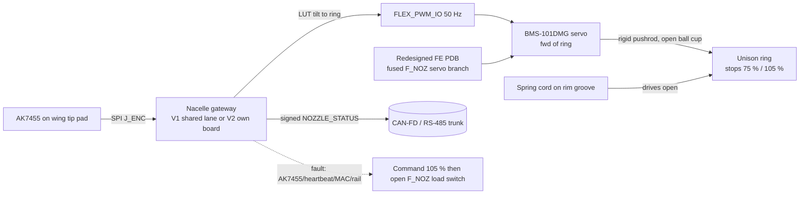
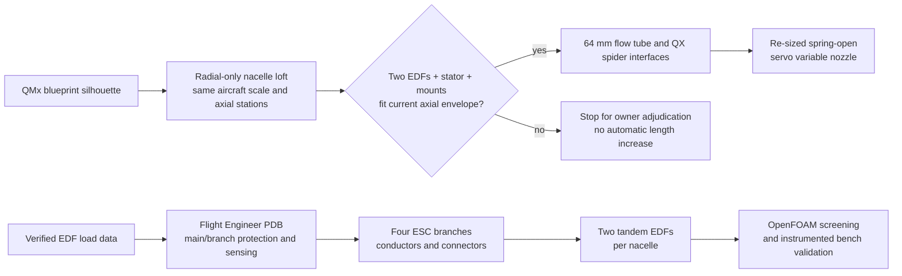
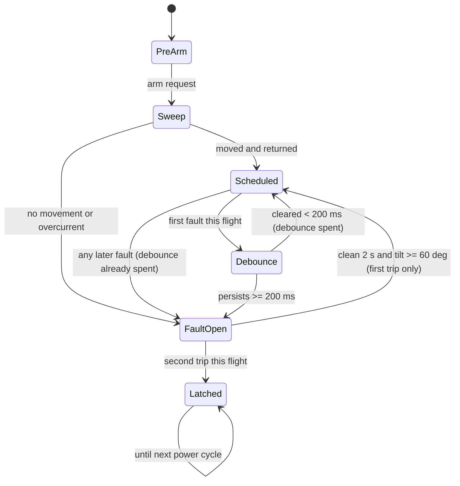
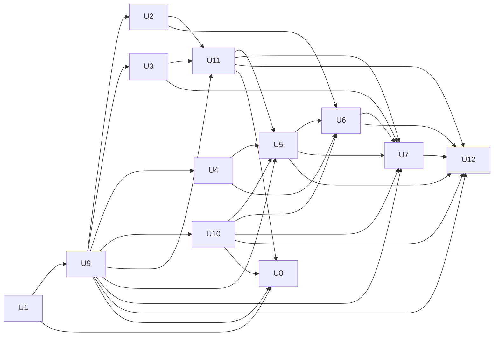

**Author:** Steve Griffing, PE(CSE), CISSP-ISSEP, CEH (GitHub `Stab-Rabbit-coding`) — owner decisions.
**AI contribution:** analysis, ideation synthesis and plan text by Claude (Claude Opus 5.5, Anthropic);
ideation and servo research sub-agents Claude Sonnet 5 (Anthropic). Per `AGENTS.md` AI attribution.
**Plan update:** nacelle-scale, QX-Motor interface, power-system, and verification requirements
added by GitHub Copilot (model not exposed by this host), 2026-10-01.

---

## Goal Capsule

- **Objective:** Fit two QX-Motor 64 mm EDFs and an interstage stator in each nacelle, with a
  servo-scheduled variable nozzle that fails open, while keeping the rest of the aircraft at its
  current scale and preserving the canonical nacelle shape as closely as the required radial
  growth permits.
- **Means:** radially enlarge the nacelle about the thrust axis, hold its current axial length as
  a design constraint, and use the QX motor's 4×M3 / 16 mm bolt-circle interface (KTD8–KTD10).
- **Authority:** owner decisions in this plan's Key Technical Decisions > QMx official blueprint
  pack (REFERENCES.md REF-CAD-003) for canonical exterior proportions > verified manufacturer
  drawings and datasheets > this plan > derivative STL geometry.
- **Stop conditions:**
    - Stop before U6's implementation arm until the owner picks V1 or V2 (D-NZ-1). U6's comparison
    spec is not gated.
    - Stop before releasing geometry if the two complete EDF/motor envelopes, stator, spiders,
    wiring clearances, nozzle and servo cannot fit inside the current axial length. Do not lengthen
    the nacelle, move aircraft structures, or alter the wing/pylon interface without an owner
    decision.
    - Stop if the proposed exterior cannot be reconciled with the QMx blueprint silhouette and the
    approved radial scale-up; record measured deviations rather than silently reshaping it.
    - Stop and report if the U2 margin check fails against the U8 bench load.
    - Stop and report if U8 finds the spring cannot drive the ring to 105 % with the servo
    unpowered or seized at any angle (the full-stroke-slot check in KTD3).
- **Execution profile:** OpenSCAD geometry, Python sizing/check tools, OpenFOAM screening CFD,
  KiCad power-distribution design, bench measurements, BOM and documentation. Firmware behaviour
  is specified in this plan; firmware implementation is not included.

---

## Product Contract

### Summary

Each nacelle uses a radially enlarged, blueprint-derived shell around two 64 mm EDFs and an
interstage stator. One servo inside the pod schedules the nozzle from measured nacelle tilt. Its
push-only link drives the unison ring toward the 75 % position; a spring drives the ring to the
105 % stop if servo power or command is lost, and the open ball-cup must allow fail-open motion even
with the servo seized. Keep the nacelle's current axial length unless the owner explicitly changes
that constraint after a failed stack-fit gate.

The schedule runs on the gateway that reads the AK7455, as a lookup table from tilt angle to ring
position:

| Tilt | Nozzle exit |
| --- | --- |
| 0° | 75 % of bore |
| 90° to 145° | 105 % of bore, held flat |

Loss of servo power opens the nozzle mechanically without electrical power. Reject invalid or
unauthenticated frames without changing actuator state; faults in valid authenticated heartbeat
or AK7455 state follow KTD4's debounce and fail-open policy.

### Problem Frame

The 2026-07-19 passive drive (wing-fixed sun, nacelle pinion and crank, pushrod) cannot be built
for three reasons, found 2026-09-10 and 2026-09-28:

1. **No room for the sun.** It has 0.0 mm of axial space in the Rev T4 trunnion joint
   (`docs/NOZZLE_DRIVE_TRADE.md` § PACKAGING BLOCKER).
2. **Pinion collision.** The pinion, 26.4 mm aft of the pivot, meets the Rev T1 tilt-drive shaft,
   which leaves the wing tip 25.6 mm aft of the spar at wing station 53.6.
3. **Over-travel.** Any continuous 1:1 drive over-strokes the ring past 90° of tilt. Measured with
   `tools/nozzle_linkage_check.py`: ring −40.7° at 140° tilt against a 23.75° stroke. That
   violates the "≥ 90° holds 105 %" requirement over the 145° tilt sweep.

Reopening the datum found no place for a wing-fixed part inside the tip airfoil. The owner chose
Option A on 2026-09-28.

The 2026-09-28 hull scale-up evaluation rejected scaling the whole aircraft, but recommended trying
the larger EDFs on the existing aircraft. The owner then settled a nacelle-only radial scale-up:
preserve aircraft scale and nacelle axial length, use the QMx blueprint pack for exterior
proportions, and enlarge the cross-section only as needed for the 64 mm propulsion stack. The
supplied QX-Motor sheet shows a nominal 41.53 mm EDF axial dimension and a separate QF2822 motor
envelope; verify the drawing datums against an assembled installation before accepting axial fit.

### Provisional Thrust-to-Weight Screen

Using the supplied QF2822-2400KV, 6S table point of 2,135 gf per EDF (4.71 lbf (20.9 N)) and the
existing 90% tandem-stacking assumption gives 16.94 lbf (75.4 N) total nacelle thrust. This is a
screening estimate, not measured installed thrust; U12 owns bench confirmation. The evaluation's
assumed complete-EDF mass of 0.397–0.507 lbm (180–230 g) each, 0.093 lbm (42 g) per ESC, and
0.088 lbm (40 g) Flight Engineer growth allowance gives an estimated AUW of 10.98–11.42 lbm
(4,981–5,181 g) when applied to its 9.77 lbm (4,432.6 g) clean baseline, for T/W ≈ 1.48–1.54
(about 1.52 at 0.441 lbm (200 g) per EDF).

That estimate is not a settled aircraft result. `docs/FIRST_FLIGHT_READINESS.md` separately carries
an unresolved 12.35–12.79 lbm (5.6–5.8 kg) current-AUW estimate. Applying the same estimated
propulsion and PDB increment to that basis gives 13.55–14.44 lbm (6,148–6,548 g) and T/W ≈
1.17–1.25. Both screens exclude the not-yet-measured mass change from radial shell growth, servo
nozzle hardware, wiring, and any PDB redesign beyond the 0.088 lbm (40 g) allowance; neither is a
release mass. U5/U12 must reconcile the mass bases using measured components and recompute T/W from
measured thrust. The first-flight minimum is T/W ≥ 1.2; a result below that floor blocks flight
release and requires a new owner-approved mass or propulsion decision.

### Requirements

- **R1.** Nozzle exit is 75 % of bore radius at 0° tilt and 105 % at every tilt from 90° to the
  145° limit (`airframe/AGENTS.md` "Nacelle Nozzle Drive", reworded per R9).
- **R2.** Servo-rail loss releases the push-only link and the spring drives the nozzle to 105 %
  without electrical power. Reject invalid or unauthenticated frames without changing actuator
  state. Apply KTD4's one-time debounce to faults in valid authenticated heartbeat or AK7455 state;
  an expired heartbeat or invalid sensor state then commands 105 % and disables the servo rail.
- **R3.** No servo or nozzle-drive hardware may stand proud of the enlarged nacelle shell. The
  exterior shell may grow only by the radial-scale decision in KTD8; document its measured
  deviation from the QMx canonical silhouette.
- **R4.** The servo is serviceable without sliding the nacelle off the spar.
- **R5.** Both gateway variants are documented with mounting, wiring (including the wing–nacelle
  joint crossing), weight and CG, so the owner can decide D-NZ-1.
- **R6.** Nacelle mass/CG and PIVOT_Z are re-derived, with no TBDs, including the Rev S3 flap
  shingle mass left open in §1.1.3.1.
- **R7.** BOM, REFERENCES, WBS and generated TODO reflect the new drive. The retired passive drive
  is archived with its attribution chain intact.
- **R8.** A pre-arm check proves the ring moves before flight.
- **R9.** The requirement text is reworded from "driven by nacelle tilt" to "scheduled on measured
  nacelle tilt". The trade study records the decision, the over-travel finding, and the reopened-
  datum result.
- **R10.** Enlarge the nacelle cross-section radially relative to the aircraft, about the EDF thrust
  axis. Do not scale the aircraft or uniformly scale the nacelle axially. Preserve the QMx
  blueprint silhouette and axial stations as closely as the propulsion envelope permits; record
  each necessary exterior deviation from the canonical reference.
- **R11.** Keep the current nacelle axial length and aircraft/wing/pylon stations unchanged. Fit
  two complete QX-Motor 64 mm EDF/motor assemblies, one interstage stator, mounting spiders, wiring
  clearances, and the nozzle inside that envelope. If verified stack dimensions do not fit, stop
  for owner adjudication; do not lengthen the nacelle unilaterally.
- **R12.** Set the nominal thrust-tube flow diameter to 64 mm, subject to verified EDF casing and
  running clearances. Re-derive stator, sleeves, spiders, nozzle throat, flap hinge circle, ring,
  stops, and servo linkage from that flow boundary; do not carry 50 mm radial dimensions forward
  by assumption.
- **R13.** Match both QF2822 spider mounts to four M3 fasteners on a 16 mm bolt circle. Verify
  drawing datums and screw engagement against a physical motor before releasing print geometry.
- **R14.** Redesign the four-ESC power path and Flight Engineer PDB for the verified QX operating
  envelope, including main feed, branch protection, conductors, connectors, current shunts, thermal
  dissipation, BEC/servo supply, and battery capability. Treat 57 A per EDF at 6S and 228 A
  aggregate as candidate sizing inputs, not validated aircraft duty.
- **R15.** Recompute nacelle and aircraft mass, CG, pivot, hover thrust-to-weight, structure, and
  clearances; verify inlet/stator/nozzle flow using sourced or bench-measured boundary conditions.
  Do not reuse the 50 mm mass table or assume a complete-EDF mass from the motor-only value. The
  measured hover T/W must meet the project's 1.2 minimum before flight release; if it does not, stop
  and return for an owner-approved mass or propulsion decision.
- **R16.** Include a monotonic freshness counter in each authenticated `NOZZLE_STATUS` session.
  Receivers reject duplicate or stale status, and a gateway reset requires a new authenticated
  session before status is accepted for pre-arm or flight decisions.

### Scope Boundaries

- In scope: active implementation of the 64 mm nacelle scale-up and servo nozzle; radial CAD and
  blueprint comparison; complete EDF/stator axial fit; ESC/PDB/harness redesign; nozzle linkage
  re-sizing; mass/CG, structural and aerodynamic verification; BOM, REFERENCES and WBS updates.
  Retire or archive passive-drive parts only when confirmed unused by the selected servo design.
- Out: the seal-flap aerodynamic-step VERIFY stays open as a bench item. It is carried by U8,
  not closed.
- Out: scaling the fuselage, wings, landing gear or aircraft as a whole; changing nacelle axial
  length or moving the wing/pylon interface without a separate owner decision; firmware
  implementation; thrust/RPM-aware scheduling (ideation reject #5; revisit after U8 data).

#### Deferred to Follow-Up Work

- Stale BOM rows unrelated to this drive (`PRINT-NACELLE-IDLER*`, `CROWN-M1-12T`, the 72T
  `PRINT-NACELLE-RING` description, `SPAR-TILT-CF4`, `BRG-MF104ZZ`). Log them as a WBS item; don't
  fix them here.
- `airframe/blender-scripts/serenity_render_views.py` still references the stale bare
  `nacelle_nozzle_iris.stl` (already flagged in §1.1.3.1).
- `tools/nacelle_mass_cg.py` treats the retired 1.5 in gear as ACTIVE. U5 switches the default to
  3.0 in (the flight article, per the 2026-09-06 decision); a broader LG audit is out of scope.

### Outstanding Questions

- **D-NZ-1 (blocking for U6's implementation arm only): V1 shared encoder lane or V2 dedicated
  gateway?** The owner has not decided. U6 writes the comparison. Units U1–U5, U7 and U8 do not
  depend on the answer.
- **Axial fit gate (R11):** verify the complete EDF/motor/stator/spider/nozzle stack inside the
  existing axial envelope. If it fails, report the measured shortfall and stop for owner
  adjudication; do not select a longer nacelle unilaterally.
- **QX source verification:** the user-supplied images in
  `docs/references/qx-motor 64mm edf/` show motor/EDF dimensions and performance, but complete EDF
  mass, drawing datums, tolerances, and a catalogued manufacturer document/URL are not established.
  Keep affected values marked for verification until U7 closes this.
- **Power design:** the 57 A per EDF, 60 A ESC recommendation and 100 A motor maximum are
  values shown on the supplied sheet. Continuous aircraft duty, thermal derating, battery
  capability and protective-device coordination remain to be established in U10.
- **Deferred:**
    - Spring part number (only McMaster catalogue categories confirmed). U3 carries a
    "requires verification" row.
    - BMS-101DMG full dimensions and voltage rating (only the case thickness and mass were read).
    U7 records them as requiring verification.

### Sources

- Original ideation artifact: `docs/ideation/2026-09-28-nozzle-servo-actuation-ideation.html`,
  added in Git commit `aa181e23` but absent from this branch's tree. Recover it with
  `git show aa181e23:docs/ideation/2026-09-28-nozzle-servo-actuation-ideation.html` if needed.
- `docs/HULL_SCALE_36IN_EDF64MM_EVALUATION.md` (recommendation 1; reject whole-hull scale-up and
  retain its open EDF mass and power-system uncertainties)
- `docs/references/qx-motor 64mm edf/8-4.jpg`, `8-4.webp`, and `7-2.jpg` (user-supplied QX-Motor
  dimension and performance images; subject to U7 source verification)
- `REFERENCES.md` REF-CAD-003 — QMx official blueprint pack, exterior-proportion authority
- `docs/NOZZLE_DRIVE_TRADE.md`, `avionics/kicad/Bus-Gateway/CAN-PERIPH-GW-1.md` §3,
  `docs/CARGO_DOOR_GATEWAY_SPEC.md` (D-GW-4/5, failsafe), `docs/TILT_ENCODER_WIRING_EMI_SPEC.md`
- Servo specs read on vendor pages 2026-09-28:
    - Blue Bird BMS-101DMG (hyperflight.co.uk `products.asp?code=BMS-101DMG`): 4.5 g, 1.0 kgf·cm,
    0.07 s/60°, 8 mm case.
    - Hitec HS-40 (hitec.uk; servodatabase.com): 20 × 8.6 × 17 mm, 4.8 g, 0.8 kgf·cm at 6 V,
    4.8–6.0 V.
    - AGFRC C1.5CLS linear (amazon.com listing B07QGYBV1H): 21.4 × 15.2 × 6.0 mm, 1.5 g,
    120/240 gf, stroke listed inconsistently (7 vs 9 mm).
- ArduPilot `SERVOn_FSPWM` per-output failsafe PWM
  (ardupilot.org/plane/docs/apms-failsafe-function.html), cited as precedent for a commanded fail
  position.

---

## Planning Contract

### Key Technical Decisions

- **KTD1 — Option A, servo scheduled from the AK7455** *(session-settled: user-directed — chosen
  over the wing-tip sector + spring rod and the wider joint gap: those had exposed hardware, a jam
  path into the tilt drive, and nacelle-off service)*.
- **KTD2 — Servo: Blue Bird BMS-101DMG primary, Hitec HS-40 alternate** *(session-settled:
  user-directed "use the smaller servo you found, unless there's a linear one that works
  better")*.
    - **BMS-101DMG (4.5 g, 8 mm case, metal gear):** the smallest rotary candidate. Its full L×W and
    voltage range were not published on the page read, so they are "requires verification". The
    HS-40 is the fully dimensioned fall-back if the BMS-101DMG fails the 6 V rating or the U4 fit.
    - **Force check:** a ~90° servo sweep driving 13.2 mm of lever chord needs an arm of
    13.2 / (2 sin 45°) ≈ 9.3 mm (0.37 in). At 1.0 kgf·cm (0.098 N·m) that gives a pull of
    ≈ 10.5 N (2.4 lbf).
    - **Linear servo rejected:** the AGFRC C1.5CLS delivers at most 2.4 N (0.54 lbf) at 6 V. Its
    stroke is listed inconsistently, and the lever arm would have to shrink to about 21 mm to match
    that stroke. It cannot hold against any open-spring worth having, so it is recorded as
    rejected unless U8 measures a total closing load under about 1 N.
- **KTD3 — Rigid pushrod into an OPEN ball cup; spring cord opens** *(session-settled:
  user-approved; corrected 2026-09-29, third and final revision)*.
  This remains the selected fail-open topology; its 50 mm ring, hinge, spring and linkage dimensions
  are not valid for the 64 mm design and must be re-derived in U11.
    - A rigid rod (COTS M3 ball stud, the same part the pre-Option-A pushrod used) drives the ring's
    lever ball at r 32 mm, exactly the chord/angle relationship `tools/nozzle_linkage_check.py`
    already solved for this ring — this is proportional position control, not a hard stop.
    - The ring-side socket is an **open cup** (a hemisphere plus a clear exit channel, not a
    captured sphere): the rod can only push the ball in. Nothing retains the ball against the
    cup once the rod stops pushing, so a dead, unpowered, **or seized** servo cannot hold the
    nozzle closed — the ball simply lifts out as the spring cord (wrapped on a rim groove, r
    32.35 mm) drives the ring to its 105 % stop.
    - Hard stops are additive lugs projecting inward from the housing's own bore wall, just outside
    the ear's normal 157.5°→133.75° sweep, so the ear only reaches them on overtravel.
    - **Two earlier corrections, both superseded, kept here as the record so they are not
    retried:**
    1. *2026-09-28, first cut* — a pull-only slotted ear. Rejected same day: a seized pull link
       still blocks the ring paying out toward open.
    2. *2026-09-28, second cut* — a push-only wire tangent to the ear's flat flank. Rejected
       2026-09-29: kinematically broken (a fixed point contacting a **rotating flat face** is
       coincident with it at one angle only, not a continuous range — confirmed when the wire's
       required contact radius ran past the ear's own tip near both ends of the stroke) and it
       still needed a window straight through the housing's exterior-mould-line wall to reach the
       ear, the same packaging cost item 3 below already flagged.
    - A direct axial-shaft servo arm remains rejected (2026-09-28 packaging check): the wing servo's
    15.3 mm shaft-axis height cannot stand radially in the ~10 mm annulus, and it cannot track the
    ear's arc within the flank's narrow radial span — hence a rod, not an arm, at the ring.
    - **Packaging cost accepted:** the ear (tip r 35.0 mm, matching the original pre-Option-A
    reach) stands past the housing bore (33.6 mm), so a small window through the housing wall,
    spanning only the ear's own 32.3° stop-to-stop sweep, lets the rod reach it — a fairing-
    covered actuator slot at the inboard flap gap, consistent with how real variable-nozzle
    linkages (REF-CAD-001) cross their cowl. Flagged for the U8 bench check the pre-Option-A
    design also deferred ("Pushrod clearance/interference check").
    - Spring sizing target: at least 1.5 × (measured opening-side friction) and no more than 40 %
    of servo stall push, pending U8.

- **KTD4 — The schedule runs on the gateway that reads the AK7455** *(user-approved at scoping:
  chosen over flight-computer-commanded nozzle position)*.
    - The tilt-to-ring lookup table holds flat from 90° to 145°. The over-travel is fixed by
    construction.
    - Flight computers receive signed `NOZZLE_STATUS` frames containing commanded position, sweep
    result, fault flags, and a freshness counter. Receivers reject duplicate and stale status before
    using it for pre-arm or flight decisions. Flight computers do not command nozzle position.
    - Reject invalid or unauthenticated frames and log the rejection without changing actuator state.
    Do not treat a bad MAC by itself as a valid fault command. Loss of the authenticated heartbeat,
    invalid AK7455 state, servo-rail fault, gateway reset, or watchdog expiry enters the fail-open
    path.
    - A gateway watchdog resets the MCU if its control loop stalls. A hardware pull-down holds the
      `F_NOZ` high-side switch **off during gateway reset, brownout,
    watchdog reset, or unpowered state**. The gateway may energize the servo only while its health
    output is valid. This makes a gateway hang or reset remove servo power without requiring gateway
    firmware to execute. Servo-rail loss mechanically releases the push-only link so the spring
    drives the ring to 105 %. On a debounced valid-state fault, command 105 % and then disable the
    switch; do not rely on stopping PWM because a digital servo may hold its last pulse when signal
    is lost. Door firmware must not be reused unchanged.
    - **Debounce and re-arm:** the first authenticated-heartbeat or AK7455 fault shorter than 200 ms
    in a flight does not trip. The debounce forgives once only; a later valid-state fault of any
    duration trips immediately. Servo-rail loss, gateway reset, and watchdog expiry bypass the
    debounce and open mechanically through the reset-default-off switch. A tripped valid-state fault
    latches open until the AK7455 angle and authenticated heartbeat have both been clean for 2 s and
    the tilt is ≥ 60°; then the schedule resumes. A second debounced fault in the same flight latches
    until power cycle. Both timing values are starting points for U8 to tune.
- **KTD5 — Servo forward of the ring, inside the pod** *(user-approved at scoping)*.
    - The servo lies flat in the annulus: 8 mm case thickness radial, 22 mm axial, and the shaft
    oriented so its 9.31 mm crank arm swings a rigid ball-link rod up to the housing window at the
    ear's sweep. The servo station can sit wherever the rod geometrically reaches, preferably
    behind an existing access cover (R4).
    - The ear sweeps 157.5° (closed) → 133.75° (open), because the ring opens clockwise.
    - A faired blister is the fall-back only (R3).
- **KTD6 — Servo power from a fused branch of the 6 V servo rail in both variants** (door
  precedent D-GW-4). Only signal and GND use `J_FLEX`. The 6 V pair crosses the joint through the
  spar bore with the power feeds, under the same braid/ferrite rule as the encoder pair.
- **KTD7 — Retire, don't park, the passive drive.** Archive `nacelle_nozzle_sync_gears.scad`,
  `nacelle_nozzle_pushrod.scad`, their STLs and Makefile targets. Keep the
  `nozzle_linkage_check.py` negative results as the historical record, pointed at from the trade
  doc.
- **KTD8 — Nacelle-only radial scale-up** *(session-settled: user-directed — chosen over scaling
  the full aircraft or lengthening the nacelle; it preserves the aircraft scale and canonical
  proportions while addressing EDF diameter)*. Scale radial sections about the EDF thrust axis;
  preserve axial stations and current length. The QMx official blueprint pack is the exterior
  proportion authority; the derivative nacelle STL is only a build reference. Any change to axial
  length, aircraft scale, wing, or pylon requires owner adjudication.
- **KTD9 — QX propulsion interfaces** *(session-settled: user-directed — 64 mm thrust tube and
  QF2822 spider mounts)*. Use two 64 mm EDFs in tandem with a stator between them, a nominal 64 mm
  thrust-tube flow diameter, and four M3 mounting holes on a 16 mm bolt circle at each motor
  spider. The supplied 41.53 mm EDF dimension and motor protrusion must be datum-checked before the
  axial stack is frozen.
    - **Alternative REJECTED 2026-10-05 (owner):** HET Typhoon EDF 2W-25 / 2W-30 (and the linked
    1W-35) in place of the QX QF2822 [REF-EDF-004]. On 6S with the QX rotor they give no thrust
    gain at equal current margin (2W-25 0.94x, 2W-30 ~0.86x; a mixed set +7 % only above the
    2W-25 rating), have Ø4 shafts and no published bolt pattern. QX QF2822 retained; stages
    co-rotate within each nacelle, port/starboard mirrored (in-nacelle counter-rotation brings
    no torque or aerodynamic gain with stators on both stages, needs an unconfirmed CCW QX
    rotor, and only removes a ~0.5 N·m differential-tilt gyro coupling the FCS can reject).
- **KTD10 — Size power hardware from verified loads, not placeholder ratings.** The supplied
  sheet's 57 A per EDF and 60 A ESC recommendation are screening inputs only. Do not freeze an
  80 A ESC, fuse, conductor, connector, shunt or battery rating until continuous/transient duty,
  thermal derating and fault coordination are analysed and verified.

### High-Level Technical Design

#### Gateway variants (D-NZ-1) — first-pass numbers for U6 to firm up

"est." = engineering estimate pending weighing; everything else is from the repo or a vendor page.

| | **V1 — shared AK7455 encoder lane** | **V2 — dedicated N_STACKS=1 gateway** |
| --- | --- | --- |
| Board | No additional MCU board. Add one `F_NOZ` high-side switch per nacelle to the shared encoder-lane hardware; `FLEX_PWM_IO` is only the PWM signal, not servo power. | +1 board per nacelle, 49.0 × 25.5 × 1.6 mm, ~6 g VERIFY; include the `F_NOZ` switch and reset-default-off hardware. |
| Mounting | wherever the encoder gateway lives. **It is not yet placed in any SCAD or in the mass roll-up**, so U6 must place it: nacelle flank near the ESC bays | card-edge tray (door-tray pattern, D-GW-5) at the forward ESC bay, behind the bay cover, next to the servo |
| Wiring across the joint | + 6 V pair and switch-control/health wiring as required by switch placement (KTD6) | + 6 V pair + isolated CAN-FD pair + RS-485 pair + GND + board RAIL-2 feed |
| Mass per nacelle (rotating) | servo 4.5 + link ~1 est. + spring ~1 est. + mount ~1.5 est. + lead ~0.5 est. − pushrod 3.6 = **+4.9 g (0.011 lbm)** | V1 + board 6 + tray ~3 est. = **+13.9 g (0.031 lbm)** |
| Mass per nacelle (fixed wiring) | 6 V pair 22 AWG ~0.7 m ≈ 4.2 g est. | V1 + bus pairs ≈ 11 g est. more |
| Aircraft total vs deleted drive | **≈ +19 g (0.042 lbm)** | **≈ +59 g (0.13 lbm)**, about +40 g over V1; both estimates exclude the new switch hardware until U5 weighs it. |
| PIVOT_Z shift (560 g assembly) | ≈ +0.34 mm aft from the drive swap; +1.2 mm more from the shingle-flap correction | V1 + board at ~Z 95–120 → ≈ ±0.2 mm |
| Common-mode exposure | One gateway fault loses tilt feedback and nozzle command together; the hardware-default-off switch releases the nozzle spring-open, while the tilt loop loses its sensor. | Nozzle and encoder fail independently. |
| Service | servo behind an ESC-bay-adjacent cover; gateway unchanged | same, plus one more board to provision (keys, firmware image) |
| Assurance | the encoder lane gains a second endpoint class (actuator). SCA mapping must cover mixed sensor/actuator roles on one MCU | same class as the door gateway; the existing mapping is reused |

### Assumptions

- The nacelle encoder gateway sits in the nacelle, as `TILT_ENCODER_WIRING_EMI_SPEC.md` §2.1
  says ("at nacelle pivot housing"). U6 confirms and places it.
- Servo sweep is about 90° over 1000–2000 µs (typical RC). U8 measures it.

### Sequencing

---

## Implementation Units

### U1. Record the decision and retire the passive drive

**Goal:** Documents and archive reflect KTD1/KTD7, and the superseded §1.1.3.1 and §1.1.3.3 items
are closed.

**Requirements:** R7, R9.

**Dependencies:** none.

**Files:**
- Docs:
    - `docs/NOZZLE_DRIVE_TRADE.md` — decision amendment, reopened-datum result, over-travel finding.
    - `airframe/AGENTS.md` — "Nacelle Nozzle Drive" wording.
    - `airframe/wings-nacelles/WBS.md` — §1.1.3.1, §1.1.3.3.
    - `airframe/wings-nacelles/TODO.md` — regenerated, not hand-edited.
- Archive:
    - `airframe/openscad/nacelles/nacelle_nozzle_sync_gears.scad`
    - `airframe/openscad/nacelles/nacelle_nozzle_pushrod.scad`
    - `airframe/openscad/nacelles/gear_option_compare.scad`, plus `gear_shell_compare.scad` if it
    is tracked.
    - Their STLs, Makefile targets, and the `port_tilt_spar_assembly.scad` sync block.
- Assembly and indexes:
    - `airframe/FreeCAD-scripts/serenity_assembly.py` — spar-crank placement.
    - `PROJECT_INDEX.md` and `ARCHIVE_INDEX.md` — regenerated.

**Approach:**
1. Amend the trade doc with a dated DECISION AMENDMENT (Option A, 2026-09-28). Record:
   - the reopened-datum search;
   - the pinion-vs-tilt-shaft collision;
   - the 0→145° over-travel sweep table.
2. Keep `nozzle_linkage_check.py` and add a pointer from it to the amendment. Don't delete it: it
   is the negative-result record.
3. Close these WBS items with the dated reason "superseded by Option A":
   - RSSR NO-GO;
   - adopted sun/pinion drive;
   - spar-crank re-hub;
   - KTD3 blocker;
   - sync-gears parked;
   - pushrod clearance check;
   - spar-crank placement;
   - gear-compare WIP.
4. Close the §1.1.3.3 protrusion item as stale since 2026-07-18.
5. Close the hinge-boss item as ACCEPTED RESIDUAL. Under the repo's stale-checkbox rule an accepted
   item is closed, not open.
6. Add the new §1.1.3.1 Option A subsection mirroring U2–U8.
7. Move the archived files to the repo's archive location (see `ARCHIVE_INDEX.md`) with their
   attribution headers intact, then regenerate TODO and the indexes.

**Patterns to follow:** the Stage 4 gear-train archive (§1.1.3.1 Rev S2); the
`tools/gen_todo_from_wbs.py` "never hand-edit TODO" rule.

**Test expectation:** none — documentation and archive only. The render and index gates in the
Verification Contract still apply.

**Verification:**
- No active file `use<>`s or imports an archived SCAD.
- `serenity_assembly.py` no longer places the spar crank.
- The regenerated TODO lists no superseded item.

### U2. 64 mm nozzle schedule and servo linkage tool

**Goal:** One re-runnable tool for the 64 mm Option A drive. It works out:
- the ring angle for a given servo angle through the rigid pushrod / open ball cup;
- the spring/servo force margins;
- the tilt → ring → PWM lookup table with the 90–145° hold.

**Requirements:** R1, R2, R12, R15, KTD2, KTD3, KTD4, KTD9.

**Dependencies:** U1 and U9 (the 64 mm geometry and provisional servo envelope are known).

**Files:** `tools/nozzle_servo_linkage.py` (new);
`tools/tests/test_nozzle_servo_linkage.py` (new).

**Approach:**
1. Source the re-derived 64 mm constants from `nacelle_nozzle_iris.scad`, citing file/line as
  `nozzle_linkage_check.py` does. Do not carry forward the 50 mm `RING_LEVER_R`, `R_HINGE`,
  ring, flap or spring dimensions without re-derivation.
2. Take U9's provisional servo station/envelope candidate as an input. U4 owns final servo
  placement and verifies the complete shell and service fit after the nozzle geometry is resolved.
3. Compute:
   - the arm radius and sweep;
   - servo pull against spring force plus measured flap load (U8 value as input, 20 N placeholder
     flagged);
   - the minimum transmission angle;
   - the lookup table as exit % → ring ψ → servo angle → µs.
4. Emit the table as a data file for U6 to embed.

**Patterns to follow:** `tools/nozzle_linkage_check.py` (constant sourcing, transmission-angle
convention, pass/fail exit codes).

**Test scenarios:**
- 0° tilt → 75 % of the 64 mm nominal bore radius (24 mm); 90° → 105 % (33.6 mm), each within
  0.1 mm of the verified flow-boundary target.
- 90°, 120°, 145° all give identical ring angle (flat hold); 150° is clamped with a warning.
- Invalid or NaN tilt input → table lookup returns the 105 % command.
- Spring force above 40 % of servo pull → margin check fails with a non-zero exit.
- The AGFRC linear servo run through the same check at 2.4 N → fails at the 20 N placeholder, and
  passes only below about 1 N.
- The table is monotonic in tilt from 0° to 90°.

**Verification:**
- The tool passes its tests.
- The default run prints PASS with the BMS-101DMG and the placeholder load flagged "pending U8".

### U3. Ring stops, spring-cord groove and open ball-cup ear — 50 mm baseline DONE (2026-09-29)

**Goal:** Preserve the KTD3 fail-open topology. The existing CAD is a 50 mm baseline only; re-size
the hardware for 64 mm before treating this unit as complete for the active design. The iris hardware
carries hard 75 %/105 % stops (additive housing-bore lugs), a
spring-cord rim groove + housing-side anchor rib, an open (uncaptured) ball cup on the ear, and a
housing window sized to the ear's own sweep for the pushrod to reach it.

**Requirements:** R1, R2, R3.

**Dependencies:** U2 and U9 for the 64 mm implementation (the historical 50 mm baseline is already
rendered).

**Files:**
- `airframe/openscad/nacelles/nacelle_nozzle_iris.scad`
- Re-rendered `nacelle_nozzle_ring.stl`, `nacelle_nozzle_throat.stl` and `-closed`/`-open` asm
  STLs.
- `airframe/FreeCAD-scripts/Makefile` if targets change.

**Approach (as built, commit history 566b860c → 6b29b671 → 2026-09-29 correction):**
1. The ear restores the original (pre-Option-A) `RING_LEVER_R` (32 mm) / `RING_BALL_D` (3 mm,
   COTS M3 ball stud) geometry and tip reach (35.0 mm) — proven chord kinematics, not a new
   contact model.
2. The ball socket is cut as a hemisphere **plus a clear exit channel** extending radially
   outward through the rest of the ear (an open cup, not `sphere()`'s full captured void): the
   rod presses the ball in; nothing retains it once the rod stops pushing.
3. Stops are additive lugs projecting inward from the housing's own bore wall (r 33.6→33.3), just
   outside the ear's 157.5°→133.75° sweep so the ear only reaches them on overtravel; they clear
   the plain ring rim (33.1 mm) by 0.2 mm.
4. A single housing window (r 33.1→36.6, the ear's own stop-to-stop azimuth span, full ring
   height) lets the rod reach the ear from outside — sized to the sweep, not wider.
5. The spring cord runs in a groove on the ring rim (the ring itself is the spring seat) and
   anchors, housing-side, to a small rib on the housing's own bore wall at the flap gap
   diametrically opposite the ear (337.5°) — clear of the window, the cam slots and the flap
   clevises.
6. The ring's cam-only geometry is unchanged in the historical 50 mm baseline. Re-derive the
  ring, flap kinematics and `R_HINGE` for the active 64 mm design in U11.

**Rework note (2026-09-29):** two earlier cuts of this unit (a pull-only slotted ear, then a
push-only wire tangent to a flat ear flank) were built, rendered, and found defective during U4's
routing check before either was field-usable — see KTD3 above for the full record. Manifold
sweep verification (0° → −23.75° psi) now shows 0 mm³ interference throughout the operating
range and correct blocking beyond each stop.

**Patterns to follow:** the Rev S2 cam-only ring change set; the `RENDER_PART` selector convention;
the pre-Option-A pushrod's own ball/socket numbers (only the socket's openness changed).

**Test scenarios:**
- Each print part renders `Simple: yes` and is watertight in `tools/validate_stls.py`.
- Ring-vs-housing manifold overlap is 0 mm³ from ψ = 0° to ψ = −23.75° and strictly positive
  (blocked) beyond either end — verified with `manifold3d`, not asserted from drawing inspection.
- Legacy 50 mm baseline only: ring ψ = 0 and ψ = −23.75° produce flow-boundary radii 18.75 mm
  and 26.25 mm. These are not acceptance values for the active 64 mm geometry; U11 verifies the
  re-derived 24.0 mm and 33.6 mm nominal endpoints.
- The spring seat does not intersect any flap at either stop.

**Verification:**
- The legacy 50 mm assembly renders reproduce their recorded exit radii; U11 owns active 64 mm
  endpoint verification.
- The housing OD envelope is unchanged or smaller (checked with
  `tools/nacelle_housing_profile.py`).

### U4. Servo mount, pod pocket and fit check

**Goal:** Place the servo forward of the ring inside the blueprint-guided radial shell (KTD5/KTD8) with a flush
access cover, and prove the fit.

**Requirements:** R3, R4.

**Dependencies:** U2, U3, U9 and U11.

**Files:**
- `airframe/openscad/nacelles/nacelle_nozzle_servo_mount.scad` (new).
- `airframe/openscad/nacelles/nacelle_pod_50mm_tandem.scad` (pocket and cover seat).
- `airframe/openscad/nacelles/nacelle_esc_cover.scad` if the cover is shared.
- Re-baked `nacelle_port_revs.stl` and `nacelle_stbd_revs.stl` via `tools/bake_hull_frame.py`.

**Approach:**
1. Search the blueprint-guided, radially enlarged shell for a forward servo station using the
  verified servo envelope, installation clearance and required wall thickness. Use the current
  ESC-bay and cover interfaces, and keep the nacelle's axial length unchanged. This unit is the
  sole owner of final servo-mount placement.
2. Place the servo and its crank so a rigid pushrod (COTS ball-link rod + the M3 ball stud
   already at the ring's lever, U3) reaches the housing window at the ear's sweep (157.5°→133.75°,
   window centred there). Route the spring cord from its housing-side anchor (337.5°, the
   diametrically-opposite flap gap) back to wherever the servo's own structure can anchor it, or
   to a dedicated boss if not. Keep both clear of the aft spider sleeve and the EDF2 phase leads.
3. Side-dependent geometry is keyed on `PYLON_SIDE`. Remember the known trap: NACELLE_SIDE is
   inverted relative to the filename.
4. If no station fits inside the approved shell and mould-line deviation, stop per the Goal Capsule;
  do not add a blister or extend the shell without owner sign-off.
5. Note: the servo, mount, rod and ring are all rigid parts of the nacelle assembly, which rotates
   as one body about the trunnion — nacelle tilt does not change any distance between them. The
   fit check below needs one pose, not a tilt sweep; a tilt sweep matters only for parts that cross
   the wing–nacelle joint, which this unit's parts do not.

**Patterns to follow:** `nacelle_esc_bay.scad` / `nacelle_esc_cover.scad` flush-cover pattern;
`tools/cargo_layout_fit.py`-style interference report.

**Test scenarios:**
- Servo, mount, crank and rod have 0 mm³ intersection with the duct, stator/aft spider sleeves,
  ESC bays and harness troughs, checked in the nacelle's own rigid frame (see Approach step 5 —
  one pose suffices).
- Minimum wall around the pocket ≥ 1.5 mm (3 perimeters at 0.4 mm).
- The rod sweeps its ball-cup end through the ring's ear window across the full 23.75° stroke with
  0 mm³ interference against the housing (this repeats U3's own manifold sweep check, now with the
  rod present too).
- Both baked shells are watertight single bodies.

**Verification:**
- The interference report is clean.
- The shells validate.
- The servo can be removed by opening the cover alone.

### U5. Nacelle mass, CG and PIVOT_Z re-derivation

**Goal:** `tools/nacelle_mass_cg.py` reflects the complete 64 mm Option A nacelle, aircraft mass
budget, CG and PIVOT_Z and converges.

**Requirements:** R6, R11, R14, R15, R10.

**Dependencies:** U3, U4, U9, U10 and U11.

**Files:** `tools/nacelle_mass_cg.py`; `airframe/openscad/nacelles/nacelle_pod_50mm_tandem.scad`
(`PIVOT_Z` iteration); `airframe/wings-nacelles/WBS.md` §1.1.3.1 (shingle mass/CG item) and
§1.1.4 (NAC-64-SERVO-01 mass/CG/T-W acceptance).

**Approach:**
1. Replace the 50 mm EDF, stator, sleeves, shell and nozzle rows with weighed or mesh-derived 64 mm
  parts. Record each QF2822 motor's measured 135 g sheet value separately from the complete EDF
  unit; do not estimate complete-unit mass by thrust analogy.
2. Re-measure the 64 mm master/seal flaps, ring, throat, spring, servo, link, mount, ESCs and wiring.
  Do not assume the 50 mm 40 mm flap mass or existing pushrod-row value carries over.
3. Add a variant switch so V1 and V2 gateway rows are both reportable. V2's board needs a real
   mass: weigh it, or use the 3.7 g FR4 estimate plus parts, marked VERIFY.
4. Recompute hover clearance against the aircraft's currently selected landing-gear configuration;
  retain the alternate gear as a separate reported case.
5. Iterate PIVOT_Z to convergence with the fixed axial stations and radially scaled mass model.

**Test scenarios:**
- The fixed-point assertion holds.
- Reported PIVOT_Z matches the SCAD within 0.1 mm after iteration.
- The V1 and V2 totals differ by exactly the gateway rows.
- Hover clearance is reported against the 3.0 in gear.

**Verification:** the roll-up converges. Its numbers replace the U6 table's first-pass estimates.

### U6. Nozzle-servo gateway spec — present V1 and V2, then implement the chosen one

**Goal:** A spec in the door-gateway document's shape that lets the owner decide D-NZ-1, then
records the chosen variant's integration with the 64 mm servo load and redesigned PDB.

**Requirements:** R2, R5, R8, R16, KTD4, KTD6.

**Dependencies:** U2 (lookup table), U4 (servo station), U5 (masses), and U10 (verified 6 V rail
and fuse/load-switch design).

**Files:**
- `docs/NACELLE_NOZZLE_SERVO_SPEC.md` (new).
- After D-NZ-1:
    - `avionics/kicad/Bus-Gateway/CAN-PERIPH-GW-1.md` and its schematic/PCB (V1 shared-lane
    integration or V2 dedicated gateway, including `F_NOZ` switch control and reset default);
    - `docs/TILT_ENCODER_WIRING_EMI_SPEC.md`;
    - `docs/POWER_DISTRIBUTION.md` (redesigned EDF distribution and the `F_NOZ` 6 V branch);
    - `avionics/WBS.md` and `airframe/wings-nacelles/WBS.md` §1.1.4.

**Approach:**
1. **Decisions table** (the door spec's D-GW pattern) covering:
   - one high-side `F_NOZ` switch per nacelle, controlled by the gateway and held off by hardware
     pull-down while the gateway is unpowered, in reset, brownout, or watchdog reset;
   - a contingent 3.3 → 5 V level shifter, fitted only if U8 item 3 fails (cargo-door harness
     precedent);
   - servo pinning, `J_FLEX` pin 4 `FLEX_PWM_IO`;
   - power (`F_NOZ` fuse sized from the measured stall);
   - the joint crossing;
   - failsafe polarity and invalid-frame behavior (KTD4): reject and log invalid/unauthenticated
     frames without changing actuator state; fail open on expiry of valid authenticated state;
   - signed `NOZZLE_STATUS` freshness counter and receiver replay/duplicate rejection (R16);
   - the pre-arm sweep state machine above (R8).
2. Place the nacelle encoder gateway physically. It is currently unplaced and unweighed.
3. Write the V1/V2 comparison from the Planning Contract table with U5 numbers substituted. End it
   with the owner decision box.
4. After the decision, write only the chosen arm into the board, EMI and power docs, and record
   the rejected arm's reason.

**Patterns to follow:** `docs/CARGO_DOOR_GATEWAY_SPEC.md` structure (decisions, BOM delta,
`J_FLEX` table, firmware contract, placement table, open items).

**Test scenarios:**
- Spec review checklist: servo-rail loss, authenticated-heartbeat expiry, invalid AK7455 state,
  gateway reset, and watchdog expiry each map to the specified spring-open behavior; invalid or
  unauthenticated frames are rejected and logged without changing actuator state.
- The selected gateway variant contains the per-nacelle `F_NOZ` high-side switch with a
  reset-default-off control. Verify the switch actually removes power if the MCU is held in reset.
- Stall the gateway control loop and verify the watchdog resets the MCU, the switch defaults off,
  and the spring opens the nozzle without a firmware fail-open command.
- `NOZZLE_STATUS` freshness is signed into the frame, and receivers reject duplicate or stale
  status; after gateway reset they require a new authenticated session before accepting a pre-arm
  sweep result.
- The debounce/re-arm table matches the state diagram: one forgiven sub-200 ms glitch per flight,
  any later valid-state fault trips at once, gateway reset/power faults bypass debounce, 2 s clean
  plus tilt ≥ 60° re-arms once, and a second debounced trip latches.
- The `J_FLEX` pin table matches the §3 net names.
- Each variant's joint-crossing conductor count and mass is listed and summed.
- No row reuses the door "hold last" failsafe.

**Verification:**
- The owner can decide D-NZ-1 from the spec alone.
- After the decision, the three downstream docs agree on pin, fuse and route.

### U7. BOM and REFERENCES

**Goal:** The parts list and citations match the design.

**Requirements:** R7.

**Dependencies:** U3, U4, U5, U6, U9, U10 and U11.

**Files:**
- `current-specification/bom_revS.csv` and `bom_revS.json` (mirror trap: edit both, or regenerate
  the JSON).
- `REFERENCES.md`.
- A BOM edit script `tools/bom_edit_nozzle_servo.py` (new), following `tools/bom_edit_door_gateway.py`.

**Approach:**
1. Add rows:
   - four QX-Motor EDF/motor assemblies, stators, revised spiders and the 64 mm thrust tube, using
     measured mass and verified manufacturer identifiers;
   - four ESCs, revised PDB protection/current-sense parts, battery/wire/connectors only after U10
     closes the sizing;
   - `SERVO-NOZZLE` (BMS-101DMG ×2);
   - `SPRING-NOZZLE-OPEN`;
   - `ROD-NOZZLE-PUSH` (COTS ball-link pushrod, same class the pre-Option-A drive used) and
     `CORD-NOZZLE-SPRING` (Dyneema Ø0.5 mm);
   - `PRINT-NOZZLE-SERVO-MOUNT`;
   - `FUSE-F_NOZ`;
   - `SW-F_NOZ` (the high-side load switch);
   - a contingent `LVLSHIFT-NOZ` row at Qty 0 until U8 item 3 decides it;
   - the harness;
   - V2 rows only if chosen.
2. Retire, with Qty 0 and a dated note: `PUSHROD-BALL-M3`, `BALLSTUD-M3`, `PRINT-PUSHROD-CRANK`.
3. Add REFERENCES entries with validated URLs and cited sections:
   - BMS-101DMG, HS-40, and AGFRC C1.5CLS as the rejected record;
- ArduPilot failsafe docs;
- QX-Motor manual and dimension drawing, after obtaining a validated manufacturer source and
    identifying the dimension datums. Keep the supplied images as evidence, not a substitute for
    the catalogued primary reference.
4. Mark unread specifications "requires verification", with a TODO §0.x item each.

**Test scenarios:**
- CSV and JSON parse, and match on every row.
- The retired rows total 0 g.
- The aircraft total changes by the U5 per-nacelle deltas × 2.
- Every new REF-ID is cited from at least one repo location listed in its entry.

**Verification:**
- BOM totals reconcile with U5.
- The REFERENCES orphan check (existing tool/CI) passes.

### U8. Bench and flight-readiness verification items

**Goal:** The unknowns this plan cannot settle on paper become tracked WBS bench tasks with
pass/fail criteria.

**Requirements:** R2, R8, R16, KTD2, KTD3, KTD4.

**Dependencies:** U1, U9, U10 and U11.

**Files:** `airframe/wings-nacelles/WBS.md` §1.1.3.1 (legacy nozzle bench items) and §1.1.4
(NAC-64-SERVO-01 bench gates); `docs/FIRST_FLIGHT_READINESS.md` (gate row).

**Approach:** add these items:
1. Flap hinge moment: lever-ear force at r 32 mm, at 75 % and 105 %, fan off and at hover throttle.
2. Servo sweep and µs map on the sourced unit.
3. BMS-101DMG at 6 V and reliable 3.3 V PWM input, or a level shifter.
4. Stall current, to size `F_NOZ`.
5. Spring rate selection against item 1.
6. Pull the servo plug with the 64 mm EDFs at the agreed test point → ring reaches the re-derived
  105 % position within 0.5 s.
7. Seal-flap aero step, which stays open from Rev S3.
8. **Unpowered and seized servo:** with the servo unpowered, and again with the servo arm locked
   at each of 75 %, 90 % and 105 %, the spring drives the ring to 105 % through the slot within
   0.5 s. This is a stop condition in the Goal Capsule.
9. Hold the gateway in reset, force brownout, and stall its main loop; verify the hardware-default-
   off switch removes servo power and the ring reaches 105 % without gateway firmware execution.
10. Inject invalid-MAC and unauthenticated frames; verify the gateway rejects/logs them without
  changing nozzle state. Replay duplicate and stale signed `NOZZLE_STATUS` frames; verify
  receivers reject them for pre-arm and in-flight decisions.
11. BMS-101DMG signal-loss behaviour (hold or go limp), recorded for the record. The failsafe does
  not depend on it because the switch removes servo power.
12. Measure cruise penalty of the 105 % fault state at 0° tilt (thrust change and trim), plus tune
  the 200 ms and 2 s debounce/re-arm timers.
13. Verify each 64 mm motor/ESC branch current and temperature, PDB/shunt temperature, connector
  temperature, harness temperature and battery sag at the approved continuous and transient test
  points; compare against U10 limits.

**Test expectation:** none in this plan — these are the tests. Each WBS item states its own
pass/fail criterion.

**Verification:** the first-flight readiness plan carries a nozzle fail-open gate.

---

### U9. Blueprint-guided radial nacelle scale and axial fit

**Goal:** Produce a radially enlarged nacelle that packages two complete 64 mm QX-Motor EDF/motor
assemblies and an interstage stator, while retaining the current axial length and keeping the
canonical silhouette as close as practical.

**Requirements:** R10, R11, R12, R13; KTD8 and KTD9.

**Dependencies:** U1.

**Files:** `airframe/openscad/nacelles/nacelle_pod_50mm_tandem.scad`; the applicable EDF sleeve and
spider sources; `tools/nacelle_axial_fit.py` (new); `tools/nacelle_housing_profile.py`; the nacelle
build notes and `airframe/wings-nacelles/WBS.md` §1.1.4 (NAC-64-SERVO-01).

**Approach:**
1. Use QMx REF-CAD-003 as the authority for visible proportions. Compare normalized nacelle
  silhouettes at matching axial stations; use the Thingiverse-derived STL only as the parametric
  build base, not as proof of canonical shape. Do not copy QMx geometry.
2. Scale radial sections about the EDF thrust axis only. Keep aircraft scale, nacelle axial length,
  pivot station and wing/pylon interfaces unchanged. Make only the local fairing changes needed
  to preserve the silhouette around the larger flow path; report the station-by-station deviation.
3. Measure the complete EDF duct and motor projection, including the rotor/shroud, motor, screw
  heads, leads and attachment faces. Treat the sheet's 41.53 mm axial dimension as provisional
  until its endpoints are identified on the real assembly. Verify the two EDFs, interstage stator,
  spiders, sleeves, intake, nozzle and service clearances against the current axial envelope.
4. Set the nominal flow-tube diameter to 64 mm and derive running/assembly clearances from measured
  EDF hardware. Rebuild both spider mounts for four M3 screws on a 16 mm bolt circle; confirm the
  motor-face datum and screw engagement against the QF2822.
5. Check shell/pylon/wing, trunnion, tilt actuator, ESC bays, conductors and servo clearances over
  the full nacelle motion envelope. If any axial or aircraft interface must move, stop for owner
  adjudication before editing that interface.

**Test scenarios:**
- The fit report accounts for the measured complete-envelope dimensions of EDF1, EDF2, motors,
  stator, spiders, nozzle and service clearances; the current axial length is not exceeded.
- Both spider patterns accept a physical QF2822 motor with all four M3 fasteners engaged and no
  rotor, casing, or wire interference.
- The radial shell profile is compared against the QMx reference at the selected stations; every
  departure needed for the 64 mm package is listed and justified.
- Both nacelle variants render manifold, preserve their hull-frame transforms and clear the wing,
  pylon, tilt mechanism and landing-gear envelope.

**Verification:** the axial-fit tool reports PASS before release geometry is regenerated. Any fit
failure is a stop, not permission to extend the nacelle.

### U10. Four-ESC power distribution and wiring redesign

**Goal:** Size the Flight Engineer PDB, battery feed, branch protection, conductors, connectors and
current sensing for four 6S QX propulsion branches plus the nozzle-servo rail.

**Requirements:** R14, R15, KTD10.

**Dependencies:** U1 and verified motor/ESC operating data; can proceed in parallel with U9 after
the physical connector and routing envelope is known.

**Files:** `docs/POWER_DISTRIBUTION.md`; `avionics/kicad/FlightEngineer/FlightEngineer.md` and its
schematic/PCB; `current-specification/bom_revS.csv` and `.json`; the nacelle/wing harness notes;
`REFERENCES.md`; `avionics/WBS.md`; `airframe/wings-nacelles/WBS.md` §1.1.4 for nacelle power-route
and harness integration.

**Approach:**
1. Use the supplied sheet's QF2822-2400KV row as a candidate: 22.2 V, 57.0 A, 1265.4 W and a
  stated 60 A ESC recommendation. Four simultaneous branches imply a 228 A / 5.06 kW screening
  load if those points are valid at aircraft installation conditions. Do not call this a proven
  continuous flight duty point.
2. Obtain manufacturer data and bench measurements for steady-state, startup, stall/locked rotor,
  throttle transients, ESC input and phase current, RPM, voltage sag, temperature, and the actual
  flight duty cycle. Select ESCs with justified thermal and current margin; do not assume either
  60 A or 80 A is adequate based on nameplate arithmetic alone.
3. Recalculate the battery C/current requirement, main fuse, four independently protected ESC
  branches, fuse time-current coordination, bus bars/copper, connectors, wire gauge/insulation,
  bundling derating, service loops, voltage drop and heat rise. Verify the nacelle and wing-joint
  routes through full tilt without chafe or binding.
4. Re-size current shunts and monitor ranges for continuous dissipation and transients; re-check
  PDB PCB copper, terminals and connector temperatures. Keep each ESC fault isolated so one branch
  fault does not remove all nacelle thrust.
5. Preserve and separately size the fused 6 V nozzle-servo branch and load switch from measured
  servo stall current. Account for PDB mass and cooling in U5.

**Test scenarios:**
- A worksheet and PDB design show maximum continuous and transient current, voltage drop, thermal
  rise, fuse coordination, connector capacity, battery current and shunt dissipation for the four
  branches and servo supply.
- At least one branch fault is isolated without collapsing the other three powered branches or
  defeating nozzle fail-open behavior.
- Bench operation at approved continuous and transient points stays within sourced component and
  wire limits with measured thermal margin.

**Verification:** PDB schematic passes ERC and PCB passes DRC. Measured current/temperature data
and all selected parts replace the provisional evaluation assumptions before release.

### U11. Re-size the spring-open servo nozzle for the 64 mm flow path

**Goal:** Rework the existing overlapping-flap nozzle and servo drive around the 64 mm flow
boundary, retaining the approved servo-scheduled, spring-to-open behavior.

**Requirements:** R1–R4, R8, R12, R15; KTD2–KTD6 and KTD9.

**Dependencies:** U2, U3 and U9.

**Files:** `airframe/openscad/nacelles/nacelle_nozzle_iris.scad`;
`airframe/openscad/nacelles/nacelle_nozzle_servo_mount.scad`; `tools/nozzle_servo_linkage.py`;
`tools/tests/test_nozzle_servo_linkage.py`; nozzle STLs and Makefile targets.

**Approach:**
1. Rebuild the fixed throat, hinge circle, 8 master/seal flaps, cam ring, stops and servo linkage
  from the measured 64 mm bore. At a nominal 64 mm bore, the existing 75 % and 105 % radius
  schedule corresponds to 24.0 mm and 33.6 mm exit radii; verify the physical flow boundary and
  resolve any packaging or self-intersection before CAD release.
2. Re-derive flap angles, overlaps, seals, hinge loads, ring stroke, spring rate, servo arm and
  linkage transmission over the complete schedule. Keep the open ball-cup and independent spring
  path so a dead or seized servo cannot mechanically block fail-open motion.
3. Provide U4 with the re-sized nozzle, ring, and linkage interface constraints; do not select or
  place the servo station here. U4 owns final servo placement. Retain the 90–145° flat-open
  schedule, 0° closed endpoint, fault-open behavior, pre-arm sweep and gateway variants.
4. Recalculate servo torque, current and spring margins from measured full-scale nozzle forces;
  do not scale the 50 mm force estimates linearly without validating flap-pressure loads.

**Test scenarios:**
- The linkage map gives the verified 75 % and 105 % bore-radius endpoints and holds the open
  endpoint from 90° through 145°; invalid sensor data commands fail-open.
- The spring opens the nozzle with servo power removed and with the servo mechanically seized at
  each tested position.
- Every printable nozzle part renders `Simple: yes`, is watertight, clears adjacent flaps and ring
  stops, and produces the intended smooth-cone geometry at both end positions.
- Servo, ring, spring, wiring, EDFs and stator have no interference through their relevant motion
  and service envelopes.

**Verification:** the 64 mm geometry renders and its measured linkage/force checks pass before any
flight article is released.

### U12. Structural, CFD, mass and integrated acceptance

**Goal:** Demonstrate that the radial nacelle, propulsion stack, nozzle and upgraded electrical
system meet their engineering gates as an integrated system.

**Requirements:** R6, R8, R10–R15; KTD8–KTD10.

**Dependencies:** U5, U6, U7, U9, U10 and U11.

**Files:** `tools/nacelle_mass_cg.py`; `tools/nacelle_axial_fit.py`; OpenFOAM case inputs/results;
`docs/NOZZLE_DRIVE_TRADE.md`; `docs/POWER_DISTRIBUTION.md`; `docs/FIRST_FLIGHT_READINESS.md`;
`airframe/wings-nacelles/WBS.md` §1.1.4 (NAC-64-SERVO-01).

**Approach:**
1. Re-run structural sizing for the enlarged shell, spiders, stator supports, nozzle hinges, pylon
  interface and fasteners against the project's adopted load cases. Use cited allowables for the
  actual printed material/orientation; if no allowable exists, record the gap and make coupon or
  proof-load testing a release gate.
2. Build an OpenFOAM screening case for the inlet, tandem EDF/stator duct and variable nozzle. Use
  measured fan boundary data where available; otherwise label the case directional. Check mesh
  sensitivity and convergence, compare baseline and candidate pressure/velocity distribution, and
  validate the principal result on a thrust/pressure bench.
3. Weigh the complete EDFs, ESCs, printed parts, PDB and harness; update aircraft and nacelle mass,
  CG, PIVOT_Z, hover thrust-to-weight and clearance. Use the selected actual gear configuration.
4. Run integrated bench tests of both nacelles and four ESC channels, including the nozzle fault
  path, current sharing/fault isolation, thermal rise, vibration, thrust and nozzle schedule.
5. Update the first-flight readiness gate only after mass, thrust, power, structural and nozzle
  results have measured evidence and unresolved issues remain in the WBS.

**Test scenarios:**
- The CAD/structural review finds no unanalysed critical load path or unsupported material
  allowable; required coupons/proof tests pass before flight release.
- CFD runs converge under a documented mesh-sensitivity check and its relevant trend agrees with
  bench pressure/thrust measurements within a stated, justified acceptance band.
- Measured aircraft mass/CG and thrust yield hover T/W ≥ 1.2; no assumed complete-EDF mass remains
  in the roll-up. A result below 1.2 blocks flight release and returns for owner adjudication.
- One EDF/ESC branch fault and one nozzle-servo fault each produce the specified isolated,
  fail-open response without unacceptable loss of control authority.

**Verification:** structural, CFD, mass-properties, power and integrated bench evidence is stored
or linked from the owning design notes and WBS before first-flight release.

---

## Verification Contract

- OpenSCAD renders of every touched part report `Simple: yes`; `tools/validate_stls.py` passes on
  every regenerated and hull-frame-rebaked STL.
- The U9 axial-fit check passes with measured EDF/motor/stator/nozzle dimensions and confirms the
  current axial length and fixed aircraft interfaces are retained.
- `/usr/bin/python3 -m pytest tools/tests/test_nozzle_servo_linkage.py` passes; any U9/U10 tests
  added by implementation also pass. Use the system interpreter because the venv hides
  `manifold3d` and `trimesh`.
- `tools/nacelle_mass_cg.py` converges, reports measured component inputs, and agrees with the
  selected `PIVOT_Z` within 0.1 mm.
- Flight Engineer schematic ERC and PCB DRC pass; unresolved violations are documented in the
  owning WBS with the specific rule and reason.
- The OpenFOAM case documents mesh and solver convergence and is compared with instrumented
  pressure/thrust bench results; CFD alone is not an acceptance test.
- `tools/gen_todo_from_wbs.py --check` passes after regeneration. The repository currently has an
  unrelated missing `avionics/observer/WBS.md` federation entry; close it before claiming the
  full-repository federation gate passes. Regenerate project indexes only if implementation adds,
  renames or archives active files.
- Markdown lint and repo pre-commit hooks pass, including the CNAF callout and modal-verb rules.
- Static analysis (ruff/flake8 per repo config) is clean on new Python tools.

## Definition of Done

- U1–U12 are complete, including the selected D-NZ-1 implementation arm, the 64 mm radial shell,
  the fixed-length tandem EDF/stator fit, the redesigned PDB/harness and the integrated test gates.
- The current axial envelope is retained; a failed fit is returned for owner adjudication, not
  silently solved by lengthening the nacelle.
- The QMx silhouette comparison and every required deviation are recorded; the aircraft and
  wing/pylon scale and stations remain unchanged.
- No 50 mm-only nozzle dimension, complete-EDF mass assumption, or unverified ESC/fuse/wire rating
  remains in the active release data.
- No §1.1.3.1 checkbox is left open whose own text says superseded or resolved.
- Every mass, force and CG figure is quoted imperial-primary with metric in parentheses. Every
  estimate is marked est. or VERIFY, and none are TBD.
- AI attribution appears in touched file headers and commit messages.
