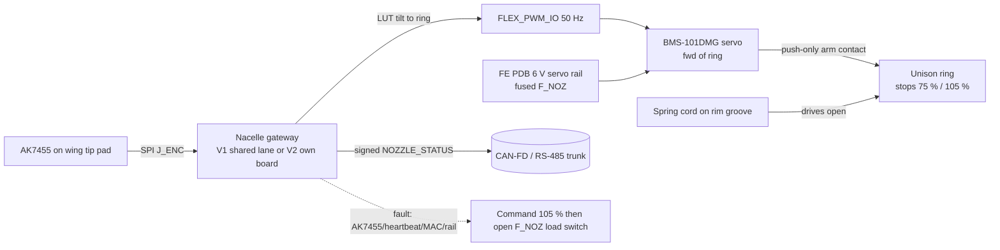
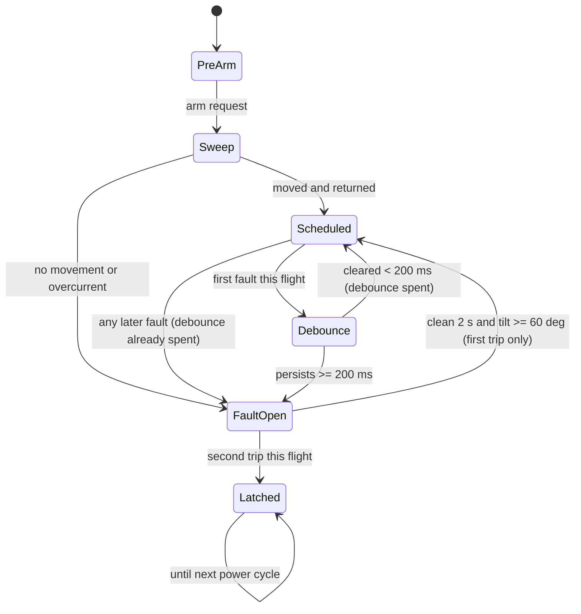
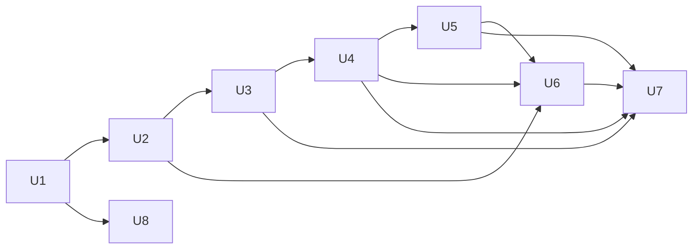

# feat: Nacelle nozzle servo drive (Option A) and passive-drive retirement

**Author:** Steve Griffing, PE(CSE), CISSP-ISSEP, CEH (GitHub `Stab-Rabbit-coding`) — owner decisions.
**AI contribution:** analysis, ideation synthesis and plan text by Claude (Claude Opus 5.5, Anthropic);
ideation and servo research sub-agents Claude Sonnet 5 (Anthropic). Per `AGENTS.md` AI attribution.

---

## Goal Capsule

- **Objective:** Replace the unbuildable passive nozzle drive with one thin servo per nacelle. The
  servo sets the iris from the AK7455 tilt angle, and a spring opens the ring to 105 % whenever the
  servo or its command is lost. Present the two gateway variants (V1 shared encoder lane, V2
  dedicated board) for the owner to decide. Retire the superseded §1.1.3.1 items.
- **Authority:** owner decisions in this plan's Key Technical Decisions (KTD1–KTD3 are
  session-settled) > `airframe/AGENTS.md` requirement > this plan > the ideation doc.
- **Stop conditions:**
  - Stop before U6's implementation arm until the owner picks V1 or V2 (D-NZ-1). U6's comparison
    spec is not gated.
  - Stop and report if U4's fit check shows no forward station fits the 8 mm servo without a
    blister. The blister fallback needs owner sign-off because it breaks the mould line.
  - Stop and report if the U2 margin check fails against the U8 bench load.
  - Stop and report if U8 finds the spring cannot drive the ring to 105 % with the servo
    unpowered or seized at any angle (the full-stroke-slot check in KTD3).
- **Execution profile:** CAD (OpenSCAD) + Python analysis tools + docs/BOM. No flight firmware
  code in this plan — firmware behaviour is specified (U6), not written.

---

## Product Contract

### Summary

Each nacelle gets a sub-micro servo inside the pod, forward of the nozzle ring. Its arm pushes the
unison ring toward 75 % bore through a push-only contact. A spring drives the ring to a hard 105 %
stop whenever the servo stops pushing, and a seized servo cannot hold the ring closed.

The schedule runs on the gateway that reads the AK7455, as a lookup table from tilt angle to ring
position:

| Tilt | Nozzle exit |
|---|---|
| 0° | 75 % of bore |
| 90° to 145° | 105 % of bore, held flat |

Loss of the AK7455, bus, MAC or heartbeat commands open and then de-energises the servo.

### Problem Frame

The 2026-07-19 passive drive (wing-fixed sun, nacelle pinion and crank, pushrod) cannot be built
for three reasons, found 2026-09-10 and 2026-09-28:

1. **No room for the sun.** It has 0.0 mm of axial space in the Rev T4 trunnion joint
   (`docs/NOZZLE_DRIVE_TRADE.md` § PACKAGING BLOCKER).
2. **Pinion collision.** The pinion, 26.4 mm aft of the pivot, meets the Rev T1 tilt-drive shaft,
   which leaves the wing tip 25.6 mm aft of the spar at wing station 53.6.
3. **Over-travel.** Any continuous 1:1 drive over-strokes the ring past 90° of tilt. Measured with
   `tools/nozzle_linkage_check.py`: ring −40.7° at 140° tilt against a 23.75° stroke. That
   violates the "≥ 90° holds 105 %" requirement over the 145° tilt sweep.

Reopening the datum found no place for a wing-fixed part inside the tip airfoil. The owner chose
Option A on 2026-09-28.

### Requirements

- **R1.** Nozzle exit is 75 % of bore radius at 0° tilt and 105 % at every tilt from 90° to the
  145° limit (`airframe/AGENTS.md` "Nacelle Nozzle Drive", reworded per R9).
- **R2.** On loss of servo power, the command bus/heartbeat, AK7455 validity, or command
  authentication, the nozzle goes to 105 % and stays there without power.
- **R3.** No part of the drive may stand proud of the canonical nacelle shell unless the owner
  signs off (the blister fallback).
- **R4.** The servo is serviceable without sliding the nacelle off the spar.
- **R5.** Both gateway variants are documented with mounting, wiring (including the wing–nacelle
  joint crossing), weight and CG, so the owner can decide D-NZ-1.
- **R6.** Nacelle mass/CG and PIVOT_Z are re-derived, with no TBDs, including the Rev S3 flap
  shingle mass left open in §1.1.3.1.
- **R7.** BOM, REFERENCES, WBS and generated TODO reflect the new drive. The retired passive drive
  is archived with its attribution chain intact.
- **R8.** A pre-arm check proves the ring moves before flight.
- **R9.** The requirement text is reworded from "driven by nacelle tilt" to "scheduled on measured
  nacelle tilt". The trade study records the decision, the over-travel finding, and the reopened-
  datum result.

### Scope Boundaries

- In scope: §1.1.3.1 close-outs that don't depend on the drive, the §1.1.3.3 protrusion item
  (stale since Option B, 2026-07-18), and archiving `gear_option_compare.scad` /
  `gear_shell_compare.scad`.
- Out: the seal-flap aerodynamic-step VERIFY stays open as a bench item. It is carried by U8,
  not closed.
- Out: thrust/RPM-aware scheduling (ideation reject #5). Revisit after U8 data.

#### Deferred to Follow-Up Work

- Stale BOM rows unrelated to this drive (`PRINT-NACELLE-IDLER*`, `CROWN-M1-12T`, the 72T
  `PRINT-NACELLE-RING` description, `SPAR-TILT-CF4`, `BRG-MF104ZZ`). Log them as a WBS item; don't
  fix them here.
- `airframe/blender-scripts/serenity_render_views.py` still references the stale bare
  `nacelle_nozzle_iris.stl` (already flagged in §1.1.3.1).
- `tools/nacelle_mass_cg.py` treats the retired 1.5 in gear as ACTIVE. U5 switches the default to
  3.0 in (the flight article, per the 2026-09-06 decision); a broader LG audit is out of scope.

### Outstanding Questions

- **D-NZ-1 (blocking for U6's implementation arm only): V1 shared encoder lane or V2 dedicated
  gateway?** The owner has not decided. U6 writes the comparison. Units U1–U5, U7 and U8 do not
  depend on the answer.
- **Deferred:**
  - Spring part number (only McMaster catalogue categories confirmed). U3 carries a
    "requires verification" row.
  - BMS-101DMG full dimensions and voltage rating (only the case thickness and mass were read).
    U7 records them as requiring verification.

### Sources

- `docs/ideation/2026-09-28-nozzle-servo-actuation-ideation.html` (ideas 1–7 and rejection table)
- `docs/NOZZLE_DRIVE_TRADE.md`, `avionics/kicad/Bus-Gateway/CAN-PERIPH-GW-1.md` §3,
  `docs/CARGO_DOOR_GATEWAY_SPEC.md` (D-GW-4/5, failsafe), `docs/TILT_ENCODER_WIRING_EMI_SPEC.md`
- Servo specs read on vendor pages 2026-09-28:
  - Blue Bird BMS-101DMG (hyperflight.co.uk `products.asp?code=BMS-101DMG`): 4.5 g, 1.0 kgf·cm,
    0.07 s/60°, 8 mm case.
  - Hitec HS-40 (hitec.uk; servodatabase.com): 20 × 8.6 × 17 mm, 4.8 g, 0.8 kgf·cm at 6 V,
    4.8–6.0 V.
  - AGFRC C1.5CLS linear (amazon.com listing B07QGYBV1H): 21.4 × 15.2 × 6.0 mm, 1.5 g,
    120/240 gf, stroke listed inconsistently (7 vs 9 mm).
- ArduPilot `SERVOn_FSPWM` per-output failsafe PWM
  (ardupilot.org/plane/docs/apms-failsafe-function.html), cited as precedent for a commanded fail
  position.

---

## Planning Contract

### Key Technical Decisions

- **KTD1 — Option A, servo scheduled from the AK7455** *(session-settled: user-directed — chosen
  over the wing-tip sector + spring rod and the wider joint gap: those had exposed hardware, a jam
  path into the tilt drive, and nacelle-off service)*.
- **KTD2 — Servo: Blue Bird BMS-101DMG primary, Hitec HS-40 alternate** *(session-settled:
  user-directed "use the smaller servo you found, unless there's a linear one that works
  better")*.
  - **BMS-101DMG (4.5 g, 8 mm case, metal gear):** the smallest rotary candidate. Its full L×W and
    voltage range were not published on the page read, so they are "requires verification". The
    HS-40 is the fully dimensioned fall-back if the BMS-101DMG fails the 6 V rating or the U4 fit.
  - **Force check:** a ~90° servo sweep driving 13.2 mm of lever chord needs an arm of
    13.2 / (2 sin 45°) ≈ 9.3 mm (0.37 in). At 1.0 kgf·cm (0.098 N·m) that gives a pull of
    ≈ 10.5 N (2.4 lbf).
  - **Linear servo rejected:** the AGFRC C1.5CLS delivers at most 2.4 N (0.54 lbf) at 6 V. Its
    stroke is listed inconsistently, and the lever arm would have to shrink to about 21 mm to match
    that stroke. It cannot hold against any open-spring worth having, so it is recorded as
    rejected unless U8 measures a total closing load under about 1 N.
- **KTD3 — Spring opens, servo only pushes toward closed (push-only contact)** *(session-settled:
  user-approved; revised 2026-09-28 by owner-approved correction)*.
  - The servo arm tip is a **unilateral contact** on the ear's open-side flank at r 34.3 mm. It
    pushes the ring toward 75 %. A spring cord wrapped on a rim groove (r 32.35 mm) pulls the ring
    toward 105 % and holds the ear on the tip.
  - Because the contact is push-only, the ring can always move away from the arm, so a dead,
    unpowered **or seized** servo cannot hold the nozzle closed.
  - **Correction:** the earlier "full-stroke slotted pull link" fix was wrong. A seized pull link
    blocks the ring from paying out toward open, and no slot or cord arrangement avoids that.
  - Hard stops are the ends of a window through the housing wall:
    - the 75 % stop is full height on the ear's closed-side flank;
    - the 105 % stop is an upper-band lug on the ear's open-side flank, above the arm's contact
      band, so the tip is never trapped.
  - Spring sizing target: at least 1.5 × (measured opening-side friction) and no more than 40 %
    of servo stall push, pending U8.

- **KTD4 — The schedule runs on the gateway that reads the AK7455** *(user-approved at scoping:
  chosen over flight-computer-commanded nozzle position)*.
  - The tilt-to-ring lookup table holds flat from 90° to 145°. The over-travel is fixed by
    construction.
  - The flight computers see a signed `NOZZLE_STATUS` (commanded %, sweep result, fault flags).
    They do not command the nozzle.
  - Failsafe polarity is the **inverse of the door gateway's**: loss of the AK7455, heartbeat, MAC
    or rail commands 105 %, then **opens a gateway-controlled load switch on the `F_NOZ` servo
    branch**. It does not rely on stopping PWM, because a digital servo may keep holding its last
    pulse when the signal is lost (doc review 2026-09-28). Door firmware must not be reused
    unchanged.
  - **Debounce and re-arm:** the **first** fault shorter than 200 ms in a flight does not trip.
    The debounce forgives once only: any later fault, of any length, trips immediately (owner
    decision 2026-09-28). A tripped fault latches
    open until the AK7455 angle and the bus have both been clean for 2 s and the tilt is ≥ 60°;
    then the schedule resumes. A second trip in the same flight latches until power cycle. This
    avoids spending a whole cruise at 105 % after one transient glitch (owner decision
    2026-09-28, chosen over latching until power cycle). Both timing values are starting points,
    to be set by U8.
- **KTD5 — Servo forward of the ring, inside the pod** *(user-approved at scoping)*.
  - The servo lies flat in the annulus just forward of the nozzle housing, with its shaft radial
    (8 mm case thickness radial) at the mid-stroke contact azimuth, about 141°.
  - Its 10.05 mm arm reaches aft through a window in the housing's forward lip.
  - The ear sweeps 157.5° (closed) → 133.75° (open), because the ring opens clockwise.
  - A faired blister is the fall-back only (R3).
- **KTD6 — Servo power from a fused branch of the 6 V servo rail in both variants** (door
  precedent D-GW-4). Only signal and GND use `J_FLEX`. The 6 V pair crosses the joint through the
  spar bore with the power feeds, under the same braid/ferrite rule as the encoder pair.
- **KTD7 — Retire, don't park, the passive drive.** Archive `nacelle_nozzle_sync_gears.scad`,
  `nacelle_nozzle_pushrod.scad`, their STLs and Makefile targets. Keep the
  `nozzle_linkage_check.py` negative results as the historical record, pointed at from the trade
  doc.

### High-Level Technical Design

#### Gateway variants (D-NZ-1) — first-pass numbers for U6 to firm up

"est." = engineering estimate pending weighing; everything else is from the repo or a vendor page.

| | **V1 — shared AK7455 encoder lane** | **V2 — dedicated N_STACKS=1 gateway** |
|---|---|---|
| Board | none added. `FLEX_PWM_IO` (PA25 TIMA0_C3) on the encoder lane's unused `J_FLEX` is a firmware-mode choice ("no hardware change", `CAN-PERIPH-GW-1.md` §3) | +1 board per nacelle, 49.0 × 25.5 × 1.6 mm, ~6 g VERIFY |
| Mounting | wherever the encoder gateway lives. **It is not yet placed in any SCAD or in the mass roll-up**, so U6 must place it: nacelle flank near the ESC bays | card-edge tray (door-tray pattern, D-GW-5) at the forward ESC bay, behind the bay cover, next to the servo |
| Wiring across the joint | + 6 V pair only (KTD6) | + 6 V pair + isolated CAN-FD pair + RS-485 pair + GND + board RAIL-2 feed |
| Mass per nacelle (rotating) | servo 4.5 + link ~1 est. + spring ~1 est. + mount ~1.5 est. + lead ~0.5 est. − pushrod 3.6 = **+4.9 g (0.011 lbm)** | V1 + board 6 + tray ~3 est. = **+13.9 g (0.031 lbm)** |
| Mass per nacelle (fixed wiring) | 6 V pair 22 AWG ~0.7 m ≈ 4.2 g est. | V1 + bus pairs ≈ 11 g est. more |
| Aircraft total vs deleted drive | **≈ +19 g (0.042 lbm)** | **≈ +59 g (0.13 lbm)**, about +40 g over V1 |
| PIVOT_Z shift (560 g assembly) | ≈ +0.34 mm aft from the drive swap; +1.2 mm more from the shingle-flap correction | V1 + board at ~Z 95–120 → ≈ ±0.2 mm |
| Common-mode exposure | one gateway fault loses tilt feedback **and** nozzle command together. The nozzle fails open (hover-safe), but the tilt loop loses its sensor | nozzle and encoder fail independently |
| Service | servo behind an ESC-bay-adjacent cover; gateway unchanged | same, plus one more board to provision (keys, firmware image) |
| Assurance | the encoder lane gains a second endpoint class (actuator). SCA mapping must cover mixed sensor/actuator roles on one MCU | same class as the door gateway; the existing mapping is reused |

### Assumptions

- The nacelle encoder gateway sits in the nacelle, as `TILT_ENCODER_WIRING_EMI_SPEC.md` §2.1
  says ("at nacelle pivot housing"). U6 confirms and places it.
- Servo sweep is about 90° over 1000–2000 µs (typical RC). U8 measures it.

### Sequencing

---

## Implementation Units

### U1. Record the decision and retire the passive drive

**Goal:** Documents and archive reflect KTD1/KTD7, and the superseded §1.1.3.1 and §1.1.3.3 items
are closed.

**Requirements:** R7, R9.

**Dependencies:** none.

**Files:**
- Docs:
  - `docs/NOZZLE_DRIVE_TRADE.md` — decision amendment, reopened-datum result, over-travel finding.
  - `airframe/AGENTS.md` — "Nacelle Nozzle Drive" wording.
  - `airframe/wings-nacelles/WBS.md` — §1.1.3.1, §1.1.3.3.
  - `airframe/wings-nacelles/TODO.md` — regenerated, not hand-edited.
- Archive:
  - `airframe/openscad/nacelles/nacelle_nozzle_sync_gears.scad`
  - `airframe/openscad/nacelles/nacelle_nozzle_pushrod.scad`
  - `airframe/openscad/nacelles/gear_option_compare.scad`, plus `gear_shell_compare.scad` if it
    is tracked.
  - Their STLs, Makefile targets, and the `port_tilt_spar_assembly.scad` sync block.
- Assembly and indexes:
  - `airframe/FreeCAD-scripts/serenity_assembly.py` — spar-crank placement.
  - `PROJECT_INDEX.md` and `ARCHIVE_INDEX.md` — regenerated.

**Approach:**
1. Amend the trade doc with a dated DECISION AMENDMENT (Option A, 2026-09-28). Record:
   - the reopened-datum search;
   - the pinion-vs-tilt-shaft collision;
   - the 0→145° over-travel sweep table.
2. Keep `nozzle_linkage_check.py` and add a pointer from it to the amendment. Don't delete it: it
   is the negative-result record.
3. Close these WBS items with the dated reason "superseded by Option A":
   - RSSR NO-GO;
   - adopted sun/pinion drive;
   - spar-crank re-hub;
   - KTD3 blocker;
   - sync-gears parked;
   - pushrod clearance check;
   - spar-crank placement;
   - gear-compare WIP.
4. Close the §1.1.3.3 protrusion item as stale since 2026-07-18.
5. Close the hinge-boss item as ACCEPTED RESIDUAL. Under the repo's stale-checkbox rule an accepted
   item is closed, not open.
6. Add the new §1.1.3.1 Option A subsection mirroring U2–U8.
7. Move the archived files to the repo's archive location (see `ARCHIVE_INDEX.md`) with their
   attribution headers intact, then regenerate TODO and the indexes.

**Patterns to follow:** the Stage 4 gear-train archive (§1.1.3.1 Rev S2); the
`tools/gen_todo_from_wbs.py` "never hand-edit TODO" rule.

**Test expectation:** none — documentation and archive only. The render and index gates in the
Verification Contract still apply.

**Verification:**
- No active file `use<>`s or imports an archived SCAD.
- `serenity_assembly.py` no longer places the spar crank.
- The regenerated TODO lists no superseded item.

### U2. Servo linkage and schedule tool

**Goal:** One re-runnable tool for the Option A drive. It works out:
- the ring angle for a given servo angle through the push-only arm contact;
- the spring/servo force margins;
- the tilt → ring → PWM lookup table with the 90–145° hold.

**Requirements:** R1, R2, KTD2, KTD3, KTD4.

**Dependencies:** U1 (the constants' new owners are known).

**Files:** `tools/nozzle_servo_linkage.py` (new);
`tools/tests/test_nozzle_servo_linkage.py` (new).

**Approach:**
1. Source constants from `nacelle_nozzle_iris.scad`, citing file:line as `nozzle_linkage_check.py`
   does: `RING_LEVER_R` 32, `RING_LEVER_AZ` 157.5, the 23.75° stroke, `R_HINGE`, and the flap
   geometry.
2. Take the servo station from U4 as an input.
3. Compute:
   - the arm radius and sweep;
   - servo pull against spring force plus measured flap load (U8 value as input, 20 N placeholder
     flagged);
   - the minimum transmission angle;
   - the lookup table as exit % → ring ψ → servo angle → µs.
4. Emit the table as a data file for U6 to embed.

**Patterns to follow:** `tools/nozzle_linkage_check.py` (constant sourcing, transmission-angle
convention, pass/fail exit codes).

**Test scenarios:**
- 0° tilt → 75 % exit radius (18.75 mm) within 0.1 mm; 90° → 105 % (26.25 mm).
- 90°, 120°, 145° all give identical ring angle (flat hold); 150° is clamped with a warning.
- Invalid or NaN tilt input → table lookup returns the 105 % command.
- Spring force above 40 % of servo pull → margin check fails with a non-zero exit.
- The AGFRC linear servo run through the same check at 2.4 N → fails at the 20 N placeholder, and
  passes only below about 1 N.
- The table is monotonic in tilt from 0° to 90°.

**Verification:**
- The tool passes its tests.
- The default run prints PASS with the BMS-101DMG and the placeholder load flagged "pending U8".

### U3. Ring stops, spring seat and pull-link anchor

**Goal:** The iris hardware carries KTD3: hard 75 %/105 % stops (housing window ends), a spring-cord
rim groove, anchor and exit bore, and a push-only contact ear replacing the ball socket.

**Requirements:** R1, R2, R3.

**Dependencies:** U2.

**Files:**
- `airframe/openscad/nacelles/nacelle_nozzle_iris.scad`
- Re-rendered `nacelle_nozzle_ring.stl`, `nacelle_nozzle_throat.stl` and `-closed`/`-open` asm
  STLs.
- `airframe/FreeCAD-scripts/Makefile` if targets change.

**Approach:**
1. Put the stops on the throat/housing, with ring tabs and a ≥ 1.5 mm (0.06 in) PETG land.
2. Seat the spring coaxially in the housing, clear of the flap clevises.
3. Keep the ring's cam-only geometry, so the flap kinematics are unchanged (R2 invariant). Keep
   `R_HINGE` fixed.

**Patterns to follow:** the Rev S2 cam-only ring change set; the `RENDER_PART` selector convention.

**Test scenarios:**
- Each print part renders `Simple: yes` and is watertight in `tools/validate_stls.py`.
- At ring ψ = 0 and ψ = 23.75° (tabs against the stops), the flap flow boundary is 18.75 mm and
  26.25 mm ± 0.1 mm. Measure it from the asm renders.
- The spring seat does not intersect any flap at either stop.

**Verification:**
- Both asm renders reproduce the exit radii.
- The housing OD envelope is unchanged or smaller (checked with
  `tools/nacelle_housing_profile.py`).

### U4. Servo mount, pod pocket and fit check

**Goal:** Place the servo forward of the ring inside the canonical shell (KTD5) with a flush
access cover, and prove the fit.

**Requirements:** R3, R4.

**Dependencies:** U2, U3.

**Files:**
- `airframe/openscad/nacelles/nacelle_nozzle_servo_mount.scad` (new).
- `airframe/openscad/nacelles/nacelle_pod_50mm_tandem.scad` (pocket and cover seat).
- `airframe/openscad/nacelles/nacelle_esc_cover.scad` if the cover is shared.
- Re-baked `nacelle_port_revs.stl` and `nacelle_stbd_revs.stl` via `tools/bake_hull_frame.py`.

**Approach:**
1. Search Z stations between the ESC bays and the ring for an annulus depth of at least
   8 mm + 2 × 0.3 mm clearance + skin. Use the actual Rev T4b wall-thickness profile.
2. Clear the arm's sweep (lip window about 141° ± 12°) and the spring's run from the cord
   exit bore (about 90°) of the aft spider sleeve and the EDF2 phase leads.
3. Side-dependent geometry is keyed on `PYLON_SIDE`. Remember the known trap: NACELLE_SIDE is
   inverted relative to the filename.
4. If no station fits, stop per the Goal Capsule and draft the faired-blister fallback for owner
   sign-off.

**Patterns to follow:** `nacelle_esc_bay.scad` / `nacelle_esc_cover.scad` flush-cover pattern;
`tools/cargo_layout_fit.py`-style interference report.

**Test scenarios:**
- Servo, mount and link have 0 mm³ intersection with the duct, stator/aft spider sleeves, ESC bays
  and harness troughs at 0°, 90° and 145° tilt poses.
- Minimum wall around the pocket ≥ 1.5 mm (3 perimeters at 0.4 mm).
- The link path clears the ring lever ear across the full 23.75° stroke.
- Both baked shells are watertight single bodies.

**Verification:**
- The interference report is clean.
- The shells validate.
- The servo can be removed by opening the cover alone.

### U5. Nacelle mass, CG and PIVOT_Z re-derivation

**Goal:** `tools/nacelle_mass_cg.py` reflects the as-designed Option A assembly and converges.

**Requirements:** R6.

**Dependencies:** U3, U4.

**Files:** `tools/nacelle_mass_cg.py`; `airframe/openscad/nacelles/nacelle_pod_50mm_tandem.scad`
(`PIVOT_Z` iteration); `airframe/wings-nacelles/WBS.md` §1.1.3.1 (closes the shingle mass/CG item).

**Approach:**
1. Flap row → 4 master + 4 seal at the measured 3.4/3.7 g. That is 28.4 g per nozzle for 40 mm
   flaps, not 21.1 g.
2. Delete the pushrod row. Add rows for servo, link, spring, mount and in-nacelle servo lead.
3. Add a variant switch so V1 and V2 gateway rows are both reportable. V2's board needs a real
   mass: weigh it, or use the 3.7 g FR4 estimate plus parts, marked VERIFY.
4. Make 3.0 in gear the default clearance check (flight article since 2026-09-06).
5. Iterate PIVOT_Z to convergence. The current residual is −1.23 mm, NOT CONVERGED.

**Test scenarios:**
- The fixed-point assertion holds.
- Reported PIVOT_Z matches the SCAD within 0.1 mm after iteration.
- The V1 and V2 totals differ by exactly the gateway rows.
- Hover clearance is reported against the 3.0 in gear.

**Verification:** the roll-up converges. Its numbers replace the U6 table's first-pass estimates.

### U6. Nozzle-servo gateway spec — present V1 and V2, then implement the chosen one

**Goal:** A spec in the door-gateway document's shape that lets the owner decide D-NZ-1, then
records the chosen variant's integration.

**Requirements:** R2, R5, R8, KTD4, KTD6.

**Dependencies:** U2 (lookup table), U4 (servo station), U5 (masses).

**Files:**
- `docs/NACELLE_NOZZLE_SERVO_SPEC.md` (new).
- After D-NZ-1:
  - `avionics/kicad/Bus-Gateway/CAN-PERIPH-GW-1.md` (deployment §1/§3);
  - `docs/TILT_ENCODER_WIRING_EMI_SPEC.md`;
  - `docs/POWER_DISTRIBUTION.md` (the `F_NOZ` 6 V branch);
  - `avionics/WBS.md`.

**Approach:**
1. **Decisions table** (the door spec's D-GW pattern) covering:
   - the `F_NOZ` load switch: a gateway GPIO drives a high-side switch, and the servo is
     unpowered whenever the switch is off, which is the fault state;
   - a contingent 3.3 → 5 V level shifter, fitted only if U8 item 3 fails (cargo-door harness
     precedent);
   - servo pinning, `J_FLEX` pin 4 `FLEX_PWM_IO`;
   - power (`F_NOZ` fuse sized from the measured stall);
   - the joint crossing;
   - failsafe polarity (KTD4);
   - messages: `NOZZLE_STATUS` published, no remote command class;
   - the pre-arm sweep state machine above (R8).
2. Place the nacelle encoder gateway physically. It is currently unplaced and unweighed.
3. Write the V1/V2 comparison from the Planning Contract table with U5 numbers substituted. End it
   with the owner decision box.
4. After the decision, write only the chosen arm into the board, EMI and power docs, and record
   the rejected arm's reason.

**Patterns to follow:** `docs/CARGO_DOOR_GATEWAY_SPEC.md` structure (decisions, BOM delta,
`J_FLEX` table, firmware contract, placement table, open items).

**Test scenarios:**
- Spec review checklist: every failure input in R2 maps to "105 %, then `F_NOZ` load switch
  off".
- The debounce/re-arm table matches the state diagram: one forgiven sub-200 ms glitch per flight,
  any later fault trips at once, 2 s clean plus tilt ≥ 60° re-arms once, and a second trip
  latches.
- The `J_FLEX` pin table matches the §3 net names.
- Each variant's joint-crossing conductor count and mass is listed and summed.
- No row reuses the door "hold last" failsafe.

**Verification:**
- The owner can decide D-NZ-1 from the spec alone.
- After the decision, the three downstream docs agree on pin, fuse and route.

### U7. BOM and REFERENCES

**Goal:** The parts list and citations match the design.

**Requirements:** R7.

**Dependencies:** U3, U4, U5, U6.

**Files:**
- `current-specification/bom_revT.csv` and `bom_revT.json` (mirror trap: edit both, or regenerate
  the JSON).
- `REFERENCES.md`.
- A BOM edit script `tools/bom_edit_nozzle_servo.py` (new), following `tools/bom_edit_door_gateway.py`.

**Approach:**
1. Add rows:
   - `SERVO-NOZZLE` (BMS-101DMG ×2);
   - `SPRING-NOZZLE-OPEN`;
   - `ARM-NOZZLE` (the servo arm with its contact nub) and `CORD-NOZZLE-SPRING` (Dyneema
     Ø0.5 mm);
   - `PRINT-NOZZLE-SERVO-MOUNT`;
   - `FUSE-F_NOZ`;
   - `SW-F_NOZ` (the high-side load switch);
   - a contingent `LVLSHIFT-NOZ` row at Qty 0 until U8 item 3 decides it;
   - the harness;
   - V2 rows only if chosen.
2. Retire, with Qty 0 and a dated note: `PUSHROD-BALL-M3`, `BALLSTUD-M3`, `PRINT-PUSHROD-CRANK`.
3. Add REFERENCES entries with validated URLs and cited sections:
   - BMS-101DMG, HS-40, and AGFRC C1.5CLS as the rejected record;
   - ArduPilot failsafe docs.
4. Mark unread specs "requires verification", with a TODO §0.x item each.

**Test scenarios:**
- CSV and JSON parse, and match on every row.
- The retired rows total 0 g.
- The aircraft total changes by the U5 per-nacelle deltas × 2.
- Every new REF-ID is cited from at least one repo location listed in its entry.

**Verification:**
- BOM totals reconcile with U5.
- The REFERENCES orphan check (existing tool/CI) passes.

### U8. Bench and flight-readiness verification items

**Goal:** The unknowns this plan cannot settle on paper become tracked WBS bench tasks with
pass/fail criteria.

**Requirements:** R2, R8, KTD2, KTD3.

**Dependencies:** U1.

**Files:** `airframe/wings-nacelles/WBS.md` §1.1.3.1; `docs/FIRST_FLIGHT_READINESS.md` (gate row).

**Approach:** add these items:
1. Flap hinge moment: lever-ear force at r 32 mm, at 75 % and 105 %, fan off and at hover throttle.
2. Servo sweep and µs map on the sourced unit.
3. BMS-101DMG at 6 V and reliable 3.3 V PWM input, or a level shifter.
4. Stall current, to size `F_NOZ`.
5. Spring rate selection against item 1.
6. Pull the servo plug with the fan running → ring reaches 105 % within 0.5 s.
7. Seal-flap aero step, which stays open from Rev S3.
8. **Unpowered and seized servo:** with the servo unpowered, and again with the servo arm locked
   at each of 75 %, 90 % and 105 %, the spring drives the ring to 105 % through the slot within
   0.5 s. This is a stop condition in the Goal Capsule.
9. BMS-101DMG signal-loss behaviour (hold or go limp), recorded for the record. The failsafe
   does not depend on it because of the load switch.
10. Cruise penalty of the 105 % fault state at 0° tilt (thrust change and trim), plus tuning of
    the 200 ms and 2 s debounce/re-arm timers.

**Test expectation:** none in this plan — these are the tests. Each WBS item states its own
pass/fail criterion.

**Verification:** the first-flight readiness plan carries a nozzle fail-open gate.

---

## Verification Contract

- OpenSCAD renders of every touched part report `Simple: yes`, and `tools/validate_stls.py`
  passes on the re-rendered/re-baked STLs.
- `/usr/bin/python3 -m pytest tools/tests/test_nozzle_servo_linkage.py` passes. Use the system
  interpreter: the venv hides manifold3d and trimesh.
- `tools/nacelle_mass_cg.py` converges (fixed point, PIVOT_Z residual < 0.1 mm).
- `tools/gen_todo_from_wbs.py` regenerates TODO.md. The index generator regenerates PROJECT_INDEX
  and ARCHIVE_INDEX: never hand-merge them.
- Markdown lint (all rules) and the repo pre-commit hooks pass. These include the CNAF
  warning/caution/note labels and shall/should/may/will wording.
- Static analysis (ruff/flake8 per repo config) is clean on new Python.

## Definition of Done

- U1–U5, U7 and U8 are complete. U6's comparison spec is written, and U6's implementation arm is
  complete for whichever variant the owner chose.
- No §1.1.3.1 checkbox is left open whose own text says superseded or resolved.
- Every mass, force and CG figure is quoted imperial-primary with metric in parentheses. Every
  estimate is marked est. or VERIFY, and none are TBD.
- AI attribution appears in touched file headers and commit messages.
