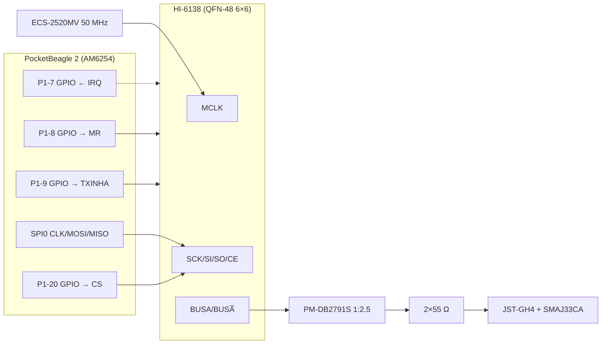

# Fleet MIL-STD-1553C swap: HI-1573 + PRU → HI-6138 (Pilot, TACCO)

## Summary

This plan replaces the Holt HI-1573 transceiver on the Pilot and TACCO capes, together with
the AM6254 PRU Manchester codec it depends on, with the Holt HI-6138 protocol engine on the
PocketBeagle 2 SPI0 bus. That gives the fleet one 1553 part, shared with Commo Rev T.

The magnetics, isolation resistors, TVS diodes, and field connector are unchanged. Both capes
are space-critical, so the footprint is datasheet-verified and the board area is budgeted
before any layout change is made.

---

## Problem Frame

Owner decisions (S. Griffing, 2026-09-28; `avionics/WBS.md` §1.2a.3):

- Upgrade the fleet to MIL-STD-1553C.
- Make the chip swap on both capes.

MIL-STD-1553C is electrically identical to 1553B [REF-MIL-001]. The swap is therefore
justified by part commonality and by moving the protocol off the PRU, not by an electrical
shortfall.

---

## Requirements

- R1. Pilot and TACCO each carry an HI-6138 in place of the HI-1573, host-controlled over
  PB2 SPI0.
- R2. The footprint is traced to DS6138 Rev S §29 (p. 263) and the pin map to Table 1 and
  the p. 1 pin configuration.
- R3. The bus side meets MIL-STD-1553C: a direct-coupled stub with the 1:2.5 PM-DB2791S and
  2 × 55 Ω resistors [REF-MIL-001 §4.5.1.5.2; DS6138 Fig. 28].
- R4. Board area: the net courtyard change is measured and reported, and the boards pass
  their existing gates without moving unrelated placement. The gates are ERC 0 and DRC with
  schematic parity, with no new violations against the baseline.
- R5. The PRU 1553 path is removed from the schematics, the device-tree sources, and the
  firmware WBS. Docs and REFERENCES are updated to 1553C.

---

## Key Technical Decisions

- **KTD1. Dedicated 50 MHz MCLK oscillator per cape.** The chip uses an ECS-2520MV-500-BN-TR,
  which is the fleet's existing ECS-2520MV family with its datasheet on file. It is ±50 ppm,
  within the HI-6138's MCLK requirement of 50.0 MHz ± 100 ppm (DS6138 Table 1).
  - The alternative was to tap the PHY's 50 MHz RMII REF_CLK. That was **rejected**: a PHY
    reset or power-down would stop the 1553 clock, coupling two supposedly independent bus
    lanes.
  - *(session-settled: user-directed — "just be sure of footprint since those boards are
    tight on space"; area is minimized, but not by coupling buses.)*
- **KTD2. Custom footprint `Serenity-Custom:Holt_HI-6138_QFN-48_6x6mm_P0.4mm_EP4.6mm`.**
  - No stock KiCad library footprint has a 4.70 mm exposed pad. The closest official variant
    is only in a third-party library that is not in the project lib-table.
  - The generated land uses 0.20 × 0.80 mm pads at a 0.40 mm pitch, on a 2.95 mm pad-center
    offset.
  - The exposed pad is 4.60 mm. That is deliberately smaller than the package pad
    (4.70 ± 0.05 mm), following convention #2: a smaller pad still solders, while a larger
    one risks bridging.
  - Solder paste on the exposed pad is a 3 × 3 window array.
  - The footprint is generated by `gen_pilot_footprints.py` into `Serenity-Custom.pretty`,
    which both capes share.
- **KTD3. Host pin reuse, no new PB2 pins.** Five pins are freed and four are reused on both
  capes:
  - The PRU lines on P1-7..P1-10 and TX_INH on P1-20 are freed.
  - P1-20 becomes the GPIO chip-select for the HI-6138 (SPI0 chip-selects are already GPIO
    on these capes, per the DTS §2 comment).
  - P1-7 becomes the IRQ input, P1-8 the MR output, and P1-9 the TXINHA output, which keeps
    the host's transmit-inhibit safety function.
  - P1-10 is left free.
- **KTD4. Strap by internal pulls; set the RT address in software.**
  - LOCK is left low (internal pull-down), so the host writes the RT address and parity.
    RTA4:0 and RTAP stay on their internal pull-ups; a physical address strap would cost
    six resistors.
  - AUTOEN, MTSTOFF, EE2K, EECOPY, BCTRIG, MODE1760, RTSSF, TEST, BENDI, TTCLK, and MTTCLK
    stay on their internal pull-downs.
  - The EEPROM port (ECS/ESCLK/MOSI/MISO) and READY, ACTIVE, and RTMC8 are no-connects.
  - MODE must be left unconnected, as the datasheet requires.
  - TXINHB stays on its internal pull-up, because only bus A is populated. That keeps the
    existing single-bus design.
  - IRQ is open-drain, so it gets a 10 kΩ pull-up to +3V3.
- **KTD5. Decoupling.**
  - The datasheet gives no capacitor recommendation. The plan uses one 100 nF 0402 per
    supply pin group: VCC pins 6/16/31 as one group and VCCP pins 41/44 as another.
  - The existing 10 µF bulk capacitor is kept for the transmitter supply.
  - `C-1553A/B/C` are reused, and `C-1553D` is added.
  - This is recorded as an engineering choice, not a datasheet citation.
- **KTD6. Patch the PCBs in place; regenerate only the schematics.**
  - Both schematic generators regenerate byte-identical output, confirmed for Pilot on
    2026-09-28.
  - The committed Pilot PCB has 16 parts that differ from a fresh `gen_pilot_pcb.py` run,
    so it was hand-adjusted after generation.
  - The PCB is therefore patched in place:
    1. Swap the QFN-44 for the QFN-48 at the same position, side, and rotation.
    2. Place the new small parts with a courtyard-aware search around it.
    3. Update pad nets from the regenerated netlist.
  - Nothing else moves. This follows the project memory rule "never re-run PCB gen after
    manual packing".

---

## High-Level Technical Design

---

## Implementation Units

### U1. HI-6138 footprint, part data, and oscillator (Phase 1)

**Goal:** a datasheet-traced land and pin table, with an area budget, before touching either
board.

**Requirements:** R2, R4 (KTD1, KTD2, KTD4, KTD5)

**Files:**

- `avionics/kicad/Pilot/scripts/gen_pilot_footprints.py`
- `avionics/kicad/Serenity-Custom.pretty/Holt_HI-6138_QFN-48_6x6mm_P0.4mm_EP4.6mm.kicad_mod`
- `avionics/kicad/HI6138_FOOTPRINT_VERIFICATION.md` (new; records the datasheet trace and
  the area budget)

**Approach:**

1. Add a generator function in the existing house style.
2. Cite DS6138 Rev S §29 p. 263 in its docstring.
3. Compute the courtyard budget from the loaded footprints (convention #3): the QFN-44 and
   its caps removed, against the QFN-48, oscillator, and extra caps and resistor added.

**Test scenarios:**

- 48 perimeter pads plus the exposed pad; pad 1 at top-left; 12 pads per side at 0.40 mm
  pitch, spanning ±2.20 mm.
- Every pad's outer edge extends past the package edge (3.00 mm) by at least 0.3 mm of toe.
  The inner edge leaves at least 0.2 mm clearance to the exposed-pad copper.
- The exposed pad is at most 4.65 mm, the package pad's minimum.
- The file loads in pcbnew without error.

**Verification:** the verification report lists each dimension against the datasheet value,
and the budget table shows the net mm² change per board.

### U2. Pilot schematic and PCB swap (Phase 2)

**Goal:** the HI-6138 on Pilot, with gates green at baseline.

**Requirements:** R1, R3, R4 (KTD3–KTD6)

**Dependencies:** U1

**Files:**

- `avionics/kicad/Pilot/scripts/gen_pilot_sch.py`
- `avionics/kicad/Pilot/kicads/Pilot.kicad_sch` and `Pilot.net` (regenerated)
- `avionics/kicad/Pilot/kicads/Pilot.kicad_pcb` (in-place patch)
- `avionics/kicad/tools/swap_1553_hi6138.py` (new; shared patch tool)

**Approach:**

1. Replace the `1553-XCVR` entry and the PB2_P1 map.
2. Add `X-50M`, `C-50M`, `R-1553IRQ`, and `C-1553D`.
3. Regenerate the schematic and netlist.
4. Run the patch tool on the PCB.

**Test scenarios:**

- ERC with severity all returns 0.
- DRC with schematic parity shows zero footprint or net parity errors.
- The count of courtyard or clearance violations is at or below the pre-change baseline.
- The `1553-XCVR` position, side, and rotation are unchanged.
- No footprint other than `1553-XCVR` and the new parts has moved; a script diff of
  (ref, at, layer) confirms it.

**Verification:** the gate outputs are recorded in the commit message and in the Pilot.md
change log.

### U3. TACCO schematic and PCB swap (Phase 3)

**Goal / Approach / Tests:** the same as U2, applied to `gen_tacco_sch.py` and
`TACCO.kicad_pcb`. TACCO's net names use the `1553B_` prefix, which is renamed to the neutral
`M1553_`. TACCO's SPI0 bus is `SPI0_B_*`.

**Dependencies:** U1, U2 (the tool is proven on Pilot first)

### U4. Firmware, DTS, and documentation (Phase 4)

**Goal:** no document or source still describes the PRU 1553 path or claims 1553B hardware.

**Requirements:** R5

**Files:**

- `avionics/firmware/dts/Pilot/k3-am6254-pocketbeagle2-serenity-cape-a2.dts`
- `avionics/firmware/dts/TACCO/k3-am6254-pocketbeagle2-serenity-cape-b2.dts`
- `avionics/firmware/WBS.md`
- `avionics/kicad/Pilot/Pilot.md`
- `avionics/kicad/TACCO/TACCO.md`
- `avionics/kicad/TACCO/reports/HDD.md`
- `REFERENCES.md`
- `avionics/WBS.md` §1.2a.3

**Approach:**

1. Remove the PRU0 1553 pinctrl and node.
2. Add the HI-6138 as an SPI0 child, using a GPIO chip-select, IRQ, and reset.
   - Pad offsets are copied from the retired PRU pads in GPIO mode.
   - They are marked `[ESTIMATE]`, the file's existing convention for unverified pinmux.
3. Replace the firmware WBS item with an "HI-6138 SPI driver + RT §4.4.3.2 superseding-command
   test".

**Test expectation:** `dtc` compiles both overlays if it is installed. A grep finds no
remaining `PRU_1553` or `DS26LV31` in active files.

---

## Execution deviations (recorded 2026-09-28)

- **U3 net names.** TACCO keeps its `M1553B_*` and `SPI0_B_*` names. The `_B_` suffix is
  TACCO's documented cape-B convention that avoids net collisions with Pilot on the shared
  ring; it is not a "1553B" label. The planned rename to `M1553_*` is dropped.
- **U3 generator drift.** `gen_tacco_sch.py` predated the XO → TACCO rename. It was
  corrected first and proven netlist-identical to the committed schematic before the swap.
- **U3 placement.** TACCO has no collision-free site for any of the 4 new parts within 20 mm
  on either side, so they are parked off-board and left for the owner's placement (WBS
  §1.2a.3). The swap tool gained two fixes during this run: NPTH holes now block the
  opposite side, and the courtyard margin is 0.25 mm. Pilot's committed placement, made
  with the earlier tool settings, passes DRC with 0 violations.

## Risks

- **SPI0 contention with the IMU (Pilot) and ZigBee/flash (TACCO).** 1553 traffic shares SPI0.
  Mitigation: the HI-6138 buffers messages in its own RAM, so host access is not
  time-critical. Firmware must prioritize IMU reads. Logged for firmware.
- **Area.** The net courtyard change is small but likely positive, because the oscillator is
  added. U1 measures it. If the patch tool cannot place a new part without collision, the
  run stops and reports; it never forces an overlap.
- **Existing DTS drift.** The DTS still names the DS26LV31, which predates this plan. U4
  fixes only the 1553 section.

## Definition of Done

- U1–U4 are committed as four separate phase commits.
- Gates are recorded per board.
- WBS §1.2a.3 items are ticked and TODO is regenerated from the WBS.
- Anything not completed is left open in the WBS with the reason.
