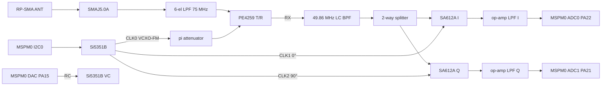

# Commo Rev T — 49 MHz I/Q radio and full Rev T board

> ⚠️ **Engineering review required.** Every RF, EMC, and regulatory result in this plan must be
> reviewed and accepted by a licensed PE or an equivalently qualified engineer before use. No
> FCC §15.235 numeric limit is asserted here from memory. Limits must be confirmed against the
> current 47 CFR Part 15 text and an accredited EMC lab.

## Summary

This plan builds the Commo Rev T standalone node, covering Phases 2–4 of the origin plan:

- the bus, security, and power sections chosen in Phase 1
  (`avionics/kicad/Commo/COMMO_REVT_PHASE1_PARTS.md`);
- a new 49 MHz radio built from active, datasheet-verified parts:
  - **RX:** a quadrature (I/Q) direct-conversion receiver made of two SA612A mixers. The
    MSPM0G3519's two simultaneous-sampling ADCs digitize it, and FM and Bell-202 are
    demodulated in firmware;
  - **TX:** an Si5351B whose VCXO is frequency-modulated from the MCU's 12-bit DAC. It drives
    the existing 6-element LPF through an attenuator, with no power amplifier.

## Problem Frame

- **Rev S radio unusable.** The Rev S 49 MHz chain is miswired, has no receive detector, and
  uses parts that cannot be built (Phase 1 audit, §3).
- **No single-chip part.** The only single-chip option, the AX5043, is discontinued
  (onsemi AX5043/D Rev 4, "Document Discontinued", 2026-06-11).
- **No FM IF chip.** The integrated FM-IF ICs are discontinued: NXP SA605, SA614A, and SA636
  are archived or no longer manufactured on nxp.com.
- **Owner direction (2026-09-29):** build a discrete mixer and FM IF within Commo's size,
  weight, and power limits. A background agent keeps searching for a single-chip option.

## Requirements

- R1. The Rev T schematic is generator-owned (`gen_commo_revt_sch.py`, following fleet
  convention rule 6), has ERC 0, and every pin table is traced to an OEM datasheet in
  `avionics/datasheets/`.
- R2. Receive covers 49.82–49.90 MHz (§15.235 band; confirm against REF-FCC-003) at 1200 baud
  Bell-202 AFSK over FM, using only in-production parts.
- R3. Transmit is FM AFSK from the Si5351B VCXO. Conducted power is set by an attenuator so
  the §15.235 field-strength limit can be met. The value must be confirmed by an EMC lab
  (REF-FCC-003).
- R4. SWaP: receive current is no more than 15 mA at 5 V for the RF section, excluding the MCU.
  The RF section occupies no more than 400 mm² of courtyard.
- R5. The layout is generator-owned. DRC shows 0 violations and 0 parity issues. Gerbers are
  produced. Placement is marked provisional pending the owner's manual pass (avionics
  AGENTS.md).
- R6. Board mass comes from a PCB roll-up (owner decision 2026-09-29) and is propagated to
  `airframe/README.md` and `docs/BATTERY_MOUNT.md`.

## Key Technical Decisions

- **KTD1. I/Q direct conversion instead of a superhet IF.**
  - A real low-IF mixer cannot reject its image a few kHz away.
  - A 455 kHz superhet needs a ceramic filter plus a now-discontinued FM-IF chip.
  - I/Q with two simultaneous ADCs rejects the image in firmware.
  - *(session-settled: user-directed — discrete mixer + FM IF chosen over dropping 49 MHz
    and over the discontinued AX5043: keep the 49 MHz link.)*
- **KTD2. Mixer: NXP SA612A ×2 (SO8).**
  - Datasheet (Rev. 3, 4 June 2014): VCC 4.5–8.0 V, 2.4 mA typical, NF 5.0 dB and conversion
    gain 17 dB at 45 MHz.
  - External LO of 200–300 mVpp into OSC_B (pin 6) through a DC block.
  - Runs from +5V_FILT.
- **KTD3. Synthesizer: Si5351B-B-GT (10-MSOP) with a 25 MHz crystal. The Si5351A and the TCXO
  are dropped.**
  - PLLA (not pulled) makes the I and Q LOs on CLK1 and CLK2 with a 90° phase offset.
  - PLLB is VCXO-pulled and makes the TX carrier on CLK0.
  - VCXO figures (Si5351-B "VCXO Specifications", Si5351B only): gain 18–150 ppm/V, pull
    ±30 to ±240 ppm, modulation bandwidth 10 kHz.
  - At 49.86 MHz, 1 ppm ≈ 49.9 Hz, so a deviation of about ±3 kHz is about ±60 ppm, inside
    the pull range.
  - VC is driven by the MSPM0 DAC (PA15, DAC_OUT) through an RC reconstruction filter.
- **KTD4. No LNA.**
  - The MGA-82563 draws tens of mA (confirm the exact figure in its datasheet) and is not
    needed at 49 MHz, where external noise dominates.
  - The SA612A NF of 5 dB sets the front end. This saves area and power (R4).
- **KTD5. No PA.**
  - Si5351B CLK0 drives the LPF through a resistive pi attenuator.
  - The attenuation value is **set at bench/EMC test**. The footprint accepts 0402 values,
    with a starting design value computed in U3 from Si5351-B output drive data.
- **KTD6. Keep the existing 6-element LPF, the SMAJ5.0A, and the RP-SMA §15.203 jack.**
  - The Rev S LPF topology (100 nH / 180 nH / 180 nH, 120 pF / 180 pF / 120 pF, fc 75 MHz)
    is kept as documented in Commo.md §4.
  - Its response must be re-verified by simulation in U3.
- **KTD7. MCU pin plan (RGZ-48; TI SLASFA6B Figure 6-5 and Table 6-2).**
  - I²C0 on PA0/PA1 carries both the SE (0x30) and the Si5351B (0x60).
  - The I/Q ADC pins are PA22 (A0_7) and PA21 (A1_7), sampled simultaneously.
  - The full allocation is in U1's pin table.

---

## High-Level Technical Design

---

## Implementation Units

### U1. Rev T schematic generator — MCU, buses, SE, power, SiK

**Goal:** `avionics/kicad/Commo/scripts/gen_commo_revt_sch.py` writes a new
`Commo.kicad_sch` / `Commo.kicad_sym` pair. The Rev S files are already archived.

**Requirements:** R1

**Files:**

- `avionics/kicad/Commo/scripts/gen_commo_revt_sch.py`
- `avionics/kicad/Commo/kicads/Commo.kicad_sch`, `Commo.kicad_sym`, `Commo.net`
- `Serenity-Custom.pretty/Infineon_PG-USON-10-2-4_3x3mm_P0.5mm_EP1.7x2.5mm.kicad_mod`
  (copied from LibreServo_v4, provenance cited)

**Approach:**

1. Mirror the structure of `Pilot/scripts/gen_pilot_sch.py` (ICS/SIMPLE tables, box symbols,
   global labels, PWR_FLAGs).
2. Reuse the verified entries for ISOW1044, ISOW1412, TPS62933, HI-6138, PM-DB2791S, and the
   1553/CAN/RS-485 field ports.
3. Add new entries for the MSPM0G3519 (RGZ-48), OPTIGA Trust M (Table 6), RFD900ux-SMT
   (datasheet v1.2), the TC2030-NL SWD pads, and the Nano-Fit 4P power input.

**Test scenarios:**

- `kicad-cli sch erc --severity-all` returns 0.
- Every MCU pin in the netlist carries the net U1's pin plan assigns, cross-checked by a
  script against Table 6-2 mux PF numbers.
- OPTIGA pins 2 and 4–7 are no-connects.
- RFD900ux pin 19 is on +5V; pins 25–28 go to UART0 with RTS/CTS crossed.

**Verification:** ERC 0; the netlist exports; the pin-plan check script passes.

### U2. Synthesizer and TX modulation

**Goal:** Si5351B with its crystal, I²C, CLK0–CLK2, and the VCXO VC drive from the MCU DAC.

**Requirements:** R1, R3 (KTD3, KTD5)

**Dependencies:** U1

**Approach:**

1. Take the Si5351B pin map from the Si5351-B 10-MSOP table. Check it against Table 20
   (Si5351A); the B variant replaces XB/VC on the 10-MSOP. Verify the exact B pinout before
   emitting.
2. Select the 25 MHz crystal from the Si5351-B crystal requirements section.

**Test scenarios:**

- Pin map matches the Si5351B table exactly.
- The crystal meets the stated ESR and load-capacitance limits.
- The VC RC filter corner is ≥ 10 kHz, so it passes the 2.2 kHz tone, and ≤ 20 kHz, to
  suppress DAC images.

**Verification:** ERC 0; a design note records the numbers.

### U3. RX front end, T/R, LPF, attenuator

**Goal:** the LPF, PE4259 switch, BPF, splitter, two SA612A mixers, LO pads, op-amp I/Q
filters, and ADC nets.

**Requirements:** R2, R4 (KTD1, KTD2, KTD4, KTD6)

**Dependencies:** U2

**Approach:**

1. Verify PE4259 lifecycle and its truth table.
2. Choose the op-amp: a dual in SOT-23-8 or smaller, datasheet on file.
3. Compute the LO pad so a 3.3 V CMOS CLK arrives at SA612A pin 6 at 200–300 mVpp.
4. Set the anti-alias corner for the I/Q channel bandwidth.

**Test scenarios:**

- Computed LO level is within 200–300 mVpp.
- Current budget is ≤ 15 mA at 5 V (R4).
- An ngspice or Python LPF/BPF response shows ≥ the Commo.md harmonic targets at 98 and
  147 MHz.

**Verification:** ERC 0; `avionics/kicad/Commo/COMMO_REVT_RF_DESIGN.md` records every
computed value.

### U4. PCB generator and layout gates

**Goal:** `gen_commo_revt_pcb.py`, adapted from `gen_pilot_pcb.py`.

**Requirements:** R5

**Dependencies:** U1–U3

**Approach:**

1. Board outline sized from the courtyard budget: 4 layers, RF section on its own ground
   pour, shield-can keepout retained.
2. Owner manual placement follows. The generated placement is provisional.

**Test scenarios:**

- DRC with `--schematic-parity` reports 0 violations and 0 parity issues. Unrouted pads are
  expected.
- Courtyard use per side is below 70 % (convention rule 3).

**Verification:** DRC report committed; Gerbers exported.

### U5. Integration: mass, W&B, firmware items, docs

**Goal:** a mass roll-up from the PCB (bare board plus BOM masses) and updates to the
airframe docs.

**Requirements:** R6

**Dependencies:** U4

**Approach:**

1. Roll up the board mass as bare board plus BOM masses.
2. Update `airframe/README.md` and `docs/BATTERY_MOUNT.md` with the result.
3. Log firmware items in `avionics/firmware/WBS.md`: the I/Q DSP chain (channel filter, FM
   discriminator using the MATHACL trig engine, Bell-202 demodulator), the VCXO modulator,
   and AX.25 HDLC.
4. Update Commo.md and the WBS.

**Test expectation:** no code behaviour. Mass arithmetic is checked by script.

**Verification:** mass figures appear in lbm (g), and the WBS items are closed or re-opened
with reasons.

---

## Risks

- **Firmware DSP load on the 80 MHz Cortex-M0+.** The budget is about 1,600 cycles per sample
  at 48 ksps. This needs a bench prototype, and the fallback is a lower sample rate.
- **Si5351B quadrature LO.** The phase-offset feature requires integer MultiSynth division.
  U2 verifies it with the datasheet and AN619 if available.
- **Station at the antennas.** The mounting station depends on the hull model. If it cannot be
  determined, U5 leaves it to the owner.
- **Regulatory.** Emissions are unverified until an EMC lab test (skill rule 6).

## Definition of Done

- U1–U5 are committed.
- ERC is 0 and DRC is 0 with 0 parity issues.
- The RF design note is complete.
- Mass is propagated.
- The WBS is updated.
- The PR is watched to green.
